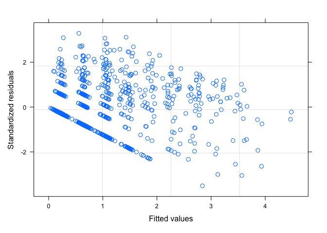
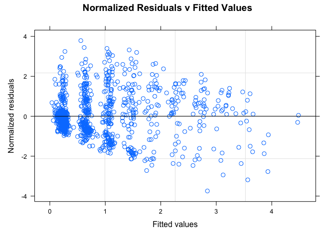
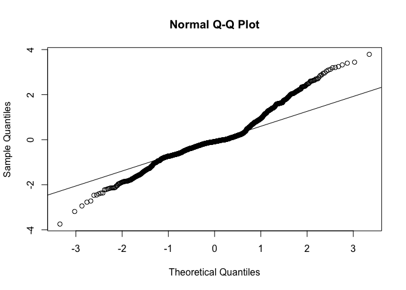
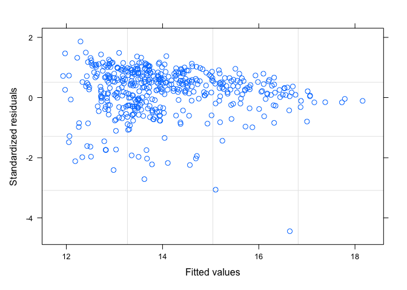
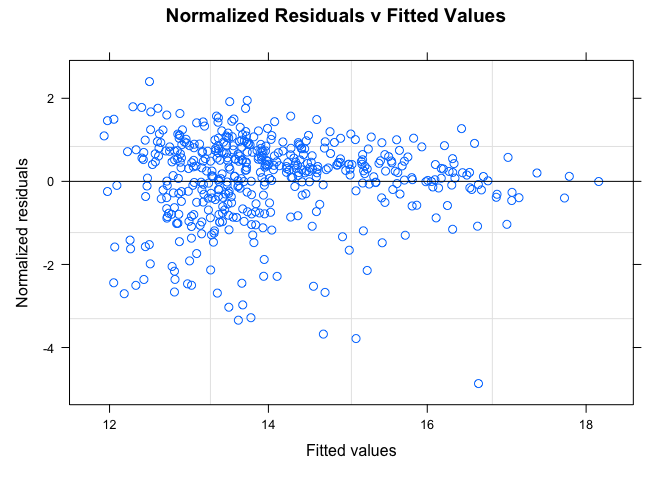
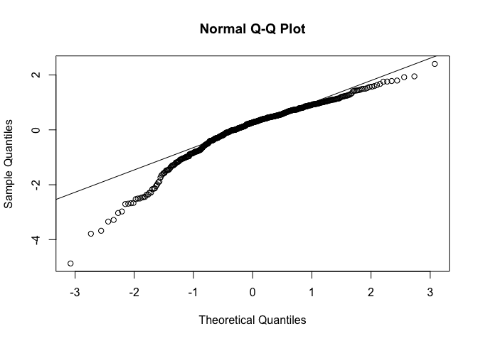
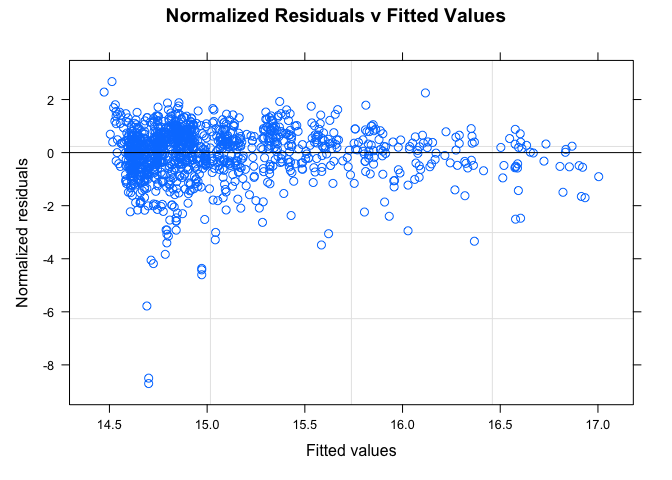
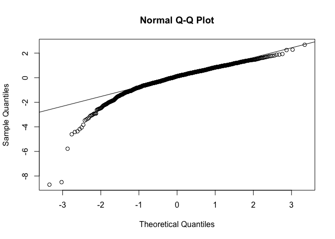

Mutualism promotes range expansion in both ant and plant partners
================
Pooja Nathan and Megan Frederickson
14/07/2021

# How does mutualism affect ant and plant range sizes?

This R Markdown document describes the dataset and code for:

Nathan P, Frederickson ME. In prep. Mutualism promotes range expansion
in both ant and plant partners.

The first step is to load packages

``` r
library(olsrr)
library(ape)
library(geiger)
library(nlme)
library(phytools)
#library(plotrix)
library(caper)
library(tidyverse)
library(cowplot)
#library(devtools)
```

## Analysis for effect of EFNs on legume range size

``` r
range <- read.csv("legume_invasion_data.csv") #Read in legume range data
EFN <- read.csv("EFN_fromwhole.csv") #Read in EFN data
colnames(EFN) <- c("Species", "EFN") #Fix column names
range <- merge(EFN, range, by='Species', all.x=FALSE, all.y=TRUE) #Merge legume range and EFN data
range$EFN <- ifelse(is.na(range$EFN), 0, range$EFN) #Make NAs zeros for EFNs
```

## Make figures

## Number of introduced ranges

``` r
range$fixer <- as.factor(range$fixer) #Make factor
range$EFN <- as.factor(range$EFN) #Make factor
hues <- c("#af8dc3", "#7fbf7b")

#EFNs
fig1a <- ggplot(data=range)+
  scale_fill_manual(values=hues) +
  scale_colour_manual(values=hues) +
  geom_violin(aes(color=EFN, fill=EFN, x=EFN, y=(num_introduced+1)), alpha=0.7)+
  scale_x_discrete(breaks=c("0","1"),
                   labels=c("No", "Yes")) + 
  xlab("Plant has EFNs") + 
  ylab("Introduced ranges (no. + 1)")+
  stat_summary(aes(x=EFN, y=(num_introduced+1)), fun="mean", geom="crossbar", width=0.25)+
  theme_cowplot() +
  theme(legend.position = "none")+
  scale_y_log10()
fig1a
```

<!-- -->

``` r
save_plot("Fig1a.pdf", fig1a, base_width=3, base_height=4)

#Nodules
fig1b <- ggplot(data=range)+
  scale_fill_manual(values=hues) +
  scale_colour_manual(values=hues) +
  geom_violin(aes(color=fixer, fill=fixer, x=fixer, y=(num_introduced+1)), alpha=0.7)+
  scale_x_discrete(breaks=c("0","1"),
                   labels=c("No", "Yes")) + 
  xlab("Nodules") + 
  ylab("Introduced ranges (no. + 1)")+
  stat_summary(aes(x=fixer, y=(num_introduced+1)), fun="mean", geom="crossbar", width=0.25)+
  theme_cowplot() +
  theme(legend.position = "none")+
  scale_y_log10()

fig1 <- plot_grid(fig1a, fig1b, labels="AUTO")
fig1
```

<!-- -->

``` r
save_plot("Fig1.pdf", fig1)
```

## Introduced range area

``` r
#EFNs
fig2a <- ggplot(data=range)+
  scale_fill_manual(values=hues) +
  scale_colour_manual(values=hues) +
  geom_violin(aes(color=EFN, fill=EFN, x=EFN, y=(total_area_introduced/1e+6)+1), alpha=0.7)+
  scale_x_discrete(breaks=c("0","1"),
                   labels=c("No", "Yes")) + 
  xlab("Extrafloral nectaries") + 
  ylab("Introduced range area (sq. km + 1)")+
  stat_summary(aes(x=EFN, y=(total_area_introduced/1e+6)+1), fun="mean", geom="crossbar", width=0.25)+
  theme_cowplot() +
  theme(legend.position = "none")+
  scale_y_log10()

#Nodules
fig2b <- ggplot(data=range)+
  scale_fill_manual(values=hues) +
  scale_colour_manual(values=hues) +
  geom_violin(aes(color=fixer, fill=fixer, x=fixer, y=(total_area_introduced/1e+6)+1), alpha=0.7)+
  scale_x_discrete(breaks=c("0","1"),
                   labels=c("No", "Yes")) + 
  xlab("Nodules") + 
  ylab("Introduced range area (sq. km + 1)")+
  stat_summary(aes(x=fixer, y=(total_area_introduced/1e+6)+1), fun="mean", geom="crossbar", width=0.25)+
  theme_cowplot() +
  theme(legend.position = "none")+
  scale_y_log10()

fig2 <- plot_grid(fig2a, fig2b, labels="AUTO")
fig2
```

<!-- -->

``` r
save_plot("Fig2.pdf", fig2)
```

## Native range area

``` r
#EFNs
fig3a <- ggplot(data=range)+
  scale_fill_manual(values=hues) +
  scale_colour_manual(values=hues) +
  geom_violin(aes(color=EFN, fill=EFN, x=EFN, y=(total_area_native/1e+6)), alpha=0.7)+
  scale_x_discrete(breaks=c("0","1"),
                   labels=c("No", "Yes")) + 
  xlab("Extrafloral nectaries") + 
  ylab("Native range area (sq. km)")+
  theme_cowplot() +
  theme(legend.position = "none")+
  stat_summary(aes(x=EFN, y=(total_area_native/1e+6)), fun="mean", geom="crossbar", width=0.25)+
  scale_y_log10()

#Nodules
fig3b <- ggplot(data=range)+
  scale_fill_manual(values=hues) +
  scale_colour_manual(values=hues) +
  geom_violin(aes(color=fixer, fill=fixer, x=fixer, y=(total_area_native/1e+6)), alpha=0.7)+
  scale_x_discrete(breaks=c("0","1"),
                   labels=c("No", "Yes")) + 
  xlab("Nodules") + 
  ylab("Native range area (sq. km)")+
  stat_summary(aes(x=fixer, y=(total_area_native/1e+6)), fun="mean", geom="crossbar", width=0.25)+
  theme_cowplot() +
  theme(legend.position = "none")+
  scale_y_log10()

fig3 <- plot_grid(fig3a, fig3b, labels="AUTO")
fig3
```

<!-- -->

``` r
save_plot("Fig3.pdf", fig3)
```

## Preparing dataset for pgls analysis

``` r
zanne <- read.tree("Vascular_Plants_rooted.dated.tre") #reading in Zanne et al. 2014 plant phylogeny
phyint <- intersect(zanne$tip.label, range$Species)  
phydiff <- setdiff(zanne$tip.label, range$Species)
pruned.tree.pgls <- drop.tip(zanne, phydiff) #dropping tips not in the dataset

range_efn_pgls <- range[range$Species %in% phyint, ]
range_efn_pgls <- range_efn_pgls[complete.cases(range_efn_pgls), ] #removing NA elements
```

## Statistical models

``` r
#PGLS of number of introduced ranges as response variable with both interactions, 
#interaction and other covariates
#p1 <- gls(log(num_introduced + 1) ~ EFN*fixer + total_area_native + abs_lat_native + annual + uses_num_uses, correlation = corPagel(1, phy = pruned.tree.pgls, form = ~ Species), method = "ML", data = range_efn_pgls) 
#summary(p1)

#EFN significant positive, fixer and interaction not significant

#PGLS with both, covariates and no interaction (dropping interaction because it was non-signif.)
p2 <- gls(log(num_introduced + 1) ~ EFN+fixer +
            total_area_native + abs_lat_native + annual + uses_num_uses, 
            correlation = corPagel(1, phy = pruned.tree.pgls, form = ~ Species), 
            method = "ML", data = range_efn_pgls) 
summary(p2)
```

    ## Generalized least squares fit by maximum likelihood
    ##   Model: log(num_introduced + 1) ~ EFN + fixer + total_area_native + abs_lat_native +      annual + uses_num_uses 
    ##   Data: range_efn_pgls 
    ##        AIC      BIC    logLik
    ##   2676.529 2722.467 -1329.265
    ## 
    ## Correlation Structure: corPagel
    ##  Formula: ~Species 
    ##  Parameter estimate(s):
    ##    lambda 
    ## 0.2802357 
    ## 
    ## Coefficients:
    ##                        Value  Std.Error  t-value p-value
    ## (Intercept)        0.2334427 0.18101561  1.28963  0.1974
    ## EFN1               0.4512541 0.07582080  5.95159  0.0000
    ## fixer1             0.0904190 0.11375899  0.79483  0.4269
    ## total_area_native  0.0000000 0.00000000 -1.88394  0.0598
    ## abs_lat_native    -0.0026216 0.00203378 -1.28905  0.1976
    ## annual             0.0586273 0.06697994  0.87530  0.3816
    ## uses_num_uses      0.4191633 0.01245119 33.66452  0.0000
    ## 
    ##  Correlation: 
    ##                   (Intr) EFN1   fixer1 ttl_r_ abs_l_ annual
    ## EFN1               0.006                                   
    ## fixer1            -0.248 -0.079                            
    ## total_area_native -0.065 -0.022 -0.042                     
    ## abs_lat_native    -0.219  0.033 -0.057  0.082              
    ## annual            -0.039 -0.007 -0.025  0.080  0.091       
    ## uses_num_uses     -0.090 -0.116  0.074 -0.423  0.028  0.046
    ## 
    ## Standardized residuals:
    ##        Min         Q1        Med         Q3        Max 
    ## -3.5106477 -0.3722223 -0.2875591  0.3714661  3.2879418 
    ## 
    ## Residual standard error: 0.8091229 
    ## Degrees of freedom: 1217 total; 1210 residual

``` r
plot(p2)
```

<!-- -->

``` r
#EFN significant positive, fixer not significant, slightly lower AIC 

#anova(p1, p2) #both models are comparable

#Diagnostics on model 2

plot(p2, resid(., type="n")~fitted(.), main="Normalized Residuals v Fitted Values",
abline=c(0,0))
```

<!-- -->

``` r
res <- resid(p2, type="n")
qqnorm(res)
qqline(res)
```

<!-- -->

``` r
p1 <- glm(num_introduced ~ EFN + fixer + total_area_native + abs_lat_native + annual + uses_num_uses, family="quasipoisson", data=range_efn_pgls)
summary(p1)
```

    ## 
    ## Call:
    ## glm(formula = num_introduced ~ EFN + fixer + total_area_native + 
    ##     abs_lat_native + annual + uses_num_uses, family = "quasipoisson", 
    ##     data = range_efn_pgls)
    ## 
    ## Deviance Residuals: 
    ##     Min       1Q   Median       3Q      Max  
    ## -9.5439  -1.7790  -1.4152  -0.0215  13.1273  
    ## 
    ## Coefficients:
    ##                     Estimate Std. Error t value Pr(>|t|)    
    ## (Intercept)        1.587e-01  1.285e-01   1.235   0.2171    
    ## EFN1               4.851e-01  9.981e-02   4.860 1.33e-06 ***
    ## fixer1             6.512e-03  1.156e-01   0.056   0.9551    
    ## total_area_native -3.201e-15  3.621e-15  -0.884   0.3769    
    ## abs_lat_native    -5.784e-03  2.803e-03  -2.064   0.0393 *  
    ## annual             5.698e-01  1.078e-01   5.285 1.49e-07 ***
    ## uses_num_uses      4.599e-01  1.412e-02  32.581  < 2e-16 ***
    ## ---
    ## Signif. codes:  0 '***' 0.001 '**' 0.01 '*' 0.05 '.' 0.1 ' ' 1
    ## 
    ## (Dispersion parameter for quasipoisson family taken to be 7.41221)
    ## 
    ##     Null deviance: 15070.1  on 1216  degrees of freedom
    ## Residual deviance:  6647.4  on 1210  degrees of freedom
    ## AIC: NA
    ## 
    ## Number of Fisher Scoring iterations: 6

``` r
#they look ok!

#Repeating for area introduced
#PGLS with both EFN presence and fixer, interaction and covariates
#p3 <- gls(log((total_area_introduced/1e+6)+1) ~ EFN*fixer + total_area_native + abs_lat_native + annual + uses_num_uses, correlation = corPagel(1, phy = pruned.tree.pgls, form = ~ Species), method = "ML", data = range_efn_pgls) 
#summary(p3)
#EFN significant positive, fixer and interaction not significant

#PGLS with both, covariates and no interaction
#hist(log((range_efn_pgls$total_area_introduced/1e+6)+1))

#range_efn_pgls$introduced <- ifelse(range_efn_pgls$total_area_introduced == 0, 0, 1) #Introduced Y/N as binary variable

#binary <- glm(introduced~EFN+fixer+total_area_native+abs_lat_native+annual+uses_num_uses, family="binomial", data=range_efn_pgls)
#summary(binary)
#plot(binary)

p4 <- gls(log((total_area_introduced/1e+6)+1) ~ EFN + fixer + total_area_native + abs_lat_native + annual + uses_num_uses, correlation = corPagel(1, phy = pruned.tree.pgls, form = ~ Species), method = "ML", data = subset(range_efn_pgls, total_area_introduced > 0)) 
summary(p4)
```

    ## Generalized least squares fit by maximum likelihood
    ##   Model: log((total_area_introduced/1e+06) + 1) ~ EFN + fixer + total_area_native +      abs_lat_native + annual + uses_num_uses 
    ##   Data: subset(range_efn_pgls, total_area_introduced > 0) 
    ##        AIC      BIC    logLik
    ##   2119.829 2157.355 -1050.914
    ## 
    ## Correlation Structure: corPagel
    ##  Formula: ~Species 
    ##  Parameter estimate(s):
    ##   lambda 
    ## 0.602316 
    ## 
    ## Coefficients:
    ##                       Value Std.Error   t-value p-value
    ## (Intercept)       13.070245 0.9881727 13.226682  0.0000
    ## EFN1               0.355314 0.2987288  1.189418  0.2349
    ## fixer1            -0.236256 0.6592649 -0.358363  0.7202
    ## total_area_native  0.000000 0.0000000 -4.213218  0.0000
    ## abs_lat_native     0.003998 0.0095089  0.420476  0.6743
    ## annual             0.021887 0.3012648  0.072649  0.9421
    ## uses_num_uses      0.553160 0.0475959 11.621994  0.0000
    ## 
    ##  Correlation: 
    ##                   (Intr) EFN1   fixer1 ttl_r_ abs_l_ annual
    ## EFN1              -0.007                                   
    ## fixer1            -0.280 -0.095                            
    ## total_area_native -0.034 -0.031 -0.064                     
    ## abs_lat_native    -0.197  0.065 -0.070  0.043              
    ## annual            -0.025  0.063 -0.041  0.191  0.039       
    ## uses_num_uses     -0.145 -0.031  0.074 -0.361  0.079  0.023
    ## 
    ## Standardized residuals:
    ##        Min         Q1        Med         Q3        Max 
    ## -4.4431151 -0.1513288  0.3622003  0.7307176  1.8639091 
    ## 
    ## Residual standard error: 2.98143 
    ## Degrees of freedom: 478 total; 471 residual

``` r
plot(p4)
```

<!-- -->

``` r
#EFN significant positive, fixer not significant, slightly lower AIC 

#anova(p3, p4) #both models are comparable

#Diagnostics on model 4

plot(p4, resid(., type="n")~fitted(.), main="Normalized Residuals v Fitted Values",
abline=c(0,0))
```

<!-- -->

``` r
res <- resid(p4, type="n")
qqnorm(res)
qqline(res)
```

<!-- -->

``` r
#Residual plot looks weird, but better than before

#Repeating for native area
#PGLS with both EFN presence and fixer, interaction and covariates
#p5 <- gls(log((total_area_native/1e+6) + 1) ~ EFN*fixer + abs_lat_native + annual + uses_num_uses, correlation = corPagel(1, phy = pruned.tree.pgls, form = ~ Species), method = "ML", data = range_efn_pgls)
#summary(p5)
#all effects non-significant

#PGLS with both EFN presence and fixer, covariates and no interaction
p6 <- gls(log((total_area_native/1e+6) + 1)~ EFN+fixer +abs_lat_native + annual + uses_num_uses, correlation = corPagel(1, phy = pruned.tree.pgls, form = ~ Species),  method = "ML", data = range_efn_pgls) 
summary(p6)
```

    ## Generalized least squares fit by maximum likelihood
    ##   Model: log((total_area_native/1e+06) + 1) ~ EFN + fixer + abs_lat_native +      annual + uses_num_uses 
    ##   Data: range_efn_pgls 
    ##       AIC      BIC    logLik
    ##   4096.75 4137.583 -2040.375
    ## 
    ## Correlation Structure: corPagel
    ##  Formula: ~Species 
    ##  Parameter estimate(s):
    ##    lambda 
    ## 0.4752941 
    ## 
    ## Coefficients:
    ##                    Value Std.Error  t-value p-value
    ## (Intercept)    14.867639 0.4383276 33.91901  0.0000
    ## EFN1           -0.072505 0.1343102 -0.53983  0.5894
    ## fixer1          0.070601 0.2233903  0.31604  0.7520
    ## abs_lat_native -0.007528 0.0037770 -1.99303  0.0465
    ## annual         -0.040617 0.1204992 -0.33707  0.7361
    ## uses_num_uses   0.247382 0.0202012 12.24594  0.0000
    ## 
    ##  Correlation: 
    ##                (Intr) EFN1   fixer1 abs_l_ annual
    ## EFN1            0.003                            
    ## fixer1         -0.183 -0.077                     
    ## abs_lat_native -0.168  0.037 -0.042              
    ## annual         -0.026 -0.001 -0.016  0.087       
    ## uses_num_uses  -0.095 -0.141  0.048  0.068  0.092
    ## 
    ## Standardized residuals:
    ##        Min         Q1        Med         Q3        Max 
    ## -7.3826615 -0.3242391  0.1292669  0.6002564  1.6111164 
    ## 
    ## Residual standard error: 1.637456 
    ## Degrees of freedom: 1217 total; 1211 residual

``` r
#all effects non-significant

#anova(p5, p6) #both models are comparable, p6 slightly better

plot(p6, resid(., type="n")~fitted(.), main="Normalized Residuals v Fitted Values",
abline=c(0,0))
```

<!-- -->

``` r
res <- resid(p6, type="n")
qqnorm(res)
qqline(res)
```

<!-- -->

# Do EFN-visiting ants have higher range size?

``` r
###Native range size
antarea <- read.csv("Ant_species_native range.csv")
antefn <- read.csv("Species_EFN_Data.csv")
efn_area <- merge(antarea, antefn, by.y = "Phy", all = FALSE)
efn_area$EFN <- as.factor(efn_area$EFN)

fig4a <- ggplot(data=efn_area)+
  scale_fill_manual(values=hues) +
  scale_colour_manual(values=hues) +
  geom_violin(aes(color=EFN, fill=EFN, x=EFN, y=total.area), alpha=0.7)+
  scale_x_discrete(breaks=c("0","1"),
                   labels=c("No", "Yes")) + 
  xlab("Visits extrafloral nectaries") + 
  ylab("Native range area (sq. km)")+
  theme_cowplot() +
  theme(legend.position = "none")+
  stat_summary(aes(x=EFN, y=total.area), fun="mean", geom="crossbar", width=0.25)+
  scale_y_log10()

### Invaded range size
efn_inv <- read.csv("invaded_area_ant_species.csv")
antefn <- read.csv("Species_EFN_Data.csv")
colnames(efn_inv) <- c("Phy", "SD", "LogArea")
efn_area_inv <- merge(efn_inv, antefn, by = "Phy", all = FALSE)
efn_area_inv$EFN <- as.factor(efn_area_inv$EFN)

fig4b <- ggplot(data=efn_area_inv)+
  scale_fill_manual(values=hues) +
  scale_colour_manual(values=hues) +
  geom_violin(aes(color=EFN, fill=EFN, x=EFN, y=(10^LogArea+1)), alpha=0.7)+
  scale_x_discrete(breaks=c("0","1"),
                   labels=c("No", "Yes")) + 
  xlab("Ant visits EFNs") + 
  ylab("Introduced range area (sq. km + 1)")+
  theme_cowplot() +
  theme(legend.position = "none")+
  stat_summary(aes(x=EFN, y=(10^LogArea+1)), fun="mean", geom="crossbar", width=0.25)+
  scale_y_log10()
fig4b
```

<!-- -->

``` r
save_plot("Fig4b.pdf", fig4b, base_width=3, base_height=4)

fig4 <- plot_grid(fig4a, fig4b, labels="AUTO")
fig4
```

<!-- -->

``` r
save_plot("Fig4.pdf", fig4)
```

``` r
#Native range size
ant_tree <- read.tree("Ant_tree.tre") #Reading in ant phylogeny
phy_int <- intersect(ant_tree$tip.label, efn_area$Phy)
phy_diff <- setdiff(ant_tree$tip.label, efn_area$Phy)
pruned_ant_tree <- drop.tip(ant_tree, as.character(phy_diff)) #pruning tree to contain only tips in the dataset

efn_area_phy <- efn_area[efn_area$Phy %in% phy_int, ] #dataset for pgls
#write.csv(efn_area_phy, "Ant_list_EFN.csv")
efn_area_phy <- efn_area_phy[match(pruned_ant_tree$tip.label, efn_area_phy$Phy),]

#PGLS model
a1 <- gls(LogArea ~ EFN, 
                correlation = corPagel(1, phy = pruned_ant_tree, form = ~ Phy), 
                method = "ML", data = efn_area_phy) 
summary(a1) #Significant positive effect of EFNs
```

    ## Generalized least squares fit by maximum likelihood
    ##   Model: LogArea ~ EFN 
    ##   Data: efn_area_phy 
    ##        AIC      BIC    logLik
    ##   1389.062 1407.725 -690.5311
    ## 
    ## Correlation Structure: corPagel
    ##  Formula: ~Phy 
    ##  Parameter estimate(s):
    ##    lambda 
    ## 0.5859827 
    ## 
    ## Coefficients:
    ##                Value  Std.Error  t-value p-value
    ## (Intercept) 6.282770 0.19564462 32.11317       0
    ## EFN1        0.353959 0.07505536  4.71597       0
    ## 
    ##  Correlation: 
    ##      (Intr)
    ## EFN1 -0.026
    ## 
    ## Standardized residuals:
    ##         Min          Q1         Med          Q3         Max 
    ## -4.78626786 -0.04228276  0.53542315  0.93338538  2.00603766 
    ## 
    ## Residual standard error: 0.7325567 
    ## Degrees of freedom: 785 total; 783 residual

``` r
#Diagnostic plots
plot(a1, resid(., type="n")~fitted(.), main="Normalized Residuals v Fitted Values",
abline=c(0,0))
```

<!-- -->

``` r
res <- resid(a1, type="n")
qqnorm(res)
qqline(res)
```

<!-- -->

``` r
### Invaded range size
phy_int <- intersect(ant_tree$tip.label, efn_area_inv$Phy)
phy_diff <- setdiff(ant_tree$tip.label, efn_area_inv$Phy)
pruned_ant_tree <- drop.tip(ant_tree, as.character(phy_diff))

efn_area_inv_phy <- efn_area_inv[efn_area_inv$Phy %in% phy_int, ] #dataset for pgls
efn_area_inv_phy <- efn_area_inv_phy[match(pruned_ant_tree$tip.label, efn_area_inv_phy$Phy),]

#PGLS model
a2 <- gls(LogArea ~ EFN, 
          correlation = corPagel(1, phy = pruned_ant_tree, form = ~ Phy), 
          method = "ML", data = efn_area_inv_phy) 
summary(a2)
```

    ## Generalized least squares fit by maximum likelihood
    ##   Model: LogArea ~ EFN 
    ##   Data: efn_area_inv_phy 
    ##        AIC      BIC    logLik
    ##   382.4937 393.5424 -187.2468
    ## 
    ## Correlation Structure: corPagel
    ##  Formula: ~Phy 
    ##  Parameter estimate(s):
    ##    lambda 
    ## 0.3469218 
    ## 
    ## Coefficients:
    ##                Value Std.Error   t-value p-value
    ## (Intercept) 5.333327 0.2644049 20.171062  0.0000
    ## EFN1        0.967269 0.2881516  3.356806  0.0011
    ## 
    ##  Correlation: 
    ##      (Intr)
    ## EFN1 -0.204
    ## 
    ## Standardized residuals:
    ##        Min         Q1        Med         Q3        Max 
    ## -3.2104523 -0.6007892  0.2721361  0.8783244  1.7850218 
    ## 
    ## Residual standard error: 1.272571 
    ## Degrees of freedom: 117 total; 115 residual

``` r
## Diagnostic plots
plot(a2, resid(., type="n")~fitted(.), main="Normalized Residuals v Fitted Values",
abline=c(0,0))
```

<!-- -->

``` r
res <- resid(a2, type="n")
qqnorm(res)
qqline(res)
```

<!-- -->
