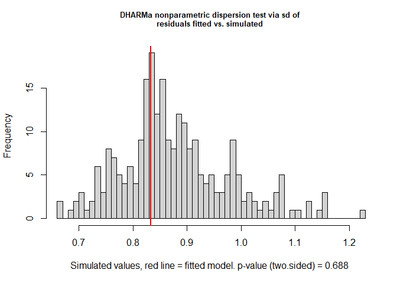
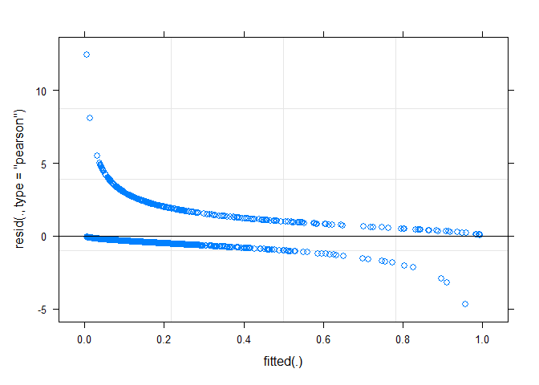
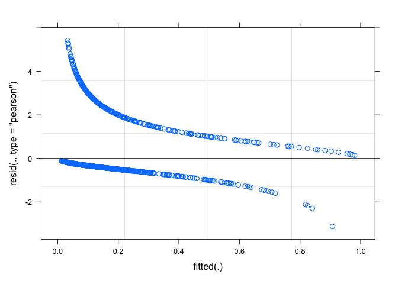
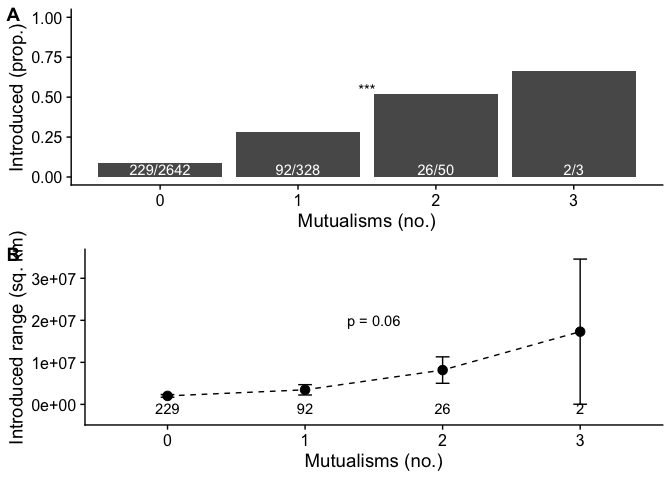

Generalized mutualism promotes range expansion in both ant and plant
partners
================
Pooja Nathan and Megan Frederickson
2023-02-20

# How does mutualism affect ant and plant range sizes?

This R Markdown document describes the dataset and code for:

Nathan P, Economo EP, Guenard B, Simonsen A, Frederickson ME.
Generalized mutualisms promote range expansion in both plant and ant
partners. In prep.

First, let’s load the packages we’ll use.

``` r
library(car)
library(ape)
library(geiger)
library(lme4)
library(nlme)
library(lmtest)
library(phytools)
library(caper)
library(tidyverse)
library(cowplot)
library(knitr)
library(taxize)
library(corrplot)
library(Hmisc)
```

## Legume dataset

We obtained introduced and native range size data for legumes from
Simonsen et al. (2017).

Mutualistic trait data came from Weber et al. (2015) for extrafloral
nectaries (EFNs), Chomicki & Renner (2015) for domatia, Simonsen et
al. (2017) for nodulation, and Soudzilovskaia et al. (2020) for
mycorrhizae.

The next several chunks of code are slow to run, so they are not run
here, but they are included for reproducibility.

``` r
#Not run
#Legume range and nodulation data
range <- read.csv("inv_dat_by_species_simonsen2017.csv") #Read in legume range data
names(range)[names(range) == "Species"] <- "Phy"
range$Phy <- as.character(gsub("_", " ", range$Phy))


#EFN data
EFN <- read.csv("EFNs_Weberatal_analysis_onlypresence.csv") #Read in EFN data
EFN$Phy <- as.character(gsub("_", " ", EFN$Phy))

#Domatia
domatia <- read.csv("domatia_chomickirenner_analysis_onlypresence.csv")  #Read in domatia data
names(domatia)[names(domatia) == 'ï..Phy'] <- 'Phy'
domatia$Phy <- as.character(gsub("_", " ", domatia$Phy))

#Mycorrhizae
mycorrhizae <- read.csv("mycorrhizae_sou.csv") #Read in legume species in Soudzilovskaia et al.'s mycorrhizae dataset
mycorrhizae$Phy <- as.character(gsub("_", " ", mycorrhizae$species))
mycorrhizae$In.range.dataset <- mycorrhizae$Phy %in% range$Phy #Check which taxa are in range dataset
mycorrhizae <- subset(mycorrhizae, In.range.dataset) #Subset to just taxa with mycorrhizal trait data that are also in legume range dataset
```

### Check taxonomy

We resolved misspelled names using the gnr_resolve function and checked
for synonyms using the synonyms function in the taxize package.

First, let’s check the taxonomy of the names of domatia-bearing plants.

Next, let’s check the taxonomy of EFN-bearing plants.

``` r
#Not run
#Do the same as above for the EFN data
EFN_resolve <- as.data.frame(gnr_resolve(EFN[, "Phy"], best_match_only=TRUE))
EFN_resolve$num_words <- str_count(EFN_resolve$matched_name, " ")+1
EFN <- merge(EFN, EFN_resolve, by.y = "user_supplied_name", by.x = "Phy", all.x=TRUE)
EFN$matched_name <- ifelse(EFN$num_words == 1, NA, EFN$matched_name)
EFN$matched_name <- ifelse(!is.na(EFN$matched_name), paste0(word(EFN$matched_name, 1, 1), " ", tolower(word(EFN$matched_name, 2, 2))), EFN$matched_name)
EFN$diff <- EFN$Phy == EFN$matched_name #Check changes between original and matched names

#Find synonyms for resolved names
#I had trouble getting this to work consistently so I retrieved the synonyms in batches
EFN_synonyms_pow1 <- synonyms(EFN[1:100,"matched_name"], db="pow") #Get synonyms
EFN_synonyms_pow2 <- synonyms(EFN[101:200,"matched_name"], db="pow")
EFN_synonyms_pow3 <- synonyms(EFN[201:400,"matched_name"], db="pow")
EFN_synonyms_pow4 <- synonyms(EFN[401:826,"matched_name"], db="pow")
EFN_synonyms_pow <- c(EFN_synonyms_pow1, EFN_synonyms_pow2, EFN_synonyms_pow3, EFN_synonyms_pow4)
EFN_syn <- do.call(rbind, EFN_synonyms_pow)
EFN_syn$matched_name <- gsub('[^-[:^punct:]]', '', (gsub('[[:digit:]]+', '', row.names(EFN_syn))), perl=TRUE)
EFN_syn <- subset(EFN_syn, rank == "SPECIES") #Keep on species (not varieties)
colnames(EFN_syn)[2] <- "synonym" #Fix column name

#Determine if original names and synonyms are in domatia, mycorrhizae, and range datasets
EFN_syn$syndomY <- EFN_syn$synonym %in% domatia$Phy 
EFN_syn$synrangeY <- EFN_syn$synonym %in% range$Phy
EFN_syn$synmycoY <- EFN_syn$synonym %in% mycorrhizae$Phy
write.csv(EFN_syn, "efn_synonyms.csv")
EFN_syn <- subset(EFN_syn, EFN_syn$syndomY | EFN_syn$synrangeY | EFN_syn$synmycoY) #Subset if synonyms match other datasets
EFN_syn$EFN <- 1 #Add trait
EFN_syn <- subset(EFN_syn, !is.na(synonym))
colnames(EFN_syn)[[2]] <- "Phy" #Fix column name

#Add synonyms to EFN dataset
EFN <- rbind(EFN[, c("EFN", "Phy", "matched_name")], EFN_syn[, c("EFN", "Phy","matched_name")]) #Merge
EFN$Phy <- trimws(EFN$Phy) #Trim white space from taxonomic names

#Check if each EFN name is in the EFN, mycorrhizae, and range datasets
EFN$RangeY <- EFN$Phy %in% range$Phy
EFN$domY <- EFN$Phy %in% domatia$Phy
EFN$mycoY <- EFN$Phy %in% mycorrhizae$Phy #No EFN-bearing plants in mycorrhizal dataset

write.csv(EFN, file="efn_resolved.csv", row.names=FALSE)
```

Merge the EFN and domatia datasets.

``` r
#Read in taxonomically resolved EFN and domatia datasets
EFN <- read.csv("efn_resolved.csv")
domatia <- read.csv("domatia_resolved.csv")

#Further cleaning of EFN and domatia datasets to 
colnames(EFN)[[3]] <- "matched_name_EFN"
colnames(domatia)[[3]] <- "matched_name_domatia"
domatia$diff <- domatia$Phy == domatia$matched_name_domatia 
EFN$diff <- EFN$Phy == EFN$matched_name_EFN
EFN <- subset(EFN, !is.na(diff))
EFN$matches <- EFN$RangeY+EFN$domY+EFN$mycoY
EFN <- subset(EFN, matches > 0)
EFN <- EFN[!duplicated(EFN), ]
EFN <- EFN[!duplicated(EFN$matched_name_EFN),]

#Merge 
EFN_dom <- merge(EFN[,c("EFN", "Phy", "matched_name_EFN")], domatia[,c("Domatia", "Phy")], by="Phy", all=TRUE)

#Add zeros instead of NAs for traits
EFN_dom$EFN <- ifelse(is.na(EFN_dom$EFN), 0, EFN_dom$EFN)
EFN_dom$Domatia <- ifelse(is.na(EFN_dom$Domatia), 0, EFN_dom$Domatia)
```

Next, we’ll check the taxonomy of the legumes for which we have data on
mycorrhizae.

``` r
#Not run
#Resolve names
mycorrhizae_resolve <- as.data.frame(gnr_resolve(mycorrhizae[, "Phy"], best_match_only=TRUE))
mycorrhizae_resolve$num_words <- str_count(mycorrhizae_resolve$matched_name, " ")+1
mycorrhizae <- merge(mycorrhizae, mycorrhizae_resolve, by.y = "user_supplied_name", by.x = "Phy", all.x=TRUE)
mycorrhizae$matched_name <- ifelse(mycorrhizae$num_words == 1, NA, mycorrhizae$matched_name)
mycorrhizae$matched_name <- ifelse(!is.na(mycorrhizae$matched_name), paste0(word(mycorrhizae$matched_name, 1, 1), " ", tolower(word(mycorrhizae$matched_name, 2, 2))), mycorrhizae$matched_name)

#Find synonyms for resolved names
mycorrhizae_synonyms_pow1 <- synonyms(unique(mycorrhizae$matched_name)[1:200], db="pow")
mycorrhizae_synonyms_pow2 <- synonyms(unique(mycorrhizae$matched_name)[201:400], db="pow")
mycorrhizae_synonyms_pow3 <- synonyms(unique(mycorrhizae$matched_name)[401:600], db="pow")
mycorrhizae_synonyms_pow4 <- synonyms(unique(mycorrhizae$matched_name)[601:800], db="pow")
mycorrhizae_syn <- append(mycorrhizae_synonyms_pow1, mycorrhizae_synonyms_pow2)
mycorrhizae_syn <- append(mycorrhizae_syn, mycorrhizae_synonyms_pow3)
mycorrhizae_syn <- append(mycorrhizae_syn, mycorrhizae_synonyms_pow4)

mycorrhizae_syn <- do.call(rbind, mycorrhizae_syn)
mycorrhizae_syn$matched_name <- gsub('[^-[:^punct:]]', '', (gsub('[[:digit:]]+', '', row.names(mycorrhizae_syn))), perl=TRUE)
mycorrhizae_syn <- subset(mycorrhizae_syn, rank == "SPECIES") #Keep on species (not varieties)
colnames(mycorrhizae_syn)[2] <- "synonym" #Fix column name

#Determine if original names and synonyms are in EFN, domatia, and range datasets
mycorrhizae_syn$syndomY <- mycorrhizae_syn$synonym %in% domatia$Phy 
mycorrhizae_syn$synrangeY <- mycorrhizae_syn$synonym %in% range$Phy
mycorrhizae_syn$synefnY <- mycorrhizae_syn$synonym %in% EFN$Phy
write.csv(mycorrhizae_syn, "mycorrhizae_synonyms.csv")

mycorrhizae_syn <- subset(mycorrhizae_syn, mycorrhizae_syn$syndomY | mycorrhizae_syn$synrangeY | mycorrhizae_syn$synefnY) #Subset if synonyms match other datasets
mycorrhizae_syn <- subset(mycorrhizae_syn, !is.na(synonym))
colnames(mycorrhizae_syn)[[2]] <- "Phy" #Fix column name

#Add synonyms to mycorrhizae dataset
mycorrhizae <- mycorrhizae[ ,-c(73:234)]
mycorrhizae_syn <- merge(mycorrhizae[, c("Phy", "mycorrhiza.type")], mycorrhizae_syn, by.x="Phy", by.y="matched_name", all.x=FALSE, all.y=TRUE)
colnames(mycorrhizae_syn)[[4]] <- "species"
mycorrhizae <- rbind(mycorrhizae[, c("mycorrhiza.type", "Phy", "species")], mycorrhizae_syn[, c("mycorrhiza.type", "Phy","species")]) #Merge
#mycorrhizae$Phy <- trimws(mycorrhizae$Phy) #Trim white space from taxonomic names

#Check if each mycorrhizae name is in the EFN, domatia, and range datasets
mycorrhizae$RangeY <- mycorrhizae$Phy %in% range$Phy
mycorrhizae$domY <- mycorrhizae$Phy %in% domatia$Phy
mycorrhizae$efnY <- mycorrhizae$Phy %in% EFN$Phy 

mycorrhizae$AM <- ifelse(mycorrhizae$mycorrhiza.type == "AM; others not addressed" | mycorrhizae$mycorrhiza.type == "AM; no others" | mycorrhizae$mycorrhiza.type == "EcM,AM", 1, 0)
mycorrhizae$EM <- ifelse(mycorrhizae$mycorrhiza.type == "EcM; others not addressed" | mycorrhizae$mycorrhiza.type == "EcM; no others" | mycorrhizae$mycorrhiza.type == "EcM,AM", 1, 0)

mycorrhizae.sum <- mycorrhizae %>% group_by(Phy, species, RangeY, domY, efnY) %>% dplyr::summarize(n=n(), sum.AM = sum(AM), sum.EM=sum(EM))
mycorrhizae.sum$AM <- ifelse(mycorrhizae.sum$sum.AM > 0, "Y", "N")
mycorrhizae.sum$EM <- ifelse(mycorrhizae.sum$sum.EM > 0, "Y", "N")
mycorrhizae.sum$match <- ifelse(mycorrhizae.sum$Phy == mycorrhizae.sum$species, TRUE, FALSE)

write.csv(mycorrhizae.sum, file="mycorrhizae_resolved.csv", row.names=FALSE)
```

Merge the EFN and domatia dataset with the mycorrhizae dataset.

``` r
#Read in taxonomically resolved mycorrhizal dataset
mycorrhizae <- read.csv("mycorrhizae_resolved.csv")

#A little further cleaning of mycorrhizal dataset, to remove taxa that appear twice
mycorrhizae <- mycorrhizae %>% group_by(Phy, RangeY, domY, efnY) %>% dplyr::summarize(n.records=sum(n), sum.AM = sum(sum.AM), sum.EM=sum(sum.EM))
mycorrhizae$AM <- ifelse(mycorrhizae$sum.AM > 0, "Y", "N")
mycorrhizae$EM <- ifelse(mycorrhizae$sum.EM > 0, "Y", "N")

#Merge 
EFN_dom_myco <- merge(mycorrhizae, EFN_dom, by="Phy", all=TRUE)
```

Finally, we’ll check the taxonomy of the range dataset.

``` r
#Not run
#Resolve names
range_resolve <- as.data.frame(gnr_resolve(range[, "Phy"], best_match_only=TRUE))
range_resolve$num_words <- str_count(range_resolve$matched_name, " ")+1
range <- merge(range, range_resolve, by.y = "user_supplied_name", by.x = "Phy", all.x=TRUE)
range$matched_name <- ifelse(range$num_words == 1, NA, range$matched_name)
range$matched_name <- ifelse(!is.na(range$matched_name), paste0(word(range$matched_name, 1, 1), " ", tolower(word(range$matched_name, 2, 2))), range$matched_name)
range$diff <- range$matched_name == range$Phy #Only one difference and spelling doesn't affect trait data (because taxon is not in EFN/dom/myco dataset)

write.csv(range, file="range_resolved.csv", row.names=FALSE)

#We don't really need to check synonyms, because we've already checked the synonyms of the matching datasets, and our goals with considering synonyms is just to make sure we match trait and range data correctly
```

Merge the mutualistic trait data with the range dataset.

``` r
range <- read.csv("range_resolved.csv")

legume_range_df <- merge(range, EFN_dom_myco, all.x="TRUE", all.y="FALSE", by= "Phy") #Put all the data in one dataframe
legume_range_df$EFN <- ifelse(is.na(legume_range_df$EFN), 0, legume_range_df$EFN) #Add zeros for NAs in EFN trait
legume_range_df$Domatia <- ifelse(is.na(legume_range_df$Domatia), 0, legume_range_df$Domatia) #Add zeros for NAs in domatia trait
write.csv(legume_range_df, file="legume_range_traits.csv", row.names = FALSE)
```

### Summarize legume dataset

We are finally finished cleaning the dataset, and now simply have to
summarize, visualize, and model.

First, let’s summarize how many species we have in each category. How
many legumes with vs. without EFNs do we have range size data for, and
how many introduced ranges have they been introduced to, on average?

``` r
#Make factors factors
legume_range_df$EFN <- as.factor(legume_range_df$EFN)
legume_range_df$Domatia <- as.factor(legume_range_df$Domatia)
legume_range_df$fixer <- as.factor(legume_range_df$fixer)
legume_range_df$AM <- as.factor(legume_range_df$AM)
legume_range_df$EM <- as.factor(legume_range_df$EM)
legume_range_df$annual <- as.numeric(legume_range_df$annual)
legume_range_df$woody <- as.numeric(legume_range_df$woody)

##Collapse all mycorrhizal fungi types into a single yes/no category
legume_range_df$myco <- ifelse(legume_range_df$AM == "Y" | legume_range_df$EM == "Y", 1, ifelse(legume_range_df$AM == "N" & legume_range_df$EM == "N", 0, NA))
legume_range_df$myco <- as.factor(legume_range_df$myco)

df <- legume_range_df
#annual and woody are highly correlated
#combining them into a single variable called Natural History
#df$nathis <- df$annual + df$woody
#df$nathis <- as.factor(df$nathis)

summary.efn <- ungroup(subset(df, !is.na(num_introduced)) %>% group_by(EFN) %>% dplyr::summarize(n=n(), mean_num_introduced = mean(num_introduced, na.rm=TRUE), sd_num_introduced = sd(num_introduced, na.rm=TRUE), se_num_introduced = sd_num_introduced/sqrt(n)))
kable(summary.efn)
```

| EFN |    n | mean_num_introduced | sd_num_introduced | se_num_introduced |
|:----|-----:|--------------------:|------------------:|------------------:|
| 0   | 3697 |            1.365702 |          5.330667 |         0.0876712 |
| 1   |  280 |            5.257143 |         10.864345 |         0.6492688 |

How many legumes with vs. without domatia do we have range size data
for?

``` r
summary.dom <- ungroup(subset(df, !is.na(num_introduced)) %>% group_by(Domatia) %>% dplyr::summarize(n=n(), mean_num_introduced = mean(num_introduced, na.rm=TRUE), sd_num_introduced = sd(num_introduced, na.rm=TRUE), se_num_introduced = sd_num_introduced/sqrt(n)))
kable(summary.dom)
```

| Domatia |    n | mean_num_introduced | sd_num_introduced | se_num_introduced |
|:--------|-----:|--------------------:|------------------:|------------------:|
| 0       | 3953 |           1.6463445 |          5.990833 |         0.0952848 |
| 1       |   24 |           0.5416667 |          1.178767 |         0.2406149 |

How many legumes that do vs. do not form nodules do we have range size
data for?

``` r
summary.fix <- ungroup(subset(df, !is.na(num_introduced)) %>% group_by(fixer) %>% dplyr::summarize(n=n(), mean_num_introduced = mean(num_introduced, na.rm=TRUE), sd_num_introduced = sd(num_introduced, na.rm=TRUE), se_num_introduced = sd_num_introduced/sqrt(n)))
kable(summary.fix)
```

| fixer |    n | mean_num_introduced | sd_num_introduced | se_num_introduced |
|:------|-----:|--------------------:|------------------:|------------------:|
| 0     |  396 |            2.482323 |          6.839364 |         0.3436910 |
| 1     | 3581 |            1.546495 |          5.864139 |         0.0979946 |

How many legumes do vs. do not associate with mycorrhizae do we have
range size data for?

``` r
summary.myco <- ungroup(subset(df, !is.na(num_introduced) & !is.na(myco)) %>% group_by(myco) %>% dplyr::summarize(n=n(), mean_num_introduced = mean(num_introduced, na.rm=TRUE), sd_num_introduced = sd(num_introduced, na.rm=TRUE), se_num_introduced = sd_num_introduced/sqrt(n)))
kable(summary.myco)
```

| myco |   n | mean_num_introduced | sd_num_introduced | se_num_introduced |
|:-----|----:|--------------------:|------------------:|------------------:|
| 0    |  33 |            3.636364 |          7.192957 |         1.2521332 |
| 1    | 690 |            5.998551 |         11.970876 |         0.4557235 |

``` r
summary.myco2 <- ungroup(subset(df, !is.na(num_introduced) & !is.na(myco)) %>% group_by(AM,EM) %>% dplyr::summarize(n=n(), mean_num_introduced = mean(num_introduced, na.rm=TRUE), sd_num_introduced = sd(num_introduced, na.rm=TRUE), se_num_introduced = sd_num_introduced/sqrt(n), mean_area_introduced = mean(total_area_introduced, na.rm=TRUE), sd_area_introduced = sd(total_area_introduced, na.rm=TRUE), se_area_introduced = sd_area_introduced/sqrt(n)))
kable(summary.myco2)
```

| AM  | EM  |   n | mean_num_introduced | sd_num_introduced | se_num_introduced | mean_area_introduced | sd_area_introduced | se_area_introduced |
|:----|:----|----:|--------------------:|------------------:|------------------:|---------------------:|-------------------:|-------------------:|
| N   | N   |  33 |           3.6363636 |          7.192957 |         1.2521332 |         3.194037e+12 |       8.008639e+12 |       1.394125e+12 |
| N   | Y   |  38 |           0.8684211 |          2.988004 |         0.4847182 |         4.655278e+11 |       1.604713e+12 |       2.603188e+11 |
| Y   | N   | 572 |           6.6311189 |         12.567518 |         0.5254743 |         6.482227e+12 |       1.410887e+13 |       5.899216e+11 |
| Y   | Y   |  80 |           3.9125000 |          9.169561 |         1.0251881 |         3.160244e+12 |       8.285881e+12 |       9.263897e+11 |

### Make figures

#### Number of introduced ranges

Our measure of ecological success for legumes is the number of new
ranges they have been successfully introduced to. We subsetted to
include only legumes with at least one introduced range. Each “inset”
shows the proportion of introduced species in with each trait.

##### Dots and whiskers

``` r
pt_size <- 3
y_limits <- c(-0.5, 15)
er_width <- 0.1
y_text <- -0.25
y_inset_limits <- c(0,1)

df$introducedY <- ifelse(df$num_introduced > 0, 1, 0) #Create binary variable for whether or not legume is introduced

#EFN figure
summary.efn <- ungroup(subset(df, !is.na(num_introduced) & num_introduced > 0) %>% group_by(EFN) %>% dplyr::summarize(n=n(), mean_num_introduced = mean(num_introduced, na.rm=TRUE), sd_num_introduced = sd(num_introduced, na.rm=TRUE), se_num_introduced = sd_num_introduced/sqrt(n)))
kable(summary.efn)
```

| EFN |   n | mean_num_introduced | sd_num_introduced | se_num_introduced |
|:----|----:|--------------------:|------------------:|------------------:|
| 0   | 716 |            7.051676 |          10.33137 |         0.3861014 |
| 1   | 135 |           10.903704 |          13.55468 |         1.1666015 |

``` r
p_EFN <- ggplot(data=summary.efn, aes(x=EFN, y=mean_num_introduced))+geom_point(size=pt_size)+geom_errorbar(aes(x=EFN, ymin=mean_num_introduced-se_num_introduced, ymax=mean_num_introduced+se_num_introduced), width=er_width)+ geom_line(aes(group=1),linetype="dashed")+theme_cowplot()+ylab("Introduced ranges (no.)")+xlab("EFNs")+geom_text(aes(x=EFN, y= y_text, label=n))+scale_x_discrete(labels=c("No", "Yes"))+scale_y_continuous(limits=y_limits)+annotate("text", x = 1.5, y = 13, label = "***")

summary.efn2 <- ungroup(df %>% group_by(EFN, introducedY) %>% dplyr::summarize(n=n()))
summary.efn2.wide <- spread(summary.efn2, key = introducedY, value=n)
colnames(summary.efn2.wide) <- c("EFN","Not_introduced",  "Introduced")
summary.efn2.wide$total <- summary.efn2.wide$Not_introduced+summary.efn2.wide$Introduced
summary.efn2.wide$prop.introduced <- summary.efn2.wide$Introduced/(summary.efn2.wide$total)
prop.efn <- paste0(summary.efn2.wide$Introduced, "/", summary.efn2.wide$total)

inset_p_EFN <- ggplot(data=summary.efn2.wide, aes(x=EFN, y=prop.introduced))+geom_bar(stat="identity")+theme_cowplot()+scale_x_discrete(labels=c("No", "Yes"))+ylab("Introduced (prop.)")+xlab("EFNs")+scale_y_continuous(limits=y_inset_limits)+annotate("text", x = 1.5, y = 0.55, label = "***")+geom_text(aes(x=EFN, y=0.05, label=prop.efn), color="white")

#Domatia figure
summary.dom <- ungroup(subset(df, !is.na(num_introduced) & num_introduced > 0) %>% group_by(Domatia) %>% dplyr::summarize(n=n(), mean_num_introduced = mean(num_introduced, na.rm=TRUE), sd_num_introduced = sd(num_introduced, na.rm=TRUE), se_num_introduced = sd_num_introduced/sqrt(n)))
kable(summary.dom)
```

| Domatia |   n | mean_num_introduced | sd_num_introduced | se_num_introduced |
|:--------|----:|--------------------:|------------------:|------------------:|
| 0       | 844 |            7.710901 |         11.019742 |         0.3793152 |
| 1       |   7 |            1.857143 |          1.573592 |         0.5947617 |

``` r
p_dom <- ggplot(data=summary.dom, aes(x=Domatia, y=mean_num_introduced))+geom_point(size=pt_size)+geom_errorbar(aes(x=Domatia, ymin=mean_num_introduced-se_num_introduced, ymax=mean_num_introduced+se_num_introduced), width=er_width)+geom_line(aes(group=1), linetype="dashed")+theme_cowplot()+ylab("Introduced ranges (no.)")+xlab("Domatia")+geom_text(aes(x=Domatia, y= y_text, label=n))+scale_x_discrete(labels=c("No", "Yes"))+scale_y_continuous(limits=y_limits)+annotate("text", x = 1.5, y = 13, label = "*")

summary.dom2 <- ungroup(df %>% group_by(Domatia, introducedY) %>% dplyr::summarize(n=n()))
summary.dom2.wide <- spread(summary.dom2, key = introducedY, value=n)
colnames(summary.dom2.wide) <- c("Domatia","Not_introduced",  "Introduced")
summary.dom2.wide$total <- summary.dom2.wide$Not_introduced+summary.dom2.wide$Introduced
summary.dom2.wide$prop.introduced <- summary.dom2.wide$Introduced/summary.dom2.wide$total
prop.dom <- paste0(summary.dom2.wide$Introduced, "/", summary.dom2.wide$total)

inset_p_dom <- ggplot(data=summary.dom2.wide, aes(x=Domatia, y=prop.introduced))+geom_bar(stat="identity")+theme_cowplot()+scale_x_discrete(labels=c("No", "Yes"))+ylab("Introduced (prop.)")+xlab("Domatia")+scale_y_continuous(limits=y_inset_limits)+annotate("text", x = 1.5, y = 0.55, label = "ns")+geom_text(aes(x=Domatia, y=0.05, label=prop.dom), color="white")

#Nodules figure
summary.fix <- ungroup(subset(df, !is.na(num_introduced) & num_introduced > 0) %>% group_by(fixer) %>% dplyr::summarize(n=n(), mean_num_introduced = mean(num_introduced, na.rm=TRUE), sd_num_introduced = sd(num_introduced, na.rm=TRUE), se_num_introduced = sd_num_introduced/sqrt(n)))
kable(summary.fix)
```

| fixer |   n | mean_num_introduced | sd_num_introduced | se_num_introduced |
|:------|----:|--------------------:|------------------:|------------------:|
| 0     | 103 |            9.543689 |          10.63455 |         1.0478534 |
| 1     | 748 |            7.403743 |          11.01733 |         0.4028336 |

``` r
p_fix <- ggplot(data=summary.fix, aes(x=fixer, y=mean_num_introduced))+geom_point(size=pt_size)+geom_errorbar(aes(x=fixer, ymin=mean_num_introduced-se_num_introduced, ymax=mean_num_introduced+se_num_introduced), width=er_width)+geom_line(aes(group=1), linetype="dashed")+theme_cowplot()+ylab("Introduced ranges (no.)")+xlab("Nodules")+geom_text(aes(x=fixer, y= y_text, label=n))+scale_x_discrete(labels=c("No", "Yes"))+scale_y_continuous(limits=y_limits)+annotate("text", x = 1.5, y = 13, label = "ns")

summary.fix2 <- ungroup(df %>% group_by(fixer, introducedY) %>% dplyr::summarize(n=n()))
summary.fix2.wide <- spread(summary.fix2, key = introducedY, value=n)
colnames(summary.fix2.wide) <- c("fixer","Not_introduced",  "Introduced")
summary.fix2.wide$total <- summary.fix2.wide$Not_introduced+summary.fix2.wide$Introduced
summary.fix2.wide$prop.introduced <- summary.fix2.wide$Introduced/summary.fix2.wide$total
prop.fix <- paste0(summary.fix2.wide$Introduced, "/", summary.fix2.wide$total)
  
inset_p_fix <- ggplot(data=summary.fix2.wide, aes(x=fixer, y=prop.introduced))+geom_bar(stat="identity")+theme_cowplot()+scale_x_discrete(labels=c("No", "Yes"))+ylab("Introduced (prop.)")+xlab("Nodules")+scale_y_continuous(limits=y_inset_limits)+annotate("text", x = 1.5, y = 0.55, label = "ns")+geom_text(aes(x=fixer, y=0.05, label=prop.fix), color="white")

#Mycorrhizae figure
summary.AM <- ungroup(subset(df, !is.na(num_introduced) & !is.na(myco) & num_introduced > 0) %>% group_by(AM) %>% dplyr::summarize(n=n(), mean_num_introduced = mean(num_introduced, na.rm=TRUE), sd_num_introduced = sd(num_introduced, na.rm=TRUE), se_num_introduced = sd_num_introduced/sqrt(n)))
kable(summary.AM)
```

| AM  |   n | mean_num_introduced | sd_num_introduced | se_num_introduced |
|:----|----:|--------------------:|------------------:|------------------:|
| N   |  22 |            6.954546 |          8.126836 |         1.7326471 |
| Y   | 308 |           13.331169 |         14.933754 |         0.8509296 |

``` r
p_AM <- ggplot(data=summary.AM, aes(x=AM, y=mean_num_introduced))+geom_point(size=pt_size)+geom_errorbar(aes(x=AM, ymin=mean_num_introduced-se_num_introduced, ymax=mean_num_introduced+se_num_introduced), width=er_width)+geom_line(aes(group=1), linetype="dashed")+theme_cowplot()+ylab("Introduced ranges (no.)")+xlab("AM")+geom_text(aes(x=AM, y= y_text, label=n))+scale_y_continuous(limits=y_limits)+scale_x_discrete(labels=c("No", "Yes"))+annotate("text", x = 1.5, y = 13, label = "ns")

summary.EM <- ungroup(subset(df, !is.na(num_introduced) & !is.na(myco) & num_introduced > 0) %>% group_by(EM) %>% dplyr::summarize(n=n(), mean_num_introduced = mean(num_introduced, na.rm=TRUE), sd_num_introduced = sd(num_introduced, na.rm=TRUE), se_num_introduced = sd_num_introduced/sqrt(n)))
kable(summary.EM)
```

| EM  |   n | mean_num_introduced | sd_num_introduced | se_num_introduced |
|:----|----:|--------------------:|------------------:|------------------:|
| N   | 295 |           13.264407 |          14.92901 |         0.8692007 |
| Y   |  35 |            9.885714 |          11.88863 |         2.0095451 |

``` r
p_EM <- ggplot(data=summary.EM, aes(x=EM, y=mean_num_introduced))+geom_point(size=pt_size)+geom_errorbar(aes(x=EM, ymin=mean_num_introduced-se_num_introduced, ymax=mean_num_introduced+se_num_introduced), width=er_width)+geom_line(aes(group=1), linetype="dashed")+theme_cowplot()+ylab("Introduced ranges (no.)")+xlab("EM")+geom_text(aes(x=EM, y= y_text, label=n))+scale_y_continuous(limits=y_limits)+scale_x_discrete(labels=c("No", "Yes"))+annotate("text", x = 1.5, y = 13, label = "ns")

#Or
summary.AMEM2 <- ungroup(subset(df, !is.na(myco)) %>% group_by(AM, EM, introducedY) %>% dplyr::summarize(n=n()))
summary.AMEM2.wide <- spread(summary.AMEM2, key = introducedY, value=n)
colnames(summary.AMEM2.wide) <- c("AM", "EM","Not_introduced",  "Introduced")
summary.AMEM2.wide$total <- summary.AMEM2.wide$Not_introduced+summary.AMEM2.wide$Introduced
summary.AMEM2.wide$prop.introduced <- summary.AMEM2.wide$Introduced/summary.AMEM2.wide$total
prop.AMEM <- paste0(summary.AMEM2.wide$Introduced, "/", summary.AMEM2.wide$total)

inset_p_AMEM <- ggplot(data=summary.AMEM2.wide, aes(x=AM, y=prop.introduced, fill=EM))+geom_bar(stat="identity", position=position_dodge())+theme_cowplot()+scale_x_discrete(labels=c("No", "Yes"))+ylab("Introduced (prop.)")+xlab("AM")+scale_y_continuous(limits=y_inset_limits)+annotate("text", x = 1, y = 0.55, label = "*")+scale_fill_grey(labels=c("No", "Yes"))+geom_text(aes(x=c(0.77, 1.21, 1.78, 2.21), y=0.05, label=prop.AMEM), color="white")

fig1top <- plot_grid(inset_p_EFN, inset_p_dom, inset_p_fix, inset_p_AMEM, labels=c("AUTO"), nrow=1, rel_widths = c(1,1,1,2))
fig1bottom <-plot_grid(p_EFN, p_dom, p_fix, p_AM, p_EM, nrow=1, ncol=5, labels=c("E", "F", "G", "H", "I"))
fig1 <- plot_grid(fig1top, fig1bottom, nrow=2)
fig1
```

<!-- -->

``` r
save_plot("Figure1.pdf", fig1, base_height=8, base_width=8)
```

#### Total introduced area

We might prefer to plot total introduced area, instead of the number of
introduced ranges.

``` r
pt_size <- 3
y_limits <- c(-500000, 7e+12)
er_width <- 0.1
y_text <- 0

summary.efn.area <- ungroup(subset(df, !is.na(num_introduced)) %>% group_by(EFN) %>% dplyr::summarize(n=n(), mean_area_introduced = mean(total_area_introduced, na.rm=TRUE), sd_area_introduced = sd(total_area_introduced, na.rm=TRUE), se_area_introduced = sd_area_introduced/sqrt(n)))

p_EFN_area <- ggplot(data=summary.efn.area, aes(x=EFN, y=mean_area_introduced))+geom_point(size=pt_size)+geom_errorbar(aes(x=EFN, ymin=mean_area_introduced-se_area_introduced, ymax=mean_area_introduced+se_area_introduced), width=er_width)+ geom_line(aes(group=1),linetype="dashed")+theme_cowplot()+ylab("Introduced range area (sq. km)")+xlab("EFNs")+geom_text(aes(x=EFN, y= y_text, label=n))+scale_x_discrete(labels=c("No", "Yes"))+scale_y_continuous(limits=y_limits)

summary.dom.area <- ungroup(subset(df, !is.na(num_introduced)) %>% group_by(Domatia) %>% dplyr::summarize(n=n(), mean_area_introduced = mean(total_area_introduced, na.rm=TRUE), sd_area_introduced = sd(total_area_introduced, na.rm=TRUE), se_area_introduced = sd_area_introduced/sqrt(n)))
kable(summary.dom.area)
```

| Domatia |    n | mean_area_introduced | sd_area_introduced | se_area_introduced |
|:--------|-----:|---------------------:|-------------------:|-------------------:|
| 0       | 3953 |         1.582357e+12 |       6.502144e+12 |       103417297082 |
| 1       |   24 |         5.290977e+11 |       1.104627e+12 |       225481104596 |

``` r
p_dom_area <- ggplot(data=summary.dom.area, aes(x=Domatia, y=mean_area_introduced))+geom_point(size=pt_size)+geom_errorbar(aes(x=Domatia, ymin=mean_area_introduced-se_area_introduced, ymax=mean_area_introduced+se_area_introduced), width=er_width)+geom_line(aes(group=1),linetype="dashed")+theme_cowplot()+ylab("Introduced range area (sq. km)")+xlab("Domatia")+geom_text(aes(x=Domatia, y= y_text, label=n))+scale_x_discrete(labels=c("No", "Yes"))+scale_y_continuous(limits=y_limits)

summary.fix.area <- ungroup(subset(df, !is.na(num_introduced)) %>% group_by(fixer) %>% dplyr::summarize(n=n(), mean_area_introduced = mean(total_area_introduced, na.rm=TRUE), sd_area_introduced = sd(total_area_introduced, na.rm=TRUE), se_area_introduced = sd_area_introduced/sqrt(n)))
kable(summary.fix.area)
```

| fixer |    n | mean_area_introduced | sd_area_introduced | se_area_introduced |
|:------|-----:|---------------------:|-------------------:|-------------------:|
| 0     |  396 |         1.995301e+12 |       6.040271e+12 |       303535045685 |
| 1     | 3581 |         1.529633e+12 |       6.529860e+12 |       109119327208 |

``` r
p_fix_area <- ggplot(data=summary.fix.area, aes(x=fixer, y=mean_area_introduced))+geom_point(size=pt_size)+geom_errorbar(aes(x=fixer, ymin=mean_area_introduced-se_area_introduced, ymax=mean_area_introduced+se_area_introduced), width=er_width)+geom_line(aes(group=1),linetype="dashed")+theme_cowplot()+ylab("Introduced range area (sq. km)")+xlab("Nodules")+geom_text(aes(x=fixer, y= y_text, label=n))+scale_x_discrete(labels=c("No", "Yes"))+scale_y_continuous(limits=y_limits)

summary.myco.area <- ungroup(subset(df, !is.na(num_introduced)) %>% group_by(myco) %>% dplyr::summarize(n=n(), mean_area_introduced = mean(total_area_introduced, na.rm=TRUE), sd_area_introduced = sd(total_area_introduced, na.rm=TRUE), se_area_introduced = sd_area_introduced/sqrt(n)))
kable(summary.myco.area)
```

| myco |    n | mean_area_introduced | sd_area_introduced | se_area_introduced |
|:-----|-----:|---------------------:|-------------------:|-------------------:|
| 0    |   33 |         3.194037e+12 |       8.008639e+12 |       1.394125e+12 |
| 1    |  690 |         5.765715e+12 |       1.325680e+13 |       5.046778e+11 |
| NA   | 3254 |         6.711765e+11 |       2.992716e+12 |       5.246343e+10 |

``` r
p_myco_area <- ggplot(data=subset(summary.myco.area, !is.na(myco)), aes(x=myco, y=mean_area_introduced))+geom_point(size=pt_size)+geom_errorbar(aes(x=myco, ymin=mean_area_introduced-se_area_introduced, ymax=mean_area_introduced+se_area_introduced), width=er_width)+geom_line(aes(group=1),linetype="dashed")+theme_cowplot()+ylab("Introduced range area (sq. km)")+xlab("Mycorrhizae")+geom_text(aes(x=myco, y= y_text, label=n))+scale_x_discrete(labels=c("No", "Yes"))+scale_y_continuous(limits=y_limits)

fig1_area <- plot_grid(p_EFN_area, p_dom_area, p_myco_area, p_fix_area, nrow=1, labels="AUTO")
fig1_area
```

<!-- -->

``` r
save_plot("Figure1alt.pdf", fig1_area, base_height=4, base_width=8)
```

#### Total native area

We can also plot the effect of the same mutualistic traits on the native
range size of legumes.

``` r
pt_size <- 3
y_limits <- c(-500000, 13e+12)
er_width <- 0.1
y_text <- 0

summary.efn.dom.native <- ungroup(df %>% group_by(EFN, Domatia) %>% dplyr::summarize(n=n(), mean_native = mean(total_area_native, na.rm=TRUE), sd_native = sd(total_area_native, na.rm=TRUE), se_native = sd_native/sqrt(n)))

p_EFN_dom_native <- ggplot(data=summary.efn.dom.native, aes(x=EFN, y=mean_native, color=Domatia))+geom_point(size=pt_size)+geom_errorbar(aes(x=EFN, ymin=mean_native-se_native, ymax=mean_native+se_native, color=Domatia), width=er_width)+ geom_line(aes(group=Domatia), linetype="dashed")+theme_cowplot()+ylab("Native range (sq. km)")+xlab("EFNs")+geom_text(aes(x=c(0.8,1.2,1.8,2.2), y= y_text, label=n))+scale_x_discrete(labels=c("No", "Yes"))+scale_y_continuous(limits=y_limits)+scale_color_grey(labels=c("No", "Yes"))+theme(legend.position = c(0.1, 0.8))+annotate("text", x = 1.5, y = 7.1e+12, label = "ns")+annotate("text", x = 1.5, y = 3.9e+12, label = "***")

summary.dom.native <- ungroup(df %>% group_by(Domatia) %>% dplyr::summarize(n=n(), mean_native = mean(total_area_native, na.rm=TRUE), sd_native = sd(total_area_native, na.rm=TRUE), se_native = sd_native/sqrt(n)))

p_dom_native <- ggplot(data=summary.dom.native, aes(x=Domatia, y=mean_native))+geom_point(size=pt_size)+geom_errorbar(aes(x=Domatia, ymin=mean_native-se_native, ymax=mean_native+se_native), width=er_width)+ geom_line(aes(group=1),linetype="dashed")+theme_cowplot()+ylab("Native range (sq. km)")+xlab("Domatia")+geom_text(aes(x=Domatia, y= y_text, label=n))+scale_x_discrete(labels=c("No", "Yes"))+scale_y_continuous(limits=y_limits)

summary.fix.native <- ungroup(df %>% group_by(fixer) %>% dplyr::summarize(n=n(), mean_native = mean(total_area_native, na.rm=TRUE), sd_native = sd(total_area_native, na.rm=TRUE), se_native = sd_native/sqrt(n)))

p_fix_native <- ggplot(data=summary.fix.native, aes(x=fixer, y=mean_native))+geom_point(size=pt_size)+geom_errorbar(aes(x=fixer, ymin=mean_native-se_native, ymax=mean_native+se_native), width=er_width)+ geom_line(aes(group=1),linetype="dashed")+theme_cowplot()+ylab("Native range (sq. km)")+xlab("Nodules")+geom_text(aes(x=fixer, y= y_text, label=n))+scale_x_discrete(labels=c("No", "Yes"))+scale_y_continuous(limits=y_limits)+annotate("text", x = 1.5, y = 7.1e+12, label = "*")

summary.AM.native <- ungroup(df %>% group_by(AM) %>% dplyr::summarize(n=n(), mean_native = mean(total_area_native, na.rm=TRUE), sd_native = sd(total_area_native, na.rm=TRUE), se_native = sd_native/sqrt(n)))
kable(summary.AM.native)
```

| AM  |    n |  mean_native |    sd_native |    se_native |
|:----|-----:|-------------:|-------------:|-------------:|
| N   |   71 | 6.641775e+12 | 7.620421e+12 | 904377608987 |
| Y   |  652 | 9.645563e+12 | 1.042585e+13 | 408307721818 |
| NA  | 3254 | 4.185009e+12 | 4.948411e+12 |  86747509406 |

``` r
p_AM_native <- ggplot(data=subset(summary.AM.native, !is.na(AM)), aes(x=AM, y=mean_native))+geom_point(size=pt_size)+geom_errorbar(aes(x=AM, ymin=mean_native-se_native, ymax=mean_native+se_native), width=er_width)+ geom_line(aes(group=1),linetype="dashed")+theme_cowplot()+ylab("Native range (sq. km)")+xlab("AM")+geom_text(aes(x=AM, y= y_text, label=n))+scale_x_discrete(labels=c("No", "Yes"))+scale_y_continuous(limits=y_limits)+annotate("text", x = 1.5, y = 7.1e+12, label = "ns")

summary.EM.native <- ungroup(df %>% group_by(EM) %>% dplyr::summarize(n=n(), mean_native = mean(total_area_native, na.rm=TRUE), sd_native = sd(total_area_native, na.rm=TRUE), se_native = sd_native/sqrt(n)))
kable(summary.EM.native)
```

| EM  |    n |  mean_native |    sd_native |    se_native |
|:----|-----:|-------------:|-------------:|-------------:|
| N   |  605 | 1.022114e+13 | 1.082192e+13 | 439973745086 |
| Y   |  118 | 4.887136e+12 | 3.986129e+12 | 366952887362 |
| NA  | 3254 | 4.185009e+12 | 4.948411e+12 |  86747509406 |

``` r
p_EM_native <- ggplot(data=subset(summary.EM.native, !is.na(EM)), aes(x=EM, y=mean_native))+geom_point(size=pt_size)+geom_errorbar(aes(x=EM, ymin=mean_native-se_native, ymax=mean_native+se_native), width=er_width)+ geom_line(aes(group=1),linetype="dashed")+theme_cowplot()+ylab("Native range (sq. km)")+xlab("EM")+geom_text(aes(x=EM, y= y_text, label=n))+scale_x_discrete(labels=c("No", "Yes"))+scale_y_continuous(limits=y_limits)+annotate("text", x = 1.5, y = 7.1e+12, label = "ns")

fig2 <- plot_grid(p_EFN_dom_native, p_fix_native, p_AM_native, p_EM_native, nrow=1, labels="AUTO", rel_widths = c(1.8, 1, 1, 1))
fig2
```

<!-- -->

``` r
save_plot("Figure2.pdf", fig2, base_height = 4, base_width = 12)
save_plot("Figure2.png", fig2, base_height = 4, base_width = 12)
```

### Statistical models

#### Preparing dataset for pgls analysis

``` r
df$Phy2 <- paste0(as.character(word(legume_range_df$Phy, 1, 1)), "_", as.character(word(legume_range_df$Phy, 2, 2)))

zanne <- read.tree("Vascular_Plants_rooted.dated.tre") #reading in Zanne et al. 2014 plant phylogeny
phyint <- intersect(zanne$tip.label, df$Phy2)  
phydiff <- setdiff(zanne$tip.label, df$Phy2)
pruned.tree.pgls <- drop.tip(zanne, phydiff) #dropping tips not in the dataset

range_pgls <- df[df$Phy2 %in% phyint, ]
colnames(range_pgls)
```

    ##  [1] "Phy"                   "introduced"            "native"               
    ##  [4] "num_introduced"        "total_area_introduced" "total_area_native"    
    ##  [7] "lat_native"            "tribe"                 "genus"                
    ## [10] "subfamily"             "tribe_ncbi"            "fixer"                
    ## [13] "abs_lat_native"        "woody"                 "annual"               
    ## [16] "uses_num_uses"         "submitted_name"        "matched_name"         
    ## [19] "data_source_title"     "score"                 "num_words"            
    ## [22] "diff"                  "RangeY"                "domY"                 
    ## [25] "efnY"                  "n.records"             "sum.AM"               
    ## [28] "sum.EM"                "AM"                    "EM"                   
    ## [31] "EFN"                   "matched_name_EFN"      "Domatia"              
    ## [34] "myco"                  "introducedY"           "Phy2"

``` r
which(colSums(is.na(range_pgls))>0) #Check which columns have NAs
```

    ##       lat_native   abs_lat_native           RangeY             domY 
    ##                7               13               23               24 
    ##             efnY        n.records           sum.AM           sum.EM 
    ##               25               26               27               28 
    ##               AM               EM matched_name_EFN             myco 
    ##               29               30               32               34

``` r
range_pgls <-range_pgls[,-c(23:30, 32, 34)] #Remove some unneeded columns
range_pgls <- range_pgls[complete.cases(range_pgls), ] #removing NA elements
```

#### PGLS models for EFN, domatia, and rhizobia

The problem with PGLS models is that we lose a lot of trait data for
species not in the phylogeny. We either need a better phylogeny or a
non-phylogenetic model.

``` r
#PGLS of number of introduced ranges as response variable with EFNs, domatia, and nodules, 
#interaction and other covariates
#Interactions that were not significant were removed

pgls1 <- gls(log(num_introduced + 1) ~  EFN+fixer+Domatia+total_area_native+abs_lat_native+uses_num_uses+woody+annual, correlation = corPagel(1, phy = pruned.tree.pgls, form = ~ Phy2), method="ML", data = range_pgls) 
summary(pgls1)
```

    ## Generalized least squares fit by maximum likelihood
    ##   Model: log(num_introduced + 1) ~ EFN + fixer + Domatia + total_area_native +      abs_lat_native + uses_num_uses + woody + annual 
    ##   Data: range_pgls 
    ##        AIC      BIC    logLik
    ##   2700.424 2756.597 -1339.212
    ## 
    ## Correlation Structure: corPagel
    ##  Formula: ~Phy2 
    ##  Parameter estimate(s):
    ##     lambda 
    ## 0.05347022 
    ## 
    ## Coefficients:
    ##                        Value Std.Error  t-value p-value
    ## (Intercept)        0.0733407 0.1366338  0.53677  0.5915
    ## EFN1               0.4758472 0.0748031  6.36133  0.0000
    ## fixer1             0.0272251 0.0920400  0.29580  0.7674
    ## Domatia1          -0.2619320 0.3262446 -0.80287  0.4222
    ## total_area_native  0.0000000 0.0000000 -1.49706  0.1346
    ## abs_lat_native    -0.0021480 0.0019406 -1.10686  0.2686
    ## uses_num_uses      0.4222072 0.0125099 33.74996  0.0000
    ## woody              0.0824447 0.0663478  1.24261  0.2143
    ## annual             0.1320226 0.0721788  1.82910  0.0676
    ## 
    ##  Correlation: 
    ##                   (Intr) EFN1   fixer1 Domat1 ttl_r_ abs_l_ uss_n_ woody 
    ## EFN1              -0.035                                                 
    ## fixer1            -0.335 -0.089                                          
    ## Domatia1          -0.016 -0.001 -0.069                                   
    ## total_area_native -0.161 -0.017 -0.054 -0.009                            
    ## abs_lat_native    -0.362  0.049 -0.101  0.055  0.100                     
    ## uses_num_uses     -0.065 -0.120  0.102  0.018 -0.434  0.009              
    ## woody             -0.518  0.008  0.029 -0.005  0.145  0.167 -0.092       
    ## annual            -0.251 -0.001 -0.028  0.008  0.109  0.135  0.006  0.401
    ## 
    ## Standardized residuals:
    ##        Min         Q1        Med         Q3        Max 
    ## -3.7841411 -0.2286056 -0.1429828  0.5591491  3.8077558 
    ## 
    ## Residual standard error: 0.7255528 
    ## Degrees of freedom: 1220 total; 1211 residual

``` r
#Diagnostic plots
plot(pgls1$residuals, pgls1$fitted)
```

<!-- -->

``` r
qqnorm(pgls1$residuals)
qqline(pgls1$residuals)
```

<!-- -->

``` r
#PGLS of total introduced area
pgls2 <- gls(log(total_area_introduced/1e+6 + 1) ~  EFN+Domatia+fixer+
            total_area_native + abs_lat_native + uses_num_uses+ annual + woody, 
            correlation = corPagel(1, phy = pruned.tree.pgls, form = ~ Phy2), 
            method = "ML", data = range_pgls) 
summary(pgls2)
```

    ## Generalized least squares fit by maximum likelihood
    ##   Model: log(total_area_introduced/1e+06 + 1) ~ EFN + Domatia + fixer +      total_area_native + abs_lat_native + uses_num_uses + annual +      woody 
    ##   Data: range_pgls 
    ##        AIC      BIC    logLik
    ##   7646.726 7702.899 -3812.363
    ## 
    ## Correlation Structure: corPagel
    ##  Formula: ~Phy2 
    ##  Parameter estimate(s):
    ##     lambda 
    ## 0.03965764 
    ## 
    ## Coefficients:
    ##                       Value Std.Error   t-value p-value
    ## (Intercept)       -0.149150 0.9843678 -0.151518  0.8796
    ## EFN1               3.175815 0.5676230  5.594937  0.0000
    ## Domatia1          -1.103148 2.4796089 -0.444888  0.6565
    ## fixer1             0.148494 0.6689894  0.221967  0.8244
    ## total_area_native  0.000000 0.0000000  0.770150  0.4414
    ## abs_lat_native     0.025891 0.0144520  1.791489  0.0735
    ## uses_num_uses      2.267574 0.0949966 23.870043  0.0000
    ## annual             1.628732 0.5455796  2.985324  0.0029
    ## woody              1.374633 0.4982229  2.759073  0.0059
    ## 
    ##  Correlation: 
    ##                   (Intr) EFN1   Domat1 fixer1 ttl_r_ abs_l_ uss_n_ annual
    ## EFN1              -0.031                                                 
    ## Domatia1          -0.018  0.001                                          
    ## fixer1            -0.357 -0.087 -0.059                                   
    ## total_area_native -0.168 -0.019 -0.009 -0.058                            
    ## abs_lat_native    -0.374  0.051  0.056 -0.113  0.101                     
    ## uses_num_uses     -0.069 -0.120  0.017  0.109 -0.436  0.007              
    ## annual            -0.263 -0.001  0.007 -0.028  0.107  0.133  0.008       
    ## woody             -0.542  0.006 -0.005  0.036  0.151  0.179 -0.090  0.411
    ## 
    ## Standardized residuals:
    ##        Min         Q1        Med         Q3        Max 
    ## -2.9058187 -0.4625303 -0.2970511  0.9280070  2.8987742 
    ## 
    ## Residual standard error: 5.50801 
    ## Degrees of freedom: 1220 total; 1211 residual

``` r
#Diagnostic plots
plot(pgls2$residuals, pgls2$fitted)
```

<!-- -->

``` r
qqnorm(pgls2$residuals)
qqline(pgls2$residuals)
```

<!-- -->

``` r
#Repeating for native area
#PGLS with both EFN and domatia presence and fixer, interaction and covariates
pgls3 <- gls(log((total_area_native/1e+6) + 1) ~ EFN*Domatia + fixer+ abs_lat_native+ annual + woody + uses_num_uses, correlation = corPagel(1, phy = pruned.tree.pgls, form = ~ Phy2), method = "ML", data = range_pgls)
summary(pgls3)
```

    ## Generalized least squares fit by maximum likelihood
    ##   Model: log((total_area_native/1e+06) + 1) ~ EFN * Domatia + fixer +      abs_lat_native + annual + woody + uses_num_uses 
    ##   Data: range_pgls 
    ##        AIC      BIC    logLik
    ##   4123.495 4179.667 -2050.747
    ## 
    ## Correlation Structure: corPagel
    ##  Formula: ~Phy2 
    ##  Parameter estimate(s):
    ##     lambda 
    ## 0.05618689 
    ## 
    ## Coefficients:
    ##                    Value Std.Error  t-value p-value
    ## (Intercept)    15.513777 0.2439771 63.58702  0.0000
    ## EFN1           -0.055668 0.1344893 -0.41392  0.6790
    ## Domatia1        0.664690 0.6565665  1.01237  0.3116
    ## fixer1          0.059562 0.1658921  0.35904  0.7196
    ## abs_lat_native -0.011540 0.0034708 -3.32487  0.0009
    ## annual         -0.159879 0.1286393 -1.24285  0.2142
    ## woody          -0.520381 0.1178553 -4.41542  0.0000
    ## uses_num_uses   0.251612 0.0202017 12.45499  0.0000
    ## EFN1:Domatia1  -3.478310 1.4338451 -2.42586  0.0154
    ## 
    ##  Correlation: 
    ##                (Intr) EFN1   Domat1 fixer1 abs_l_ annual woody  uss_n_
    ## EFN1           -0.037                                                 
    ## Domatia1       -0.002  0.038                                          
    ## fixer1         -0.345 -0.090 -0.068                                   
    ## abs_lat_native -0.351  0.051  0.049 -0.094                            
    ## annual         -0.236  0.001  0.007 -0.022  0.126                     
    ## woody          -0.503  0.011 -0.004  0.036  0.153  0.390              
    ## uses_num_uses  -0.151 -0.143  0.004  0.086  0.058  0.059 -0.033       
    ## EFN1:Domatia1  -0.030 -0.085 -0.456  0.010  0.001  0.002  0.001  0.021
    ## 
    ## Standardized residuals:
    ##        Min         Q1        Med         Q3        Max 
    ## -9.3142743 -0.5678160  0.0423493  0.5718876  1.9130026 
    ## 
    ## Residual standard error: 1.300092 
    ## Degrees of freedom: 1220 total; 1211 residual

``` r
#Diagnostic plots
plot(pgls3$residuals, pgls3$fitted)
```

<!-- -->

``` r
qqnorm(pgls3$residuals)
qqline(pgls3$residuals)
```

<!-- -->

#### PGLS models for mycorrhizae

``` r
range_myco <- subset(df, !is.na(myco))
range_myco$Phy2 <- as.character(range_myco$Phy2)
phyint1 <- intersect(zanne$tip.label, range_myco$Phy2)  
phydiff1 <- setdiff(zanne$tip.label, range_myco$Phy2)
pruned.myco.pgls <- drop.tip(zanne, phydiff1) #dropping tips not in the dataset

range_myco_pgls <- range_myco[range_myco$Phy2 %in% phyint1, ]
which(colSums(is.na(range_myco_pgls))>0) #Check which columns have NAs
```

    ##       lat_native   abs_lat_native matched_name_EFN 
    ##                7               13               32

``` r
range_myco_pgls <-range_myco_pgls[,-c(32)] #Remove some unneeded columns
range_myco_pgls <- range_myco_pgls[complete.cases(range_myco_pgls), ] #removing NA elements

#PGLS of number of introduced ranges as response variable mycorrhizae and covariates as predictors
pgls4 <- gls(log(num_introduced + 1) ~ AM+EM + total_area_native + abs_lat_native + annual + uses_num_uses +woody, correlation = corPagel(1, phy = pruned.myco.pgls, form = ~ Phy2), method = "ML", data = range_myco_pgls) 
summary(pgls4)
```

    ## Generalized least squares fit by maximum likelihood
    ##   Model: log(num_introduced + 1) ~ AM + EM + total_area_native + abs_lat_native +      annual + uses_num_uses + woody 
    ##   Data: range_myco_pgls 
    ##        AIC     BIC    logLik
    ##   1021.483 1060.99 -500.7416
    ## 
    ## Correlation Structure: corPagel
    ##  Formula: ~Phy2 
    ##  Parameter estimate(s):
    ##    lambda 
    ## 0.3510044 
    ## 
    ## Coefficients:
    ##                        Value Std.Error   t-value p-value
    ## (Intercept)        0.6935901 0.3470193  1.998708  0.0464
    ## AMY                0.0250939 0.1732259  0.144862  0.8849
    ## EMY                0.1326962 0.1520811  0.872536  0.3835
    ## total_area_native  0.0000000 0.0000000 -2.588187  0.0100
    ## abs_lat_native    -0.0096414 0.0042172 -2.286204  0.0228
    ## annual             0.2466313 0.1876824  1.314089  0.1896
    ## uses_num_uses      0.4225765 0.0209385 20.181770  0.0000
    ## woody             -0.1225914 0.1557321 -0.787194  0.4317
    ## 
    ##  Correlation: 
    ##                   (Intr) AMY    EMY    ttl_r_ abs_l_ annual uss_n_
    ## AMY               -0.436                                          
    ## EMY               -0.089  0.215                                   
    ## total_area_native -0.156  0.003  0.046                            
    ## abs_lat_native    -0.320  0.029 -0.149  0.020                     
    ## annual            -0.203  0.035 -0.011  0.228  0.158              
    ## uses_num_uses     -0.035 -0.105  0.003 -0.305  0.130 -0.076       
    ## woody             -0.453  0.010 -0.099  0.139  0.156  0.302 -0.101
    ## 
    ## Standardized residuals:
    ##        Min         Q1        Med         Q3        Max 
    ## -2.7175691 -0.4920365 -0.0990735  0.6348036  2.7112597 
    ## 
    ## Residual standard error: 1.012345 
    ## Degrees of freedom: 384 total; 376 residual

``` r
#PGLS of total introduced area
pgls5 <- gls(log(total_area_introduced/1e+6 + 1) ~  AM +EM+
            total_area_native + abs_lat_native + uses_num_uses+ annual + woody, 
            correlation = corPagel(1, phy = pruned.myco.pgls, form = ~ Phy2), 
            method = "ML", data = range_myco_pgls) 
summary(pgls5)
```

    ## Generalized least squares fit by maximum likelihood
    ##   Model: log(total_area_introduced/1e+06 + 1) ~ AM + EM + total_area_native +      abs_lat_native + uses_num_uses + annual + woody 
    ##   Data: range_myco_pgls 
    ##        AIC      BIC    logLik
    ##   2453.348 2492.855 -1216.674
    ## 
    ## Correlation Structure: corPagel
    ##  Formula: ~Phy2 
    ##  Parameter estimate(s):
    ##    lambda 
    ## 0.2763967 
    ## 
    ## Coefficients:
    ##                       Value Std.Error   t-value p-value
    ## (Intercept)        3.761190 2.1029283  1.788549  0.0745
    ## AMY               -0.528574 1.1213240 -0.471384  0.6376
    ## EMY                0.088337 0.9808715  0.090059  0.9283
    ## total_area_native  0.000000 0.0000000 -0.497487  0.6191
    ## abs_lat_native     0.010387 0.0266908  0.389150  0.6974
    ## uses_num_uses      1.936326 0.1355741 14.282415  0.0000
    ## annual             2.021161 1.2178874  1.659563  0.0978
    ## woody              0.466847 0.9913453  0.470923  0.6380
    ## 
    ##  Correlation: 
    ##                   (Intr) AMY    EMY    ttl_r_ abs_l_ uss_n_ annual
    ## AMY               -0.469                                          
    ## EMY               -0.101  0.227                                   
    ## total_area_native -0.168  0.003  0.049                            
    ## abs_lat_native    -0.341  0.029 -0.146  0.020                     
    ## uses_num_uses     -0.040 -0.105  0.007 -0.308  0.132              
    ## annual            -0.217  0.035 -0.009  0.225  0.152 -0.076       
    ## woody             -0.475  0.009 -0.109  0.146  0.167 -0.097  0.312
    ## 
    ## Standardized residuals:
    ##          Min           Q1          Med           Q3          Max 
    ## -2.186608040 -0.640473432 -0.007923054  0.929536047  2.122576304 
    ## 
    ## Residual standard error: 6.303302 
    ## Degrees of freedom: 384 total; 376 residual

``` r
pgls6 <- gls((total_area_native)^(1/4) ~ AM+EM+ abs_lat_native+ annual + woody + uses_num_uses, correlation = corPagel(1, phy = pruned.myco.pgls, form = ~ Phy2), method = "ML", data = range_myco_pgls)
summary(pgls6)
```

    ## Generalized least squares fit by maximum likelihood
    ##   Model: (total_area_native)^(1/4) ~ AM + EM + abs_lat_native + annual +      woody + uses_num_uses 
    ##   Data: range_myco_pgls 
    ##        AIC      BIC    logLik
    ##   5753.121 5788.677 -2867.561
    ## 
    ## Correlation Structure: corPagel
    ##  Formula: ~Phy2 
    ##  Parameter estimate(s):
    ##    lambda 
    ## 0.1433151 
    ## 
    ## Coefficients:
    ##                    Value Std.Error   t-value p-value
    ## (Intercept)    1660.9219 134.47963 12.350732  0.0000
    ## AMY              46.9825  82.83931  0.567152  0.5709
    ## EMY             -12.0170  71.68765 -0.167629  0.8670
    ## abs_lat_native    0.4846   1.86256  0.260172  0.7949
    ## annual         -349.3895  87.96043 -3.972121  0.0001
    ## woody          -253.0009  69.43168 -3.643883  0.0003
    ## uses_num_uses    59.5535   9.49813  6.270026  0.0000
    ## 
    ##  Correlation: 
    ##                (Intr) AMY    EMY    abs_l_ annual woody 
    ## AMY            -0.551                                   
    ## EMY            -0.121  0.252                            
    ## abs_lat_native -0.396  0.032 -0.137                     
    ## annual         -0.216  0.038 -0.014  0.136              
    ## woody          -0.500  0.009 -0.143  0.205  0.316       
    ## uses_num_uses  -0.123 -0.113  0.038  0.145 -0.008 -0.036
    ## 
    ## Standardized residuals:
    ##        Min         Q1        Med         Q3        Max 
    ## -3.2272641 -0.6394048 -0.0257639  0.7245727  2.3017423 
    ## 
    ## Residual standard error: 440.0511 
    ## Degrees of freedom: 384 total; 377 residual

#### Pagel correlations between traits

``` r
#Pagel correlation between traits
range_pagel <- df[df$Phy2 %in% phyint, ]
range_pagel <-range_pagel[,-c(23:28, 32, 34)] #Remove some unneeded columns

range_pagel <- range_pagel[!duplicated(range_pagel$Phy2), ] #Removing duplicated data
range_pagel <- range_pagel[complete.cases(range_pagel), ] 

names <- pruned.tree.pgls$tip.label 
names <- names[names %in% range_pagel$Phy2]

traits <- data.frame(range_pagel$Phy2, range_pagel$AM, range_pagel$EM, range_pagel$EFN, range_pagel$Domatia, range_pagel$fixer)
colnames(traits) <- c("Phy", "AM", "EM", "EFN", "Domatia", "Fixer")
traits <- arrange(traits, names)

#[match(as.character(pruned.tree.pgls$tip.label), traits$Phy),]

rownames(traits) <- traits[,1]
traits[,1] <- NULL
head(traits)
```

    ##                        AM EM EFN Domatia Fixer
    ## Copaifera_langsdorffii  Y  N   0       0     0
    ## Lupinus_argenteus       Y  N   0       0     1
    ## Chamaecrista_nictitans  Y  N   1       0     1
    ## Cercis_canadensis       N  Y   0       0     0
    ## Didelotia_africana      Y  Y   0       0     0
    ## Dicorynia_guianensis    Y  N   0       0     0

``` r
AM<-setNames(traits$AM,rownames(traits))
EM<-setNames(traits$EM,rownames(traits))
EFN<-setNames(traits$EFN,rownames(traits))
Domatia<-setNames(traits$Domatia,rownames(traits))
fixer<-setNames(traits$Fixer,rownames(traits))

#Subsetting phylogeny
phyint2 <- intersect(pruned.tree.pgls$tip.label, range_pagel$Phy2)  
phydiff2 <- setdiff(pruned.tree.pgls$tip.label, range_pagel$Phy2)
pruned.pagel <- drop.tip(pruned.tree.pgls, phydiff2) #dropping tips not in the dataset

fit.amem <- fitPagel(pruned.pagel, AM, EM)
amem <- plot(fit.amem,lwd.by.rate=TRUE)
```

<!-- -->

``` r
fit.amefn <- fitPagel(pruned.pagel, AM, EFN) #nonsig

fit.amdom <- fitPagel(pruned.pagel, AM, Domatia) #signif.
amdom <- plot(fit.amdom,lwd.by.rate=TRUE)
```

<!-- -->

``` r
fit.amfix <- fitPagel(pruned.pagel, AM, fixer) #pval 0.009
amfix <- plot(fit.amfix,lwd.by.rate=TRUE)
```

<!-- -->

``` r
fit.emefn <- fitPagel(pruned.pagel, EM, EFN) #nonsig

fit.emdom <- fitPagel(pruned.pagel, EM, Domatia)
emdom <- plot(fit.emdom,lwd.by.rate=TRUE)
```

<!-- -->

``` r
fit.emfix <- fitPagel(pruned.pagel, EM, fixer) #pval 0.0004
emfix <- plot(fit.emfix, lwd.by.rate=TRUE)
```

<!-- -->

``` r
fit.efndom <- fitPagel(pruned.pagel, EFN, Domatia)
efndom <- plot(fit.efndom, lwd.by.rate=TRUE)
```

<!-- -->

``` r
fit.efnfix <- fitPagel(pruned.pagel, EFN, fixer) #nonsig

fit.domfix <- fitPagel(pruned.pagel, Domatia, fixer) #marginally sig
domfix <- plot(fit.domfix, lwd.by.rate=TRUE)
```

<!-- --> \#### Mixed
models Another possible approach is to use mixed models with legume
genus as a random effect to account for the non-independence of species
in a genus. The response variables (number of introduced ranges and
total introduced area) are very non-normal so we fit two models: a
binomial GLMM modelling whether or not a legume species is introduced,
and linear mixed models of the number of introduced ranges or total
introduced area for introduced species only.

``` r
#Checking correlation between variables
df_cor <- data.frame(as.numeric(df$fixer), as.numeric(df$EFN), as.numeric(df$Domatia), as.numeric(df$EM), as.numeric(df$AM), #mutualisms
                     df$woody, df$annual, df$uses_num_uses, df$abs_lat_native) #covariates
# <- cor(df_cor)
colnames(df_cor) <- c("fixer", "EFN", "Domatia", "EM", "AM", "Woody", "Annual", "Uses", "Abs_lat")
corr <- rcorr(as.matrix(df_cor))

plotr <- corrplot(corr$r, type = "upper", order = "hclust", 
         tl.col = "black", tl.srt = 45) #correlation coeffs
```

<!-- -->

``` r
plotp <- corrplot(corr$P, type = "upper", order = "hclust", 
         tl.col = "black", tl.srt = 45) #p-values
```

<!-- -->

``` r
#Fit binomial model for whether or not a legume species has been introduced
binomial1 <- glmer(introducedY~fixer*uses_num_uses + fixer + EFN+Domatia+scale(total_area_native)+woody+annual+scale(abs_lat_native)+(1|tribe_ncbi), data=df, family="binomial",glmerControl(optimizer = "bobyqa", optCtrl=list(maxfun=100000)))
summary(binomial1) 
```

    ## Generalized linear mixed model fit by maximum likelihood (Laplace
    ##   Approximation) [glmerMod]
    ##  Family: binomial  ( logit )
    ## Formula: introducedY ~ fixer * uses_num_uses + fixer + EFN + Domatia +  
    ##     scale(total_area_native) + woody + annual + scale(abs_lat_native) +  
    ##     (1 | tribe_ncbi)
    ##    Data: df
    ## Control: glmerControl(optimizer = "bobyqa", optCtrl = list(maxfun = 1e+05))
    ## 
    ##      AIC      BIC   logLik deviance df.resid 
    ##   2544.9   2612.8  -1261.4   2522.9     3523 
    ## 
    ## Scaled residuals: 
    ##      Min       1Q   Median       3Q      Max 
    ## -14.7388  -0.3819  -0.2651  -0.1467   6.2195 
    ## 
    ## Random effects:
    ##  Groups     Name        Variance Std.Dev.
    ##  tribe_ncbi (Intercept) 0.5034   0.7095  
    ## Number of obs: 3534, groups:  tribe_ncbi, 51
    ## 
    ## Fixed effects:
    ##                          Estimate Std. Error z value Pr(>|z|)    
    ## (Intercept)              -3.20650    0.31486 -10.184  < 2e-16 ***
    ## fixer1                    0.02090    0.27189   0.077 0.938719    
    ## uses_num_uses             0.75967    0.10397   7.307 2.74e-13 ***
    ## EFN1                      1.25903    0.19518   6.451 1.11e-10 ***
    ## Domatia1                  0.39751    0.64320   0.618 0.536566    
    ## scale(total_area_native)  0.17335    0.05770   3.004 0.002663 ** 
    ## woody                     0.78305    0.16289   4.807 1.53e-06 ***
    ## annual                    0.68973    0.18810   3.667 0.000246 ***
    ## scale(abs_lat_native)     0.09114    0.06933   1.315 0.188653    
    ## fixer1:uses_num_uses      0.29484    0.11605   2.541 0.011067 *  
    ## ---
    ## Signif. codes:  0 '***' 0.001 '**' 0.01 '*' 0.05 '.' 0.1 ' ' 1
    ## 
    ## Correlation of Fixed Effects:
    ##             (Intr) fixer1 uss_n_ EFN1   Domat1 scl(t__) woody  annual scl(b__)
    ## fixer1      -0.761                                                            
    ## uses_num_ss -0.464  0.521                                                     
    ## EFN1        -0.060  0.041  0.015                                              
    ## Domatia1     0.027 -0.063  0.033 -0.013                                       
    ## scl(ttl_r_) -0.046  0.032 -0.055 -0.033  0.006                                
    ## woody       -0.462  0.056 -0.015 -0.034 -0.001  0.142                         
    ## annual      -0.195 -0.057 -0.009 -0.018  0.020  0.079    0.419                
    ## scl(bs_lt_)  0.018 -0.104  0.003  0.027  0.095  0.129    0.150  0.130         
    ## fxr1:ss_nm_  0.403 -0.543 -0.884 -0.001 -0.017 -0.109    0.015  0.056 -0.012

``` r
Anova(binomial1, type=3)
```

    ## Analysis of Deviance Table (Type III Wald chisquare tests)
    ## 
    ## Response: introducedY
    ##                             Chisq Df Pr(>Chisq)    
    ## (Intercept)              103.7148  1  < 2.2e-16 ***
    ## fixer                      0.0059  1  0.9387187    
    ## uses_num_uses             53.3865  1  2.740e-13 ***
    ## EFN                       41.6121  1  1.113e-10 ***
    ## Domatia                    0.3819  1  0.5365658    
    ## scale(total_area_native)   9.0249  1  0.0026632 ** 
    ## woody                     23.1095  1  1.530e-06 ***
    ## annual                    13.4453  1  0.0002456 ***
    ## scale(abs_lat_native)      1.7281  1  0.1886529    
    ## fixer:uses_num_uses        6.4545  1  0.0110674 *  
    ## ---
    ## Signif. codes:  0 '***' 0.001 '**' 0.01 '*' 0.05 '.' 0.1 ' ' 1

``` r
plot(binomial1)
```

<!-- -->

``` r
#Fit binomial model without random effect
binomial2 <- glm(introducedY~fixer*uses_num_uses+EFN*Domatia+fixer+scale(total_area_native)+woody+annual+scale(abs_lat_native)+uses_num_uses, data=df, family="binomial")
summary(binomial2) 
```

    ## 
    ## Call:
    ## glm(formula = introducedY ~ fixer * uses_num_uses + EFN * Domatia + 
    ##     fixer + scale(total_area_native) + woody + annual + scale(abs_lat_native) + 
    ##     uses_num_uses, family = "binomial", data = df)
    ## 
    ## Deviance Residuals: 
    ##     Min       1Q   Median       3Q      Max  
    ## -3.3161  -0.5035  -0.4233  -0.3193   2.5368  
    ## 
    ## Coefficients:
    ##                          Estimate Std. Error z value Pr(>|z|)    
    ## (Intercept)              -2.58318    0.24473 -10.555  < 2e-16 ***
    ## fixer1                   -0.22870    0.22398  -1.021 0.307206    
    ## uses_num_uses             0.73919    0.09651   7.659 1.87e-14 ***
    ## EFN1                      1.28905    0.17224   7.484 7.21e-14 ***
    ## Domatia1                  0.46998    0.75473   0.623 0.533474    
    ## scale(total_area_native)  0.20525    0.05473   3.750 0.000176 ***
    ## woody                     0.52827    0.14376   3.675 0.000238 ***
    ## annual                    0.98970    0.16762   5.904 3.54e-09 ***
    ## scale(abs_lat_native)     0.13697    0.05312   2.579 0.009918 ** 
    ## fixer1:uses_num_uses      0.30376    0.10858   2.798 0.005149 ** 
    ## EFN1:Domatia1             0.35515    1.58532   0.224 0.822740    
    ## ---
    ## Signif. codes:  0 '***' 0.001 '**' 0.01 '*' 0.05 '.' 0.1 ' ' 1
    ## 
    ## (Dispersion parameter for binomial family taken to be 1)
    ## 
    ##     Null deviance: 3814.5  on 3533  degrees of freedom
    ## Residual deviance: 2636.7  on 3523  degrees of freedom
    ##   (443 observations deleted due to missingness)
    ## AIC: 2658.7
    ## 
    ## Number of Fisher Scoring iterations: 5

``` r
Anova(binomial2, type=3)
```

    ## Analysis of Deviance Table (Type III tests)
    ## 
    ## Response: introducedY
    ##                          LR Chisq Df Pr(>Chisq)    
    ## fixer                       1.007  1  0.3157180    
    ## uses_num_uses              90.863  1  < 2.2e-16 ***
    ## EFN                        53.176  1  3.050e-13 ***
    ## Domatia                     0.348  1  0.5554063    
    ## scale(total_area_native)   14.225  1  0.0001622 ***
    ## woody                      14.038  1  0.0001792 ***
    ## annual                     34.796  1  3.662e-09 ***
    ## scale(abs_lat_native)       6.688  1  0.0097076 ** 
    ## fixer:uses_num_uses         6.999  1  0.0081575 ** 
    ## EFN:Domatia                 0.051  1  0.8215439    
    ## ---
    ## Signif. codes:  0 '***' 0.001 '**' 0.01 '*' 0.05 '.' 0.1 ' ' 1

``` r
plot(binomial2)
```

<!-- --><!-- --><!-- --><!-- -->

``` r
#Compare models
anova(binomial1, binomial2) #Random effect improves model fit to data
```

    ## Data: df
    ## Models:
    ## binomial1: introducedY ~ fixer * uses_num_uses + fixer + EFN + Domatia + scale(total_area_native) + woody + annual + scale(abs_lat_native) + (1 | tribe_ncbi)
    ## binomial2: introducedY ~ fixer * uses_num_uses + EFN * Domatia + fixer + scale(total_area_native) + woody + annual + scale(abs_lat_native) + uses_num_uses
    ##           npar    AIC    BIC  logLik deviance Chisq Df Pr(>Chisq)
    ## binomial1   11 2544.9 2612.8 -1261.4   2522.9                    
    ## binomial2   11 2658.7 2726.6 -1318.4   2636.7     0  0

``` r
#Fit a linear mixed model for how many new ranges an introduced legume has established in, and how much total area they cover
legume_range_df_introducedY <- subset(df, num_introduced >0) #Filter to species with 1+ introduced ranges

#Number of introduced ranges
lmer1 <- lmer(log(num_introduced)~EFN+Domatia+fixer+scale(abs_lat_native)+scale(total_area_native)+annual+woody+uses_num_uses+(1|tribe_ncbi), data=legume_range_df_introducedY)
summary(lmer1)
```

    ## Linear mixed model fit by REML ['lmerMod']
    ## Formula: log(num_introduced) ~ EFN + Domatia + fixer + scale(abs_lat_native) +  
    ##     scale(total_area_native) + annual + woody + uses_num_uses +  
    ##     (1 | tribe_ncbi)
    ##    Data: legume_range_df_introducedY
    ## 
    ## REML criterion at convergence: 2208.3
    ## 
    ## Scaled residuals: 
    ##      Min       1Q   Median       3Q      Max 
    ## -3.09452 -0.76189 -0.02237  0.68385  2.70244 
    ## 
    ## Random effects:
    ##  Groups     Name        Variance Std.Dev.
    ##  tribe_ncbi (Intercept) 0.04084  0.2021  
    ##  Residual               0.83733  0.9151  
    ## Number of obs: 814, groups:  tribe_ncbi, 39
    ## 
    ## Fixed effects:
    ##                           Estimate Std. Error t value
    ## (Intercept)               0.852767   0.162638   5.243
    ## EFN1                      0.343026   0.098576   3.480
    ## Domatia1                 -0.986516   0.383716  -2.571
    ## fixer1                   -0.210014   0.136135  -1.543
    ## scale(abs_lat_native)    -0.064120   0.042109  -1.523
    ## scale(total_area_native) -0.051380   0.037046  -1.387
    ## annual                    0.007123   0.119607   0.060
    ## woody                    -0.223967   0.099458  -2.252
    ## uses_num_uses             0.321275   0.016440  19.542
    ## 
    ## Correlation of Fixed Effects:
    ##             (Intr) EFN1   Domat1 fixer1 scl(b__) scl(t__) annual woody 
    ## EFN1        -0.049                                                     
    ## Domatia1     0.025 -0.013                                              
    ## fixer1      -0.780  0.031 -0.040                                       
    ## scl(bs_lt_)  0.022  0.062  0.064 -0.131                                
    ## scl(ttl_r_)  0.078 -0.029 -0.004 -0.109  0.061                         
    ## annual      -0.256  0.013 -0.002 -0.029 -0.008    0.187                
    ## woody       -0.543 -0.085 -0.012  0.118  0.135    0.168    0.418       
    ## uses_num_ss -0.284 -0.044 -0.019  0.087  0.036   -0.376    0.012 -0.053

``` r
Anova(lmer1, type=3,)
```

    ## Analysis of Deviance Table (Type III Wald chisquare tests)
    ## 
    ## Response: log(num_introduced)
    ##                             Chisq Df Pr(>Chisq)    
    ## (Intercept)               27.4926  1  1.577e-07 ***
    ## EFN                       12.1091  1  0.0005018 ***
    ## Domatia                    6.6098  1  0.0101419 *  
    ## fixer                      2.3799  1  0.1229066    
    ## scale(abs_lat_native)      2.3187  1  0.1278245    
    ## scale(total_area_native)   1.9236  1  0.1654623    
    ## annual                     0.0035  1  0.9525140    
    ## woody                      5.0710  1  0.0243295 *  
    ## uses_num_uses            381.8802  1  < 2.2e-16 ***
    ## ---
    ## Signif. codes:  0 '***' 0.001 '**' 0.01 '*' 0.05 '.' 0.1 ' ' 1

``` r
plot(lmer1)
```

<!-- -->

``` r
#Removed the interaction when nonsig or the number of species showing trait combinations was too small

#Number of introduced ranges without random effect of genus
lm2 <- lm(log(num_introduced)~EFN+Domatia+fixer+scale(abs_lat_native)+scale(total_area_native)+annual+woody+uses_num_uses, data=legume_range_df_introducedY)
summary(lm2)
```

    ## 
    ## Call:
    ## lm(formula = log(num_introduced) ~ EFN + Domatia + fixer + scale(abs_lat_native) + 
    ##     scale(total_area_native) + annual + woody + uses_num_uses, 
    ##     data = legume_range_df_introducedY)
    ## 
    ## Residuals:
    ##     Min      1Q  Median      3Q     Max 
    ## -3.0074 -0.7321 -0.0230  0.6482  2.5258 
    ## 
    ## Coefficients:
    ##                          Estimate Std. Error t value Pr(>|t|)    
    ## (Intercept)               0.96476    0.13783   7.000 5.41e-12 ***
    ## EFN1                      0.36826    0.09165   4.018 6.42e-05 ***
    ## Domatia1                 -1.03072    0.38320  -2.690  0.00730 ** 
    ## fixer1                   -0.27019    0.10700  -2.525  0.01176 *  
    ## scale(abs_lat_native)    -0.04390    0.03554  -1.235  0.21702    
    ## scale(total_area_native) -0.04904    0.03648  -1.344  0.17921    
    ## annual                    0.07310    0.11491   0.636  0.52487    
    ## woody                    -0.28276    0.09328  -3.031  0.00251 ** 
    ## uses_num_uses             0.32206    0.01644  19.587  < 2e-16 ***
    ## ---
    ## Signif. codes:  0 '***' 0.001 '**' 0.01 '*' 0.05 '.' 0.1 ' ' 1
    ## 
    ## Residual standard error: 0.9297 on 805 degrees of freedom
    ##   (37 observations deleted due to missingness)
    ## Multiple R-squared:  0.3763, Adjusted R-squared:  0.3701 
    ## F-statistic: 60.71 on 8 and 805 DF,  p-value: < 2.2e-16

``` r
Anova(lm2, type=3)
```

    ## Anova Table (Type III tests)
    ## 
    ## Response: log(num_introduced)
    ##                          Sum Sq  Df  F value    Pr(>F)    
    ## (Intercept)               42.35   1  48.9949  5.41e-12 ***
    ## EFN                       13.95   1  16.1441  6.42e-05 ***
    ## Domatia                    6.25   1   7.2349  0.007298 ** 
    ## fixer                      5.51   1   6.3757  0.011760 *  
    ## scale(abs_lat_native)      1.32   1   1.5264  0.217019    
    ## scale(total_area_native)   1.56   1   1.8073  0.179214    
    ## annual                     0.35   1   0.4047  0.524868    
    ## woody                      7.94   1   9.1885  0.002513 ** 
    ## uses_num_uses            331.62   1 383.6613 < 2.2e-16 ***
    ## Residuals                695.81 805                       
    ## ---
    ## Signif. codes:  0 '***' 0.001 '**' 0.01 '*' 0.05 '.' 0.1 ' ' 1

``` r
plot(lm2)
```

<!-- --><!-- --><!-- --><!-- -->

``` r
#Compare models
anova(lmer1, lm2) #Random effect improves model fit to data
```

    ## Data: legume_range_df_introducedY
    ## Models:
    ## lm2: log(num_introduced) ~ EFN + Domatia + fixer + scale(abs_lat_native) + scale(total_area_native) + annual + woody + uses_num_uses
    ## lmer1: log(num_introduced) ~ EFN + Domatia + fixer + scale(abs_lat_native) + scale(total_area_native) + annual + woody + uses_num_uses + (1 | tribe_ncbi)
    ##       npar    AIC    BIC  logLik deviance  Chisq Df Pr(>Chisq)  
    ## lm2     10 2202.3 2249.3 -1091.2   2182.3                       
    ## lmer1   11 2199.8 2251.5 -1088.9   2177.8 4.5284  1    0.03334 *
    ## ---
    ## Signif. codes:  0 '***' 0.001 '**' 0.01 '*' 0.05 '.' 0.1 ' ' 1

``` r
#Introduced area (if introduced at all)
lmer2 <- lmer(log(total_area_introduced/1e+6)~EFN+Domatia+fixer+scale(abs_lat_native)+scale(total_area_native)+annual+woody+uses_num_uses+(1|tribe_ncbi), data=legume_range_df_introducedY) 
summary(lmer2)
```

    ## Linear mixed model fit by REML ['lmerMod']
    ## Formula: 
    ## log(total_area_introduced/1e+06) ~ EFN + Domatia + fixer + scale(abs_lat_native) +  
    ##     scale(total_area_native) + annual + woody + uses_num_uses +  
    ##     (1 | tribe_ncbi)
    ##    Data: legume_range_df_introducedY
    ## 
    ## REML criterion at convergence: 3717.4
    ## 
    ## Scaled residuals: 
    ##     Min      1Q  Median      3Q     Max 
    ## -5.3614 -0.5074  0.2251  0.6725  1.8533 
    ## 
    ## Random effects:
    ##  Groups     Name        Variance Std.Dev.
    ##  tribe_ncbi (Intercept) 0.2051   0.4529  
    ##  Residual               5.4791   2.3407  
    ## Number of obs: 814, groups:  tribe_ncbi, 39
    ## 
    ## Fixed effects:
    ##                          Estimate Std. Error t value
    ## (Intercept)              13.65018    0.40527  33.682
    ## EFN1                      0.25734    0.25026   1.028
    ## Domatia1                 -0.33832    0.97991  -0.345
    ## fixer1                   -0.51137    0.33635  -1.520
    ## scale(abs_lat_native)     0.30137    0.10549   2.857
    ## scale(total_area_native) -0.37416    0.09443  -3.962
    ## annual                    0.46486    0.30434   1.527
    ## woody                    -0.71074    0.25223  -2.818
    ## uses_num_uses             0.53144    0.04199  12.657
    ## 
    ## Correlation of Fixed Effects:
    ##             (Intr) EFN1   Domat1 fixer1 scl(b__) scl(t__) annual woody 
    ## EFN1        -0.049                                                     
    ## Domatia1     0.026 -0.017                                              
    ## fixer1      -0.781  0.028 -0.040                                       
    ## scl(bs_lt_)  0.015  0.064  0.061 -0.130                                
    ## scl(ttl_r_)  0.073 -0.026 -0.003 -0.109  0.060                         
    ## annual      -0.270  0.013 -0.002 -0.027 -0.017    0.183                
    ## woody       -0.552 -0.088 -0.013  0.123  0.147    0.177    0.431       
    ## uses_num_ss -0.289 -0.042 -0.019  0.089  0.035   -0.376    0.014 -0.055

``` r
Anova(lmer2, type=3)
```

    ## Analysis of Deviance Table (Type III Wald chisquare tests)
    ## 
    ## Response: log(total_area_introduced/1e+06)
    ##                              Chisq Df Pr(>Chisq)    
    ## (Intercept)              1134.4495  1  < 2.2e-16 ***
    ## EFN                         1.0574  1   0.303811    
    ## Domatia                     0.1192  1   0.729904    
    ## fixer                       2.3114  1   0.128425    
    ## scale(abs_lat_native)       8.1621  1   0.004277 ** 
    ## scale(total_area_native)   15.6999  1  7.423e-05 ***
    ## annual                      2.3330  1   0.126658    
    ## woody                       7.9404  1   0.004834 ** 
    ## uses_num_uses             160.2112  1  < 2.2e-16 ***
    ## ---
    ## Signif. codes:  0 '***' 0.001 '**' 0.01 '*' 0.05 '.' 0.1 ' ' 1

``` r
plot(lmer2)
```

<!-- -->

``` r
#Native range size
lmer3 <- lmer(log(total_area_native/1e+6)~EFN*uses_num_uses+fixer*uses_num_uses+EFN*Domatia+fixer+annual+woody+scale(abs_lat_native)+uses_num_uses+(1|tribe_ncbi), data=df)
summary(lmer3)
```

    ## Linear mixed model fit by REML ['lmerMod']
    ## Formula: log(total_area_native/1e+06) ~ EFN * uses_num_uses + fixer *  
    ##     uses_num_uses + EFN * Domatia + fixer + annual + woody +  
    ##     scale(abs_lat_native) + uses_num_uses + (1 | tribe_ncbi)
    ##    Data: df
    ## 
    ## REML criterion at convergence: 11421.6
    ## 
    ## Scaled residuals: 
    ##     Min      1Q  Median      3Q     Max 
    ## -9.9467 -0.3532  0.1027  0.6065  2.7179 
    ## 
    ## Random effects:
    ##  Groups     Name        Variance Std.Dev.
    ##  tribe_ncbi (Intercept) 0.1127   0.3357  
    ##  Residual               1.4445   1.2019  
    ## Number of obs: 3534, groups:  tribe_ncbi, 51
    ## 
    ## Fixed effects:
    ##                       Estimate Std. Error t value
    ## (Intercept)           15.04010    0.12106 124.233
    ## EFN1                   0.11520    0.10923   1.055
    ## uses_num_uses          0.18311    0.03639   5.033
    ## fixer1                -0.24345    0.10753  -2.264
    ## Domatia1               0.51836    0.30019   1.727
    ## annual                -0.07513    0.07376  -1.019
    ## woody                 -0.33316    0.05899  -5.648
    ## scale(abs_lat_native) -0.18060    0.02818  -6.410
    ## EFN1:uses_num_uses    -0.07957    0.04050  -1.965
    ## uses_num_uses:fixer1   0.12920    0.03929   3.288
    ## EFN1:Domatia1         -2.13586    0.67786  -3.151
    ## 
    ## Correlation of Fixed Effects:
    ##             (Intr) EFN1   uss_n_ fixer1 Domat1 annual woody  sc(__) EFN1:_
    ## EFN1        -0.043                                                        
    ## uses_num_ss -0.367  0.038                                                 
    ## fixer1      -0.768  0.021  0.412                                          
    ## Domatia1     0.013  0.036  0.041 -0.035                                   
    ## annual      -0.180 -0.016 -0.005 -0.032  0.011                            
    ## woody       -0.412 -0.026 -0.020  0.066 -0.009  0.392                     
    ## scl(bs_lt_)  0.035  0.020 -0.009 -0.106  0.078  0.127  0.120              
    ## EFN1:ss_nm_  0.023 -0.574 -0.097  0.012 -0.010  0.005  0.011  0.017       
    ## uss_nm_ss:1  0.352  0.005 -0.909 -0.433 -0.032  0.019 -0.012  0.015 -0.060
    ## EFN1:Domat1  0.017 -0.062 -0.017 -0.018 -0.435  0.000  0.008 -0.008 -0.052
    ##             us__:1
    ## EFN1              
    ## uses_num_ss       
    ## fixer1            
    ## Domatia1          
    ## annual            
    ## woody             
    ## scl(bs_lt_)       
    ## EFN1:ss_nm_       
    ## uss_nm_ss:1       
    ## EFN1:Domat1  0.010

``` r
Anova(lmer3, type=3)
```

    ## Analysis of Deviance Table (Type III Wald chisquare tests)
    ## 
    ## Response: log(total_area_native/1e+06)
    ##                            Chisq Df Pr(>Chisq)    
    ## (Intercept)           15433.8880  1  < 2.2e-16 ***
    ## EFN                       1.1124  1   0.291554    
    ## uses_num_uses            25.3275  1  4.838e-07 ***
    ## fixer                     5.1254  1   0.023578 *  
    ## Domatia                   2.9817  1   0.084210 .  
    ## annual                    1.0374  1   0.308428    
    ## woody                    31.8988  1  1.624e-08 ***
    ## scale(abs_lat_native)    41.0839  1  1.458e-10 ***
    ## EFN:uses_num_uses         3.8600  1   0.049450 *  
    ## uses_num_uses:fixer      10.8111  1   0.001009 ** 
    ## EFN:Domatia               9.9282  1   0.001628 ** 
    ## ---
    ## Signif. codes:  0 '***' 0.001 '**' 0.01 '*' 0.05 '.' 0.1 ' ' 1

``` r
plot(lmer3)
```

<!-- -->

``` r
#Plot the interaction between EFN, domatia and each mutualism with human uses

#Mycorrhizae
#Successful introduction?
binomial3 <- glmer(introducedY~AM*EM+scale(total_area_native)+annual+woody+scale(abs_lat_native)+uses_num_uses+(1|tribe_ncbi), data=subset(df, !is.na(myco)), family="binomial", glmerControl(optimizer = "bobyqa", optCtrl=list(maxfun=100000)))
summary(binomial3) 
```

    ## Generalized linear mixed model fit by maximum likelihood (Laplace
    ##   Approximation) [glmerMod]
    ##  Family: binomial  ( logit )
    ## Formula: introducedY ~ AM * EM + scale(total_area_native) + annual + woody +  
    ##     scale(abs_lat_native) + uses_num_uses + (1 | tribe_ncbi)
    ##    Data: subset(df, !is.na(myco))
    ## Control: glmerControl(optimizer = "bobyqa", optCtrl = list(maxfun = 1e+05))
    ## 
    ##      AIC      BIC   logLik deviance df.resid 
    ##    602.6    647.8   -291.3    582.6      671 
    ## 
    ## Scaled residuals: 
    ##     Min      1Q  Median      3Q     Max 
    ## -3.5318 -0.4742 -0.1826  0.4179  4.4635 
    ## 
    ## Random effects:
    ##  Groups     Name        Variance Std.Dev.
    ##  tribe_ncbi (Intercept) 0.7624   0.8732  
    ## Number of obs: 681, groups:  tribe_ncbi, 42
    ## 
    ## Fixed effects:
    ##                          Estimate Std. Error z value Pr(>|z|)    
    ## (Intercept)              -2.00235    0.59270  -3.378 0.000729 ***
    ## AMY                      -0.62848    0.48737  -1.290 0.197213    
    ## EMY                      -1.32063    0.76843  -1.719 0.085686 .  
    ## scale(total_area_native)  0.22286    0.14494   1.538 0.124137    
    ## annual                    0.58861    0.50983   1.155 0.248283    
    ## woody                     0.87115    0.35776   2.435 0.014892 *  
    ## scale(abs_lat_native)     0.20422    0.15065   1.356 0.175225    
    ## uses_num_uses             0.95836    0.08766  10.933  < 2e-16 ***
    ## AMY:EMY                   1.32107    0.81360   1.624 0.104434    
    ## ---
    ## Signif. codes:  0 '***' 0.001 '**' 0.01 '*' 0.05 '.' 0.1 ' ' 1
    ## 
    ## Correlation of Fixed Effects:
    ##             (Intr) AMY    EMY    scl(t__) annual woody  scl(b__) uss_n_
    ## AMY         -0.760                                                     
    ## EMY         -0.445  0.577                                              
    ## scl(ttl_r_) -0.038  0.004  0.034                                       
    ## annual      -0.270  0.089  0.041  0.162                                
    ## woody       -0.483  0.000 -0.081  0.199    0.335                       
    ## scl(bs_lt_) -0.192  0.015 -0.062  0.042    0.115  0.290                
    ## uses_num_ss -0.254 -0.061 -0.068 -0.243    0.023  0.132  0.161         
    ## AMY:EMY      0.426 -0.588 -0.876 -0.018   -0.038  0.045  0.066    0.087

``` r
Anova(binomial3, type=3)
```

    ## Analysis of Deviance Table (Type III Wald chisquare tests)
    ## 
    ## Response: introducedY
    ##                             Chisq Df Pr(>Chisq)    
    ## (Intercept)               11.4133  1  0.0007292 ***
    ## AM                         1.6629  1  0.1972130    
    ## EM                         2.9536  1  0.0856863 .  
    ## scale(total_area_native)   2.3643  1  0.1241370    
    ## annual                     1.3329  1  0.2482834    
    ## woody                      5.9292  1  0.0148920 *  
    ## scale(abs_lat_native)      1.8377  1  0.1752254    
    ## uses_num_uses            119.5342  1  < 2.2e-16 ***
    ## AM:EM                      2.6365  1  0.1044340    
    ## ---
    ## Signif. codes:  0 '***' 0.001 '**' 0.01 '*' 0.05 '.' 0.1 ' ' 1

``` r
plot(binomial3)
```

<!-- -->

``` r
#No interactions with human uses

#Number of introduced ranges
lmer4 <- lmer(log(num_introduced)~EM*uses_num_uses+AM+EM+scale(total_area_native)+annual+woody+scale(abs_lat_native)+uses_num_uses+(1|tribe_ncbi), data=subset(legume_range_df_introducedY, !is.na(myco)))
summary(lmer4)
```

    ## Linear mixed model fit by REML ['lmerMod']
    ## Formula: 
    ## log(num_introduced) ~ EM * uses_num_uses + AM + EM + scale(total_area_native) +  
    ##     annual + woody + scale(abs_lat_native) + uses_num_uses +  
    ##     (1 | tribe_ncbi)
    ##    Data: subset(legume_range_df_introducedY, !is.na(myco))
    ## 
    ## REML criterion at convergence: 922.4
    ## 
    ## Scaled residuals: 
    ##     Min      1Q  Median      3Q     Max 
    ## -2.9031 -0.7388  0.1026  0.7042  2.2842 
    ## 
    ## Random effects:
    ##  Groups     Name        Variance Std.Dev.
    ##  tribe_ncbi (Intercept) 0.08326  0.2885  
    ##  Residual               0.94283  0.9710  
    ## Number of obs: 320, groups:  tribe_ncbi, 34
    ## 
    ## Fixed effects:
    ##                          Estimate Std. Error t value
    ## (Intercept)               0.91687    0.26669   3.438
    ## EMY                      -0.49844    0.31699  -1.572
    ## uses_num_uses             0.29792    0.02621  11.365
    ## AMY                       0.17950    0.22309   0.805
    ## scale(total_area_native) -0.17711    0.06294  -2.814
    ## annual                    0.19125    0.23369   0.818
    ## woody                    -0.35435    0.16215  -2.185
    ## scale(abs_lat_native)    -0.11853    0.06920  -1.713
    ## EMY:uses_num_uses         0.18406    0.08258   2.229
    ## 
    ## Correlation of Fixed Effects:
    ##             (Intr) EMY    uss_n_ AMY    scl(t__) annual woody  scl(b__)
    ## EMY         -0.194                                                     
    ## uses_num_ss -0.250  0.217                                              
    ## AMY         -0.763  0.143 -0.094                                       
    ## scl(ttl_r_) -0.038  0.049 -0.232  0.024                                
    ## annual      -0.263  0.015 -0.053  0.074  0.238                         
    ## woody       -0.443 -0.107 -0.059  0.009  0.184    0.369                
    ## scl(bs_lt_) -0.124 -0.083  0.084 -0.001  0.019    0.075  0.218         
    ## EMY:ss_nm_s  0.166 -0.733 -0.283 -0.090 -0.009   -0.011  0.013 -0.043

``` r
Anova(lmer4, type=3)
```

    ## Analysis of Deviance Table (Type III Wald chisquare tests)
    ## 
    ## Response: log(num_introduced)
    ##                             Chisq Df Pr(>Chisq)    
    ## (Intercept)               11.8197  1  0.0005861 ***
    ## EM                         2.4725  1  0.1158532    
    ## uses_num_uses            129.1585  1  < 2.2e-16 ***
    ## AM                         0.6474  1  0.4210603    
    ## scale(total_area_native)   7.9175  1  0.0048958 ** 
    ## annual                     0.6697  1  0.4131401    
    ## woody                      4.7756  1  0.0288661 *  
    ## scale(abs_lat_native)      2.9342  1  0.0867207 .  
    ## EM:uses_num_uses           4.9671  1  0.0258338 *  
    ## ---
    ## Signif. codes:  0 '***' 0.001 '**' 0.01 '*' 0.05 '.' 0.1 ' ' 1

``` r
plot(lmer4)
```

<!-- -->

``` r
#EM uses interaction seen
#Check how many species have EM and their human uses hist

#Introduced area (if introduced at all)
lmer5 <- lmer(log(total_area_introduced/1e+6)~AM+EM+scale(total_area_native)+annual+woody+scale(abs_lat_native)+uses_num_uses+(1|tribe_ncbi), data=subset(legume_range_df_introducedY, !is.na(myco)))
summary(lmer5)
```

    ## Linear mixed model fit by REML ['lmerMod']
    ## Formula: 
    ## log(total_area_introduced/1e+06) ~ AM + EM + scale(total_area_native) +  
    ##     annual + woody + scale(abs_lat_native) + uses_num_uses +  
    ##     (1 | tribe_ncbi)
    ##    Data: subset(legume_range_df_introducedY, !is.na(myco))
    ## 
    ## REML criterion at convergence: 1467.6
    ## 
    ## Scaled residuals: 
    ##     Min      1Q  Median      3Q     Max 
    ## -5.0716 -0.4117  0.2491  0.6195  1.5620 
    ## 
    ## Random effects:
    ##  Groups     Name        Variance Std.Dev.
    ##  tribe_ncbi (Intercept) 0.3365   0.5801  
    ##  Residual               5.5137   2.3481  
    ## Number of obs: 320, groups:  tribe_ncbi, 34
    ## 
    ## Fixed effects:
    ##                          Estimate Std. Error t value
    ## (Intercept)              12.37901    0.62669  19.753
    ## AMY                       1.04477    0.53585   1.950
    ## EMY                       0.08356    0.51122   0.163
    ## scale(total_area_native) -0.49868    0.15079  -3.307
    ## annual                    0.99582    0.56230   1.771
    ## woody                    -0.58346    0.38550  -1.514
    ## scale(abs_lat_native)     0.43749    0.16255   2.691
    ## uses_num_uses             0.49674    0.06057   8.201
    ## 
    ## Correlation of Fixed Effects:
    ##             (Intr) AMY    EMY    scl(t__) annual woody  scl(b__)
    ## AMY         -0.772                                              
    ## EMY         -0.110  0.117                                       
    ## scl(ttl_r_) -0.047  0.024  0.071                                
    ## annual      -0.274  0.074  0.015  0.233                         
    ## woody       -0.449  0.012 -0.155  0.202    0.384                
    ## scl(bs_lt_) -0.126 -0.006 -0.168  0.013    0.064  0.244         
    ## uses_num_ss -0.213 -0.125  0.022 -0.245   -0.057 -0.060  0.077

``` r
Anova(lmer5, type=3, test="F")
```

    ## Analysis of Deviance Table (Type III Wald F tests with Kenward-Roger df)
    ## 
    ## Response: log(total_area_introduced/1e+06)
    ##                                 F Df Df.res    Pr(>F)    
    ## (Intercept)              384.9964  1 266.73 < 2.2e-16 ***
    ## AM                         3.7822  1 305.70  0.052718 .  
    ## EM                         0.0253  1 194.01  0.873909    
    ## scale(total_area_native)  10.7231  1 300.68  0.001182 ** 
    ## annual                     3.1016  1 311.77  0.079198 .  
    ## woody                      2.2197  1 235.25  0.137600    
    ## scale(abs_lat_native)      6.8957  1 136.31  0.009628 ** 
    ## uses_num_uses             66.7292  1 309.85 7.992e-15 ***
    ## ---
    ## Signif. codes:  0 '***' 0.001 '**' 0.01 '*' 0.05 '.' 0.1 ' ' 1

``` r
plot(lmer5)
```

<!-- -->

``` r
#Native range size
lmer6 <- lmer(log(total_area_native/1e+6)~AM+EM+annual+woody+scale(abs_lat_native)+uses_num_uses+(1|tribe_ncbi), data=subset(df, !is.na(myco)))
summary(lmer6)
```

    ## Linear mixed model fit by REML ['lmerMod']
    ## Formula: 
    ## log(total_area_native/1e+06) ~ AM + EM + annual + woody + scale(abs_lat_native) +  
    ##     uses_num_uses + (1 | tribe_ncbi)
    ##    Data: subset(df, !is.na(myco))
    ## 
    ## REML criterion at convergence: 2047
    ## 
    ## Scaled residuals: 
    ##     Min      1Q  Median      3Q     Max 
    ## -4.8824 -0.4290  0.1092  0.6323  2.1235 
    ## 
    ## Random effects:
    ##  Groups     Name        Variance Std.Dev.
    ##  tribe_ncbi (Intercept) 0.09374  0.3062  
    ##  Residual               1.10887  1.0530  
    ## Number of obs: 681, groups:  tribe_ncbi, 42
    ## 
    ## Fixed effects:
    ##                       Estimate Std. Error t value
    ## (Intercept)           15.59693    0.19010  82.046
    ## AMY                    0.06331    0.15018   0.422
    ## EMY                    0.14946    0.14122   1.058
    ## annual                -0.67965    0.18476  -3.679
    ## woody                 -0.61038    0.13021  -4.688
    ## scale(abs_lat_native) -0.02858    0.05494  -0.520
    ## uses_num_uses          0.16579    0.01909   8.685
    ## 
    ## Correlation of Fixed Effects:
    ##             (Intr) AMY    EMY    annual woody  sc(__)
    ## AMY         -0.728                                   
    ## EMY         -0.219  0.234                            
    ## annual      -0.269  0.037  0.012                     
    ## woody       -0.519  0.005 -0.123  0.344              
    ## scl(bs_lt_) -0.167  0.010 -0.038  0.097  0.260       
    ## uses_num_ss -0.166 -0.073  0.038  0.020  0.006  0.096

``` r
Anova(lmer6, type=3, test="F")
```

    ## Analysis of Deviance Table (Type III Wald F tests with Kenward-Roger df)
    ## 
    ## Response: log(total_area_native/1e+06)
    ##                               F Df Df.res    Pr(>F)    
    ## (Intercept)           6635.7694  1 324.27 < 2.2e-16 ***
    ## AM                       0.1763  1 671.16 0.6747332    
    ## EM                       1.0931  1 472.28 0.2963181    
    ## annual                  13.4563  1 673.74 0.0002635 ***
    ## woody                   21.4553  1 403.51 4.893e-06 ***
    ## scale(abs_lat_native)    0.2630  1 272.10 0.6084558    
    ## uses_num_uses           75.0464  1 673.62 < 2.2e-16 ***
    ## ---
    ## Signif. codes:  0 '***' 0.001 '**' 0.01 '*' 0.05 '.' 0.1 ' ' 1

``` r
plot(lmer6)
```

<!-- -->

#### Multiple mutualisms

We can also look at the effects of multiple mutualisms.

``` r
df$AM.num <- ifelse(df$AM == "Y", 1, ifelse(df$AM == "N", 0, NA))
df$EM.num <- ifelse(df$EM == "Y", 1, ifelse(df$EM == "N", 0, NA))

df$num_mutualisms <- as.numeric(as.character(df$fixer))+as.numeric(as.character(df$EFN))+as.numeric(as.character(df$AM.num))+as.numeric(as.character(df$Domatia))+as.numeric(as.character(df$EM.num))

summary.mnum2 <- ungroup(subset(df, !is.na(num_mutualisms)) %>% group_by(num_mutualisms, introducedY) %>% dplyr::summarize(n=n()))
summary.mnum2.wide <- spread(summary.mnum2, key = introducedY, value=n)
colnames(summary.mnum2.wide) <- c("num_mutualisms","Not_introduced",  "Introduced")
summary.mnum2.wide$total <- summary.mnum2.wide$Not_introduced+summary.mnum2.wide$Introduced
summary.mnum2.wide$prop.introduced <- summary.mnum2.wide$Introduced/(summary.mnum2.wide$total)
prop.mnum <- paste0(summary.mnum2.wide$Introduced, "/", summary.mnum2.wide$total)

inset_p_mnum <- ggplot(data=subset(summary.mnum2.wide, !is.na(num_mutualisms)), aes(x=num_mutualisms, y=prop.introduced))+geom_bar(stat="identity")+theme_cowplot()+xlab("Mutualisms (no.)")+ylab("Introduced (prop.)")+scale_y_continuous(limits=y_inset_limits)+annotate("text", x = 2, y = 0.55, label = "*")+geom_text(aes(x=num_mutualisms, y=0.05, label=prop.mnum), color="white")

summary.mnum <- subset(df, !is.na(num_mutualisms) & introducedY == 1) %>% group_by(num_mutualisms) %>% dplyr::summarize(n=n(), mean_num_introduced = mean(num_introduced, na.rm=TRUE), sd_num_introduced = sd(num_introduced, na.rm=TRUE), se_num_introduced = sd_num_introduced/sqrt(n))
summary.mnum$num_mutualisms <- as.factor(summary.mnum$num_mutualisms)

p_num_mutualisms <- ggplot(data=summary.mnum, aes(x=num_mutualisms, y=mean_num_introduced))+geom_point(size=pt_size)+geom_errorbar(aes(x=num_mutualisms, ymin=mean_num_introduced-se_num_introduced, ymax=mean_num_introduced+se_num_introduced), width=er_width)+theme_cowplot()+ylab("Introduced ranges (no.)")+geom_line(aes(group=1),linetype="dashed")+xlab("Mutualisms (no.)")+geom_text(aes(x=num_mutualisms, y= 3, label=n))+annotate("text", x=3, y=15.5, label="p = 0.07")
p_num_mutualisms
```

<!-- -->

``` r
lmer7 <-  lmer(log(num_introduced)~num_mutualisms+annual+scale(abs_lat_native)+woody+uses_num_uses+scale(total_area_native)+(1|tribe_ncbi), data=subset(df, !is.na(num_mutualisms) & introducedY == 1))
summary(lmer7)
```

    ## Linear mixed model fit by REML ['lmerMod']
    ## Formula: 
    ## log(num_introduced) ~ num_mutualisms + annual + scale(abs_lat_native) +  
    ##     woody + uses_num_uses + scale(total_area_native) + (1 | tribe_ncbi)
    ##    Data: subset(df, !is.na(num_mutualisms) & introducedY == 1)
    ## 
    ## REML criterion at convergence: 922.4
    ## 
    ## Scaled residuals: 
    ##      Min       1Q   Median       3Q      Max 
    ## -2.71794 -0.70243  0.07489  0.70168  2.22084 
    ## 
    ## Random effects:
    ##  Groups     Name        Variance Std.Dev.
    ##  tribe_ncbi (Intercept) 0.1129   0.3359  
    ##  Residual               0.9340   0.9664  
    ## Number of obs: 320, groups:  tribe_ncbi, 34
    ## 
    ## Fixed effects:
    ##                          Estimate Std. Error t value
    ## (Intercept)               0.66491    0.25786   2.579
    ## num_mutualisms            0.18003    0.09976   1.805
    ## annual                    0.17413    0.23298   0.747
    ## scale(abs_lat_native)    -0.13327    0.06996  -1.905
    ## woody                    -0.37160    0.16282  -2.282
    ## uses_num_uses             0.31541    0.02493  12.652
    ## scale(total_area_native) -0.18438    0.06315  -2.920
    ## 
    ## Correlation of Fixed Effects:
    ##             (Intr) nm_mtl annual scl(b__) woody  uss_n_
    ## num_mutlsms -0.733                                     
    ## annual      -0.216  0.011                              
    ## scl(bs_lt_) -0.042 -0.108  0.084                       
    ## woody       -0.413 -0.074  0.357  0.183                
    ## uses_num_ss -0.291 -0.040 -0.052  0.083   -0.049       
    ## scl(ttl_r_)  0.027 -0.050  0.241  0.037    0.180 -0.243

``` r
Anova(lmer7, type=3)
```

    ## Analysis of Deviance Table (Type III Wald chisquare tests)
    ## 
    ## Response: log(num_introduced)
    ##                             Chisq Df Pr(>Chisq)    
    ## (Intercept)                6.6490  1   0.009921 ** 
    ## num_mutualisms             3.2565  1   0.071141 .  
    ## annual                     0.5586  1   0.454836    
    ## scale(abs_lat_native)      3.6289  1   0.056784 .  
    ## woody                      5.2089  1   0.022472 *  
    ## uses_num_uses            160.0642  1  < 2.2e-16 ***
    ## scale(total_area_native)   8.5243  1   0.003504 ** 
    ## ---
    ## Signif. codes:  0 '***' 0.001 '**' 0.01 '*' 0.05 '.' 0.1 ' ' 1

``` r
plot(lmer7)
```

<!-- -->

``` r
binomial4 <-  glmer(introducedY~num_mutualisms+annual+woody+scale(abs_lat_native)+uses_num_uses+scale(total_area_native)+(1|tribe_ncbi), data=subset(df, !is.na(num_mutualisms)), family="binomial")
summary(binomial4)
```

    ## Generalized linear mixed model fit by maximum likelihood (Laplace
    ##   Approximation) [glmerMod]
    ##  Family: binomial  ( logit )
    ## Formula: 
    ## introducedY ~ num_mutualisms + annual + woody + scale(abs_lat_native) +  
    ##     uses_num_uses + scale(total_area_native) + (1 | tribe_ncbi)
    ##    Data: subset(df, !is.na(num_mutualisms))
    ## 
    ##      AIC      BIC   logLik deviance df.resid 
    ##    595.6    631.8   -289.8    579.6      673 
    ## 
    ## Scaled residuals: 
    ##     Min      1Q  Median      3Q     Max 
    ## -3.5759 -0.4860 -0.1722  0.4075  5.3727 
    ## 
    ## Random effects:
    ##  Groups     Name        Variance Std.Dev.
    ##  tribe_ncbi (Intercept) 0.8307   0.9114  
    ## Number of obs: 681, groups:  tribe_ncbi, 42
    ## 
    ## Fixed effects:
    ##                          Estimate Std. Error z value Pr(>|z|)    
    ## (Intercept)              -3.57608    0.56545  -6.324 2.54e-10 ***
    ## num_mutualisms            0.50925    0.20694   2.461   0.0139 *  
    ## annual                    0.65411    0.51245   1.276   0.2018    
    ## woody                     0.80337    0.35709   2.250   0.0245 *  
    ## scale(abs_lat_native)     0.17674    0.15106   1.170   0.2420    
    ## uses_num_uses             0.95521    0.08799  10.856  < 2e-16 ***
    ## scale(total_area_native)  0.21104    0.14600   1.445   0.1483    
    ## ---
    ## Signif. codes:  0 '***' 0.001 '**' 0.01 '*' 0.05 '.' 0.1 ' ' 1
    ## 
    ## Correlation of Fixed Effects:
    ##             (Intr) nm_mtl annual woody  scl(b__) uss_n_
    ## num_mutlsms -0.727                                     
    ## annual      -0.224  0.010                              
    ## woody       -0.498 -0.025  0.334                       
    ## scl(bs_lt_) -0.163 -0.029  0.108  0.275                
    ## uses_num_ss -0.370  0.077  0.046  0.130  0.154         
    ## scl(ttl_r_)  0.012 -0.055  0.145  0.194  0.045   -0.245

``` r
Anova(binomial4, type=3)
```

    ## Analysis of Deviance Table (Type III Wald chisquare tests)
    ## 
    ## Response: introducedY
    ##                             Chisq Df Pr(>Chisq)    
    ## (Intercept)               39.9974  1  2.543e-10 ***
    ## num_mutualisms             6.0558  1    0.01386 *  
    ## annual                     1.6293  1    0.20180    
    ## woody                      5.0613  1    0.02447 *  
    ## scale(abs_lat_native)      1.3689  1    0.24200    
    ## uses_num_uses            117.8478  1  < 2.2e-16 ***
    ## scale(total_area_native)   2.0893  1    0.14834    
    ## ---
    ## Signif. codes:  0 '***' 0.001 '**' 0.01 '*' 0.05 '.' 0.1 ' ' 1

``` r
plot(binomial4)
```

<!-- -->

``` r
#Rerun with optimization

fig3 <- plot_grid(inset_p_mnum, p_num_mutualisms, ncol=1, labels="AUTO")
fig3
```

<!-- -->

``` r
save_plot("Figure3.pdf", fig3, base_height = 8, base_width=5)
save_plot("Figure3.png", fig3, base_height = 8, base_width=5)

sum.nmum <- subset(df, !is.na(num_mutualisms)) %>% group_by(AM, EM, Domatia, EFN, fixer, num_mutualisms) %>% dplyr::summarize(n=n())
kable(sum.nmum)
```

| AM  | EM  | Domatia | EFN | fixer | num_mutualisms |   n |
|:----|:----|:--------|:----|:------|---------------:|----:|
| N   | N   | 0       | 0   | 0     |              0 |   4 |
| N   | N   | 0       | 0   | 1     |              1 |  28 |
| N   | N   | 0       | 1   | 0     |              1 |   1 |
| N   | Y   | 0       | 0   | 0     |              1 |  19 |
| N   | Y   | 0       | 0   | 1     |              2 |  16 |
| N   | Y   | 0       | 1   | 1     |              3 |   3 |
| Y   | N   | 0       | 0   | 0     |              1 |  63 |
| Y   | N   | 0       | 0   | 1     |              2 | 430 |
| Y   | N   | 0       | 1   | 0     |              2 |  13 |
| Y   | N   | 0       | 1   | 1     |              3 |  63 |
| Y   | N   | 1       | 0   | 0     |              2 |   1 |
| Y   | N   | 1       | 0   | 1     |              3 |   2 |
| Y   | Y   | 0       | 0   | 0     |              2 |  13 |
| Y   | Y   | 0       | 0   | 1     |              3 |  52 |
| Y   | Y   | 0       | 1   | 1     |              4 |  14 |
| Y   | Y   | 1       | 0   | 0     |              3 |   1 |

## Ant dataset

We obtained introduced and native range size data for ants from Benoit
Guenard and Evan Economo, and trait data on which ant species visit
EFNs, disperse seeds, and nest in domatia from Kaur et al. (2019).

``` r
###Native range size
antarea <- read.csv("Ant_species_native range.csv") #native area for ants
invarea <- read.csv("invaded_area_ant_species.csv") #invaded area for ants - all types of introduction and all available data
ncontig <- read.csv("Ant_noncontig.csv") #number of non-contiguous introduced ranges for INTRODUCED ants only
abslat <- read.csv("absolute_native_lat_ants7Feb.csv") #Absolute midpoint latitude of native range

#merging invaded and native area datasets
nat_inv_area <- merge(invarea, antarea, by='Phy', all.y=TRUE) 
nat_inv_area <- merge(nat_inv_area, ncontig, by='Phy', all.x=TRUE)
nat_inv_area$total.area.introduced <- ifelse(is.na(nat_inv_area$total.area.introduced), 0, nat_inv_area$total.area.introduced) #Make NAs zeros 
nat_inv_area_lat <- merge(abslat[, c("Phy", "abs_lat_native")], nat_inv_area, by = 'Phy') #Add midpoint native latitude

#Trait data from Kaur et al. (2019)
antefn <- read.csv("Species_EFN_Data.csv")
antdom <- read.csv("Species_Domatia_Data.csv")
antseed <- read.csv("Species_Seed_Dispersal_Data.csv")

#Creating merged datasets for area
efn_area <- merge(nat_inv_area_lat, antefn, by.y = "Phy", all = TRUE)
efn_dom_area <- merge(efn_area, antdom, by.y = "Phy", all = TRUE)
area <- merge(efn_dom_area, antseed, by.y = "Phy", all = TRUE)

#Make sure factors are factors
area$EFN <- as.factor(area$EFN)
area$Seed_Dispersal <- as.factor(area$Seed_Dispersal)
area$Domatia <- as.factor(area$Domatia)

#Exotic, intercepted, or indoor introduced
exotic <- read.csv("alien_exotic.csv") 
indoor <- read.csv("alien_indoor.csv")
intercepted <- read.csv("alien_intercepted.csv")

#Add exotic, intercepted, or indoor introduced
area <- merge(area, exotic[, c("Phy", "Exotic_status")], by="Phy", all=TRUE)
colnames(area)[[15]] <- "ExoticY"
area <- merge(area, indoor[, c("Phy", "Exotic_status")], by="Phy", all=TRUE)
colnames(area)[[16]] <- "IndoorY"
area <- merge(area, intercepted[, c("Phy", "Exotic_status")], by="Phy", all=TRUE)
colnames(area)[[17]] <- "InterceptedY"

#Introduced? 
area$introducedY <- ifelse(area$total.area.introduced > 0, 1, 0)
area$IndoorY <- ifelse(!is.na(area$IndoorY) & area$IndoorY == "Indoor Introduced" & area$introducedY == 1, 1, ifelse(is.na(area$IndoorY) & area$introducedY == 1, 0, NA))
area$ExoticY <- ifelse(!is.na(area$ExoticY) & area$ExoticY == "Exotic" & area$introducedY == 1, 1, ifelse(is.na(area$ExoticY) & area$introducedY == 1, 0, NA))
area$InterceptedY <- ifelse(!is.na(area$InterceptedY) & area$InterceptedY == "Intercepted" & area$introducedY == 1, 1, ifelse(is.na(area$InterceptedY) & area$introducedY == 1, 0, NA))
```

We will use the ant tribe as a random effect in models, and so need to
download it for each ant genus in the dataset.

``` r
#Not run
#Code included for reproducibility
ant <- data.frame(genus = unique(word(area$Phy, 1, 1, sep="_"))) #creating the vector of unique genera
ant$tribe <- NA #create an empty vector ant tribe 
#Loop through all ant genera
for (i in 1:length(ant$genus)){
  ant[i, "tribe"] <- tax_name(sci= ant$genus[i], get = 'tribe', db = 'itis')$tribe
}
write.csv(ant, "ant_tribe.csv") 
#some tribes added manually from AntWiki because data was not available

ant <- read.csv("ant_tribe.csv")
#Merge ant tribe with ant range dataset
area$genus <- word(area$Phy, 1, 1, sep="_")
area <- merge(area, ant, by="genus", all.x=TRUE)
write.csv(area, "ant_areas.csv")
```

### Summarize ant dataset

``` r
area <- read.csv("ant_areas.csv")
area$tribe <- as.factor(area$tribe)

sum(complete.cases(subset(area, !is.na(introducedY))[, c("EFN", "Domatia", "Seed_Dispersal")])) #Total taxa with at least some trait data 
```

    ## [1] 3023

``` r
kable(subset(area, !is.na(introducedY)) %>% group_by(EFN) %>% dplyr::summarize(n=n()))
```

| EFN |     n |
|----:|------:|
|   0 |  2910 |
|   1 |   115 |
|  NA | 12271 |

``` r
kable(subset(area, !is.na(introducedY)) %>% group_by(Domatia) %>% dplyr::summarize(n=n()))
```

| Domatia |     n |
|--------:|------:|
|       0 |  2967 |
|       1 |    58 |
|      NA | 12271 |

``` r
kable(subset(area, !is.na(introducedY)) %>% group_by(Seed_Dispersal) %>% dplyr::summarize(n=n()))
```

| Seed_Dispersal |     n |
|---------------:|------:|
|              0 |  2758 |
|              1 |   297 |
|             NA | 12241 |

``` r
pt_size <- 3
y_limits <- c(5, 50)
er_width <- 0.1
y_text <- 5

summary.ant.efn <- subset(area, introducedY == 1 & !is.na(EFN)) %>% group_by(EFN) %>% dplyr::summarize(n=n(), mean_introduced = mean(total.area.introduced, na.rm=TRUE), sd_introduced = sd(total.area.introduced, na.rm=TRUE), se_introduced = sd_introduced/sqrt(n))

summary.ant.efn1 <- subset(area, introducedY == 1 & !is.na(EFN)) %>% group_by(EFN) %>% dplyr::summarize(n=n(), mean_introduced = mean(n_introduced_ranges, na.rm=TRUE), sd_introduced = sd(n_introduced_ranges, na.rm=TRUE), se_introduced = sd_introduced/sqrt(n))

p_antEFN <- ggplot(data=summary.ant.efn, aes(x=EFN, y=mean_introduced))+geom_point(size=pt_size)+geom_errorbar(aes(x=EFN, ymin=mean_introduced-se_introduced, ymax=mean_introduced+se_introduced), width=er_width)+ geom_line(aes(group=1),linetype="dashed")+theme_cowplot()+ylab("Introduced range (sq. km)")+xlab("Visits EFNs")+geom_text(aes(x=EFN, y= y_text, label=n))+scale_x_discrete(labels=c("No", "Yes"))+scale_y_continuous(limits=y_limits)+annotate("text", x = 0.5, y = 15, label = "*")

p_antEFN1 <- ggplot(data=summary.ant.efn1, aes(x=EFN, y=mean_introduced))+geom_point(size=pt_size)+geom_errorbar(aes(x=EFN, ymin=mean_introduced-se_introduced, ymax=mean_introduced+se_introduced), width=er_width)+ geom_line(aes(group=1),linetype="dashed")+theme_cowplot()+ylab("No. of non-cont. introduced ranges")+xlab("Visits EFNs")+scale_x_discrete(labels=c("No", "Yes"))+geom_text(aes(x=EFN, y= y_text, label=n))+scale_y_continuous(limits=y_limits)+annotate("text", x = 0.5, y = 15, label = "**")
#Adjust labels

summary.ant.efn2 <- ungroup(subset(area, !is.na(EFN)) %>% group_by(EFN, introducedY) %>% dplyr::summarize(n=n()))
```

    ## `summarise()` has grouped output by 'EFN'. You can override using the `.groups`
    ## argument.

``` r
summary.ant.efn2.wide <- spread(summary.ant.efn2, key = introducedY, value=n)
colnames(summary.ant.efn2.wide) <- c("EFN","Not_introduced",  "Introduced")
summary.ant.efn2.wide$total <- summary.ant.efn2.wide$Not_introduced+summary.ant.efn2.wide$Introduced
summary.ant.efn2.wide$prop.introduced <- summary.ant.efn2.wide$Introduced/(summary.ant.efn2.wide$total)
prop.ant.efn <- paste0(summary.ant.efn2.wide$Introduced, "/", summary.ant.efn2.wide$total)

inset_p_antEFN <- ggplot(data=summary.ant.efn2.wide, aes(x=EFN, y=prop.introduced))+geom_bar(stat="identity")+theme_cowplot()+scale_x_discrete(labels=c("No", "Yes"))+ylab("Introduced (prop.)")+xlab("Visits EFNs")+scale_y_continuous(limits=y_inset_limits)+annotate("text", x = 0.5, y = 0.55, label = "***")+geom_text(aes(x=EFN, y=0.05, label=prop.ant.efn), color="white")

summary.ant.dom <- subset(area, introducedY == 1 & !is.na(Domatia)) %>% group_by(Domatia) %>% dplyr::summarize(n=n(), mean_introduced = mean(total.area.introduced, na.rm=TRUE), sd_introduced = sd(total.area.introduced, na.rm=TRUE), se_introduced = sd_introduced/sqrt(n))

summary.ant.dom1 <- subset(area, introducedY == 1 & !is.na(Domatia)) %>% group_by(Domatia) %>% dplyr::summarize(n=n(), mean_introduced = mean(n_introduced_ranges, na.rm=TRUE), sd_introduced = sd(n_introduced_ranges, na.rm=TRUE), se_introduced = sd_introduced/sqrt(n))

p_antdom <- ggplot(data=summary.ant.dom1, aes(x=Domatia, y=mean_introduced))+geom_point(size=pt_size)+geom_errorbar(aes(x=Domatia, ymin=mean_introduced-se_introduced, ymax=mean_introduced+se_introduced), width=er_width)+ geom_line(aes(group=1),linetype="dashed")+theme_cowplot()+ylab("No. of non-cont.introduced ranges")+xlab("Nests in domatia")+geom_text(aes(x=Domatia, y= y_text, label=n))+scale_x_discrete(labels=c("No", "Yes"))+annotate("text", x = 0.5, y = 20, label = "ns")

summary.ant.dom2 <- ungroup(subset(area, !is.na(Domatia)) %>% group_by(Domatia, introducedY) %>% dplyr::summarize(n=n()))
```

    ## `summarise()` has grouped output by 'Domatia'. You can override using the
    ## `.groups` argument.

``` r
summary.ant.dom2.wide <- spread(summary.ant.dom2, key = introducedY, value=n)
colnames(summary.ant.dom2.wide) <- c("Domatia","Not_introduced",  "Introduced")
summary.ant.dom2.wide$total <- summary.ant.dom2.wide$Not_introduced+summary.ant.dom2.wide$Introduced
summary.ant.dom2.wide$prop.introduced <- summary.ant.dom2.wide$Introduced/(summary.ant.dom2.wide$total)
prop.ant.dom <- paste0(summary.ant.dom2.wide$Introduced, "/", summary.ant.dom2.wide$total)

inset_p_antdom <- ggplot(data=summary.ant.dom2.wide, aes(x=Domatia, y=prop.introduced))+geom_bar(stat="identity")+theme_cowplot()+scale_x_discrete(labels=c("No", "Yes"))+ylab("Introduced (prop.)")+xlab("Nests in domatia")+scale_y_continuous(limits=y_inset_limits)+annotate("text", x = 0.5, y = 0.55, label = "ns")+geom_text(aes(x=Domatia, y=0.05, label=prop.ant.dom), color="white")

summary.ant.elaiosome <- subset(area, introducedY == 1 & !is.na(Seed_Dispersal)) %>% group_by(Seed_Dispersal) %>% dplyr::summarize(n=n(), mean_introduced = mean(total.area.introduced, na.rm=TRUE), sd_introduced = sd(total.area.introduced, na.rm=TRUE), se_introduced = sd_introduced/sqrt(n))

summary.ant.elaiosome1 <- subset(area, introducedY == 1 & !is.na(Seed_Dispersal)) %>% group_by(Seed_Dispersal) %>% dplyr::summarize(n=n(), mean_introduced = mean(n_introduced_ranges, na.rm=TRUE), sd_introduced = sd(n_introduced_ranges, na.rm=TRUE), se_introduced = sd_introduced/sqrt(n))

p_elaiosome <- ggplot(data=summary.ant.elaiosome1, aes(x=Seed_Dispersal, y=mean_introduced))+geom_point(size=pt_size)+geom_errorbar(aes(x=Seed_Dispersal, ymin=mean_introduced-se_introduced, ymax=mean_introduced+se_introduced), width=er_width)+ geom_line(aes(group=1),linetype="dashed")+theme_cowplot()+ylab("No. of non-cont.introduced ranges")+xlab("Disperses seeds")+geom_text(aes(x=Seed_Dispersal, y= y_text, label=n))+scale_x_discrete(labels=c("No", "Yes"))+annotate("text", x = 0.5, y = 11, label = "ns")

summary.ant.seed2 <- ungroup(subset(area, !is.na(Seed_Dispersal)) %>% group_by(Seed_Dispersal, introducedY) %>% dplyr::summarize(n=n()))
```

    ## `summarise()` has grouped output by 'Seed_Dispersal'. You can override using
    ## the `.groups` argument.

``` r
summary.ant.seed2.wide <- spread(summary.ant.seed2, key = introducedY, value=n)
colnames(summary.ant.seed2.wide) <- c("Seed_Dispersal","Not_introduced",  "Introduced")
summary.ant.seed2.wide$total <- summary.ant.seed2.wide$Not_introduced+summary.ant.seed2.wide$Introduced
summary.ant.seed2.wide$prop.introduced <- summary.ant.seed2.wide$Introduced/(summary.ant.seed2.wide$total)
prop.ant.seed <- paste0(summary.ant.seed2.wide$Introduced, "/", summary.ant.seed2.wide$total)

inset_p_antseed <- ggplot(data=summary.ant.seed2.wide, aes(x=Seed_Dispersal, y=prop.introduced))+geom_bar(stat="identity")+theme_cowplot()+scale_x_discrete(labels=c("No", "Yes"))+ylab("Introduced (prop.)")+xlab("Disperses seeds")+scale_y_continuous(limits=y_inset_limits)+annotate("text", x = 0.5, y = 0.55, label = "***")+geom_text(aes(x=Seed_Dispersal, y=0.05, label=prop.ant.seed), color="white")

fig4top <- plot_grid(inset_p_antEFN, inset_p_antseed, inset_p_antdom,  nrow=1, labels="AUTO")
fig4bottom <- plot_grid(p_antEFN1, p_elaiosome, p_antdom, nrow=1, labels=c("D", "E", "F"))
fig4 <- plot_grid(fig4top, fig4bottom, nrow=2)
fig4
```

<!-- -->

``` r
save_plot("Figure4i.pdf", fig4, base_width=8, base_height =8)
save_plot("Figure4i.png", fig4, base_width=10, base_height =8)
```

#### Native range size

``` r
y_limits = c(3200000, 1.25e+07)
y_text = 3300000
summary.ant.efn.native <- subset(area, !is.na(EFN) & !is.na(total.area.native)) %>% group_by(EFN) %>% dplyr::summarize(n=n(), mean_native = mean(total.area.native, na.rm=TRUE), sd_native = sd(total.area.native, na.rm=TRUE), se_native = sd_native/sqrt(n))

p_antEFN_native <- ggplot(data=summary.ant.efn.native, aes(x=EFN, y=mean_native))+geom_point(size=pt_size)+geom_errorbar(aes(x=EFN, ymin=mean_native-se_native, ymax=mean_native+se_native), width=er_width)+ geom_line(aes(group=1),linetype="dashed")+theme_cowplot()+ylab("Native range (sq. km)")+xlab("Visits EFNs")+geom_text(aes(x=EFN, y= y_text, label=n))+scale_x_discrete(labels=c("No", "Yes"))+scale_y_continuous(limits=y_limits)+annotate("text", x = .5, y = 8100000, label = "***")

summary.ant.dom.native <- subset(area, !is.na(Domatia)& !is.na(total.area.native)) %>% group_by(Domatia) %>% dplyr::summarize(n=n(), mean_native = mean(total.area.native, na.rm=TRUE), sd_native = sd(total.area.native, na.rm=TRUE), se_native = sd_native/sqrt(n))

p_antdom_native <- ggplot(data=summary.ant.dom.native, aes(x=Domatia, y=mean_native))+geom_point(size=pt_size)+geom_errorbar(aes(x=Domatia, ymin=mean_native-se_native, ymax=mean_native+se_native), width=er_width)+ geom_line(aes(group=1),linetype="dashed")+theme_cowplot()+ylab("Native range (sq. km)")+xlab("Nests in domatia")+geom_text(aes(x=Domatia, y= y_text, label=n))+scale_x_discrete(labels=c("No", "Yes"))+scale_y_continuous(limits=y_limits)+annotate("text", x = .5, y = 8100000, label = "ns")

summary.ant.seed.native <- subset(area, !is.na(Seed_Dispersal)& !is.na(total.area.native)) %>% group_by(Seed_Dispersal) %>% dplyr::summarize(n=n(), mean_native = mean(total.area.native, na.rm=TRUE), sd_native = sd(total.area.native, na.rm=TRUE), se_native = sd_native/sqrt(n))

p_antseed_native <- ggplot(data=summary.ant.seed.native, aes(x=Seed_Dispersal, y=mean_native))+geom_point(size=pt_size)+geom_errorbar(aes(x=Seed_Dispersal, ymin=mean_native-se_native, ymax=mean_native+se_native), width=er_width)+ geom_line(aes(group=1),linetype="dashed")+theme_cowplot()+ylab("Native range (sq. km)")+xlab("Disperses seeds")+geom_text(aes(x=Seed_Dispersal, y= y_text, label=n))+scale_x_discrete(labels=c("No", "Yes"))+scale_y_continuous(limits=y_limits)+annotate("text", x = .5, y = 8100000, label = "***")

fig5 <- plot_grid(p_antEFN_native, p_antseed_native, p_antdom_native, nrow=1, labels="AUTO")
fig5
```

<!-- -->

``` r
save_plot("Figure5.pdf", fig5, base_height = 4, base_width = 12)
save_plot("Figure5.png", fig5, base_height = 4, base_width = 12)
```

### Multiple mutualisms

``` r
area$num.mm <- as.numeric(as.character(area$Seed_Dispersal))+as.numeric(as.character(area$Domatia))+as.numeric(as.character(area$EFN))

binomial10 <- glmer(introducedY ~ num.mm + scale(abs_lat_native)+scale(total.area.native)+(1|tribe), data=area, family ="binomial")
summary(binomial10)
```

    ## Generalized linear mixed model fit by maximum likelihood (Laplace
    ##   Approximation) [glmerMod]
    ##  Family: binomial  ( logit )
    ## Formula: 
    ## introducedY ~ num.mm + scale(abs_lat_native) + scale(total.area.native) +  
    ##     (1 | tribe)
    ##    Data: area
    ## 
    ##      AIC      BIC   logLik deviance df.resid 
    ##   1740.7   1770.5   -865.3   1730.7     2850 
    ## 
    ## Scaled residuals: 
    ##     Min      1Q  Median      3Q     Max 
    ## -4.6846 -0.3393 -0.2586 -0.1762 12.4396 
    ## 
    ## Random effects:
    ##  Groups Name        Variance Std.Dev.
    ##  tribe  (Intercept) 0.6592   0.8119  
    ## Number of obs: 2855, groups:  tribe, 56
    ## 
    ## Fixed effects:
    ##                          Estimate Std. Error z value Pr(>|z|)    
    ## (Intercept)              -2.97021    0.18636 -15.938  < 2e-16 ***
    ## num.mm                    0.97258    0.13262   7.333 2.24e-13 ***
    ## scale(abs_lat_native)    -0.22163    0.06176  -3.588 0.000333 ***
    ## scale(total.area.native)  0.41172    0.03690  11.157  < 2e-16 ***
    ## ---
    ## Signif. codes:  0 '***' 0.001 '**' 0.01 '*' 0.05 '.' 0.1 ' ' 1
    ## 
    ## Correlation of Fixed Effects:
    ##             (Intr) num.mm sc(__)
    ## num.mm      -0.149              
    ## scl(bs_lt_)  0.005  0.006       
    ## scl(ttl.r.) -0.260 -0.233 -0.161

``` r
Anova(binomial10, type=3)
```

    ## Analysis of Deviance Table (Type III Wald chisquare tests)
    ## 
    ## Response: introducedY
    ##                            Chisq Df Pr(>Chisq)    
    ## (Intercept)              254.026  1  < 2.2e-16 ***
    ## num.mm                    53.779  1  2.244e-13 ***
    ## scale(abs_lat_native)     12.877  1  0.0003327 ***
    ## scale(total.area.native) 124.486  1  < 2.2e-16 ***
    ## ---
    ## Signif. codes:  0 '***' 0.001 '**' 0.01 '*' 0.05 '.' 0.1 ' ' 1

``` r
plot(binomial10)
```

<!-- -->

``` r
lmer11 <- lmer(log(n_introduced_ranges)~num.mm + scale(abs_lat_native)+scale(total.area.native)+(1|tribe), data=subset(area, introducedY == 1))
summary(lmer11)
```

    ## Linear mixed model fit by REML ['lmerMod']
    ## Formula: 
    ## log(n_introduced_ranges) ~ num.mm + scale(abs_lat_native) + scale(total.area.native) +  
    ##     (1 | tribe)
    ##    Data: subset(area, introducedY == 1)
    ## 
    ## REML criterion at convergence: 1052.3
    ## 
    ## Scaled residuals: 
    ##     Min      1Q  Median      3Q     Max 
    ## -2.0750 -0.7315 -0.1656  0.5339  2.8723 
    ## 
    ## Random effects:
    ##  Groups   Name        Variance Std.Dev.
    ##  tribe    (Intercept) 0.4309   0.6565  
    ##  Residual             1.1869   1.0894  
    ## Number of obs: 334, groups:  tribe, 32
    ## 
    ## Fixed effects:
    ##                          Estimate Std. Error t value
    ## (Intercept)               0.80614    0.15580   5.174
    ## num.mm                    0.30735    0.10527   2.920
    ## scale(abs_lat_native)    -0.39786    0.06333  -6.282
    ## scale(total.area.native)  0.07170    0.06184   1.159
    ## 
    ## Correlation of Fixed Effects:
    ##             (Intr) num.mm sc(__)
    ## num.mm      -0.298              
    ## scl(bs_lt_)  0.001 -0.035       
    ## scl(ttl.r.)  0.052 -0.363 -0.093

``` r
Anova(lmer11, type=3)
```

    ## Analysis of Deviance Table (Type III Wald chisquare tests)
    ## 
    ## Response: log(n_introduced_ranges)
    ##                            Chisq Df Pr(>Chisq)    
    ## (Intercept)              26.7736  1  2.287e-07 ***
    ## num.mm                    8.5241  1   0.003505 ** 
    ## scale(abs_lat_native)    39.4617  1  3.346e-10 ***
    ## scale(total.area.native)  1.3444  1   0.246256    
    ## ---
    ## Signif. codes:  0 '***' 0.001 '**' 0.01 '*' 0.05 '.' 0.1 ' ' 1

``` r
summary.ant.mm <- ungroup(subset(area, !is.na(introducedY)) %>% group_by(num.mm, introducedY) %>% dplyr::summarize(n=n()))
```

    ## `summarise()` has grouped output by 'num.mm'. You can override using the
    ## `.groups` argument.

``` r
summary.ant.mm.wide <- spread(summary.ant.mm, key=introducedY, value=n)
colnames(summary.ant.mm.wide) <- c("Num_mutualisms","Not_introduced",  "Introduced")
summary.ant.mm.wide$total <- summary.ant.mm.wide$Not_introduced+summary.ant.mm.wide$Introduced
summary.ant.mm.wide$prop.introduced <- summary.ant.mm.wide$Introduced/(summary.ant.mm.wide$total)
prop.ant.mm <- paste0(summary.ant.mm.wide$Introduced, "/", summary.ant.mm.wide$total)
prop.ant.mm <- prop.ant.mm[1:4]

inset_p_antmm <- ggplot(data=subset(summary.ant.mm.wide, !is.na(Num_mutualisms)),aes(x=Num_mutualisms, y=prop.introduced))+geom_bar(stat="identity")+theme_cowplot()+ylab("Introduced (prop.)")+xlab("Mutualisms (no.)")+scale_y_continuous(limits=y_inset_limits)+annotate("text", x = 1.5, y = 0.55, label = "***")+geom_text(aes(x=Num_mutualisms, y=0.05, label=prop.ant.mm), color="white")

summary.ant.mnum <- subset(area, !is.na(num.mm) & introducedY == 1) %>% group_by(num.mm) %>% dplyr::summarize(n=n(), mean_area_introduced = mean(total.area.introduced, na.rm=TRUE), sd_area_introduced = sd(total.area.introduced, na.rm=TRUE), se_area_introduced = sd_area_introduced/sqrt(n))
summary.ant.mnum$num.mm <- as.factor(summary.ant.mnum$num.mm)

summary.ant.mnum1 <- subset(area, !is.na(num.mm) & introducedY == 1) %>% group_by(num.mm) %>% dplyr::summarize(n=n(), mean_area_introduced = mean(n_introduced_ranges, na.rm=TRUE), sd_area_introduced = sd(n_introduced_ranges, na.rm=TRUE), se_area_introduced = sd_area_introduced/sqrt(n))
summary.ant.mnum$num.mm <- as.factor(summary.ant.mnum$num.mm)


p_num_mm <- ggplot(data=summary.ant.mnum1, aes(x=num.mm, y=mean_area_introduced))+geom_point(size=pt_size)+geom_errorbar(aes(x=num.mm, ymin=mean_area_introduced-se_area_introduced, ymax=mean_area_introduced+se_area_introduced), width=er_width)+theme_cowplot()+ylab("Introduced range (sq. km)")+geom_line(aes(group=1),linetype="dashed")+xlab("Mutualisms (no.)")+geom_text(aes(x=num.mm, y= -1, label=n))+annotate("text", x=1.5, y=25, label="**")

fig6 <- plot_grid(inset_p_antmm, p_num_mm, ncol=1, labels="AUTO")
fig6
```

<!-- -->

``` r
save_plot("Figure6.pdf", fig6, base_height = 8, base_width=5)
save_plot("Figure6.png", fig6, base_height = 8, base_width=5)
```

### Mixed models

``` r
#Correlations between variables
df_ant_cor <- data.frame(area$abs_lat_native, as.numeric(area$EFN), as.numeric(area$Domatia), as.numeric(area$Seed_Dispersal))
  #covariates
# <- cor(df_cor)
colnames(df_ant_cor) <- c("Abs_lat", "EFN", "Domatia", "Seed_dispersal")
corr_ant <- rcorr(as.matrix(df_ant_cor))

plotr <- corrplot(corr_ant$r, type = "upper", order = "hclust", 
         tl.col = "black", tl.srt = 45) #correlation coeffs
```

<!-- -->

``` r
plotp <- corrplot(corr_ant$P, type = "upper", order = "hclust", 
         tl.col = "black", tl.srt = 45) #p-values
```

<!-- -->

``` r
#Introduction success
binomial6 <- lme4::glmer(introducedY~EFN+Domatia+Seed_Dispersal+scale(abs_lat_native)+scale(total.area.native)+(1|tribe), data=area, family="binomial")
summary(binomial6)
```

    ## Generalized linear mixed model fit by maximum likelihood (Laplace
    ##   Approximation) [glmerMod]
    ##  Family: binomial  ( logit )
    ## Formula: 
    ## introducedY ~ EFN + Domatia + Seed_Dispersal + scale(abs_lat_native) +  
    ##     scale(total.area.native) + (1 | tribe)
    ##    Data: area
    ## 
    ##      AIC      BIC   logLik deviance df.resid 
    ##   1732.0   1773.7   -859.0   1718.0     2848 
    ## 
    ## Scaled residuals: 
    ##     Min      1Q  Median      3Q     Max 
    ## -4.3335 -0.3330 -0.2540 -0.1751 12.9607 
    ## 
    ## Random effects:
    ##  Groups Name        Variance Std.Dev.
    ##  tribe  (Intercept) 0.6756   0.8219  
    ## Number of obs: 2855, groups:  tribe, 56
    ## 
    ## Fixed effects:
    ##                          Estimate Std. Error z value Pr(>|z|)    
    ## (Intercept)              -2.95803    0.18691 -15.826  < 2e-16 ***
    ## EFN                       0.91118    0.26030   3.500 0.000464 ***
    ## Domatia                  -0.48527    0.52538  -0.924 0.355659    
    ## Seed_Dispersal            1.29394    0.18836   6.869 6.45e-12 ***
    ## scale(abs_lat_native)    -0.26221    0.06337  -4.138 3.50e-05 ***
    ## scale(total.area.native)  0.40149    0.03720  10.793  < 2e-16 ***
    ## ---
    ## Signif. codes:  0 '***' 0.001 '**' 0.01 '*' 0.05 '.' 0.1 ' ' 1
    ## 
    ## Correlation of Fixed Effects:
    ##             (Intr) EFN    Domati Sd_Dsp sc(__)
    ## EFN         -0.069                            
    ## Domatia     -0.034 -0.122                     
    ## Seed_Dsprsl -0.106 -0.124 -0.003              
    ## scl(bs_lt_)  0.016  0.072  0.108 -0.140       
    ## scl(ttl.r.) -0.256 -0.100 -0.030 -0.201 -0.145

``` r
car::Anova(binomial6, type=3)
```

    ## Analysis of Deviance Table (Type III Wald chisquare tests)
    ## 
    ## Response: introducedY
    ##                             Chisq Df Pr(>Chisq)    
    ## (Intercept)              250.4615  1  < 2.2e-16 ***
    ## EFN                       12.2531  1  0.0004645 ***
    ## Domatia                    0.8532  1  0.3556588    
    ## Seed_Dispersal            47.1876  1  6.451e-12 ***
    ## scale(abs_lat_native)     17.1233  1  3.503e-05 ***
    ## scale(total.area.native) 116.4875  1  < 2.2e-16 ***
    ## ---
    ## Signif. codes:  0 '***' 0.001 '**' 0.01 '*' 0.05 '.' 0.1 ' ' 1

``` r
plot(binomial6)
```

<!-- -->

``` r
#Update optimizer

#Total introduced area
lmer9 <- lmer(log(total.area.introduced)~EFN+Domatia+Seed_Dispersal+scale(abs_lat_native)+scale(total.area.native)+(1|tribe), data=subset(area, introducedY == 1))
summary(lmer9)
```

    ## Linear mixed model fit by REML ['lmerMod']
    ## Formula: log(total.area.introduced) ~ EFN + Domatia + Seed_Dispersal +  
    ##     scale(abs_lat_native) + scale(total.area.native) + (1 | tribe)
    ##    Data: subset(area, introducedY == 1)
    ## 
    ## REML criterion at convergence: 1497.9
    ## 
    ## Scaled residuals: 
    ##     Min      1Q  Median      3Q     Max 
    ## -3.9598 -0.5789  0.0296  0.6322  1.9750 
    ## 
    ## Random effects:
    ##  Groups   Name        Variance Std.Dev.
    ##  tribe    (Intercept) 0.7141   0.8451  
    ##  Residual             4.8522   2.2028  
    ## Number of obs: 334, groups:  tribe, 32
    ## 
    ## Fixed effects:
    ##                          Estimate Std. Error t value
    ## (Intercept)              12.44744    0.24205  51.425
    ## EFN                       0.72166    0.39398   1.832
    ## Domatia                   0.23066    0.95825   0.241
    ## Seed_Dispersal            0.01469    0.32079   0.046
    ## scale(abs_lat_native)    -0.36784    0.12917  -2.848
    ## scale(total.area.native)  0.21965    0.12444   1.765
    ## 
    ## Correlation of Fixed Effects:
    ##             (Intr) EFN    Domati Sd_Dsp sc(__)
    ## EFN         -0.137                            
    ## Domatia     -0.037 -0.190                     
    ## Seed_Dsprsl -0.308 -0.199  0.012              
    ## scl(bs_lt_)  0.014  0.105  0.123 -0.196       
    ## scl(ttl.r.)  0.068 -0.148 -0.026 -0.309 -0.080

``` r
Anova(lmer9, type=3)
```

    ## Analysis of Deviance Table (Type III Wald chisquare tests)
    ## 
    ## Response: log(total.area.introduced)
    ##                              Chisq Df Pr(>Chisq)    
    ## (Intercept)              2644.5748  1  < 2.2e-16 ***
    ## EFN                         3.3551  1   0.066996 .  
    ## Domatia                     0.0579  1   0.809782    
    ## Seed_Dispersal              0.0021  1   0.963478    
    ## scale(abs_lat_native)       8.1090  1   0.004404 ** 
    ## scale(total.area.native)    3.1155  1   0.077552 .  
    ## ---
    ## Signif. codes:  0 '***' 0.001 '**' 0.01 '*' 0.05 '.' 0.1 ' ' 1

``` r
plot(lmer9)
```

<!-- -->

``` r
#Total non-contiguous ranges
lmer9i <- lmer(log(n_introduced_ranges)~EFN+Domatia+Seed_Dispersal+scale(abs_lat_native)+scale(total.area.native)+(1|tribe), data=subset(area, introducedY == 1))
summary(lmer9i)
```

    ## Linear mixed model fit by REML ['lmerMod']
    ## Formula: 
    ## log(n_introduced_ranges) ~ EFN + Domatia + Seed_Dispersal + scale(abs_lat_native) +  
    ##     scale(total.area.native) + (1 | tribe)
    ##    Data: subset(area, introducedY == 1)
    ## 
    ## REML criterion at convergence: 1049.8
    ## 
    ## Scaled residuals: 
    ##     Min      1Q  Median      3Q     Max 
    ## -2.0770 -0.7085 -0.1717  0.5527  2.8600 
    ## 
    ## Random effects:
    ##  Groups   Name        Variance Std.Dev.
    ##  tribe    (Intercept) 0.4145   0.6438  
    ##  Residual             1.1868   1.0894  
    ## Number of obs: 334, groups:  tribe, 32
    ## 
    ## Fixed effects:
    ##                          Estimate Std. Error t value
    ## (Intercept)               0.82748    0.15428   5.363
    ## EFN                       0.55713    0.19734   2.823
    ## Domatia                   0.35416    0.47835   0.740
    ## Seed_Dispersal            0.10403    0.16155   0.644
    ## scale(abs_lat_native)    -0.37503    0.06522  -5.750
    ## scale(total.area.native)  0.08114    0.06214   1.306
    ## 
    ## Correlation of Fixed Effects:
    ##             (Intr) EFN    Domati Sd_Dsp sc(__)
    ## EFN         -0.117                            
    ## Domatia     -0.031 -0.186                     
    ## Seed_Dsprsl -0.251 -0.201  0.016              
    ## scl(bs_lt_)  0.019  0.099  0.123 -0.191       
    ## scl(ttl.r.)  0.059 -0.142 -0.025 -0.307 -0.066

``` r
Anova(lmer9i, type=3)
```

    ## Analysis of Deviance Table (Type III Wald chisquare tests)
    ## 
    ## Response: log(n_introduced_ranges)
    ##                            Chisq Df Pr(>Chisq)    
    ## (Intercept)              28.7663  1  8.166e-08 ***
    ## EFN                       7.9703  1   0.004755 ** 
    ## Domatia                   0.5481  1   0.459079    
    ## Seed_Dispersal            0.4147  1   0.519601    
    ## scale(abs_lat_native)    33.0599  1  8.936e-09 ***
    ## scale(total.area.native)  1.7053  1   0.191601    
    ## ---
    ## Signif. codes:  0 '***' 0.001 '**' 0.01 '*' 0.05 '.' 0.1 ' ' 1

``` r
plot(lmer9i)
```

<!-- -->

``` r
#Native range area
lmer10 <- lmer(log(total.area.native)~EFN+Domatia+Seed_Dispersal+scale(abs_lat_native)+(1|tribe), data=area)
summary(lmer10)
```

    ## Linear mixed model fit by REML ['lmerMod']
    ## Formula: 
    ## log(total.area.native) ~ EFN + Domatia + Seed_Dispersal + scale(abs_lat_native) +  
    ##     (1 | tribe)
    ##    Data: area
    ## 
    ## REML criterion at convergence: 11015.1
    ## 
    ## Scaled residuals: 
    ##     Min      1Q  Median      3Q     Max 
    ## -6.6897 -0.4729  0.1669  0.6714  2.3913 
    ## 
    ## Random effects:
    ##  Groups   Name        Variance Std.Dev.
    ##  tribe    (Intercept) 0.4646   0.6816  
    ##  Residual             2.6809   1.6373  
    ## Number of obs: 2855, groups:  tribe, 56
    ## 
    ## Fixed effects:
    ##                       Estimate Std. Error t value
    ## (Intercept)           14.13199    0.11194 126.246
    ## EFN                    0.63997    0.16916   3.783
    ## Domatia                0.43758    0.26400   1.658
    ## Seed_Dispersal         1.29720    0.11281  11.499
    ## scale(abs_lat_native)  0.10296    0.03149   3.269
    ## 
    ## Correlation of Fixed Effects:
    ##             (Intr) EFN    Domati Sd_Dsp
    ## EFN         -0.056                     
    ## Domatia     -0.049 -0.106              
    ## Seed_Dsprsl -0.046 -0.202  0.004       
    ## scl(bs_lt_) -0.031  0.049  0.101 -0.099

``` r
Anova(lmer10, type=3)
```

    ## Analysis of Deviance Table (Type III Wald chisquare tests)
    ## 
    ## Response: log(total.area.native)
    ##                            Chisq Df Pr(>Chisq)    
    ## (Intercept)           15938.0992  1  < 2.2e-16 ***
    ## EFN                      14.3134  1  0.0001548 ***
    ## Domatia                   2.7473  1  0.0974177 .  
    ## Seed_Dispersal          132.2183  1  < 2.2e-16 ***
    ## scale(abs_lat_native)    10.6874  1  0.0010787 ** 
    ## ---
    ## Signif. codes:  0 '***' 0.001 '**' 0.01 '*' 0.05 '.' 0.1 ' ' 1

``` r
plot(lmer10)
```

<!-- -->

### By introduction mode

``` r
# Exotic
area$ExoticY <- as.factor(area$ExoticY)
exotic.efn <- ungroup(subset(area, introducedY ==1 & !is.na(EFN)) %>% group_by(EFN, ExoticY) %>% dplyr::summarize(n=n()))
```

    ## `summarise()` has grouped output by 'EFN'. You can override using the `.groups`
    ## argument.

``` r
exotic.efn.wide <- spread(exotic.efn, key = ExoticY, value=n)
colnames(exotic.efn.wide) <- c("EFN","Not_exotic",  "Exotic")
exotic.efn.wide$EFN <- c("No", "Yes")
exotic.efn.wide$total <- exotic.efn.wide$Not_exotic + exotic.efn.wide$Exotic
exotic.efn.wide$prop.exotic <- exotic.efn.wide$Exotic/exotic.efn.wide$total
prop.exotic.efn <- paste0(exotic.efn.wide$Exotic, "/", exotic.efn.wide$total)

p_exoticefn <- ggplot(data=exotic.efn.wide, aes(x=EFN, y=prop.exotic))+geom_bar(stat="identity")+theme_cowplot()+ylab("Naturalized (prop.)")+xlab("Visits EFNs")+scale_y_continuous(limits=y_inset_limits)+annotate("text", x = 1.5, y = 0.85, label = "ns")+geom_text(aes(x=EFN, y=0.05, label=prop.exotic.efn), color="white")

exotic.dom <- ungroup(subset(area, introducedY ==1 & !is.na(Domatia)) %>% group_by(Domatia, ExoticY) %>% dplyr::summarize(n=n()))
```

    ## `summarise()` has grouped output by 'Domatia'. You can override using the
    ## `.groups` argument.

``` r
exotic.dom.wide <- spread(exotic.dom, key = ExoticY, value=n)
colnames(exotic.dom.wide) <- c("Domatia","Not_exotic",  "Exotic")
exotic.dom.wide$Domatia <- c("No", "Yes")
exotic.dom.wide$total <- exotic.dom.wide$Not_exotic + exotic.dom.wide$Exotic
exotic.dom.wide$prop.exotic <- exotic.dom.wide$Exotic/exotic.dom.wide$total
prop.exotic.dom <- paste0(exotic.dom.wide$Exotic, "/", exotic.dom.wide$total)

p_exoticdom <- ggplot(data=exotic.dom.wide, aes(x=Domatia, y=prop.exotic))+geom_bar(stat="identity")+theme_cowplot()+ylab("Naturalized (prop.)")+xlab("Nests in domatia")+scale_y_continuous(limits=y_inset_limits)+annotate("text", x = 1.5, y = 0.85, label = "ns")+geom_text(aes(x=Domatia, y=0.05, label=prop.exotic.dom), color="white")

exotic.seed <- ungroup(subset(area, introducedY ==1 & !is.na(Seed_Dispersal)) %>% group_by(Seed_Dispersal, ExoticY) %>% dplyr::summarize(n=n()))
```

    ## `summarise()` has grouped output by 'Seed_Dispersal'. You can override using
    ## the `.groups` argument.

``` r
exotic.seed.wide <- spread(exotic.seed, key = ExoticY, value=n)
colnames(exotic.seed.wide) <- c("Seed_Dispersal","Not_exotic",  "Exotic")
exotic.seed.wide$Seed_Dispersal <- c("No", "Yes")
exotic.seed.wide$total <- exotic.seed.wide$Not_exotic + exotic.seed.wide$Exotic
exotic.seed.wide$prop.exotic <- exotic.seed.wide$Exotic/exotic.seed.wide$total
prop.exotic.seed <- paste0(exotic.seed.wide$Exotic, "/", exotic.seed.wide$total)

p_exoticseed <- ggplot(data=exotic.seed.wide, aes(x=Seed_Dispersal, y=prop.exotic))+geom_bar(stat="identity")+theme_cowplot()+ylab("Naturalized (prop.)")+xlab("Disperses seeds")+scale_y_continuous(limits=y_inset_limits)+annotate("text", x = 1.5, y = 0.85, label = "ns")+geom_text(aes(x=Seed_Dispersal, y=0.05, label=prop.exotic.seed), color="white")

p_exotic <- plot_grid(p_exoticefn, p_exoticdom, p_exoticseed, nrow=1, labels=c("G", "H", "I"))

binomial7 <- glmer(ExoticY~EFN+Domatia+Seed_Dispersal+scale(abs_lat_native)+scale(total.area.native)+(1|tribe), data=subset(area, introducedY == 1), family="binomial")
summary(binomial7)
```

    ## Generalized linear mixed model fit by maximum likelihood (Laplace
    ##   Approximation) [glmerMod]
    ##  Family: binomial  ( logit )
    ## Formula: ExoticY ~ EFN + Domatia + Seed_Dispersal + scale(abs_lat_native) +  
    ##     scale(total.area.native) + (1 | tribe)
    ##    Data: subset(area, introducedY == 1)
    ## 
    ##      AIC      BIC   logLik deviance df.resid 
    ##    426.1    452.7   -206.0    412.1      327 
    ## 
    ## Scaled residuals: 
    ##     Min      1Q  Median      3Q     Max 
    ## -2.6606 -0.9173  0.4931  0.6794  1.5753 
    ## 
    ## Random effects:
    ##  Groups Name        Variance Std.Dev.
    ##  tribe  (Intercept) 0.8078   0.8988  
    ## Number of obs: 334, groups:  tribe, 32
    ## 
    ## Fixed effects:
    ##                          Estimate Std. Error z value Pr(>|z|)  
    ## (Intercept)               0.54840    0.25394   2.160   0.0308 *
    ## EFN                       0.60800    0.41171   1.477   0.1397  
    ## Domatia                  -0.50122    0.93748  -0.535   0.5929  
    ## Seed_Dispersal           -0.13784    0.32300  -0.427   0.6696  
    ## scale(abs_lat_native)    -0.27733    0.13260  -2.092   0.0365 *
    ## scale(total.area.native) -0.01822    0.12382  -0.147   0.8830  
    ## ---
    ## Signif. codes:  0 '***' 0.001 '**' 0.01 '*' 0.05 '.' 0.1 ' ' 1
    ## 
    ## Correlation of Fixed Effects:
    ##             (Intr) EFN    Domati Sd_Dsp sc(__)
    ## EFN         -0.131                            
    ## Domatia     -0.042 -0.185                     
    ## Seed_Dsprsl -0.306 -0.181  0.008              
    ## scl(bs_lt_) -0.004  0.076  0.130 -0.194       
    ## scl(ttl.r.)  0.069 -0.149 -0.025 -0.309 -0.091

``` r
Anova(binomial7, type=3)
```

    ## Analysis of Deviance Table (Type III Wald chisquare tests)
    ## 
    ## Response: ExoticY
    ##                           Chisq Df Pr(>Chisq)  
    ## (Intercept)              4.6637  1    0.03081 *
    ## EFN                      2.1808  1    0.13974  
    ## Domatia                  0.2858  1    0.59290  
    ## Seed_Dispersal           0.1821  1    0.66957  
    ## scale(abs_lat_native)    4.3746  1    0.03648 *
    ## scale(total.area.native) 0.0217  1    0.88299  
    ## ---
    ## Signif. codes:  0 '***' 0.001 '**' 0.01 '*' 0.05 '.' 0.1 ' ' 1

``` r
plot(binomial7)
```

<!-- -->

``` r
#Indoors?
area$IndoorY <- as.factor(area$IndoorY)

indoor.efn <- ungroup(subset(area, introducedY ==1 & !is.na(EFN)) %>% group_by(EFN, IndoorY) %>% dplyr::summarize(n=n()))
```

    ## `summarise()` has grouped output by 'EFN'. You can override using the `.groups`
    ## argument.

``` r
indoor.efn.wide <- spread(indoor.efn, key = IndoorY, value=n)
colnames(indoor.efn.wide) <- c("EFN","Not_indoor",  "indoor")
indoor.efn.wide$EFN <- c("No", "Yes")
indoor.efn.wide$total <- indoor.efn.wide$Not_indoor + indoor.efn.wide$indoor
indoor.efn.wide$prop.indoor <- indoor.efn.wide$indoor/indoor.efn.wide$total
prop.indoor.efn <- paste0(indoor.efn.wide$indoor, "/", indoor.efn.wide$total)

p_indoorefn <- ggplot(data=indoor.efn.wide, aes(x=EFN, y=prop.indoor))+geom_bar(stat="identity")+theme_cowplot()+ylab("Indoors (prop.)")+xlab("Visits EFNs")+scale_y_continuous(limits=y_inset_limits)+annotate("text", x = 1.5, y = 0.85, label = "**")+geom_text(aes(x=EFN, y=0.05, label=prop.indoor.efn), color="white")

indoor.dom <- ungroup(subset(area, introducedY ==1 & !is.na(Domatia)) %>% group_by(Domatia, IndoorY) %>% dplyr::summarize(n=n()))
```

    ## `summarise()` has grouped output by 'Domatia'. You can override using the
    ## `.groups` argument.

``` r
indoor.dom.wide <- spread(indoor.dom, key = IndoorY, value=n)
colnames(indoor.dom.wide) <- c("Domatia","Not_indoor",  "indoor")
indoor.dom.wide$Domatia <- c("No", "Yes")
indoor.dom.wide$total <- indoor.dom.wide$Not_indoor + indoor.dom.wide$indoor
indoor.dom.wide$prop.indoor <- indoor.dom.wide$indoor/indoor.dom.wide$total
prop.indoor.dom <- paste0(indoor.dom.wide$indoor, "/", indoor.dom.wide$total)

p_indoordom <- ggplot(data=indoor.dom.wide, aes(x=Domatia, y=prop.indoor))+geom_bar(stat="identity")+theme_cowplot()+ylab("Indoors (prop.)")+xlab("Nests in domatia")+scale_y_continuous(limits=y_inset_limits)+annotate("text", x = 1.5, y = 0.85, label = "ns")+geom_text(aes(x=Domatia, y=0.05, label=prop.indoor.dom), color="white")

indoor.seed <- ungroup(subset(area, introducedY ==1 & !is.na(Seed_Dispersal)) %>% group_by(Seed_Dispersal, IndoorY) %>% dplyr::summarize(n=n()))
```

    ## `summarise()` has grouped output by 'Seed_Dispersal'. You can override using
    ## the `.groups` argument.

``` r
indoor.seed.wide <- spread(indoor.seed, key = IndoorY, value=n)
colnames(indoor.seed.wide) <- c("Seed_Dispersal","Not_indoor",  "indoor")
indoor.seed.wide$Seed_Dispersal <- c("No", "Yes")
indoor.seed.wide$total <- indoor.seed.wide$Not_indoor + indoor.seed.wide$indoor
indoor.seed.wide$prop.indoor <- indoor.seed.wide$indoor/indoor.seed.wide$total
prop.indoor.seed <- paste0(indoor.seed.wide$indoor, "/", indoor.seed.wide$total)

p_indoorseed <- ggplot(data=indoor.seed.wide, aes(x=Seed_Dispersal, y=prop.indoor))+geom_bar(stat="identity")+theme_cowplot()+ylab("Indoors (prop.)")+xlab("Disperses seeds")+scale_y_continuous(limits=y_inset_limits)+annotate("text", x = 1.5, y = 0.85, label = "**")+geom_text(aes(x=Seed_Dispersal, y=0.05, label=prop.indoor.seed), color="white")

p_indoor <- plot_grid(p_indoorefn, p_indoordom, p_indoorseed, nrow=1, labels=c("D","E", "F"))

binomial8 <- glmer(IndoorY~EFN+Seed_Dispersal+Domatia+scale(abs_lat_native)+scale(total.area.native)+(1|tribe), data=subset(area, introducedY == 1), family="binomial")
summary(binomial8)
```

    ## Generalized linear mixed model fit by maximum likelihood (Laplace
    ##   Approximation) [glmerMod]
    ##  Family: binomial  ( logit )
    ## Formula: IndoorY ~ EFN + Seed_Dispersal + Domatia + scale(abs_lat_native) +  
    ##     scale(total.area.native) + (1 | tribe)
    ##    Data: subset(area, introducedY == 1)
    ## 
    ##      AIC      BIC   logLik deviance df.resid 
    ##    385.1    411.8   -185.6    371.1      327 
    ## 
    ## Scaled residuals: 
    ##     Min      1Q  Median      3Q     Max 
    ## -1.5777 -0.6134 -0.4522  0.9017  3.1608 
    ## 
    ## Random effects:
    ##  Groups Name        Variance Std.Dev.
    ##  tribe  (Intercept) 0.5026   0.709   
    ## Number of obs: 334, groups:  tribe, 32
    ## 
    ## Fixed effects:
    ##                          Estimate Std. Error z value Pr(>|z|)    
    ## (Intercept)               -1.0757     0.2549  -4.221 2.44e-05 ***
    ## EFN                        1.0372     0.3998   2.595  0.00947 ** 
    ## Seed_Dispersal            -1.0421     0.3807  -2.737  0.00620 ** 
    ## Domatia                   -0.2548     0.9998  -0.255  0.79881    
    ## scale(abs_lat_native)     -0.2239     0.1385  -1.616  0.10601    
    ## scale(total.area.native)   0.2788     0.1290   2.161  0.03071 *  
    ## ---
    ## Signif. codes:  0 '***' 0.001 '**' 0.01 '*' 0.05 '.' 0.1 ' ' 1
    ## 
    ## Correlation of Fixed Effects:
    ##             (Intr) EFN    Sd_Dsp Domati sc(__)
    ## EFN         -0.135                            
    ## Seed_Dsprsl -0.203 -0.289                     
    ## Domatia     -0.062 -0.211 -0.001              
    ## scl(bs_lt_)  0.092  0.076 -0.127  0.101       
    ## scl(ttl.r.)  0.044 -0.089 -0.366 -0.016 -0.119

``` r
Anova(binomial8, type=3)
```

    ## Analysis of Deviance Table (Type III Wald chisquare tests)
    ## 
    ## Response: IndoorY
    ##                            Chisq Df Pr(>Chisq)    
    ## (Intercept)              17.8140  1  2.436e-05 ***
    ## EFN                       6.7315  1   0.009473 ** 
    ## Seed_Dispersal            7.4914  1   0.006199 ** 
    ## Domatia                   0.0650  1   0.798812    
    ## scale(abs_lat_native)     2.6126  1   0.106015    
    ## scale(total.area.native)  4.6690  1   0.030711 *  
    ## ---
    ## Signif. codes:  0 '***' 0.001 '**' 0.01 '*' 0.05 '.' 0.1 ' ' 1

``` r
plot(binomial8)
```

<!-- -->

``` r
#Intercepted
area$InterceptedY <- as.factor(area$InterceptedY)

intercepted.efn <- ungroup(subset(area, introducedY ==1 & !is.na(EFN)) %>% group_by(EFN, InterceptedY) %>% dplyr::summarize(n=n()))
```

    ## `summarise()` has grouped output by 'EFN'. You can override using the `.groups`
    ## argument.

``` r
intercepted.efn.wide <- spread(intercepted.efn, key = InterceptedY, value=n)
colnames(intercepted.efn.wide) <- c("EFN","Not_intercepted",  "intercepted")
intercepted.efn.wide$EFN <- c("No", "Yes")
intercepted.efn.wide$total <- intercepted.efn.wide$Not_intercepted + intercepted.efn.wide$intercepted
intercepted.efn.wide$prop.intercepted <- intercepted.efn.wide$intercepted/intercepted.efn.wide$total
prop.intercepted.efn <- paste0(intercepted.efn.wide$intercepted, "/", intercepted.efn.wide$total)

p_interceptedefn <- ggplot(data=intercepted.efn.wide, aes(x=EFN, y=prop.intercepted))+geom_bar(stat="identity")+theme_cowplot()+ylab("Intercepted (prop.)")+xlab("Visits EFNs")+scale_y_continuous(limits=y_inset_limits)+annotate("text", x = 1.5, y = 0.85, label = "ns")+geom_text(aes(x=EFN, y=0.05, label=prop.intercepted.efn), color="white")

intercepted.dom <- ungroup(subset(area, introducedY ==1 & !is.na(Domatia)) %>% group_by(Domatia, InterceptedY) %>% dplyr::summarize(n=n()))
```

    ## `summarise()` has grouped output by 'Domatia'. You can override using the
    ## `.groups` argument.

``` r
intercepted.dom.wide <- spread(intercepted.dom, key = InterceptedY, value=n)
colnames(intercepted.dom.wide) <- c("Domatia","Not_intercepted",  "intercepted")
intercepted.dom.wide$Not_intercepted <- ifelse(is.na(intercepted.dom.wide$Not_intercepted), 0, intercepted.dom.wide$Not_intercepted)
intercepted.dom.wide$Domatia <- c("No", "Yes")
intercepted.dom.wide$total <- intercepted.dom.wide$Not_intercepted + intercepted.dom.wide$intercepted
intercepted.dom.wide$prop.intercepted <- intercepted.dom.wide$intercepted/intercepted.dom.wide$total
prop.intercepted.dom <- paste0(intercepted.dom.wide$intercepted, "/", intercepted.dom.wide$total)

p_intercepteddom <- ggplot(data=intercepted.dom.wide, aes(x=Domatia, y=prop.intercepted))+geom_bar(stat="identity")+theme_cowplot()+ylab("Intercepted (prop.)")+xlab("Nests in domatia")+scale_y_continuous(limits=y_inset_limits)+annotate("text", x = 1.45, y = 0.85, label = "ns")+geom_text(aes(x=Domatia, y=0.05, label=prop.intercepted.dom), color="white")

intercepted.seed <- ungroup(subset(area, introducedY ==1 & !is.na(Seed_Dispersal)) %>% group_by(Seed_Dispersal, InterceptedY) %>% dplyr::summarize(n=n()))
```

    ## `summarise()` has grouped output by 'Seed_Dispersal'. You can override using
    ## the `.groups` argument.

``` r
intercepted.seed.wide <- spread(intercepted.seed, key = InterceptedY, value=n)
colnames(intercepted.seed.wide) <- c("Seed_Dispersal","Not_intercepted",  "intercepted")
intercepted.seed.wide$Seed_Dispersal <- c("No", "Yes")
intercepted.seed.wide$total <- intercepted.seed.wide$Not_intercepted + intercepted.seed.wide$intercepted
intercepted.seed.wide$prop.intercepted <- intercepted.seed.wide$intercepted/intercepted.seed.wide$total
prop.intercepted.seed <- paste0(intercepted.seed.wide$intercepted, "/", intercepted.seed.wide$total)

p_interceptedseed <- ggplot(data=intercepted.seed.wide, aes(x=Seed_Dispersal, y=prop.intercepted))+geom_bar(stat="identity")+theme_cowplot()+ylab("Intercepted (prop.)")+xlab("Disperses seeds")+scale_y_continuous(limits=y_inset_limits)+annotate("text", x = 1.5, y = 0.85, label = "***")+geom_text(aes(x=Seed_Dispersal, y=0.05, label=prop.intercepted.seed), color="white")

p_intercepted <- plot_grid(p_interceptedefn, p_intercepteddom, p_interceptedseed, nrow=1, labels="AUTO")

binomial9 <- glmer(InterceptedY~EFN+Seed_Dispersal+Domatia+scale(abs_lat_native)+scale(total.area.native)+(1|tribe), data=subset(area, introducedY == 1), family="binomial")
```

    ## Warning in checkConv(attr(opt, "derivs"), opt$par, ctrl = control$checkConv, : Model is nearly unidentifiable: large eigenvalue ratio
    ##  - Rescale variables?

``` r
summary(binomial9)
```

    ## Generalized linear mixed model fit by maximum likelihood (Laplace
    ##   Approximation) [glmerMod]
    ##  Family: binomial  ( logit )
    ## Formula: 
    ## InterceptedY ~ EFN + Seed_Dispersal + Domatia + scale(abs_lat_native) +  
    ##     scale(total.area.native) + (1 | tribe)
    ##    Data: subset(area, introducedY == 1)
    ## 
    ##      AIC      BIC   logLik deviance df.resid 
    ##    424.7    451.3   -205.3    410.7      327 
    ## 
    ## Scaled residuals: 
    ##     Min      1Q  Median      3Q     Max 
    ## -3.2516 -0.8596  0.4450  0.8019  2.0101 
    ## 
    ## Random effects:
    ##  Groups Name        Variance Std.Dev.
    ##  tribe  (Intercept) 0.3336   0.5776  
    ## Number of obs: 334, groups:  tribe, 32
    ## 
    ## Fixed effects:
    ##                           Estimate Std. Error z value Pr(>|z|)    
    ## (Intercept)               -0.07638    0.19909  -0.384 0.701241    
    ## EFN                        0.47319    0.43762   1.081 0.279576    
    ## Seed_Dispersal             1.15363    0.33621   3.431 0.000601 ***
    ## Domatia                   15.83409  228.97337   0.069 0.944868    
    ## scale(abs_lat_native)     -0.40726    0.13154  -3.096 0.001960 ** 
    ## scale(total.area.native)   0.15409    0.13326   1.156 0.247553    
    ## ---
    ## Signif. codes:  0 '***' 0.001 '**' 0.01 '*' 0.05 '.' 0.1 ' ' 1
    ## 
    ## Correlation of Fixed Effects:
    ##             (Intr) EFN    Sd_Dsp Domati sc(__)
    ## EFN         -0.152                            
    ## Seed_Dsprsl -0.332 -0.173                     
    ## Domatia      0.000  0.000  0.000              
    ## scl(bs_lt_)  0.019  0.109 -0.281  0.000       
    ## scl(ttl.r.)  0.076 -0.123 -0.266  0.000 -0.097
    ## optimizer (Nelder_Mead) convergence code: 0 (OK)
    ## Model is nearly unidentifiable: large eigenvalue ratio
    ##  - Rescale variables?

``` r
Anova(binomial9, type=3)
```

    ## Analysis of Deviance Table (Type III Wald chisquare tests)
    ## 
    ## Response: InterceptedY
    ##                            Chisq Df Pr(>Chisq)    
    ## (Intercept)               0.1472  1  0.7012410    
    ## EFN                       1.1691  1  0.2795761    
    ## Seed_Dispersal           11.7736  1  0.0006008 ***
    ## Domatia                   0.0048  1  0.9448682    
    ## scale(abs_lat_native)     9.5864  1  0.0019603 ** 
    ## scale(total.area.native)  1.3371  1  0.2475531    
    ## ---
    ## Signif. codes:  0 '***' 0.001 '**' 0.01 '*' 0.05 '.' 0.1 ' ' 1

``` r
plot(binomial9)
```

<!-- -->

``` r
fig7 <- plot_grid(p_intercepted, p_indoor, p_exotic, nrow=3)
fig7
```

<!-- -->

``` r
save_plot("Figure7.pdf", fig7, base_height=8, base_width=8)
save_plot("Figure7.png", fig7, base_height=8, base_width=8)
```

### PGLS Models

``` r
#all ant mutualisms
#Native range size
ant_tree <- read.tree("Ant_tree.tre") #Reading in ant phylogeny
phy_int <- intersect(ant_tree$tip.label, area$Phy)
phy_diff <- setdiff(ant_tree$tip.label, area$Phy)
pruned_ant_tree <- drop.tip(ant_tree, as.character(phy_diff)) #pruning tree to contain only tips in the dataset

area$n_introduced_ranges <- ifelse(area$total.area.introduced == 0, 0, area$n_introduced_ranges)

area_phy <- area[area$Phy %in% phy_int, c("Phy", "abs_lat_native", "total.area.introduced", "total.area.native", "n_introduced_ranges", "EFN", "Domatia", "Seed_Dispersal")] #dataset for pgls
area_phy <- area_phy[complete.cases(area_phy), ]
#write.csv(efn_area_phy, "Ant_list_EFN.csv")
#efn_area_phy <- efn_area_phy[match(pruned_ant_tree$tip.label, efn_area_phy$Phy),]

#PGLS model
#a1 <- gls(log(total.area.native) ~ EFN + Domatia + Seed_Dispersal + EFN*Domatia + Domatia*Seed_Dispersal + Seed_Dispersal*EFN + abs_lat_native, 
                #correlation = corPagel(1, phy = pruned_ant_tree, form = ~ Phy), 
                #method = "ML", data = area_phy) 
#summary(a1) 

#removing interactions
a11 <- gls(((total.area.native)^(1/4)) ~ EFN + Domatia + Seed_Dispersal + abs_lat_native, 
                correlation = corPagel(1, phy = pruned_ant_tree, form = ~ Phy), 
                method = "ML", data = area_phy) 
summary(a11)
```

    ## Generalized least squares fit by maximum likelihood
    ##   Model: ((total.area.native)^(1/4)) ~ EFN + Domatia + Seed_Dispersal +      abs_lat_native 
    ##   Data: area_phy 
    ##        AIC      BIC    logLik
    ##   6064.151 6096.666 -3025.075
    ## 
    ## Correlation Structure: corPagel
    ##  Formula: ~Phy 
    ##  Parameter estimate(s):
    ##    lambda 
    ## 0.4245393 
    ## 
    ## Coefficients:
    ##                   Value Std.Error   t-value p-value
    ## (Intercept)    40.11204  3.403817 11.784429  0.0000
    ## EFN             7.14600  1.667334  4.285886  0.0000
    ## Domatia        -1.24239  2.452935 -0.506492  0.6127
    ## Seed_Dispersal 10.35957  1.252365  8.272005  0.0000
    ## abs_lat_native  0.03896  0.040162  0.969951  0.3324
    ## 
    ##  Correlation: 
    ##                (Intr) EFN    Domati Sd_Dsp
    ## EFN            -0.030                     
    ## Domatia        -0.036 -0.142              
    ## Seed_Dispersal -0.018 -0.192  0.034       
    ## abs_lat_native -0.189  0.032  0.078 -0.036
    ## 
    ## Standardized residuals:
    ##        Min         Q1        Med         Q3        Max 
    ## -2.4956861 -0.4287396  0.2710189  0.8615139  2.8378220 
    ## 
    ## Residual standard error: 14.2025 
    ## Degrees of freedom: 769 total; 764 residual

``` r
#Diagnostic plots
plot(a11$residuals, a11$fitted)
```

<!-- -->

``` r
qqnorm(a11$residuals)
qqline(a11$residuals)
```

<!-- -->

``` r
anova(a11)
```

    ## Denom. DF: 764 
    ##                numDF   F-value p-value
    ## (Intercept)        1 158.43851  <.0001
    ## EFN                1  34.70975  <.0001
    ## Domatia            1   0.79250  0.3736
    ## Seed_Dispersal     1  69.08979  <.0001
    ## abs_lat_native     1   0.94080  0.3324

``` r
#Introduced range size 
a2 <- gls(log(total.area.introduced+1) ~  EFN + Domatia + Seed_Dispersal +  total.area.native + abs_lat_native,  correlation = corPagel(1, phy = pruned_ant_tree, form = ~Phy), method = "ML", data = area_phy)  
summary(a2)
```

    ## Generalized least squares fit by maximum likelihood
    ##   Model: log(total.area.introduced + 1) ~ EFN + Domatia + Seed_Dispersal +      total.area.native + abs_lat_native 
    ##   Data: area_phy 
    ##        AIC      BIC    logLik
    ##   4580.651 4617.812 -2282.326
    ## 
    ## Correlation Structure: corPagel
    ##  Formula: ~Phy 
    ##  Parameter estimate(s):
    ##    lambda 
    ## 0.5040291 
    ## 
    ## Coefficients:
    ##                        Value Std.Error   t-value p-value
    ## (Intercept)        1.6508696 1.4447771  1.142647  0.2535
    ## EFN                1.9445287 0.6424026  3.026963  0.0026
    ## Domatia           -0.6669233 0.9330685 -0.714764  0.4750
    ## Seed_Dispersal     2.4630599 0.4944578  4.981335  0.0000
    ## total.area.native  0.0000002 0.0000000  7.260721  0.0000
    ## abs_lat_native    -0.0693057 0.0155102 -4.468397  0.0000
    ## 
    ##  Correlation: 
    ##                   (Intr) EFN    Domati Sd_Dsp ttl.r.
    ## EFN               -0.013                            
    ## Domatia           -0.032 -0.141                     
    ## Seed_Dispersal     0.005 -0.121  0.025              
    ## total.area.native -0.069 -0.192  0.022 -0.288       
    ## abs_lat_native    -0.166  0.038  0.070 -0.014 -0.048
    ## 
    ## Standardized residuals:
    ##        Min         Q1        Med         Q3        Max 
    ## -1.6588226 -0.3843118 -0.1282512  0.1180702  2.8455384 
    ## 
    ## Residual standard error: 5.628969 
    ## Degrees of freedom: 769 total; 763 residual

``` r
## Diagnostic plots
plot(a2$residuals, a2$fitted)
```

<!-- -->

``` r
qqnorm(a2$residuals)
qqline(a2$residuals)
```

<!-- -->

``` r
#Non-contiguous range
a3 <- gls(log(n_introduced_ranges+1) ~  EFN + Domatia + Seed_Dispersal +  total.area.native + abs_lat_native,  correlation = corPagel(1, phy = pruned_ant_tree, form = ~Phy), method = "ML", data = area_phy)  
summary(a3)
```

    ## Generalized least squares fit by maximum likelihood
    ##   Model: log(n_introduced_ranges + 1) ~ EFN + Domatia + Seed_Dispersal +      total.area.native + abs_lat_native 
    ##   Data: area_phy 
    ##        AIC      BIC    logLik
    ##   1806.334 1843.494 -895.1668
    ## 
    ## Correlation Structure: corPagel
    ##  Formula: ~Phy 
    ##  Parameter estimate(s):
    ##    lambda 
    ## 0.6655688 
    ## 
    ## Coefficients:
    ##                        Value  Std.Error   t-value p-value
    ## (Intercept)        0.2747425 0.29251762  0.939234  0.3479
    ## EFN                0.4743513 0.10338539  4.588186  0.0000
    ## Domatia            0.0217347 0.15247202  0.142549  0.8867
    ## Seed_Dispersal     0.2950486 0.07949651  3.711467  0.0002
    ## total.area.native  0.0000000 0.00000000  5.044367  0.0000
    ## abs_lat_native    -0.0141765 0.00259749 -5.457770  0.0000
    ## 
    ##  Correlation: 
    ##                   (Intr) EFN    Domati Sd_Dsp ttl.r.
    ## EFN               -0.011                            
    ## Domatia           -0.024 -0.138                     
    ## Seed_Dispersal     0.004 -0.112  0.022              
    ## total.area.native -0.053 -0.193  0.021 -0.286       
    ## abs_lat_native    -0.135  0.031  0.055 -0.005 -0.037
    ## 
    ## Standardized residuals:
    ##         Min          Q1         Med          Q3         Max 
    ## -1.28889508 -0.24969506 -0.03911948  0.20280009  4.05796633 
    ## 
    ## Residual standard error: 1.026786 
    ## Degrees of freedom: 769 total; 763 residual

``` r
## Diagnostic plots
plot(a3$residuals, a3$fitted)
```

<!-- -->

``` r
qqnorm(a3$residuals)
qqline(a3$residuals)
```

<!-- -->
\#### Pagel correlations between traits

``` r
area_pagel <- area[area$Phy %in% area$Phy, c("Phy", "EFN", "Domatia", "Seed_Dispersal")]
area_pagel <- area_pagel[complete.cases(area_pagel), ]

ant_tree <- read.tree("Ant_tree.tre") #Reading in ant phylogeny
phy_int1 <- intersect(ant_tree$tip.label, area_pagel$Phy)
phy_diff1 <- setdiff(ant_tree$tip.label, area_pagel$Phy)
ant_tree_pagel <- drop.tip(ant_tree, as.character(phy_diff1))

area_pagel <- area_pagel[area_pagel$Phy %in% ant_tree_pagel$tip.label,]

ant_traits <- data.frame(area_pagel$Phy, area_pagel$EFN, area_pagel$Domatia, area_pagel$Seed_Dispersal)
colnames(ant_traits) <- c("Phy", "EFN", "Domatia", "Seed_dispersal")
ant_traits <- arrange(ant_traits, ant_tree_pagel$tip.label)


rownames(ant_traits) <- ant_traits[,1]
ant_traits[,1] <- NULL
head(ant_traits)
```

    ##                        EFN Domatia Seed_dispersal
    ## Pseudomyrmex_tenuis      0       0              0
    ## Pheidole_parva           0       0              0
    ## Brachymyrmex_depilis     1       0              0
    ## Brachyponera_chinensis   0       0              1
    ## Strumigenys_emmae        0       0              0
    ## Stenamma_striatulum      0       0              0

``` r
EFN <-setNames(ant_traits$EFN,rownames(ant_traits))
Domatia <-setNames(ant_traits$Domatia,rownames(ant_traits))
sd <-setNames(ant_traits$Seed_dispersal,rownames(ant_traits))

#EFN and Domatia
fit.aefndom <- fitPagel(ant_tree_pagel, EFN, Domatia) #stat sig
aefndom <- plot(fit.aefndom,lwd.by.rate=TRUE)
```

<!-- -->

``` r
fit.adomsd <- fitPagel(ant_tree_pagel, Domatia, sd) #not sig


fit.asdefn <- fitPagel(ant_tree_pagel, sd, EFN) #pval 0.04
asdefn <- plot(fit.asdefn,lwd.by.rate=TRUE)
```

<!-- -->
