Mutualism promotes range expansion in both ant and plant partners
================
Pooja Nathan and Megan Frederickson
18/01/2022

# How does mutualism affect ant and plant range sizes?

This R Markdown document describes the dataset and code for:

Nathan P, Frederickson ME. In prep: Ecology letters.

The first step is to load packages

``` r
library(car)
library(olsrr)
library(ape)
library(geiger)
library(nlme)
library(phytools)
#library(plotrix)
library(caper)
library(tidyverse)
library(cowplot)
#library(devtools)
```

## Analysis for effect of EFNs on legume range size

``` r
range <- read.csv("legume_invasion_data_simonsenetal.csv") #Read in legume range data
names(range)[names(range) == "Species"] <- "Phy"

EFN <- read.csv("EFNs_Weberatal_analysis_onlypresence.csv") #Read in EFN data

domatia <- read.csv("domatia_chomickirenner_analysis_onlypresence.csv")  #Read in Domatia data
names(domatia)[names(domatia) == 'ï..Phy'] <- 'Phy'

mycorrhizae <- read.csv("Maherali_simonsen_intersect.csv") #read in legume species in Maherali

range_EFN <- merge(EFN, range, by='Phy', all.x= FALSE, all.y=TRUE) #Merge legume range and EFN data
range_EFN_domatia <- merge(domatia, range_EFN, by='Phy', all.x=FALSE, all.y=TRUE) #Merge above domatia data
range_myco <-  merge(mycorrhizae, range, by='Phy') #Merge legume range and mycorrhizae data
#This command is different from the two above because unlike EFN and domatia, we cannot assume that species we don't have data for don't participate in the mutualism
range_EFN_domatia$EFN <- ifelse(is.na(range_EFN_domatia$EFN), 0, range_EFN_domatia$EFN) #Make NAs zeros for EFNs
range_EFN_domatia$Domatia <- ifelse(is.na(range_EFN_domatia$Domatia), 0, range_EFN_domatia$Domatia) #Make NAs zeros for domatia
```

## Make figures

## Number of introduced ranges

``` r
range_EFN_domatia$EFN <- as.factor(range_EFN_domatia$EFN) #Make factor
range_EFN_domatia$Domatia <- as.factor(range_EFN_domatia$Domatia) #Make factor
range_myco$Consensus.mycorrhizal.state <- as.factor(range_myco$Consensus.mycorrhizal.state)

hues <- c("#af8dc3", "#7fbf7b")
colours <- c("#af8dc3", "#7fbf7b", "#f0e442", "#0072b2")

#EFNs
fig1a <- ggplot(data=range_EFN_domatia)+
  scale_fill_manual(values=hues) +
  scale_colour_manual(values=hues) +
  geom_violin(aes(color=EFN, fill=EFN, x=EFN, y=(num_introduced+1)), alpha=0.7)+
  scale_x_discrete(breaks=c("0","1"),
                   labels=c("No", "Yes")) + 
  xlab("Extrafloral nectaries") + 
  ylab("Introduced ranges (no. + 1)")+
  stat_summary(aes(x=EFN, y=(num_introduced+1)), fun="mean", geom="crossbar", width=0.25)+
  theme_cowplot() +
  theme(legend.position = "none")+
  scale_y_log10()
#fig1a

#Domatia
fig1b <- ggplot(data=range_EFN_domatia)+
  scale_fill_manual(values=hues) +
  scale_colour_manual(values=hues) +
  geom_violin(aes(color=Domatia, fill=Domatia, x=Domatia, y=(num_introduced+1)), alpha=0.7)+
  scale_x_discrete(breaks=c("0","1"),
                   labels=c("No", "Yes")) + 
  xlab("Domatia") + 
  ylab("Introduced ranges (no. + 1)")+
  stat_summary(aes(x=Domatia, y=(num_introduced+1)), fun="mean", geom="crossbar", width=0.25)+
  theme_cowplot() +
  theme(legend.position = "none")+
  scale_y_log10()
#fig1b

#Nodules
range$fixer <- as.factor(range$fixer)

fig1c <- ggplot(data=range)+
  scale_fill_manual(values=hues) +
  scale_colour_manual(values=hues) +
  geom_violin(aes(color=fixer, fill=fixer, x=fixer, y=(num_introduced+1)), alpha=0.7)+
  scale_x_discrete(breaks=c("0","1"),
                   labels=c("No", "Yes")) + 
  xlab("Nodules") + 
  ylab("Introduced ranges (no. + 1)")+
  stat_summary(aes(x=fixer, y=(num_introduced+1)), fun="mean", geom="crossbar", width=0.25)+
  theme_cowplot() +
  theme(legend.position = "none")+
  scale_y_log10()
#fig1c

#Mycorrhizae
fig1d <- ggplot(data=range_myco)+
  scale_fill_manual(values=colours) +
  scale_colour_manual(values=colours) +
  geom_violin(aes(color=Consensus.mycorrhizal.state, fill=Consensus.mycorrhizal.state, x=Consensus.mycorrhizal.state, y=(num_introduced+1)), alpha=0.7)+
  scale_x_discrete(labels = waiver()) + 
  xlab("Mycorrhizal state") + 
  ylab("Introduced ranges (no. + 1)")+
  stat_summary(aes(x=Consensus.mycorrhizal.state, y=(num_introduced+1)), fun="mean", geom="crossbar", width=0.25)+
  theme_cowplot() +
  theme(legend.position = "none")+
  scale_y_log10()
#fig1d

fig1 <- plot_grid(fig1a, fig1b, fig1c, fig1d, labels="AUTO",  ncol = 2, nrow = 2)
fig1
```

<!-- -->

``` r
ggsave(fig1, device = "jpeg", filename = "Fig1.jpg")
```

## Native range area

``` r
#EFNs
fig2a <- ggplot(data=range_EFN_domatia)+
  scale_fill_manual(values=hues) +
  scale_colour_manual(values=hues) +
  geom_violin(aes(color=EFN, fill=EFN, x=EFN, y=(total_area_native/1e+6)), alpha=0.7)+
  scale_x_discrete(breaks=c("0","1"),
                   labels=c("No", "Yes")) + 
  xlab("Extrafloral nectaries") + 
  ylab("Native range area (sq. km)")+
  theme_cowplot() +
  theme(legend.position = "none")+
  stat_summary(aes(x=EFN, y=(total_area_native/1e+6)), fun="mean", geom="crossbar", width=0.25)+
  scale_y_log10()
#fig2a

#Domatia
fig2b <- ggplot(data=range_EFN_domatia)+
  scale_fill_manual(values=hues) +
  scale_colour_manual(values=hues) +
  geom_violin(aes(color=Domatia, fill=Domatia, x=Domatia, y=(total_area_native/1e+6)), alpha=0.7)+
  scale_x_discrete(breaks=c("0","1"),
                   labels=c("No", "Yes")) + 
  xlab("Domatia") + 
  ylab("Native range area (sq. km)")+
  theme_cowplot() +
  theme(legend.position = "none")+
  stat_summary(aes(x=Domatia, y=(total_area_native/1e+6)), fun="mean", geom="crossbar", width=0.25)+
  scale_y_log10()
#fig2b

#Nodules
fig2c <- ggplot(data=range)+
  scale_fill_manual(values=hues) +
  scale_colour_manual(values=hues) +
  geom_violin(aes(color=fixer, fill=fixer, x=fixer, y=(total_area_native/1e+6)), alpha=0.7)+
  scale_x_discrete(breaks=c("0","1"),
                   labels=c("No", "Yes")) + 
  xlab("Nodules") + 
  ylab("Native range area (sq. km)")+
  stat_summary(aes(x=fixer, y=(total_area_native/1e+6)), fun="mean", geom="crossbar", width=0.25)+
  theme_cowplot() +
  theme(legend.position = "none")+
  scale_y_log10()
#fig2c

#Mycorrhizae
fig2d <- ggplot(data=range_myco)+
  scale_fill_manual(values=colours) +
  scale_colour_manual(values=colours) +
  geom_violin(aes(color=Consensus.mycorrhizal.state, fill=Consensus.mycorrhizal.state, x=Consensus.mycorrhizal.state, y=(total_area_native/1e+6)), alpha=0.7)+
  scale_x_discrete(labels = waiver()) + 
  xlab("Mycorrhizal state") + 
  ylab("Native range area (sq. km)")+
  stat_summary(aes(x=Consensus.mycorrhizal.state, y=(total_area_native/1e+6)), fun="mean", geom="crossbar", width=0.25)+
  theme_cowplot() +
  theme(legend.position = "none")+
  scale_y_log10()
#fig2d

fig2 <- plot_grid(fig2a, fig2b, fig2c, fig2d, labels="AUTO", ncol = 2, nrow = 2)
fig2
```

<!-- -->

``` r
ggsave(fig2, device = "jpeg", filename = "Fig2.jpg")
```

## Preparing dataset for pgls analysis

``` r
range_EFN_domatia$Phy <- as.character(range_EFN_domatia$Phy)
zanne <- read.tree("Vascular_Plants_rooted.dated.tre") #reading in Zanne et al. 2014 plant phylogeny
phyint <- intersect(zanne$tip.label, range_EFN_domatia$Phy)  
phydiff <- setdiff(zanne$tip.label, range_EFN_domatia$Phy)
pruned.tree.pgls <- drop.tip(zanne, phydiff) #dropping tips not in the dataset

range_ed_pgls <- range_EFN_domatia[range_EFN_domatia$Phy %in% phyint, ]
range_ed_pgls <- range_ed_pgls[complete.cases(range_ed_pgls), ] #removing NA elements
```

## Statistical models for EFN and domatia

``` r
#PGLS of number of introduced ranges as response variable with EFNs and domatia, 
#interaction and other covariates


p2 <- gls(log(num_introduced + 1) ~ EFN + Domatia + EFN*Domatia + 
            total_area_native + abs_lat_native + annual + uses_num_uses, 
            correlation = corPagel(1, phy = pruned.tree.pgls, form = ~ Phy), 
            method = "ML", data = range_ed_pgls) 
summary(p2)
```

    ## Generalized least squares fit by maximum likelihood
    ##   Model: log(num_introduced + 1) ~ EFN + Domatia + EFN * Domatia + total_area_native +      abs_lat_native + annual + uses_num_uses 
    ##   Data: range_ed_pgls 
    ##        AIC      BIC    logLik
    ##   2676.735 2727.776 -1328.367
    ## 
    ## Correlation Structure: corPagel
    ##  Formula: ~Phy 
    ##  Parameter estimate(s):
    ##    lambda 
    ## 0.2770456 
    ## 
    ## Coefficients:
    ##                        Value Std.Error  t-value p-value
    ## (Intercept)        0.2688513 0.1743411  1.54210  0.1233
    ## EFN1               0.4688815 0.0757388  6.19077  0.0000
    ## Domatia1          -0.2057372 0.3686124 -0.55814  0.5769
    ## total_area_native  0.0000000 0.0000000 -1.84921  0.0647
    ## abs_lat_native    -0.0025208 0.0020300 -1.24173  0.2146
    ## annual             0.0603591 0.0669246  0.90190  0.3673
    ## uses_num_uses      0.4182882 0.0124121 33.69993  0.0000
    ## EFN1:Domatia1     -0.2406518 0.7878291 -0.30546  0.7601
    ## 
    ##  Correlation: 
    ##                   (Intr) EFN1   Domat1 ttl_r_ abs_l_ annual uss_n_
    ## EFN1              -0.016                                          
    ## Domatia1          -0.017  0.025                                   
    ## total_area_native -0.078 -0.027 -0.024                            
    ## abs_lat_native    -0.243  0.033  0.036  0.079                     
    ## annual            -0.047 -0.008  0.002  0.079  0.089              
    ## uses_num_uses     -0.075 -0.108  0.016 -0.422  0.033  0.048       
    ## EFN1:Domatia1      0.002 -0.083 -0.463  0.028 -0.002  0.004  0.011
    ## 
    ## Standardized residuals:
    ##        Min         Q1        Med         Q3        Max 
    ## -3.4682164 -0.3123671 -0.2299303  0.4226491  3.3585991 
    ## 
    ## Residual standard error: 0.807169 
    ## Degrees of freedom: 1217 total; 1209 residual

``` r
#EFN significant positive, domatia and interaction not significant

#Diagnostic plots
plot(p2$residuals, p2$fitted)
```

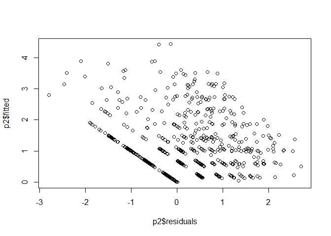<!-- -->

``` r
qqnorm(p2$residuals)
qqline(p2$residuals)
```

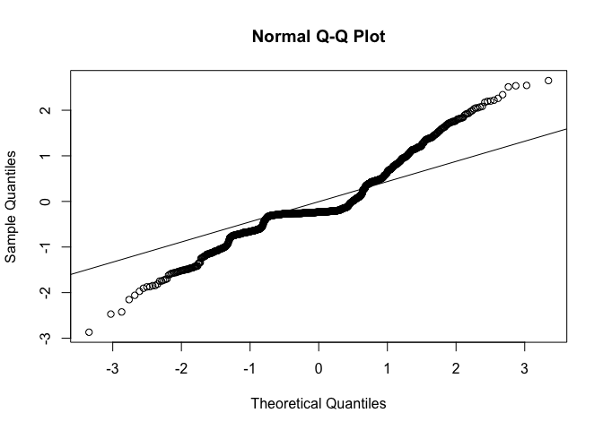<!-- -->

``` r
#Running a linear model with a quasipoisson distribution on number of introduced ranges

p3 <- glm(num_introduced ~ EFN + Domatia + EFN*Domatia + total_area_native + abs_lat_native + annual + uses_num_uses, family="quasipoisson", data=range_ed_pgls)
summary(p3)
```

    ## 
    ## Call:
    ## glm(formula = num_introduced ~ EFN + Domatia + EFN * Domatia + 
    ##     total_area_native + abs_lat_native + annual + uses_num_uses, 
    ##     family = "quasipoisson", data = range_ed_pgls)
    ## 
    ## Deviance Residuals: 
    ##     Min       1Q   Median       3Q      Max  
    ## -9.5612  -1.7810  -1.4174  -0.0283  13.1201  
    ## 
    ## Coefficients:
    ##                     Estimate Std. Error t value Pr(>|t|)    
    ## (Intercept)        1.698e-01  1.035e-01   1.640   0.1012    
    ## EFN1               4.871e-01  9.788e-02   4.976 7.42e-07 ***
    ## Domatia1          -1.508e+00  1.570e+00  -0.961   0.3370    
    ## total_area_native -3.142e-15  3.586e-15  -0.876   0.3811    
    ## abs_lat_native    -5.830e-03  2.729e-03  -2.136   0.0329 *  
    ## annual             5.680e-01  1.056e-01   5.379 8.98e-08 ***
    ## uses_num_uses      4.593e-01  1.405e-02  32.682  < 2e-16 ***
    ## EFN1:Domatia1     -1.038e+01  4.693e+02  -0.022   0.9824    
    ## ---
    ## Signif. codes:  0 '***' 0.001 '**' 0.01 '*' 0.05 '.' 0.1 ' ' 1
    ## 
    ## (Dispersion parameter for quasipoisson family taken to be 7.388056)
    ## 
    ##     Null deviance: 15070.1  on 1216  degrees of freedom
    ## Residual deviance:  6630.1  on 1209  degrees of freedom
    ## AIC: NA
    ## 
    ## Number of Fisher Scoring iterations: 9

``` r
#Analysis for area introduced
#PGLS with both EFN and domatia, interaction and covariates

#PGLS with both EFN and Domatia, interaction, covariates
p5 <- gls(log((total_area_introduced/1e+6)+1) ~ EFN + Domatia + EFN*Domatia+ total_area_native + abs_lat_native + annual + uses_num_uses, correlation = corPagel(1, phy = pruned.tree.pgls, form = ~ Phy), method = "ML", data = range_ed_pgls) 
summary(p5)
```

    ## Generalized least squares fit by maximum likelihood
    ##   Model: log((total_area_introduced/1e+06) + 1) ~ EFN + Domatia + EFN *      Domatia + total_area_native + abs_lat_native + annual + uses_num_uses 
    ##   Data: range_ed_pgls 
    ##        AIC      BIC    logLik
    ##   7623.874 7674.916 -3801.937
    ## 
    ## Correlation Structure: corPagel
    ##  Formula: ~Phy 
    ##  Parameter estimate(s):
    ##    lambda 
    ## 0.1809063 
    ## 
    ## Coefficients:
    ##                       Value Std.Error   t-value p-value
    ## (Intercept)        2.020600  1.093714  1.847467  0.0649
    ## EFN1               3.219079  0.579713  5.552887  0.0000
    ## Domatia1          -0.225372  2.800803 -0.080467  0.9359
    ## total_area_native  0.000000  0.000000  0.294054  0.7688
    ## abs_lat_native     0.022584  0.015044  1.501194  0.1336
    ## annual             0.860898  0.506309  1.700341  0.0893
    ## uses_num_uses      2.253913  0.094627 23.819030  0.0000
    ## EFN1:Domatia1     -3.833778  6.068842 -0.631715  0.5277
    ## 
    ##  Correlation: 
    ##                   (Intr) EFN1   Domat1 ttl_r_ abs_l_ annual uss_n_
    ## EFN1              -0.020                                          
    ## Domatia1          -0.023  0.028                                   
    ## total_area_native -0.097 -0.030 -0.023                            
    ## abs_lat_native    -0.288  0.032  0.041  0.082                     
    ## annual            -0.058 -0.010  0.003  0.071  0.084              
    ## uses_num_uses     -0.088 -0.106  0.017 -0.423  0.034  0.051       
    ## EFN1:Domatia1      0.003 -0.083 -0.458  0.027 -0.004  0.003  0.010
    ## 
    ## Standardized residuals:
    ##        Min         Q1        Med         Q3        Max 
    ## -2.8188487 -0.5860838 -0.4378052  0.7366424  2.4072745 
    ## 
    ## Residual standard error: 5.878475 
    ## Degrees of freedom: 1217 total; 1209 residual

``` r
plot(p5$residuals, p5$fitted)
```

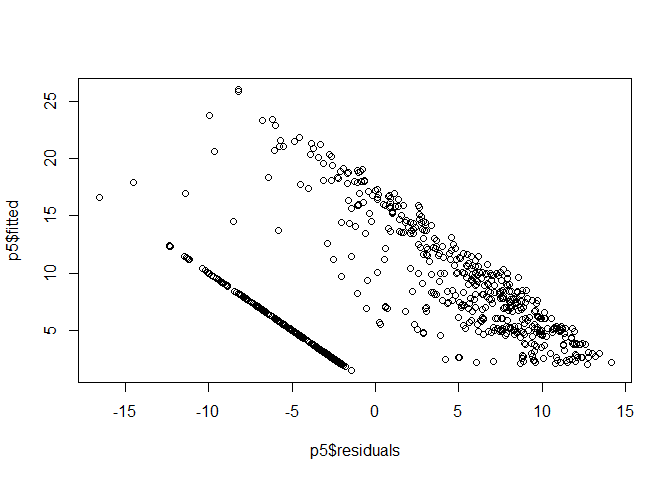<!-- -->

``` r
qqnorm(p5$residuals)
qqline(p5$residuals)
```

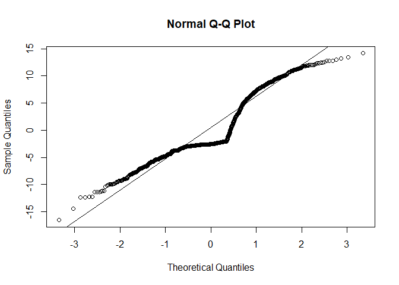<!-- -->

``` r
#Repeating for native area
#PGLS with both EFN presence and fixer, interaction and covariates
p6 <- gls(log((total_area_native/1e+6) + 1) ~ EFN + Domatia + EFN*Domatia + abs_lat_native + annual + uses_num_uses, correlation = corPagel(1, phy = pruned.tree.pgls, form = ~ Phy), method = "ML", data = range_ed_pgls)
summary(p6)
```

    ## Generalized least squares fit by maximum likelihood
    ##   Model: log((total_area_native/1e+06) + 1) ~ EFN + Domatia + EFN * Domatia +      abs_lat_native + annual + uses_num_uses 
    ##   Data: range_ed_pgls 
    ##        AIC      BIC    logLik
    ##   4092.105 4138.042 -2037.053
    ## 
    ## Correlation Structure: corPagel
    ##  Formula: ~Phy 
    ##  Parameter estimate(s):
    ##    lambda 
    ## 0.4849969 
    ## 
    ## Coefficients:
    ##                    Value Std.Error  t-value p-value
    ## (Intercept)    14.892213 0.4363908 34.12587  0.0000
    ## EFN1           -0.075294 0.1337445 -0.56297  0.5736
    ## Domatia1        0.665569 0.6641354  1.00216  0.3165
    ## abs_lat_native -0.007488 0.0037734 -1.98431  0.0474
    ## annual         -0.042073 0.1202215 -0.34997  0.7264
    ## uses_num_uses   0.246151 0.0201266 12.23017  0.0000
    ## EFN1:Domatia1  -3.470638 1.3758223 -2.52259  0.0118
    ## 
    ##  Correlation: 
    ##                (Intr) EFN1   Domat1 abs_l_ annual uss_n_
    ## EFN1           -0.012                                   
    ## Domatia1       -0.011  0.021                            
    ## abs_lat_native -0.177  0.037  0.030                     
    ## annual         -0.029 -0.002  0.003  0.087              
    ## uses_num_uses  -0.086 -0.136 -0.001  0.070  0.093       
    ## EFN1:Domatia1   0.002 -0.083 -0.474 -0.002  0.002  0.030
    ## 
    ## Standardized residuals:
    ##        Min         Q1        Med         Q3        Max 
    ## -7.3232512 -0.3069108  0.1539609  0.6247867  1.6308463 
    ## 
    ## Residual standard error: 1.644628 
    ## Degrees of freedom: 1217 total; 1210 residual

``` r
#all effects non-significant


#Diagnostic plots
plot(p6$residuals, p6$fitted)
```

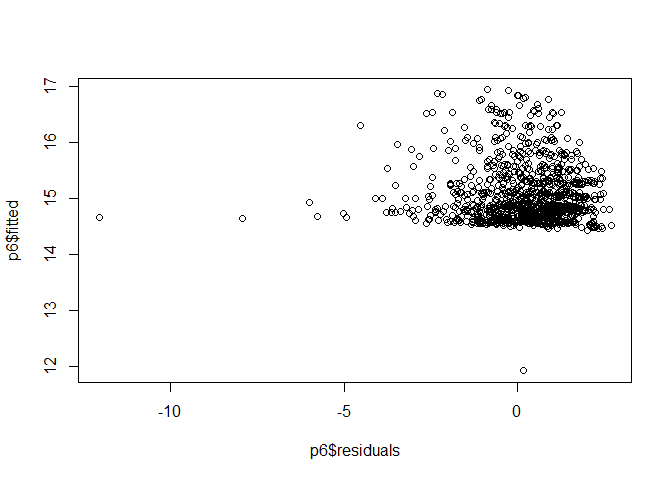<!-- -->

``` r
qqnorm(p6$residuals)
qqline(p6$residuals)
```

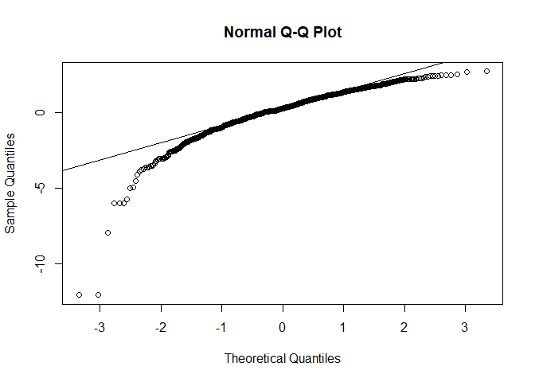<!-- -->

## Statistical models for Rhizobial symbiosis

``` r
range$Phy <- as.character(range$Phy)
phyint <- intersect(zanne$tip.label, range$Phy)  
phydiff <- setdiff(zanne$tip.label, range$Phy)
pruned.tree.pgls <- drop.tip(zanne, phydiff)

range_pgls <- range[range$Phy %in% phyint, ]
range_pgls <- range_pgls[complete.cases(range_pgls), ]

#PGLS of number of introduced ranges as response variable withd rhizobial symbiosis
#and other covariates
p8 <- gls(log(num_introduced + 1) ~ fixer + total_area_native + abs_lat_native + annual + uses_num_uses, correlation = corPagel(1, phy = pruned.tree.pgls, form = ~ Phy), method = "ML", data = range_pgls) 
summary(p8)
```

    ## Generalized least squares fit by maximum likelihood
    ##   Model: log(num_introduced + 1) ~ fixer + total_area_native + abs_lat_native +      annual + uses_num_uses 
    ##   Data: range_pgls 
    ##        AIC      BIC    logLik
    ##   2709.595 2750.428 -1346.797
    ## 
    ## Correlation Structure: corPagel
    ##  Formula: ~Phy 
    ##  Parameter estimate(s):
    ##    lambda 
    ## 0.2961177 
    ## 
    ## Coefficients:
    ##                        Value  Std.Error  t-value p-value
    ## (Intercept)        0.2299740 0.18850526  1.21999  0.2227
    ## fixer1             0.1465607 0.11604565  1.26296  0.2068
    ## total_area_native  0.0000000 0.00000000 -1.73845  0.0824
    ## abs_lat_native    -0.0030575 0.00206918 -1.47763  0.1398
    ## annual             0.0587183 0.06798857  0.86365  0.3880
    ## uses_num_uses      0.4276283 0.01254028 34.10038  0.0000
    ## 
    ##  Correlation: 
    ##                   (Intr) fixer1 ttl_r_ abs_l_ annual
    ## fixer1            -0.241                            
    ## total_area_native -0.064 -0.044                     
    ## abs_lat_native    -0.214 -0.053  0.082              
    ## annual            -0.039 -0.025  0.081  0.091       
    ## uses_num_uses     -0.087  0.064 -0.429  0.032  0.046
    ## 
    ## Standardized residuals:
    ##        Min         Q1        Med         Q3        Max 
    ## -3.1172741 -0.4051342 -0.3259334  0.4048065  3.1503612 
    ## 
    ## Residual standard error: 0.827861 
    ## Degrees of freedom: 1217 total; 1211 residual

``` r
#Not significant

#Diagnostic plots
plot(p8$residuals, p8$fitted)
```

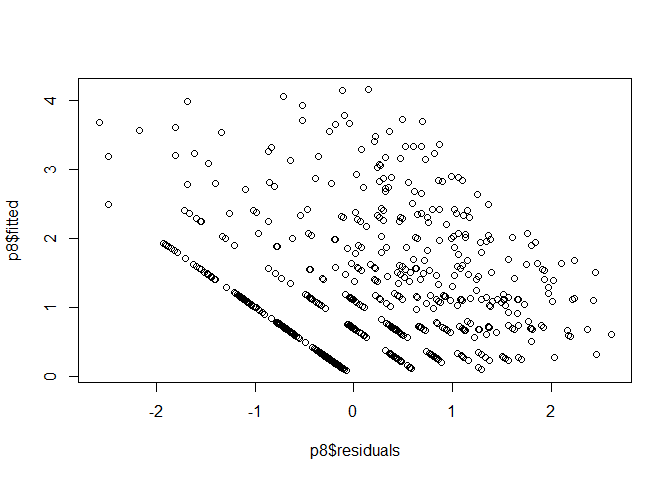<!-- -->

``` r
qqnorm(p8$residuals)
qqline(p8$residuals)
```

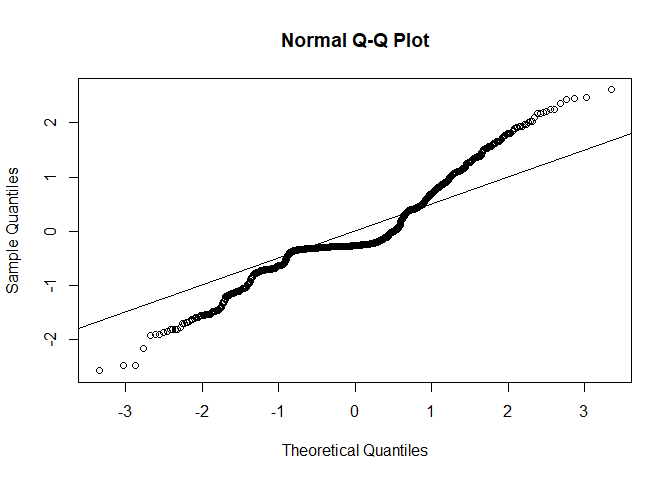<!-- -->

``` r
#Running a linear model with a quasipoisson distribution on number of introduced ranges

p9 <- glm(num_introduced ~ fixer + total_area_native + abs_lat_native + annual + uses_num_uses, family="quasipoisson", data=range_pgls)
summary(p9)
```

    ## 
    ## Call:
    ## glm(formula = num_introduced ~ fixer + total_area_native + abs_lat_native + 
    ##     annual + uses_num_uses, family = "quasipoisson", data = range_pgls)
    ## 
    ## Deviance Residuals: 
    ##     Min       1Q   Median       3Q      Max  
    ## -8.6289  -1.7755  -1.4727  -0.0642  12.8243  
    ## 
    ## Coefficients:
    ##                     Estimate Std. Error t value Pr(>|t|)    
    ## (Intercept)        2.053e-01  1.294e-01   1.586  0.11300    
    ## fixer1             1.005e-01  1.150e-01   0.874  0.38255    
    ## total_area_native -4.629e-15  3.695e-15  -1.253  0.21055    
    ## abs_lat_native    -7.780e-03  2.761e-03  -2.818  0.00491 ** 
    ## annual             4.868e-01  1.069e-01   4.553 5.81e-06 ***
    ## uses_num_uses      4.686e-01  1.418e-02  33.044  < 2e-16 ***
    ## ---
    ## Signif. codes:  0 '***' 0.001 '**' 0.01 '*' 0.05 '.' 0.1 ' ' 1
    ## 
    ## (Dispersion parameter for quasipoisson family taken to be 7.589359)
    ## 
    ##     Null deviance: 15070.1  on 1216  degrees of freedom
    ## Residual deviance:  6809.8  on 1211  degrees of freedom
    ## AIC: NA
    ## 
    ## Number of Fisher Scoring iterations: 6

``` r
#Results qualitatively similar

#Analysis for area introduced
p10 <- gls(log((total_area_introduced/1e+6)+1) ~ fixer + total_area_native + abs_lat_native + annual + uses_num_uses, correlation = corPagel(1, phy = pruned.tree.pgls, form = ~ Phy), method = "ML", data = range_pgls) 

summary(p10)
```

    ## Generalized least squares fit by maximum likelihood
    ##   Model: log((total_area_introduced/1e+06) + 1) ~ fixer + total_area_native +      abs_lat_native + annual + uses_num_uses 
    ##   Data: range_pgls 
    ##        AIC      BIC    logLik
    ##   7649.255 7690.088 -3816.628
    ## 
    ## Correlation Structure: corPagel
    ##  Formula: ~Phy 
    ##  Parameter estimate(s):
    ##   lambda 
    ## 0.200572 
    ## 
    ## Coefficients:
    ##                       Value Std.Error   t-value p-value
    ## (Intercept)       1.7581510 1.2081808  1.455205  0.1459
    ## fixer1            0.9768641 0.8291967  1.178085  0.2390
    ## total_area_native 0.0000000 0.0000000  0.390669  0.6961
    ## abs_lat_native    0.0187152 0.0153337  1.220531  0.2225
    ## annual            0.8479365 0.5134317  1.651508  0.0989
    ## uses_num_uses     2.3154869 0.0954195 24.266403  0.0000
    ## 
    ##  Correlation: 
    ##                   (Intr) fixer1 ttl_r_ abs_l_ annual
    ## fixer1            -0.291                            
    ## total_area_native -0.075 -0.048                     
    ## abs_lat_native    -0.244 -0.066  0.086              
    ## annual            -0.044 -0.030  0.074  0.088       
    ## uses_num_uses     -0.104  0.073 -0.430  0.031  0.047
    ## 
    ## Standardized residuals:
    ##        Min         Q1        Med         Q3        Max 
    ## -2.4450079 -0.6340286 -0.5259645  0.7283855  2.2597791 
    ## 
    ## Residual standard error: 6.003987 
    ## Degrees of freedom: 1217 total; 1211 residual

``` r
#EFN significant positive, fixer and interaction not significant

plot(p10$residuals, p10$fitted)
```

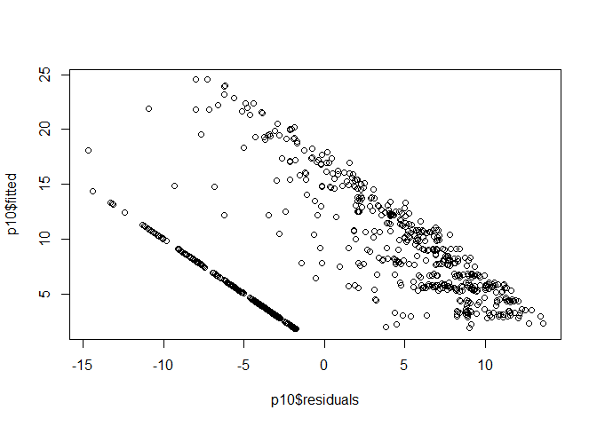<!-- -->

``` r
qqnorm(p10$residuals)
qqline(p10$residuals)
```

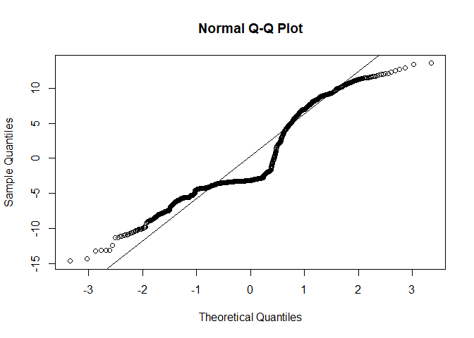<!-- -->

``` r
#Repeating for native area

p11 <- gls(log((total_area_native/1e+6) + 1) ~ fixer + abs_lat_native + annual + uses_num_uses, correlation = corPagel(1, phy = pruned.tree.pgls, form = ~ Phy), method = "ML", data = range_pgls)
summary(p11)
```

    ## Generalized least squares fit by maximum likelihood
    ##   Model: log((total_area_native/1e+06) + 1) ~ fixer + abs_lat_native +      annual + uses_num_uses 
    ##   Data: range_pgls 
    ##        AIC      BIC    logLik
    ##   4095.042 4130.771 -2040.521
    ## 
    ## Correlation Structure: corPagel
    ##  Formula: ~Phy 
    ##  Parameter estimate(s):
    ##    lambda 
    ## 0.4733439 
    ## 
    ## Coefficients:
    ##                    Value Std.Error  t-value p-value
    ## (Intercept)    14.868508 0.4369321 34.02933  0.0000
    ## fixer1          0.061557 0.2224800  0.27669  0.7821
    ## abs_lat_native -0.007462 0.0037721 -1.97817  0.0481
    ## annual         -0.040423 0.1204605 -0.33557  0.7373
    ## uses_num_uses   0.245840 0.0199941 12.29561  0.0000
    ## 
    ##  Correlation: 
    ##                (Intr) fixer1 abs_l_ annual
    ## fixer1         -0.184                     
    ## abs_lat_native -0.169 -0.040              
    ## annual         -0.026 -0.016  0.087       
    ## uses_num_uses  -0.095  0.038  0.074  0.092
    ## 
    ## Standardized residuals:
    ##        Min         Q1        Med         Q3        Max 
    ## -7.3884770 -0.3356729  0.1306844  0.6042513  1.6161696 
    ## 
    ## Residual standard error: 1.635342 
    ## Degrees of freedom: 1217 total; 1212 residual

``` r
#all mutualism effects non-significant


plot(p11$residuals, p11$fitted)
```

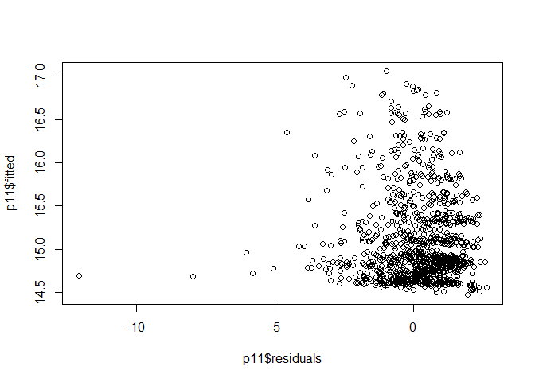<!-- -->

``` r
qqnorm(p11$residuals)
qqline(p11$residuals)
```

<!-- --> ## Statistical models
for mycorrhizae

``` r
range_myco$Phy <- as.character(range_myco$Phy)
phyint1 <- intersect(zanne$tip.label, range_myco$Phy)  
phydiff1 <- setdiff(zanne$tip.label, range_myco$Phy)
pruned.myco.pgls <- drop.tip(zanne, phydiff1) #dropping tips not in the dataset

range_myco_pgls <- range_myco[range_myco$Phy %in% phyint1, ]
range_myco_pgls <- range_myco_pgls[complete.cases(range_myco_pgls), ]


#PGLS of number of introduced ranges as response variable mycorrhizae and covariates as predictors
p12 <- gls(log(num_introduced + 1) ~ Consensus.mycorrhizal.state + total_area_native + abs_lat_native + annual + uses_num_uses, correlation = corPagel(1, phy = pruned.myco.pgls, form = ~ Phy), method = "ML", data = range_myco_pgls) 
summary(p12)
```

    ## Generalized least squares fit by maximum likelihood
    ##   Model: log(num_introduced + 1) ~ Consensus.mycorrhizal.state + total_area_native +      abs_lat_native + annual + uses_num_uses 
    ##   Data: range_myco_pgls 
    ##       AIC      BIC    logLik
    ##   598.525 632.0436 -289.2625
    ## 
    ## Correlation Structure: corPagel
    ##  Formula: ~Phy 
    ##  Parameter estimate(s):
    ##    lambda 
    ## 0.1627731 
    ## 
    ## Coefficients:
    ##                                      Value Std.Error   t-value p-value
    ## (Intercept)                      0.6591983 0.2546740  2.588401  0.0103
    ## Consensus.mycorrhizal.stateAMNM  0.2900330 0.2283288  1.270242  0.2055
    ## Consensus.mycorrhizal.stateEM   -0.3592352 0.3597864 -0.998468  0.3192
    ## Consensus.mycorrhizal.stateNM   -0.3579691 0.4019194 -0.890649  0.3742
    ## total_area_native                0.0000000 0.0000000 -1.421832  0.1566
    ## abs_lat_native                  -0.0073724 0.0053732 -1.372059  0.1716
    ## annual                           0.5157718 0.2126400  2.425563  0.0162
    ## uses_num_uses                    0.3658581 0.0282373 12.956540  0.0000
    ## 
    ##  Correlation: 
    ##                                 (Intr) C..AMN Cn..EM Cn..NM ttl_r_ abs_l_
    ## Consensus.mycorrhizal.stateAMNM  0.052                                   
    ## Consensus.mycorrhizal.stateEM   -0.120  0.054                            
    ## Consensus.mycorrhizal.stateNM    0.038  0.133  0.023                     
    ## total_area_native               -0.166 -0.054  0.029 -0.033              
    ## abs_lat_native                  -0.429 -0.227  0.017 -0.230 -0.047       
    ## annual                          -0.114 -0.037  0.025 -0.043  0.192  0.109
    ## uses_num_uses                   -0.240 -0.067  0.058  0.095 -0.279  0.097
    ##                                 annual
    ## Consensus.mycorrhizal.stateAMNM       
    ## Consensus.mycorrhizal.stateEM         
    ## Consensus.mycorrhizal.stateNM         
    ## total_area_native                     
    ## abs_lat_native                        
    ## annual                                
    ## uses_num_uses                   -0.127
    ## 
    ## Standardized residuals:
    ##        Min         Q1        Med         Q3        Max 
    ## -2.2419440 -0.4874914  0.2509161  0.8364513  2.5594412 
    ## 
    ## Residual standard error: 0.993691 
    ## Degrees of freedom: 211 total; 203 residual

``` r
#Neither mutualism nor interaction significant

#Diagnostic plots
plot(p12$residuals, p12$fitted)
```

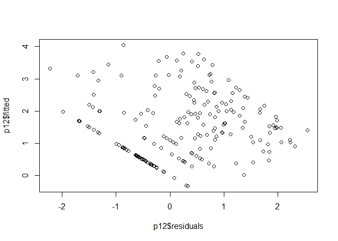<!-- -->

``` r
qqnorm(p12$residuals)
qqline(p12$residuals)
```

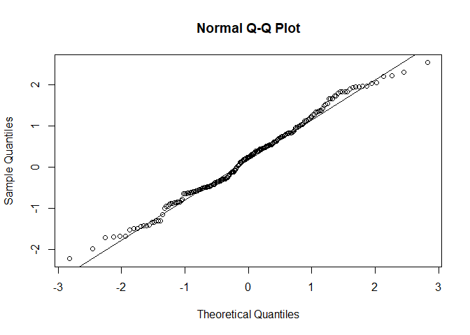<!-- -->

``` r
anova12 <- Anova(p12, type = 3)

#Running a linear model with a quasipoisson distribution on number of introduced ranges

p13 <- glm(num_introduced ~ Consensus.mycorrhizal.state + total_area_native + abs_lat_native + annual + uses_num_uses, family="quasipoisson", data=range_myco_pgls)
summary(p13)
```

    ## 
    ## Call:
    ## glm(formula = num_introduced ~ Consensus.mycorrhizal.state + 
    ##     total_area_native + abs_lat_native + annual + uses_num_uses, 
    ##     family = "quasipoisson", data = range_myco_pgls)
    ## 
    ## Deviance Residuals: 
    ##    Min      1Q  Median      3Q     Max  
    ## -7.890  -2.839  -1.486   1.109   9.952  
    ## 
    ## Coefficients:
    ##                                   Estimate Std. Error t value Pr(>|t|)    
    ## (Intercept)                      1.550e+00  1.862e-01   8.326 1.23e-14 ***
    ## Consensus.mycorrhizal.stateAMNM -1.225e-01  2.247e-01  -0.545 0.586365    
    ## Consensus.mycorrhizal.stateEM   -9.023e-01  6.048e-01  -1.492 0.137293    
    ## Consensus.mycorrhizal.stateNM   -8.204e-01  6.249e-01  -1.313 0.190700    
    ## total_area_native               -9.907e-15  5.485e-15  -1.806 0.072383 .  
    ## abs_lat_native                  -5.453e-03  4.471e-03  -1.220 0.224001    
    ## annual                           6.004e-01  1.564e-01   3.840 0.000165 ***
    ## uses_num_uses                    2.920e-01  2.479e-02  11.775  < 2e-16 ***
    ## ---
    ## Signif. codes:  0 '***' 0.001 '**' 0.01 '*' 0.05 '.' 0.1 ' ' 1
    ## 
    ## (Dispersion parameter for quasipoisson family taken to be 10.75634)
    ## 
    ##     Null deviance: 4024.0  on 210  degrees of freedom
    ## Residual deviance: 2094.3  on 203  degrees of freedom
    ## AIC: NA
    ## 
    ## Number of Fisher Scoring iterations: 6

``` r
#Results qualitatively similar

#Analysis for area introduced
#PGLS with both domatia presence and fixer, interaction and covariates
#range_myco_pgls <- na.omit(range_myco_pgls)
#range_myco_pgls$Consensus.mycorrhizal.state <- as.factor(range_myco_pgls$Consensus.mycorrhizal.state)
#range_myco_pgls$fixer <- as.factor(range_myco_pgls$fixer)
######this model didin't run
#p14 <- gls(log((total_area_introduced/1e+6) + 1)~ Consensus.mycorrhizal.state + total_area_native + abs_lat_native + annual + uses_num_uses, correlation = corPagel(1, phy = pruned.myco.pgls, form = ~ Phy), method = "ML", data = range_myco_pgls) 

#summary(p14)
#EFN significant positive, fixer and interaction not significant

#plot(p14$residuals, p14$fitted)
#qqnorm(p14$residuals)
#qqline(p14$residuals)


#Repeating for native area
#PGLS with mycorrhizae and covariates

p15 <- gls(log((total_area_native/1e+6) + 1) ~ Consensus.mycorrhizal.state + abs_lat_native + annual + uses_num_uses, correlation = corPagel(1, phy = pruned.myco.pgls, form = ~ Phy), method = "ML", data = range_myco_pgls)
summary(p15)
```

    ## Generalized least squares fit by maximum likelihood
    ##   Model: log((total_area_native/1e+06) + 1) ~ Consensus.mycorrhizal.state +      abs_lat_native + annual + uses_num_uses 
    ##   Data: range_myco_pgls 
    ##        AIC      BIC    logLik
    ##   714.6984 744.8651 -348.3492
    ## 
    ## Correlation Structure: corPagel
    ##  Formula: ~Phy 
    ##  Parameter estimate(s):
    ##    lambda 
    ## 0.1528252 
    ## 
    ## Coefficients:
    ##                                     Value Std.Error  t-value p-value
    ## (Intercept)                     14.871023 0.3255386 45.68129  0.0000
    ## Consensus.mycorrhizal.stateAMNM  0.276721 0.3011077  0.91901  0.3592
    ## Consensus.mycorrhizal.stateEM   -0.235649 0.4738458 -0.49731  0.6195
    ## Consensus.mycorrhizal.stateNM    0.222567 0.5294551  0.42037  0.6747
    ## abs_lat_native                   0.015585 0.0070497  2.21073  0.0282
    ## annual                          -0.711057 0.2755074 -2.58090  0.0106
    ## uses_num_uses                    0.155271 0.0357852  4.33896  0.0000
    ## 
    ##  Correlation: 
    ##                                 (Intr) C..AMN Cn..EM Cn..NM abs_l_ annual
    ## Consensus.mycorrhizal.stateAMNM  0.045                                   
    ## Consensus.mycorrhizal.stateEM   -0.121  0.054                            
    ## Consensus.mycorrhizal.stateNM    0.033  0.132  0.024                     
    ## abs_lat_native                  -0.452 -0.231  0.022 -0.233              
    ## annual                          -0.086 -0.028  0.021 -0.037  0.117       
    ## uses_num_uses                   -0.309 -0.086  0.070  0.089  0.087 -0.078
    ## 
    ## Standardized residuals:
    ##        Min         Q1        Med         Q3        Max 
    ## -4.1625690 -0.4424276  0.2505273  0.7372759  1.8333824 
    ## 
    ## Residual standard error: 1.310304 
    ## Degrees of freedom: 211 total; 204 residual

``` r
plot(p15$residuals, p15$fitted)
```

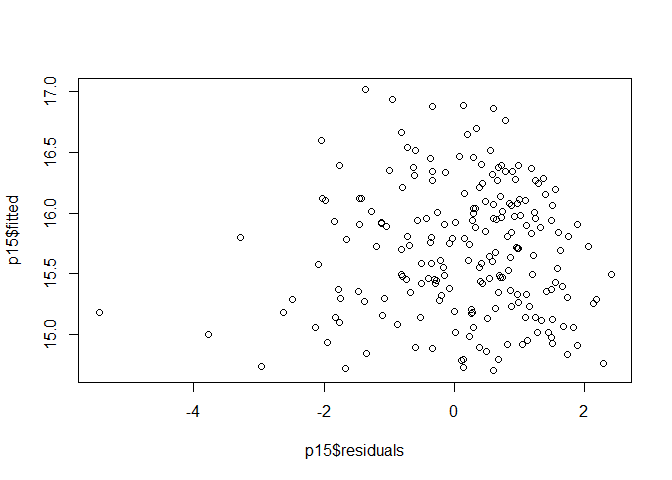<!-- -->

``` r
qqnorm(p15$residuals)
qqline(p15$residuals)
```

<!-- -->

``` r
anova15 <- Anova(p15, type = 3)
anova15
```

    ## Analysis of Deviance Table (Type III tests)
    ## 
    ## Response: log((total_area_native/1e+06) + 1)
    ##                             Df     Chisq Pr(>Chisq)    
    ## (Intercept)                  1 2086.7807  < 2.2e-16 ***
    ## Consensus.mycorrhizal.state  3    1.2415   0.743058    
    ## abs_lat_native               1    4.8873   0.027054 *  
    ## annual                       1    6.6610   0.009854 ** 
    ## uses_num_uses                1   18.8266  1.432e-05 ***
    ## ---
    ## Signif. codes:  0 '***' 0.001 '**' 0.01 '*' 0.05 '.' 0.1 ' ' 1

# Do EFN-visiting ants have higher range size?

``` r
###Native range size
antarea <- read.csv("Ant_species_native range.csv") #native area for ants
invarea <- read.csv("invaded_area_ant_species.csv") #invaded area for ants - all types of introduction and all available data
abslat <- read.csv("absolute_native_lat_ants7Feb.csv")

#merging invaded and native area datasets
nat_inv_area <- merge(invarea, antarea, by='Phy', all.y=TRUE) 
#nat_inv_area <- subset(nat_inv_area, select = -c(X,LogArea.introduced, LogArea.native))
nat_inv_area$total.area.introduced <- ifelse(is.na(nat_inv_area$total.area.introduced), 0, nat_inv_area$total.area.introduced) #Make NAs zeros 

nat_inv_area_lat <- merge(abslat, nat_inv_area, by = 'Phy')
nat_inv_area_lat <- data.frame(nat_inv_area_lat)[, -c(2, 4, 5, 6, 10, 11)] #removing unnecessary columns


antefn <- read.csv("Species_EFN_Data.csv")
antdom <- read.csv("Species_Domatia_Data.csv")
antseed <- read.csv("Species_Seed_Dispersal_Data.csv")


#Creating merged datasets for area
efn_area <- merge(nat_inv_area_lat, antefn, by.y = "Phy", all = FALSE)
efn_dom_area <- merge(efn_area, antdom, by.y = "Phy", all = FALSE)
efn_dom_seed_area <- merge(efn_dom_area, antseed, by.y = "Phy", all = FALSE)
area <- efn_dom_seed_area
#write.csv(area, "ants_nat_alien_mutualismcombined.csv")


#Making figures

area$EFN <- as.factor(area$EFN)
area$Domatia <- as.factor(area$Domatia)
area$Seed_Dispersal <- as.factor(area$Seed_Dispersal)

lognative <- log10(area$total.area.native)
logint <- log10(area$total.area.introduced + 1)
area <- data.frame(area, lognative, logint)


fig3a <- ggplot(data=area)+
  scale_fill_manual(values=hues) +
  scale_colour_manual(values=hues) +
  geom_violin(aes(color=EFN, fill=EFN, x=EFN, y=total.area.native), alpha=0.7)+
  scale_x_discrete(breaks=c("0","1"),
                   labels=c("No", "Yes")) + 
  xlab("Visits extrafloral nectaries") + 
  ylab("Native range area (sq. km)")+
  theme_cowplot() +
  theme(legend.position = "none")+
  stat_summary(aes(x=EFN, y=total.area.native), fun="mean", geom="crossbar", width=0.25)+
  scale_y_log10()
#fig3a

fig3b <- ggplot(data=area)+
  scale_fill_manual(values=hues) +
  scale_colour_manual(values=hues) +
  geom_violin(aes(color=Domatia, fill=Domatia, x=Domatia, y=total.area.native), alpha=0.7)+
  scale_x_discrete(breaks=c("0","1"),
                   labels=c("No", "Yes")) + 
  xlab("Resides in domatias") + 
  ylab("Native range area (sq. km)")+
  theme_cowplot() +
  theme(legend.position = "none")+
  stat_summary(aes(x=Domatia, y=total.area.native), fun="mean", geom="crossbar", width=0.25)+
  scale_y_log10()
#fig3b

fig3c <- ggplot(data=area)+
  scale_fill_manual(values=hues) +
  scale_colour_manual(values=hues) +
  geom_violin(aes(color=Seed_Dispersal, fill=Seed_Dispersal, x=Seed_Dispersal, y=total.area.native), alpha=0.7)+
  scale_x_discrete(breaks=c("0","1"),
                   labels=c("No", "Yes")) + 
  xlab("Disperses seeds") + 
  ylab("Native range area (sq. km)")+
  theme_cowplot() +
  theme(legend.position = "none")+
  stat_summary(aes(x=Seed_Dispersal, y=total.area.native), fun="mean", geom="crossbar", width=0.25)+
  scale_y_log10()
#fig3c

fig3 <- plot_grid(fig3a, fig3b,fig3c, labels="AUTO", ncol = 3, nrow = 1)
fig3
```

<!-- -->

``` r
ggsave(fig3, device = "jpeg", filename = "Fig3.jpg")

### Invaded range size


fig4a <- ggplot(data=area)+
  scale_fill_manual(values=hues) +
  scale_colour_manual(values=hues) +
  geom_violin(aes(color=EFN, fill=EFN, x=EFN, y=logint), alpha=0.7)+
  scale_x_discrete(breaks=c("0","1"),
                   labels=c("No", "Yes")) + 
  xlab("Visits extrafloral nectaries") + 
  ylab("log(Introduced range area (sq. km) + 1)")+
  theme_cowplot() +
  theme(legend.position = "none")+
  stat_summary(aes(x=EFN, y=logint), fun="mean", geom="crossbar", width=0.25)
#fig4a

fig4b <- ggplot(data=area)+
  scale_fill_manual(values=hues) +
  scale_colour_manual(values=hues) +
  geom_violin(aes(color=Domatia, fill=Domatia, x=Domatia, y=logint, alpha=0.7))+
  scale_x_discrete(breaks=c("0","1"),
                   labels=c("No", "Yes")) + 
  xlab("Resides in domatias") + 
  ylab("log(Introduced range area (sq. km) + 1)")+
  theme_cowplot() +
  theme(legend.position = "none")+
  stat_summary(aes(x=Domatia, y=logint), fun="mean", geom="crossbar", width=0.25)
#fig4b

fig4c <- ggplot(data=area)+
  scale_fill_manual(values=hues) +
  scale_colour_manual(values=hues) +
  geom_violin(aes(color=Seed_Dispersal, fill=Seed_Dispersal, x=Seed_Dispersal, y=logint), alpha=0.7)+
  scale_x_discrete(breaks=c("0","1"),
                   labels=c("No", "Yes")) + 
  xlab("Disperses seeds") + 
  ylab("log(Introduced range area (sq. km) + 1)")+
  theme_cowplot() +
  theme(legend.position = "none")+
  stat_summary(aes(x=Seed_Dispersal, y=logint), fun="mean", geom="crossbar", width=0.25)
#fig4c

fig4 <- plot_grid(fig4a, fig4b,fig4c, labels="AUTO", ncol = 3, nrow = 1)
fig4
```

<!-- -->

``` r
ggsave(fig4, device = "jpeg", filename = "Fig4.jpg")
```

``` r
#all ant mutualisms
#Native range size
ant_tree <- read.tree("Ant_tree.tre") #Reading in ant phylogeny
phy_int <- intersect(ant_tree$tip.label, area$Phy)
phy_diff <- setdiff(ant_tree$tip.label, area$Phy)
pruned_ant_tree <- drop.tip(ant_tree, as.character(phy_diff)) #pruning tree to contain only tips in the dataset

area_phy <- area[area$Phy %in% phy_int, ] #dataset for pgls
area_phy <- area_phy[complete.cases(area_phy), ]
#write.csv(efn_area_phy, "Ant_list_EFN.csv")
#efn_area_phy <- efn_area_phy[match(pruned_ant_tree$tip.label, efn_area_phy$Phy),]


#PGLS model
#a1 <- gls(lognative ~ EFN + Domatia + Seed_Dispersal + EFN*Domatia + Domatia*Seed_Dispersal + Seed_Dispersal*EFN + abs_lat_native, 
                #correlation = corPagel(1, phy = pruned_ant_tree, form = ~ Phy), 
                #method = "ML", data = area_phy) 
#summary(a1) 

#removing interactions
a11 <- gls(lognative ~ EFN + Domatia + Seed_Dispersal + abs_lat_native, 
                correlation = corPagel(1, phy = pruned_ant_tree, form = ~ Phy), 
                method = "ML", data = area_phy) 
summary(a11)
```

    ## Generalized least squares fit by maximum likelihood
    ##   Model: lognative ~ EFN + Domatia + Seed_Dispersal + abs_lat_native 
    ##   Data: area_phy 
    ##        AIC      BIC    logLik
    ##   219.4649 241.1639 -102.7324
    ## 
    ## Correlation Structure: corPagel
    ##  Formula: ~Phy 
    ##  Parameter estimate(s):
    ##     lambda 
    ## -0.1224982 
    ## 
    ## Coefficients:
    ##                    Value  Std.Error   t-value p-value
    ## (Intercept)     6.713068 0.04288756 156.52716  0.0000
    ## EFN1            0.434390 0.07702264   5.63977  0.0000
    ## Domatia1        0.013525 0.23569534   0.05738  0.9543
    ## Seed_Dispersal1 0.238023 0.08162069   2.91621  0.0041
    ## abs_lat_native  0.002161 0.00231702   0.93272  0.3524
    ## 
    ##  Correlation: 
    ##                 (Intr) EFN1   Domat1 Sd_Ds1
    ## EFN1            -0.508                     
    ## Domatia1        -0.100 -0.559              
    ## Seed_Dispersal1 -0.096 -0.210  0.075       
    ## abs_lat_native  -0.756  0.268  0.129 -0.464
    ## 
    ## Standardized residuals:
    ##         Min          Q1         Med          Q3         Max 
    ## -7.13447130 -0.62147347 -0.04583917  0.54758100  1.86246426 
    ## 
    ## Residual standard error: 0.456016 
    ## Degrees of freedom: 164 total; 159 residual

``` r
#Diagnostic plots
plot(a11$residuals, a11$fitted)
```

<!-- -->

``` r
qqnorm(a11$residuals)
qqline(a11$residuals)
```

<!-- -->

``` r
anova(a11)
```

    ## Denom. DF: 159 
    ##                numDF   F-value p-value
    ## (Intercept)        1 116226072  <.0001
    ## EFN                1        51  <.0001
    ## Domatia            1         0  0.5155
    ## Seed_Dispersal     1        14  0.0002
    ## abs_lat_native     1         1  0.3524

``` r
#Introduced range size 

a2 <- gls(logint ~  EFN + Domatia + Seed_Dispersal +  total.area.native + abs_lat_native,  correlation = corPagel(1, phy = pruned_ant_tree, form = ~Phy), method = "ML", data = area_phy)  
summary(a2)
```

    ## Generalized least squares fit by maximum likelihood
    ##   Model: logint ~ EFN + Domatia + Seed_Dispersal + total.area.native +      abs_lat_native 
    ##   Data: area_phy 
    ##        AIC      BIC    logLik
    ##   497.2552 522.0541 -240.6276
    ## 
    ## Correlation Structure: corPagel
    ##  Formula: ~Phy 
    ##  Parameter estimate(s):
    ##    lambda 
    ## 0.2090096 
    ## 
    ## Coefficients:
    ##                       Value Std.Error   t-value p-value
    ## (Intercept)        5.759959 0.2628644 21.912285  0.0000
    ## EFN1               0.530743 0.2407599  2.204450  0.0289
    ## Domatia1           0.172697 0.5107533  0.338123  0.7357
    ## Seed_Dispersal1   -0.022397 0.1962541 -0.114124  0.9093
    ## total.area.native  0.000000 0.0000000  1.060591  0.2905
    ## abs_lat_native    -0.020193 0.0063821 -3.163988  0.0019
    ## 
    ##  Correlation: 
    ##                   (Intr) EFN1   Domat1 Sd_Ds1 ttl.r.
    ## EFN1              -0.031                            
    ## Domatia1          -0.064 -0.352                     
    ## Seed_Dispersal1   -0.035 -0.168  0.024              
    ## total.area.native -0.235 -0.216  0.042 -0.276       
    ## abs_lat_native    -0.329  0.057  0.085 -0.210 -0.110
    ## 
    ## Standardized residuals:
    ##        Min         Q1        Med         Q3        Max 
    ## -3.0574439 -0.6020200  0.1104637  0.8158780  1.9753318 
    ## 
    ## Residual standard error: 1.085353 
    ## Degrees of freedom: 164 total; 158 residual

``` r
## Diagnostic plots
plot(a2$residuals, a2$fitted)
```

<!-- -->

``` r
qqnorm(a2$residuals)
qqline(a2$residuals)
```

<!-- -->

#In introduced species, do naturalized species spread more when they
participate #in mutualisms than indoor introduced and other categories?

``` r
###Native range size

invarea <- read.csv("invaded_area_ant_species.csv") #invaded area for ants - all types of introduction with duplicates removed
abslat <- read.csv("absolute_native_lat_ants7Feb.csv")
exstat <- read.csv("exotic_status_nodups.csv") #Invasion status - no species with more than one type of invasion

invlat <- merge(invarea, abslat, by = "Phy", all = FALSE)
invlat <- data.frame(invlat)[, -c(4, 5, 7, 8, 9)] #removing unnecessary columns
invlat_ex <- merge(invlat, exstat, by = "Phy", all = FALSE)

antefn <- read.csv("Species_EFN_Data.csv")
antdom <- read.csv("Species_Domatia_Data.csv")
antseed <- read.csv("Species_Seed_Dispersal_Data.csv")


#Creating merged datasets for area
efn_inv <- merge(invlat_ex, antefn, by.y = "Phy", all = FALSE)
efn_dom_inv <- merge(efn_inv, antdom, by.y = "Phy", all = FALSE)
efn_dom_seed_inv <- merge(efn_dom_inv, antseed, by.y = "Phy", all = FALSE)
inv_area <- efn_dom_seed_inv

inv_area$Stratum <- as.factor(inv_area$Stratum)
inv_area$Exotic_status <- as.factor(inv_area$Exotic_status)
levels(inv_area$Stratum) #6 levels
```

    ## [1] "Arboreal"                        "Arboreal & Epigaeic"            
    ## [3] "Arboreal & Epigaeic & Hypogaeic" "Epigaeic"                       
    ## [5] "Epigaeic & Hypogaeic"            "Hypogaeic"

``` r
levels(inv_area$Exotic_status) #3 levels
```

    ## [1] "Exotic"            "Indoor Introduced" "Intercepted"

``` r
inv_area$logint <- log10(inv_area$total.area.introduced)


inv_area$EFN <- as.factor(inv_area$EFN)
inv_area$Domatia <- as.factor(inv_area$Domatia)
inv_area$Seed_Dispersal <- as.factor(inv_area$Seed_Dispersal)

#Figures
#By exotic status
fig5a <- ggplot(data=inv_area)+
  scale_fill_manual(values=hues) +
  scale_colour_manual(values=hues) +
  geom_violin(aes(color=EFN, fill=EFN, x=EFN, y=logint), alpha=0.7)+
  scale_x_discrete(breaks=c("0","1"),
                   labels=c("No", "Yes")) + 
  xlab("Visits extrafloral nectaries") + 
  ylab("log(Introduced range area (sq. km) + 1)")+
  theme_cowplot() +
  theme(legend.position = "none")+
  stat_summary(aes(x=EFN, y=logint), fun="mean", geom="crossbar", width=0.25)+
  facet_wrap(inv_area$Exotic_status)

fig5b <- ggplot(data=inv_area)+
  scale_fill_manual(values=hues) +
  scale_colour_manual(values=hues) +
  geom_violin(aes(color=Domatia, fill=Domatia, x=Domatia, y=logint), alpha=0.7)+
  scale_x_discrete(breaks=c("0","1"),
                   labels=c("No", "Yes")) + 
  xlab("Resides in domatia") + 
  ylab("log(Introduced range area (sq. km) + 1)") +
  theme_cowplot() +
  theme(legend.position = "none")+
  stat_summary(aes(x=Domatia, y=logint), fun="mean", geom="crossbar", width=0.25)+
  facet_wrap(inv_area$Exotic_status)

fig5c <- ggplot(data=inv_area)+
  scale_fill_manual(values=hues) +
  scale_colour_manual(values=hues) +
  geom_violin(aes(color=Seed_Dispersal, fill=Seed_Dispersal, x=Seed_Dispersal, y=logint), alpha=0.7)+
  scale_x_discrete(breaks=c("0","1"),
                   labels=c("No", "Yes")) + 
  xlab("Disperses seeds") + 
  ylab("log(Introduced range area (sq. km) + 1)")+
  theme_cowplot() +
  theme(legend.position = "none")+
  stat_summary(aes(x=Seed_Dispersal, y=logint), fun="mean", geom="crossbar", width=0.25)+
  facet_wrap(inv_area$Exotic_status)
 
fig5 <- plot_grid(fig5a, fig5b,fig5c, labels="AUTO", ncol = 1, nrow = 3)
fig5
```

<!-- -->

``` r
ggsave(fig5, device = "jpeg", filename = "Fig5.jpg")

#By stratum
fig6a <- ggplot(data=inv_area)+
  scale_fill_manual(values=hues) +
  scale_colour_manual(values=hues) +
  geom_violin(aes(color=EFN, fill=EFN, x=EFN, y=logint), alpha=0.7)+
  scale_x_discrete(breaks=c("0","1"),
                   labels=c("No", "Yes")) + 
  xlab("Visits extrafloral nectaries") + 
  ylab("log(Introduced range area (sq. km) + 1)")+
  theme_cowplot() +
  theme(legend.position = "none")+
  stat_summary(aes(x=EFN, y=logint), fun="mean", geom="crossbar", width=0.25)+
  facet_wrap(inv_area$Stratum)

fig6b <- ggplot(data=inv_area)+
  scale_fill_manual(values=hues) +
  scale_colour_manual(values=hues) +
  geom_violin(aes(color=Domatia, fill=Domatia, x=Domatia, y=logint), alpha=0.7)+
  scale_x_discrete(breaks=c("0","1"),
                   labels=c("No", "Yes")) + 
  xlab("Resides in domatia") + 
  ylab("log(Introduced range area (sq. km) + 1)") +
  theme_cowplot() +
  theme(legend.position = "none")+
  stat_summary(aes(x=Domatia, y=logint), fun="mean", geom="crossbar", width=0.25)+
  facet_wrap(inv_area$Stratum)

fig6c <- ggplot(data=inv_area)+
  scale_fill_manual(values=hues) +
  scale_colour_manual(values=hues) +
  geom_violin(aes(color=Seed_Dispersal, fill=Seed_Dispersal, x=Seed_Dispersal, y=logint), alpha=0.7)+
  scale_x_discrete(breaks=c("0","1"),
                   labels=c("No", "Yes")) + 
  xlab("Disperses seeds") + 
  ylab("log(Introduced range area (sq. km) + 1)")+
  theme_cowplot() +
  theme(legend.position = "none")+
  stat_summary(aes(x=Seed_Dispersal, y=logint), fun="mean", geom="crossbar", width=0.25)+
  facet_wrap(inv_area$Stratum)
 
fig6 <- plot_grid(fig6a, fig6b,fig6c, labels="AUTO", ncol = 1, nrow = 3)
fig6
```

<!-- -->

``` r
ggsave(fig6, device = "jpeg", filename = "Fig6.jpg")
```

#PGLS models for species above

``` r
ant_tree <- read.tree("Ant_tree.tre") #Reading in ant phylogeny
phy_int <- intersect(ant_tree$tip.label, inv_area$Phy)
phy_diff <- setdiff(ant_tree$tip.label, inv_area$Phy)
pruned_ant_tree <- drop.tip(ant_tree, as.character(phy_diff)) #pruning tree to contain only tips in the dataset

inv_area_phy <- inv_area[inv_area$Phy %in% phy_int, ] #dataset for pgls
inv_area_phy <- inv_area_phy[complete.cases(inv_area_phy), ]

#a2 <- gls(logint ~ EFN + Domatia + Seed_Dispersal + abs_lat_native + Exotic_status, 
                #correlation = corPagel(1, phy = pruned_ant_tree, form = ~ Phy), 
                #method = "ML", data = inv_area_phy) 
```
