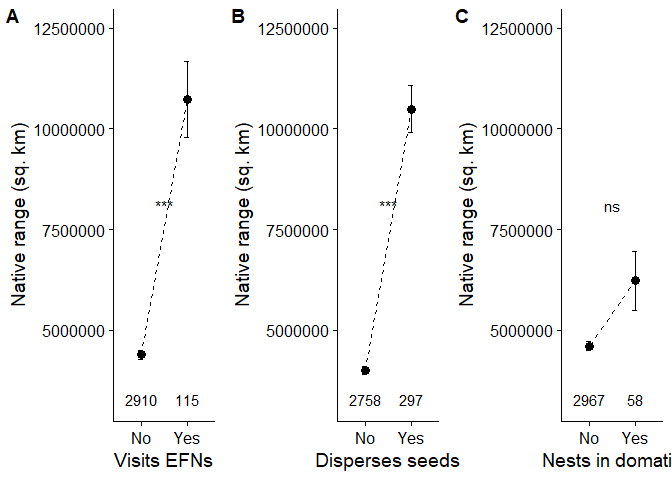
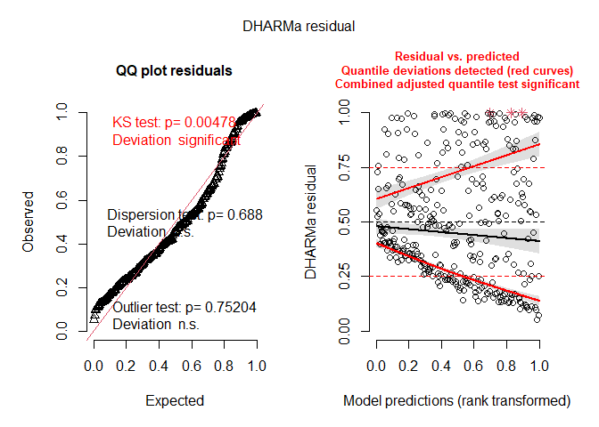

Mutualism promotes range expansion in both ant and plant partners
================
Pooja Nathan and Megan Frederickson
15/03/2022

# How does mutualism affect ant and plant range sizes?

This R Markdown document describes the dataset and code for:

Nathan P, Economo EP, Guenard B, Frederickson ME. Generalized mutualisms
promote range expansion in both plant and ant partners. In prep.

First, let’s load the packages we’ll use.

``` r
library(car)
library(olsrr)
library(ape)
library(geiger)
library(nlme)
library(lme4)
library(phytools)
library(caper)
library(tidyverse)
library(cowplot)
library(knitr)
library(taxize)
```

## Legume dataset

We obtained introduced and native range size data for legumes from
Simonsen et al. (2017).

Mutualistic trait data came from Weber et al. (2015) for extrafloral
nectaries (EFNs), Chomicki & Renner (2015) for domatia, Simonsen et
al. (2017) for nodulation, and Maherali et al. (2016) for mycorrhizae.

The next several chunks of code are slow to run, so they are not run
here, but they are included for reproducibility.

``` r
#Not run
#Legume range and nodulation data
range <- read.csv("legume_invasion_data_simonsenetal.csv") #Read in legume range data
names(range)[names(range) == "Species"] <- "Phy"
range$Phy <- as.character(gsub("_", " ", range$Phy))

#EFN data
EFN <- read.csv("EFNs_Weberatal_analysis_onlypresence.csv") #Read in EFN data
EFN$Phy <- as.character(gsub("_", " ", EFN$Phy))

#Domatia
domatia <- read.csv("domatia_chomickirenner_analysis_onlypresence.csv")  #Read in domatia data
names(domatia)[names(domatia) == 'ï..Phy'] <- 'Phy'
domatia$Phy <- as.character(gsub("_", " ", domatia$Phy))

#Mycorrhizae
mycorrhizae <- read.csv("Maherali_simonsen_intersect.csv") #Read in legume species in Maherali et al.'s mycorrhizae dataset
mycorrhizae$Phy <- as.character(gsub("_", " ", mycorrhizae$Phy))
```

### Check taxonomy

We resolved misspelled names using the gnr_resolve function and checked
for synonyms using the synonyms function in the taxize package.

First, let’s check the taxonomy of the names of domatia-bearing plants.

Next, let’s check the taxonomy of EFN-bearing plants.

``` r
#Not run
#Do the same as above for the EFN data
EFN_resolve <- as.data.frame(gnr_resolve(EFN[, "Phy"], best_match_only=TRUE))
EFN_resolve$num_words <- str_count(EFN_resolve$matched_name, " ")+1
EFN <- merge(EFN, EFN_resolve, by.y = "user_supplied_name", by.x = "Phy", all.x=TRUE)
EFN$matched_name <- ifelse(EFN$num_words == 1, NA, EFN$matched_name)
EFN$matched_name <- ifelse(!is.na(EFN$matched_name), paste0(word(EFN$matched_name, 1, 1), " ", tolower(word(EFN$matched_name, 2, 2))), EFN$matched_name)
EFN$diff <- EFN$Phy == EFN$matched_name #Check changes between original and matched names

#Find synonyms for resolved names
#I had trouble getting this to work consistently so I retrieved the synonyms in batches
EFN_synonyms_pow1 <- synonyms(EFN[1:100,"matched_name"], db="pow") #Get synonyms
EFN_synonyms_pow2 <- synonyms(EFN[101:200,"matched_name"], db="pow")
EFN_synonyms_pow3 <- synonyms(EFN[201:400,"matched_name"], db="pow")
EFN_synonyms_pow4 <- synonyms(EFN[401:826,"matched_name"], db="pow")
EFN_synonyms_pow <- c(EFN_synonyms_pow1, EFN_synonyms_pow2, EFN_synonyms_pow3, EFN_synonyms_pow4)
EFN_syn <- do.call(rbind, EFN_synonyms_pow)
EFN_syn$matched_name <- gsub('[^-[:^punct:]]', '', (gsub('[[:digit:]]+', '', row.names(EFN_syn))), perl=TRUE)
EFN_syn <- subset(EFN_syn, rank == "SPECIES") #Keep on species (not varieties)
colnames(EFN_syn)[2] <- "synonym" #Fix column name

#Determine if original names and synonyms are in domatia, mycorrhizae, and range datasets
EFN_syn$syndomY <- EFN_syn$synonym %in% domatia$Phy 
EFN_syn$synrangeY <- EFN_syn$synonym %in% range$Phy
EFN_syn$synmycoY <- EFN_syn$synonym %in% mycorrhizae$Phy
write.csv(EFN_syn, "efn_synonyms.csv")
EFN_syn <- subset(EFN_syn, EFN_syn$syndomY | EFN_syn$synrangeY | EFN_syn$synmycoY) #Subset if synonyms match other datasets
EFN_syn$EFN <- 1 #Add trait
EFN_syn <- subset(EFN_syn, !is.na(synonym))
colnames(EFN_syn)[[2]] <- "Phy" #Fix column name

#Add synonyms to EFN dataset
EFN <- rbind(EFN[, c("EFN", "Phy", "matched_name")], EFN_syn[, c("EFN", "Phy","matched_name")]) #Merge
EFN$Phy <- trimws(EFN$Phy) #Trim white space from taxonomic names

#Check if each EFN name is in the EFN, mycorrhizae, and range datasets
EFN$RangeY <- EFN$Phy %in% range$Phy
EFN$domY <- EFN$Phy %in% domatia$Phy
EFN$mycoY <- EFN$Phy %in% mycorrhizae$Phy #No EFN-bearing plants in mycorrhizal dataset

write.csv(EFN, file="efn_resolved.csv", row.names=FALSE)
```

Merge the EFN and domatia datasets.

``` r
#Read in taxonomically resolved EFN and domatia datasets
EFN <- read.csv("efn_resolved.csv")
domatia <- read.csv("domatia_resolved.csv")

#Further cleaning of EFN and domatia datasets to 
colnames(EFN)[[3]] <- "matched_name_EFN"
colnames(domatia)[[3]] <- "matched_name_domatia"
domatia$diff <- domatia$Phy == domatia$matched_name_domatia 
EFN$diff <- EFN$Phy == EFN$matched_name_EFN
EFN <- subset(EFN, !is.na(diff))
EFN$matches <- EFN$RangeY+EFN$domY+EFN$mycoY
EFN <- subset(EFN, matches > 0)
EFN <- EFN[!duplicated(EFN), ]
#tmp <- EFN[duplicated(EFN$matched_name_EFN), ]
EFN <- EFN[!duplicated(EFN$matched_name_EFN),]

#Merge 
EFN_dom <- merge(EFN[,c("EFN", "Phy", "matched_name_EFN")], domatia[,c("Domatia", "Phy")], by="Phy", all=TRUE)

#Add zeros instead of NAs for traits
EFN_dom$EFN <- ifelse(is.na(EFN_dom$EFN), 0, EFN_dom$EFN)
EFN_dom$Domatia <- ifelse(is.na(EFN_dom$Domatia), 0, EFN_dom$Domatia)
```

Next, we’ll check the taxonomy of the legumes for which we have data on
mycorrhizae.

``` r
#Not run
#Resolve names
mycorrhizae_resolve <- as.data.frame(gnr_resolve(mycorrhizae[, "Phy"], best_match_only=TRUE))
mycorrhizae_resolve$num_words <- str_count(mycorrhizae_resolve$matched_name, " ")+1
mycorrhizae <- merge(mycorrhizae, mycorrhizae_resolve, by.y = "user_supplied_name", by.x = "Phy", all.x=TRUE)
mycorrhizae$matched_name <- ifelse(mycorrhizae$num_words == 1, NA, mycorrhizae$matched_name)
mycorrhizae$matched_name <- ifelse(!is.na(mycorrhizae$matched_name), paste0(word(mycorrhizae$matched_name, 1, 1), " ", tolower(word(mycorrhizae$matched_name, 2, 2))), mycorrhizae$matched_name)

#Find synonyms for resolved names
mycorrhizae_synonyms_pow <- synonyms(mycorrhizae$matched_name, db="pow")
mycorrhizae_syn <- do.call(rbind, mycorrhizae_synonyms_pow)
mycorrhizae_syn$matched_name <- gsub('[^-[:^punct:]]', '', (gsub('[[:digit:]]+', '', row.names(mycorrhizae_syn))), perl=TRUE)
mycorrhizae_syn <- subset(mycorrhizae_syn, rank == "SPECIES") #Keep on species (not varieties)
colnames(mycorrhizae_syn)[2] <- "synonym" #Fix column name

#Determine if original names and synonyms are in EFN, domatia, and range datasets
mycorrhizae_syn$syndomY <- mycorrhizae_syn$synonym %in% domatia$Phy 
mycorrhizae_syn$synrangeY <- mycorrhizae_syn$synonym %in% range$Phy
mycorrhizae_syn$synefnY <- mycorrhizae_syn$synonym %in% EFN$Phy
write.csv(mycorrhizae_syn, "mycorrhizae_synonyms.csv")

mycorrhizae_syn <- subset(mycorrhizae_syn, mycorrhizae_syn$syndomY | mycorrhizae_syn$synrangeY | mycorrhizae_syn$synefnY) #Subset if synonyms match other datasets
mycorrhizae_syn <- subset(mycorrhizae_syn, !is.na(synonym))
colnames(mycorrhizae_syn)[[2]] <- "Phy" #Fix column name

#Add synonyms to mycorrhizae dataset
mycorrhizae_syn <- merge(mycorrhizae[, c("matched_name", "Consensus.mycorrhizal.state")], mycorrhizae_syn, by="matched_name", all.x=FALSE, all.y=TRUE)
mycorrhizae <- rbind(mycorrhizae[, c("Consensus.mycorrhizal.state", "Phy", "matched_name")], mycorrhizae_syn[, c("Consensus.mycorrhizal.state", "Phy","matched_name")]) #Merge
mycorrhizae$Phy <- trimws(mycorrhizae$Phy) #Trim white space from taxonomic names

#Check if each mycorrhizae name is in the EFN, domatia, and range datasets
mycorrhizae$RangeY <- mycorrhizae$Phy %in% range$Phy
mycorrhizae$domY <- mycorrhizae$Phy %in% domatia$Phy
mycorrhizae$efnY <- mycorrhizae$Phy %in% EFN$Phy 

write.csv(mycorrhizae, file="mycorrhizae_resolved.csv", row.names=FALSE)
```

Merge the EFN and domatia dataset with the mycorrhizae dataset.

``` r
#Read in taxonomically resolved mycorrhizal dataset
mycorrhizae <- read.csv("mycorrhizae_resolved.csv")

#Further cleaning of mycorrhizal dataset
colnames(mycorrhizae)[[3]] <- "matched_name_myco"
mycorrhizae$diff <- mycorrhizae$Phy == mycorrhizae$matched_name_myco
mycorrhizae$matches <-mycorrhizae$RangeY+mycorrhizae$domY+mycorrhizae$efnY
#tmp <- mycorrhizae[duplicated(mycorrhizae$matched_name_myco), ]
mycorrhizae <- mycorrhizae[!duplicated(mycorrhizae$matched_name_myco),]

#Merge 
EFN_dom_myco <- merge(mycorrhizae[, c("Consensus.mycorrhizal.state","Phy", "matched_name_myco")], EFN_dom, by="Phy", all=TRUE)
```

Finally, we’ll check the taxonomy of the range dataset.

``` r
#Not run
#Resolve names
range_resolve <- as.data.frame(gnr_resolve(range[, "Phy"], best_match_only=TRUE))
range_resolve$num_words <- str_count(range_resolve$matched_name, " ")+1
range <- merge(range, range_resolve, by.y = "user_supplied_name", by.x = "Phy", all.x=TRUE)
range$matched_name <- ifelse(range$num_words == 1, NA, range$matched_name)
range$matched_name <- ifelse(!is.na(range$matched_name), paste0(word(range$matched_name, 1, 1), " ", tolower(word(range$matched_name, 2, 2))), range$matched_name)
range$diff <- range$matched_name == range$Phy #Only one difference and spelling doesn't affect trait data (because taxon is not in EFN/dom/myco dataset)

write.csv(range, file="range_resolved.csv", row.names=FALSE)

#We don't really need to check synonyms, because we've already checked the synonyms of the matching datasets, and our goals with considering synonyms is just to make sure we match trait and range data correctly
```

Merge the mutualistic trait data with the range dataset.

``` r
range <- read.csv("range_resolved.csv")

legume_range_df <- merge(range, EFN_dom_myco, all.x="TRUE", all.y="FALSE", by= "Phy") #Put all the data in one dataframe
legume_range_df$EFN <- ifelse(is.na(legume_range_df$EFN), 0, legume_range_df$EFN) #Add zeros for NAs in EFN trait
legume_range_df$Domatia <- ifelse(is.na(legume_range_df$Domatia), 0, legume_range_df$Domatia) #Add zeros for NAs in domatia trait
write.csv(legume_range_df, file="legume_range_traits.csv", row.names = FALSE)
```

### Summarize legume dataset

We are finally finished cleaning the dataset, and now simply have to
summarize, visualize, and model.

First, let’s summarize how many species we have in each category. How
many legumes with vs. without EFNs do we have range size data for, and
how many introduced ranges have they been introduced to, on average?

``` r
#Make factors factors
legume_range_df$EFN <- as.factor(legume_range_df$EFN)
legume_range_df$Domatia <- as.factor(legume_range_df$Domatia)
legume_range_df$fixer <- as.factor(legume_range_df$fixer)
legume_range_df$Consensus.mycorrhizal.state <- as.factor(legume_range_df$Consensus.mycorrhizal.state)
legume_range_df$annual <- as.numeric(legume_range_df$annual)

##Collapse all mycorrhizal fungi types into a single yes/no category
legume_range_df$myco <- ifelse(legume_range_df$Consensus.mycorrhizal.state == "AM" | legume_range_df$Consensus.mycorrhizal.state == "AMNM" | legume_range_df$Consensus.mycorrhizal.state == "EM", 1, ifelse(legume_range_df$Consensus.mycorrhizal.state == "NM", 0, NA))
legume_range_df$myco <- as.factor(legume_range_df$myco)

df <- legume_range_df

summary.efn <- ungroup(subset(df, !is.na(num_introduced)) %>% group_by(EFN) %>% summarize(n=n(), mean_num_introduced = mean(num_introduced, na.rm=TRUE), sd_num_introduced = sd(num_introduced, na.rm=TRUE), se_num_introduced = sd_num_introduced/sqrt(n)))
kable(summary.efn)
```

| EFN |    n | mean_num_introduced | sd_num_introduced | se_num_introduced |
|:----|-----:|--------------------:|------------------:|------------------:|
| 0   | 3695 |            1.366170 |          5.332059 |         0.0877178 |
| 1   |  280 |            5.257143 |         10.864345 |         0.6492688 |

How many legumes with vs. without domatia do we have range size data
for?

``` r
summary.dom <- ungroup(subset(df, !is.na(num_introduced)) %>% group_by(Domatia) %>% summarize(n=n(), mean_num_introduced = mean(num_introduced, na.rm=TRUE), sd_num_introduced = sd(num_introduced, na.rm=TRUE), se_num_introduced = sd_num_introduced/sqrt(n)))
kable(summary.dom)
```

| Domatia |    n | mean_num_introduced | sd_num_introduced | se_num_introduced |
|:--------|-----:|--------------------:|------------------:|------------------:|
| 0       | 3952 |           1.6467611 |          5.991534 |         0.0953080 |
| 1       |   23 |           0.5217391 |          1.201119 |         0.2504507 |

How many legumes that do vs. do not form nodules do we have range size
data for?

``` r
summary.fix <- ungroup(subset(df, !is.na(num_introduced)) %>% group_by(fixer) %>% summarize(n=n(), mean_num_introduced = mean(num_introduced, na.rm=TRUE), sd_num_introduced = sd(num_introduced, na.rm=TRUE), se_num_introduced = sd_num_introduced/sqrt(n)))
kable(summary.fix)
```

| fixer |    n | mean_num_introduced | sd_num_introduced | se_num_introduced |
|:------|-----:|--------------------:|------------------:|------------------:|
| 0     |  396 |            2.482323 |          6.839364 |         0.3436910 |
| 1     | 3579 |            1.547080 |          5.865714 |         0.0980483 |

How many legumes do vs. do not associate with mycorrhizae do we have
range size data for?

``` r
summary.myco <- ungroup(subset(df, !is.na(num_introduced) & !is.na(myco)) %>% group_by(myco) %>% summarize(n=n(), mean_num_introduced = mean(num_introduced, na.rm=TRUE), sd_num_introduced = sd(num_introduced, na.rm=TRUE), se_num_introduced = sd_num_introduced/sqrt(n)))
kable(summary.myco)
```

| myco |   n | mean_num_introduced | sd_num_introduced | se_num_introduced |
|:-----|----:|--------------------:|------------------:|------------------:|
| 0    |   8 |            3.625000 |          7.963084 |         2.8153755 |
| 1    | 297 |            9.555556 |         14.708810 |         0.8534917 |

### Make figures

#### Number of introduced ranges

Our measure of ecological success for legumes is the number of new
ranges they have been successfully introduced to.

##### Dots and whiskers

``` r
pt_size <- 3
y_limits <- c(-1, 20)
er_width <- 0.1
y_text <- -0.5

p_EFN <- ggplot(data=summary.efn, aes(x=EFN, y=mean_num_introduced))+geom_point(size=pt_size)+geom_errorbar(aes(x=EFN, ymin=mean_num_introduced-se_num_introduced, ymax=mean_num_introduced+se_num_introduced), width=er_width)+ geom_line(aes(group=1),linetype="dashed")+theme_cowplot()+ylab("Introduced ranges (no.)")+xlab("EFNs")+geom_text(aes(x=EFN, y= y_text, label=n))+scale_x_discrete(labels=c("No", "Yes"))+scale_y_continuous(limits=y_limits)

p_dom <- ggplot(data=summary.dom, aes(x=Domatia, y=mean_num_introduced))+geom_point(size=pt_size)+geom_errorbar(aes(x=Domatia, ymin=mean_num_introduced-se_num_introduced, ymax=mean_num_introduced+se_num_introduced), width=er_width)+geom_line(aes(group=1), linetype="dashed")+theme_cowplot()+ylab("Introduced ranges (no.)")+xlab("Domatia")+geom_text(aes(x=Domatia, y= y_text, label=n))+scale_x_discrete(labels=c("No", "Yes"))+scale_y_continuous(limits=y_limits)

p_fix <- ggplot(data=summary.fix, aes(x=fixer, y=mean_num_introduced))+geom_point(size=pt_size)+geom_errorbar(aes(x=fixer, ymin=mean_num_introduced-se_num_introduced, ymax=mean_num_introduced+se_num_introduced), width=er_width)+geom_line(aes(group=1), linetype="dashed")+theme_cowplot()+ylab("Introduced ranges (no.)")+xlab("Nodules")+geom_text(aes(x=fixer, y= y_text, label=n))+scale_x_discrete(labels=c("No", "Yes"))+scale_y_continuous(limits=y_limits)

p_myco <- ggplot(data=subset(summary.myco, !is.na(myco)), aes(x=myco, y=mean_num_introduced))+geom_point(size=pt_size)+geom_errorbar(aes(x=myco, ymin=mean_num_introduced-se_num_introduced, ymax=mean_num_introduced+se_num_introduced), width=er_width)+geom_line(aes(group=1), linetype="dashed")+theme_cowplot()+ylab("Introduced ranges (no.)")+xlab("Mycorrhizae")+geom_text(aes(x=myco, y= y_text, label=n))+scale_y_continuous(limits=y_limits)+scale_x_discrete(labels=c("No", "Yes"))

fig1 <- plot_grid(p_EFN, p_dom, p_myco, p_fix)
fig1
```

<!-- -->

``` r
save_plot("MEF_figure1.pdf", fig1, base_height=6)

summary.myco2 <- ungroup(subset(legume_range_df, !is.na(num_introduced) & !is.na(myco)) %>% group_by(Consensus.mycorrhizal.state) %>% summarize(n=n(), mean_num_introduced = mean(num_introduced, na.rm=TRUE), sd_num_introduced = sd(num_introduced, na.rm=TRUE), se_num_introduced = sd_num_introduced/sqrt(n)))

p_myco_sup <- ggplot(data=subset(summary.myco2, !is.na(Consensus.mycorrhizal.state)), aes(x=Consensus.mycorrhizal.state, y=mean_num_introduced))+geom_point(size=pt_size)+geom_errorbar(aes(x=Consensus.mycorrhizal.state, ymin=mean_num_introduced-se_num_introduced, ymax=mean_num_introduced+se_num_introduced), width=er_width)+theme_cowplot()+ylab("Introduced ranges (no.)")+xlab("Mycorrhizal state")+geom_text(aes(x=Consensus.mycorrhizal.state, y= 0.1, label=n))+scale_y_continuous(limits=c(0, 12.5))
p_myco_sup
```

<!-- -->

``` r
save_plot("MEF_figureS1.pdf", p_myco_sup, base_height=6)
```

##### Multiple mutualisms

What about when we look at the influence of multiple mutualisms on
legume range size? First up, the influence of one versus two mutualisms:

``` r
y_limits <- c(-1,20)

summary.efnfix <- ungroup(subset(legume_range_df, !is.na(num_introduced)) %>% group_by(EFN, fixer) %>% summarize(n=n(), mean_num_introduced = mean(num_introduced, na.rm=TRUE), sd_num_introduced = sd(num_introduced, na.rm=TRUE), se_num_introduced = sd_num_introduced/sqrt(n)))
summary.efnfix$trait <- paste0(summary.efnfix$EFN, summary.efnfix$fixer)

p_efnfix <- ggplot(data=summary.efnfix, aes(x=trait, y=mean_num_introduced))+geom_point(size=pt_size)+geom_errorbar(aes(x=trait, ymin=mean_num_introduced-se_num_introduced, ymax=mean_num_introduced+se_num_introduced), width=er_width)+theme_cowplot()+ylab("Introduced ranges (no.)")+geom_line(aes(group=1),linetype="dashed")+xlab("Mutualistic traits")+scale_x_discrete(labels=c("Neither EFNs\nnor nodules", "Nodules only\n (no EFNs)", "EFNs only\n (no nodules)", "Both EFNs\n and nodules"))+scale_y_continuous(limits=y_limits)+geom_text(aes(x=trait, y= y_text, label=n))

summary.efndom <- ungroup(subset(legume_range_df, !is.na(num_introduced)) %>% group_by(EFN, Domatia) %>% summarize(n=n(), mean_num_introduced = mean(num_introduced, na.rm=TRUE), sd_num_introduced = sd(num_introduced, na.rm=TRUE), se_num_introduced = sd_num_introduced/sqrt(n)))
summary.efndom$trait <- paste0(summary.efndom$EFN, summary.efndom$Domatia)

p_efndom <- ggplot(data=summary.efndom, aes(x=trait, y=mean_num_introduced))+geom_point(size=pt_size)+geom_errorbar(aes(x=trait, ymin=mean_num_introduced-se_num_introduced, ymax=mean_num_introduced+se_num_introduced), width=er_width)+theme_cowplot()+ylab("Introduced ranges (no.)")+geom_line(aes(group=1),linetype="dashed")+xlab("Mutualistic traits")+scale_x_discrete(labels=c("Neither EFNs\nnor domatia", "Domatia only\n (no EFNs)", "EFNs only\n (no domatia)", "Both EFNs\n and domatia"))+scale_y_continuous(limits=y_limits)+geom_text(aes(x=trait, y= y_text, label=n))

summary.efnmyco <- ungroup(subset(legume_range_df, !is.na(num_introduced)) %>% group_by(EFN, myco) %>% summarize(n=n(), mean_num_introduced = mean(num_introduced, na.rm=TRUE), sd_num_introduced = sd(num_introduced, na.rm=TRUE), se_num_introduced = sd_num_introduced/sqrt(n)))
summary.efnmyco$trait <- paste0(summary.efnmyco$EFN, summary.efnmyco$myco)

p_efnmyco <- ggplot(data=subset(summary.efnmyco, !is.na(myco)), aes(x=trait, y=mean_num_introduced))+geom_point(size=pt_size)+geom_errorbar(aes(x=trait, ymin=mean_num_introduced-se_num_introduced, ymax=mean_num_introduced+se_num_introduced), width=er_width)+theme_cowplot()+ylab("Introduced ranges (no.)")+geom_line(aes(group=1),linetype="dashed")+xlab("Mutualistic traits")+scale_x_discrete(labels=c("Neither EFNs\nnor mycorrhizae", "Mycorrhizae only\n (no EFNs)", "Both EFNs\n and mycorrhizae"))+scale_y_continuous(limits=y_limits)+geom_text(aes(x=trait, y= y_text, label=n))

summary.mycofix <- ungroup(subset(legume_range_df, !is.na(num_introduced)) %>% group_by(myco, fixer) %>% summarize(n=n(), mean_num_introduced = mean(num_introduced, na.rm=TRUE), sd_num_introduced = sd(num_introduced, na.rm=TRUE), se_num_introduced = sd_num_introduced/sqrt(n)))
summary.mycofix$trait <- paste0(summary.mycofix$fixer, summary.mycofix$myco)

p_mycofix <- ggplot(data=subset(summary.mycofix, !is.na(myco)), aes(x=trait, y=mean_num_introduced))+geom_point(size=pt_size)+geom_errorbar(aes(x=trait, ymin=mean_num_introduced-se_num_introduced, ymax=mean_num_introduced+se_num_introduced), width=er_width)+theme_cowplot()+ylab("Introduced ranges (no.)")+geom_line(aes(group=1),linetype="dashed")+xlab("Mutualistic traits")+scale_x_discrete(labels=c("Mycorrhizae only", "Nodules only", "Both nodules\n and mycorrhizae"))+scale_y_continuous(limits=y_limits)+geom_text(aes(x=trait, y= y_text, label=n))

fig2 <- plot_grid(p_efndom, p_efnfix, p_efnmyco, p_mycofix, labels="AUTO")
fig2
```

<!-- -->

``` r
save_plot("MEF_figure2.pdf", fig2, base_height=6)
```

Next, the influence of three versus two versus one mutualism:

``` r
summary.all2 <- ungroup(subset(legume_range_df, !is.na(myco)) %>% group_by(myco, fixer, EFN) %>% summarize(n=n(), mean_num_introduced = mean(num_introduced, na.rm=TRUE), sd_num_introduced = sd(num_introduced, na.rm=TRUE), se_num_introduced = sd_num_introduced/sqrt(n)))
summary.all2$trait <- paste0(summary.all2$myco, summary.all2$fixer, summary.all2$EFN)

p_3 <- ggplot(data=summary.all2, aes(x=trait, y=mean_num_introduced))+geom_point(size=pt_size)+geom_errorbar(aes(x=trait, ymin=mean_num_introduced-se_num_introduced, ymax=mean_num_introduced+se_num_introduced), width=er_width)+theme_cowplot()+ylab("Introduced ranges (no.)")+geom_line(aes(group=1),linetype="dashed")+xlab("Mutualistic traits")+scale_x_discrete(labels=c("Nodules only", "Mycorrhizae only", "Mycorrhizae\n and EFNs\n (no nodules)", "Mycorrhizae\n and nodules\n (no EFNs)", "Mycorrhizae, \nnodules, \nand EFNs"))+scale_y_continuous(limits=y_limits)+geom_text(aes(x=trait, y= y_text, label=n))
p_3
```

<!-- -->

``` r
save_plot("MEF_figure3.pdf", p_3, base_height=6)
```

We can also look at the data on multiple mutualisms slightly
differently.

``` r
legume_range_df$num_mutualisms <- as.numeric(as.character(legume_range_df$fixer))+as.numeric(as.character(legume_range_df$EFN))+as.numeric(as.character(legume_range_df$myco))+as.numeric(as.character(legume_range_df$Domatia))

summary.mnum <- subset(legume_range_df, !is.na(num_mutualisms)) %>% group_by(num_mutualisms) %>% summarize(n=n(), mean_num_introduced = mean(num_introduced, na.rm=TRUE), sd_num_introduced = sd(num_introduced, na.rm=TRUE), se_num_introduced = sd_num_introduced/sqrt(n))
summary.mnum$num_mutualisms <- as.factor(summary.mnum$num_mutualisms)

p_num_mutualisms <- ggplot(data=summary.mnum, aes(x=num_mutualisms, y=mean_num_introduced))+geom_point(size=pt_size)+geom_errorbar(aes(x=num_mutualisms, ymin=mean_num_introduced-se_num_introduced, ymax=mean_num_introduced+se_num_introduced), width=er_width)+theme_cowplot()+ylab("Introduced ranges (no.)")+geom_line(aes(group=1),linetype="dashed")+xlab("Mutualisms (no.)")+scale_y_continuous(limits=y_limits)+geom_text(aes(x=num_mutualisms, y= y_text, label=n))
p_num_mutualisms
```

<!-- -->

``` r
save_plot("MEF_figure4.pdf", p_num_mutualisms, base_height = 4)
```

##### Violin plots

The number of introduced ranges is a very non-normal response variable,
so it is also helpful to look at the underlying data distribution.

``` r
hues <- c("#af8dc3", "#7fbf7b")
colours <- c("#af8dc3", "#7fbf7b", "#f0e442", "#0072b2")

#EFNs
fig1a <- ggplot(data=legume_range_df)+
  scale_fill_manual(values=hues) +
  scale_colour_manual(values=hues) +
  geom_violin(aes(color=EFN, fill=EFN, x=EFN, y=(num_introduced+1)), alpha=0.7)+
  scale_x_discrete(breaks=c("0","1"),
                   labels=c("No", "Yes")) + 
  xlab("Extrafloral nectaries") + 
  ylab("Introduced ranges (no. + 1)")+
  stat_summary(aes(x=EFN, y=(num_introduced+1)), fun="mean", geom="crossbar", width=0.25)+
  theme_cowplot() +
  theme(legend.position = "none")+
  scale_y_log10()

#Domatia
fig1b <- ggplot(data=legume_range_df)+
  scale_fill_manual(values=hues) +
  scale_colour_manual(values=hues) +
  geom_violin(aes(color=Domatia, fill=Domatia, x=Domatia, y=(num_introduced+1)), alpha=0.7)+
  scale_x_discrete(breaks=c("0","1"),
                   labels=c("No", "Yes")) + 
  xlab("Domatia") + 
  ylab("Introduced ranges (no. + 1)")+
  stat_summary(aes(x=Domatia, y=(num_introduced+1)), fun="mean", geom="crossbar", width=0.25)+
  theme_cowplot() +
  theme(legend.position = "none")

#Nodules
fig1c <- ggplot(data=legume_range_df)+
  scale_fill_manual(values=hues) +
  scale_colour_manual(values=hues) +
  geom_violin(aes(color=fixer, fill=fixer, x=fixer, y=(num_introduced+1)), alpha=0.7)+
  scale_x_discrete(breaks=c("0","1"),
                   labels=c("No", "Yes")) + 
  xlab("Nodules") + 
  ylab("Introduced ranges (no. + 1)")+
  stat_summary(aes(x=fixer, y=(num_introduced+1)), fun="mean", geom="crossbar", width=0.25)+
  theme_cowplot() +
  theme(legend.position = "none")+
  scale_y_log10()

#Mycorrhizae
fig1d <- ggplot(data=subset(legume_range_df, !is.na(myco)))+
  scale_fill_manual(values=hues) +
  scale_colour_manual(values=hues) +
  geom_violin(aes(color=myco, fill=myco, x=myco, y=(num_introduced+1)), alpha=0.7)+
  scale_x_discrete(breaks=c("0","1"),
                   labels=c("No", "Yes")) + 
  xlab("Mycorrhizae") + 
  ylab("Introduced ranges (no. + 1)")+
  stat_summary(aes(x=myco, y=(num_introduced+1)), fun="mean", geom="crossbar", width=0.25)+
  theme_cowplot() +
  theme(legend.position = "none")+
  scale_y_log10()

fig1 <- plot_grid(fig1a, fig1b, fig1c, fig1d, labels="AUTO",  ncol = 2, nrow = 2)
fig1
```

<!-- -->

``` r
save_plot("Fig1.pdf", fig1, base_height=8)
```

#### Native range area

It is also interesting to produce the same figures for legume native
ranges.

``` r
#EFNs
fig2a <- ggplot(data=subset(legume_range_df, !is.na(total_area_native)))+
  scale_fill_manual(values=hues) +
  scale_colour_manual(values=hues) +
  geom_violin(aes(color=EFN, fill=EFN, x=EFN, y=(total_area_native/1e+6)), alpha=0.7)+
  scale_x_discrete(breaks=c("0","1"),
                   labels=c("No", "Yes")) + 
  xlab("Extrafloral nectaries") + 
  ylab("Native range area (sq. km)")+
  theme_cowplot() +
  theme(legend.position = "none")+
  stat_summary(aes(x=EFN, y=(total_area_native/1e+6)), fun="mean", geom="crossbar", width=0.25)+
  scale_y_log10()

#Domatia
fig2b <- ggplot(data=subset(legume_range_df, !is.na(total_area_native)))+
  scale_fill_manual(values=hues) +
  scale_colour_manual(values=hues) +
  geom_violin(aes(color=Domatia, fill=Domatia, x=Domatia, y=(total_area_native/1e+6)), alpha=0.7)+
  scale_x_discrete(breaks=c("0","1"),
                   labels=c("No", "Yes")) + 
  xlab("Domatia") + 
  ylab("Native range area (sq. km)")+
  theme_cowplot() +
  theme(legend.position = "none")+
  stat_summary(aes(x=Domatia, y=(total_area_native/1e+6)), fun="mean", geom="crossbar", width=0.25)+
  scale_y_log10()

#Nodules
fig2c <- ggplot(data=subset(legume_range_df, !is.na(total_area_native)))+
  scale_fill_manual(values=hues) +
  scale_colour_manual(values=hues) +
  geom_violin(aes(color=fixer, fill=fixer, x=fixer, y=(total_area_native/1e+6)), alpha=0.7)+
  scale_x_discrete(breaks=c("0","1"),
                   labels=c("No", "Yes")) + 
  xlab("Nodules") + 
  ylab("Native range area (sq. km)")+
  stat_summary(aes(x=fixer, y=(total_area_native/1e+6)), fun="mean", geom="crossbar", width=0.25)+
  theme_cowplot() +
  theme(legend.position = "none")+
  scale_y_log10()

#Mycorrhizae
fig2d <- ggplot(data=subset(legume_range_df, !is.na(total_area_native) & !is.na(myco)))+
  scale_fill_manual(values=colours) +
  scale_colour_manual(values=colours) +
  geom_violin(aes(color=myco, fill=myco, x=myco, y=(total_area_native/1e+6)), alpha=0.7)+
  scale_x_discrete(breaks=c("0","1"),
                   labels=c("No", "Yes")) + 
  xlab("Mycorrhizae") + 
  ylab("Native range area (sq. km)")+
  stat_summary(aes(x=myco, y=(total_area_native/1e+6)), fun="mean", geom="crossbar", width=0.25)+
  theme_cowplot() +
  theme(legend.position = "none")+
  scale_y_log10()

fig2 <- plot_grid(fig2a, fig2b, fig2c, fig2d, labels="AUTO", ncol = 2, nrow = 2)
fig2
```

<!-- -->

``` r
save_plot("Fig2.pdf", fig2, base_height=8)
```

### Statistical models

#### Preparing dataset for pgls analysis

``` r
legume_range_df$Phy <- paste0(as.character(word(legume_range_df$matched_name, 1, 1)), "_", as.character(word(legume_range_df$matched_name, 2, 2)))
zanne <- read.tree("Vascular_Plants_rooted.dated.tre") #reading in Zanne et al. 2014 plant phylogeny
phyint <- intersect(zanne$tip.label, legume_range_df$Phy)  
phydiff <- setdiff(zanne$tip.label, legume_range_df$Phy)
pruned.tree.pgls <- drop.tip(zanne, phydiff) #dropping tips not in the dataset

range_pgls <- legume_range_df[legume_range_df$Phy %in% phyint, ]
#colnames(range_pgls)
range_pgls <-range_pgls[,-c(16,17,19,21, 22)]
range_pgls <- range_pgls[complete.cases(range_pgls[, 1:17]), 1:17] #removing NA elements
```

#### Statistical models for EFN, domatia, and rhizobia

\####PGLS The problem with PGLS models is that lose a lot of trait data
for species not in the phylogeny. We either need a better phylogeny or a
non-phylogenetic model.

``` r
#PGLS of number of introduced ranges as response variable with EFNs, domatia, and nodules, 
#interaction and other covariates
#Interactions that were not significant were removed

pgls1 <- gls(log(num_introduced + 1) ~  EFN+fixer+Domatia+
            total_area_native + abs_lat_native + uses_num_uses, 
            correlation = corPagel(1, phy = pruned.tree.pgls, form = ~ Phy), 
            method = "ML", data = range_pgls) 
summary(pgls1)
```

    ## Generalized least squares fit by maximum likelihood
    ##   Model: log(num_introduced + 1) ~ EFN + fixer + Domatia + total_area_native +      abs_lat_native + uses_num_uses 
    ##   Data: range_pgls 
    ##        AIC      BIC    logLik
    ##   2674.527 2720.472 -1328.264
    ## 
    ## Correlation Structure: corPagel
    ##  Formula: ~Phy 
    ##  Parameter estimate(s):
    ##    lambda 
    ## 0.2985714 
    ## 
    ## Coefficients:
    ##                        Value  Std.Error  t-value p-value
    ## (Intercept)        0.2414079 0.18618819  1.29658  0.1950
    ## EFN1               0.4666834 0.07393441  6.31213  0.0000
    ## fixer1             0.1051833 0.11490284  0.91541  0.3602
    ## Domatia1          -0.2741057 0.31071593 -0.88217  0.3779
    ## total_area_native  0.0000000 0.00000000 -1.97277  0.0487
    ## abs_lat_native    -0.0028245 0.00203168 -1.39021  0.1647
    ## uses_num_uses      0.4174307 0.01242123 33.60624  0.0000
    ## 
    ##  Correlation: 
    ##                   (Intr) EFN1   fixer1 Domat1 ttl_r_ abs_l_
    ## EFN1               0.005                                   
    ## fixer1            -0.240 -0.069                            
    ## Domatia1           0.002 -0.001 -0.097                     
    ## total_area_native -0.061 -0.020 -0.039 -0.006              
    ## abs_lat_native    -0.211  0.025 -0.056  0.053  0.074       
    ## uses_num_uses     -0.085 -0.119  0.071  0.019 -0.429  0.026
    ## 
    ## Standardized residuals:
    ##        Min         Q1        Med         Q3        Max 
    ## -3.5166795 -0.3724317 -0.2873092  0.3582873  3.2490062 
    ## 
    ## Residual standard error: 0.8157242 
    ## Degrees of freedom: 1218 total; 1211 residual

``` r
#Diagnostic plots
plot(pgls1$residuals, pgls1$fitted)
```

<!-- -->

``` r
qqnorm(pgls1$residuals)
qqline(pgls1$residuals)
```

<!-- -->

``` r
#Repeating for native area
#PGLS with both EFN presence and fixer, interaction and covariates
pgls2 <- gls(log((total_area_native/1e+6) + 1) ~ EFN*Domatia + fixer+ abs_lat_native + annual + uses_num_uses, correlation = corPagel(1, phy = pruned.tree.pgls, form = ~ Phy), method = "ML", data = range_pgls)
summary(pgls2)
```

    ## Generalized least squares fit by maximum likelihood
    ##   Model: log((total_area_native/1e+06) + 1) ~ EFN * Domatia + fixer +      abs_lat_native + annual + uses_num_uses 
    ##   Data: range_pgls 
    ##        AIC      BIC    logLik
    ##   4096.973 4148.023 -2038.487
    ## 
    ## Correlation Structure: corPagel
    ##  Formula: ~Phy 
    ##  Parameter estimate(s):
    ##    lambda 
    ## 0.4867984 
    ## 
    ## Coefficients:
    ##                    Value Std.Error  t-value p-value
    ## (Intercept)    14.872323 0.4449507 33.42465  0.0000
    ## EFN1           -0.084274 0.1311692 -0.64248  0.5207
    ## Domatia1        0.520113 0.6362782  0.81743  0.4138
    ## fixer1          0.052785 0.2243940  0.23524  0.8141
    ## abs_lat_native -0.007560 0.0037769 -2.00162  0.0455
    ## annual         -0.042577 0.1202714 -0.35401  0.7234
    ## uses_num_uses   0.247043 0.0201702 12.24788  0.0000
    ## EFN1:Domatia1  -3.329663 1.3619219 -2.44483  0.0146
    ## 
    ##  Correlation: 
    ##                (Intr) EFN1   Domat1 fixer1 abs_l_ annual uss_n_
    ## EFN1            0.003                                          
    ## Domatia1        0.004  0.032                                   
    ## fixer1         -0.180 -0.069 -0.094                            
    ## abs_lat_native -0.165  0.026  0.040 -0.043                     
    ## annual         -0.026 -0.003  0.005 -0.016  0.087              
    ## uses_num_uses  -0.093 -0.146 -0.001  0.047  0.070  0.092       
    ## EFN1:Domatia1  -0.004 -0.080 -0.458  0.038 -0.004  0.001  0.030
    ## 
    ## Standardized residuals:
    ##        Min         Q1        Med         Q3        Max 
    ## -7.3332007 -0.3214131  0.1352405  0.6055820  1.6111615 
    ## 
    ## Residual standard error: 1.646571 
    ## Degrees of freedom: 1218 total; 1210 residual

``` r
#Diagnostic plots
plot(pgls2$residuals, pgls2$fitted)
```

<!-- -->

``` r
qqnorm(pgls2$residuals)
qqline(pgls2$residuals)
```

<!-- -->

#### Mixed models

``` r
legume_range_df$genus <- as.factor(word(legume_range_df$Phy, 1, 1, sep="_"))

legume_range_df$introducedY <- ifelse(legume_range_df$num_introduced > 0, 1, 0)

binomial1 <- glmer(introducedY~EFN+Domatia+fixer+annual+abs_lat_native+uses_num_uses+(1|genus), data=legume_range_df, family="binomial") 
summary(binomial1)
```

    ## Generalized linear mixed model fit by maximum likelihood (Laplace
    ##   Approximation) [glmerMod]
    ##  Family: binomial  ( logit )
    ## Formula: introducedY ~ EFN + Domatia + fixer + annual + abs_lat_native +  
    ##     uses_num_uses + (1 | genus)
    ##    Data: legume_range_df
    ## 
    ##      AIC      BIC   logLik deviance df.resid 
    ##   2535.1   2584.4  -1259.5   2519.1     3524 
    ## 
    ## Scaled residuals: 
    ##      Min       1Q   Median       3Q      Max 
    ## -12.2520  -0.3556  -0.2270  -0.1244   6.2403 
    ## 
    ## Random effects:
    ##  Groups Name        Variance Std.Dev.
    ##  genus  (Intercept) 1.293    1.137   
    ## Number of obs: 3532, groups:  genus, 441
    ## 
    ## Fixed effects:
    ##                 Estimate Std. Error z value Pr(>|z|)    
    ## (Intercept)    -3.360958   0.271914 -12.360  < 2e-16 ***
    ## EFN1            1.259013   0.209302   6.015  1.8e-09 ***
    ## Domatia1        0.396862   0.825923   0.481   0.6309    
    ## fixer1          0.529877   0.253114   2.093   0.0363 *  
    ## annual          0.392269   0.174686   2.246   0.0247 *  
    ## abs_lat_native  0.004726   0.005368   0.880   0.3786    
    ## uses_num_uses   1.128844   0.051784  21.799  < 2e-16 ***
    ## ---
    ## Signif. codes:  0 '***' 0.001 '**' 0.01 '*' 0.05 '.' 0.1 ' ' 1
    ## 
    ## Correlation of Fixed Effects:
    ##             (Intr) EFN1   Domat1 fixer1 annual abs_l_
    ## EFN1        -0.080                                   
    ## Domatia1    -0.057 -0.020                            
    ## fixer1      -0.765  0.012 -0.006                     
    ## annual      -0.053 -0.002  0.012 -0.061              
    ## abs_lat_ntv -0.293  0.050  0.078 -0.165  0.035       
    ## uses_num_ss -0.343  0.004  0.036  0.107  0.135  0.036

``` r
Anova(binomial1, type=3)
```

    ## Analysis of Deviance Table (Type III Wald chisquare tests)
    ## 
    ## Response: introducedY
    ##                   Chisq Df Pr(>Chisq)    
    ## (Intercept)    152.7789  1  < 2.2e-16 ***
    ## EFN             36.1837  1  1.796e-09 ***
    ## Domatia          0.2309  1    0.63087    
    ## fixer            4.3824  1    0.03631 *  
    ## annual           5.0426  1    0.02473 *  
    ## abs_lat_native   0.7751  1    0.37865    
    ## uses_num_uses  475.2038  1  < 2.2e-16 ***
    ## ---
    ## Signif. codes:  0 '***' 0.001 '**' 0.01 '*' 0.05 '.' 0.1 ' ' 1

``` r
plot(binomial1)
```

<!-- -->

``` r
legume_range_df_introducedY <- subset(legume_range_df, num_introduced >0)
hist(log(legume_range_df_introducedY$num_introduced))
```

<!-- -->

``` r
lmer1 <- lmer(log(num_introduced)~EFN+Domatia+fixer+abs_lat_native+total_area_native+annual+uses_num_uses+(1|genus), data=legume_range_df_introducedY)
```

    ## Warning: Some predictor variables are on very different scales: consider
    ## rescaling

``` r
summary(lmer1)
```

    ## Linear mixed model fit by REML ['lmerMod']
    ## Formula: log(num_introduced) ~ EFN + Domatia + fixer + abs_lat_native +  
    ##     total_area_native + annual + uses_num_uses + (1 | genus)
    ##    Data: legume_range_df_introducedY
    ## 
    ## REML criterion at convergence: 2265.7
    ## 
    ## Scaled residuals: 
    ##      Min       1Q   Median       3Q      Max 
    ## -2.88825 -0.73180 -0.03294  0.67398  2.47609 
    ## 
    ## Random effects:
    ##  Groups   Name        Variance Std.Dev.
    ##  genus    (Intercept) 0.1172   0.3423  
    ##  Residual             0.7836   0.8852  
    ## Number of obs: 813, groups:  genus, 195
    ## 
    ## Fixed effects:
    ##                     Estimate Std. Error t value
    ## (Intercept)        7.028e-01  1.390e-01   5.055
    ## EFN1               3.885e-01  1.013e-01   3.833
    ## Domatia1          -1.088e+00  4.098e-01  -2.654
    ## fixer1            -1.340e-01  1.310e-01  -1.023
    ## abs_lat_native    -2.462e-03  2.808e-03  -0.877
    ## total_area_native -3.039e-15  3.783e-15  -0.803
    ## annual             6.725e-02  1.086e-01   0.619
    ## uses_num_uses      3.206e-01  1.644e-02  19.502
    ## 
    ## Correlation of Fixed Effects:
    ##             (Intr) EFN1   Domat1 fixer1 abs_l_ ttl_r_ annual
    ## EFN1        -0.126                                          
    ## Domatia1    -0.003 -0.024                                   
    ## fixer1      -0.755  0.025 -0.025                            
    ## abs_lat_ntv -0.359  0.109  0.063 -0.115                     
    ## total_r_ntv -0.065 -0.022  0.005 -0.130  0.031              
    ## annual      -0.030  0.043 -0.005 -0.080 -0.088  0.127       
    ## uses_num_ss -0.294 -0.064 -0.041  0.100  0.044 -0.379  0.050
    ## fit warnings:
    ## Some predictor variables are on very different scales: consider rescaling

``` r
Anova(lmer1, type=3)
```

    ## Analysis of Deviance Table (Type III Wald chisquare tests)
    ## 
    ## Response: log(num_introduced)
    ##                      Chisq Df Pr(>Chisq)    
    ## (Intercept)        25.5568  1  4.296e-07 ***
    ## EFN                14.6936  1  0.0001265 ***
    ## Domatia             7.0448  1  0.0079494 ** 
    ## fixer               1.0465  1  0.3063054    
    ## abs_lat_native      0.7689  1  0.3805648    
    ## total_area_native   0.6454  1  0.4217503    
    ## annual              0.3832  1  0.5358805    
    ## uses_num_uses     380.3192  1  < 2.2e-16 ***
    ## ---
    ## Signif. codes:  0 '***' 0.001 '**' 0.01 '*' 0.05 '.' 0.1 ' ' 1

``` r
plot(lmer1)
```

<!-- -->

#### Statistical models for mycorrhizae

``` r
range_myco <- subset(legume_range_df, !is.na(myco))
range_myco$Phy <- as.character(range_myco$Phy)
phyint1 <- intersect(zanne$tip.label, range_myco$Phy)  
phydiff1 <- setdiff(zanne$tip.label, range_myco$Phy)
pruned.myco.pgls <- drop.tip(zanne, phydiff1) #dropping tips not in the dataset

range_myco_pgls <- range_myco[range_myco$Phy %in% phyint1, ]
colnames(range_myco_pgls)
```

    ##  [1] "Phy"                         "fixer"                      
    ##  [3] "num_introduced"              "total_area_introduced"      
    ##  [5] "total_area_native"           "lat_native"                 
    ##  [7] "abs_lat_native"              "annual"                     
    ##  [9] "uses_num_uses"               "submitted_name"             
    ## [11] "matched_name"                "data_source_title"          
    ## [13] "score"                       "num_words"                  
    ## [15] "diff"                        "Consensus.mycorrhizal.state"
    ## [17] "matched_name_myco"           "EFN"                        
    ## [19] "matched_name_EFN"            "Domatia"                    
    ## [21] "myco"                        "num_mutualisms"             
    ## [23] "genus"                       "introducedY"

``` r
range_myco_pgls <-range_myco_pgls[,-c(17,19)]
range_myco_pgls <- range_myco_pgls[complete.cases(range_myco_pgls[, 1:22]), 1:22] #removing NA elements

#PGLS of number of introduced ranges as response variable mycorrhizae and covariates as predictors
pgls3 <- gls(log(num_introduced + 1) ~ Consensus.mycorrhizal.state + total_area_native + abs_lat_native + annual + uses_num_uses, correlation = corPagel(1, phy = pruned.myco.pgls, form = ~ Phy), method = "ML", data = range_myco_pgls) 
summary(pgls3)
```

    ## Generalized least squares fit by maximum likelihood
    ##   Model: log(num_introduced + 1) ~ Consensus.mycorrhizal.state + total_area_native +      abs_lat_native + annual + uses_num_uses 
    ##   Data: range_myco_pgls 
    ##       AIC      BIC    logLik
    ##   598.525 632.0436 -289.2625
    ## 
    ## Correlation Structure: corPagel
    ##  Formula: ~Phy 
    ##  Parameter estimate(s):
    ##    lambda 
    ## 0.1627731 
    ## 
    ## Coefficients:
    ##                                      Value Std.Error   t-value p-value
    ## (Intercept)                      0.6591983 0.2546740  2.588401  0.0103
    ## Consensus.mycorrhizal.stateAMNM  0.2900330 0.2283288  1.270242  0.2055
    ## Consensus.mycorrhizal.stateEM   -0.3592352 0.3597864 -0.998468  0.3192
    ## Consensus.mycorrhizal.stateNM   -0.3579691 0.4019194 -0.890649  0.3742
    ## total_area_native                0.0000000 0.0000000 -1.421832  0.1566
    ## abs_lat_native                  -0.0073724 0.0053732 -1.372059  0.1716
    ## annual                           0.5157718 0.2126400  2.425563  0.0162
    ## uses_num_uses                    0.3658581 0.0282373 12.956540  0.0000
    ## 
    ##  Correlation: 
    ##                                 (Intr) C..AMN Cn..EM Cn..NM ttl_r_ abs_l_
    ## Consensus.mycorrhizal.stateAMNM  0.052                                   
    ## Consensus.mycorrhizal.stateEM   -0.120  0.054                            
    ## Consensus.mycorrhizal.stateNM    0.038  0.133  0.023                     
    ## total_area_native               -0.166 -0.054  0.029 -0.033              
    ## abs_lat_native                  -0.429 -0.227  0.017 -0.230 -0.047       
    ## annual                          -0.114 -0.037  0.025 -0.043  0.192  0.109
    ## uses_num_uses                   -0.240 -0.067  0.058  0.095 -0.279  0.097
    ##                                 annual
    ## Consensus.mycorrhizal.stateAMNM       
    ## Consensus.mycorrhizal.stateEM         
    ## Consensus.mycorrhizal.stateNM         
    ## total_area_native                     
    ## abs_lat_native                        
    ## annual                                
    ## uses_num_uses                   -0.127
    ## 
    ## Standardized residuals:
    ##        Min         Q1        Med         Q3        Max 
    ## -2.2419440 -0.4874914  0.2509161  0.8364513  2.5594412 
    ## 
    ## Residual standard error: 0.993691 
    ## Degrees of freedom: 211 total; 203 residual

# Do EFN-visiting ants have higher range size?

``` r
###Native range size
antarea <- read.csv("Ant_species_native range.csv") #native area for ants
invarea <- read.csv("invaded_area_ant_species.csv") #invaded area for ants - all types of introduction and all available data
abslat <- read.csv("absolute_native_lat_ants7Feb.csv")

#merging invaded and native area datasets
nat_inv_area <- merge(invarea, antarea, by='Phy', all.y=TRUE) 
#nat_inv_area <- subset(nat_inv_area, select = -c(X,LogArea.introduced, LogArea.native))
nat_inv_area$total.area.introduced <- ifelse(is.na(nat_inv_area$total.area.introduced), 0, nat_inv_area$total.area.introduced) #Make NAs zeros 

nat_inv_area_lat <- merge(abslat, nat_inv_area, by = 'Phy')
nat_inv_area_lat <- data.frame(nat_inv_area_lat)[, -c(2, 4, 5, 6, 10, 11)] #removing unnecessary columns


antefn <- read.csv("Species_EFN_Data.csv")
antdom <- read.csv("Species_Domatia_Data.csv")
antseed <- read.csv("Species_Seed_Dispersal_Data.csv")


#Creating merged datasets for area
efn_area <- merge(nat_inv_area_lat, antefn, by.y = "Phy", all = FALSE)
efn_dom_area <- merge(efn_area, antdom, by.y = "Phy", all = FALSE)
efn_dom_seed_area <- merge(efn_dom_area, antseed, by.y = "Phy", all = FALSE)
area <- efn_dom_seed_area
area$EFN <- as.factor(area$EFN)
area$Seed_Dispersal <- as.factor(area$Seed_Dispersal)
area$Domatia <- as.factor(area$Domatia)
#write.csv(area, "ants_nat_alien_mutualismcombined.csv")
```

``` r
pt_size <- 3
y_limits <- c(-10000, 4.5e+6)
er_width <- 0.1
y_text <- -0.5

summary.ant.efn <- area %>% group_by(EFN) %>% summarize(n=n(), mean_introduced = mean(total.area.introduced, na.rm=TRUE), sd_introduced = sd(total.area.introduced, na.rm=TRUE), se_introduced = sd_introduced/sqrt(n))

p_antEFN <- ggplot(data=summary.ant.efn, aes(x=EFN, y=mean_introduced))+geom_point(size=pt_size)+geom_errorbar(aes(x=EFN, ymin=mean_introduced-se_introduced, ymax=mean_introduced+se_introduced), width=er_width)+ geom_line(aes(group=1),linetype="dashed")+theme_cowplot()+ylab("Introduced range (sq. km)")+xlab("Visits EFNs")+geom_text(aes(x=EFN, y= y_text, label=n))+scale_x_discrete(labels=c("No", "Yes"))+scale_y_continuous(limits=y_limits)
p_antEFN
```

<!-- -->

``` r
summary.ant.dom <- area %>% group_by(Domatia) %>% summarize(n=n(), mean_introduced = mean(total.area.introduced, na.rm=TRUE), sd_introduced = sd(total.area.introduced, na.rm=TRUE), se_introduced = sd_introduced/sqrt(n))

p_antdom <- ggplot(data=summary.ant.dom, aes(x=Domatia, y=mean_introduced))+geom_point(size=pt_size)+geom_errorbar(aes(x=Domatia, ymin=mean_introduced-se_introduced, ymax=mean_introduced+se_introduced), width=er_width)+ geom_line(aes(group=1),linetype="dashed")+theme_cowplot()+ylab("Introduced range (sq. km)")+xlab("Nests in domatia")+geom_text(aes(x=Domatia, y= y_text, label=n))+scale_x_discrete(labels=c("No", "Yes"))+scale_y_continuous(limits=y_limits)
p_antdom
```

<!-- -->

``` r
summary.ant.elaiosome <- area %>% group_by(Seed_Dispersal) %>% summarize(n=n(), mean_introduced = mean(total.area.introduced, na.rm=TRUE), sd_introduced = sd(total.area.introduced, na.rm=TRUE), se_introduced = sd_introduced/sqrt(n))

p_elaiosome <- ggplot(data=summary.ant.elaiosome, aes(x=Seed_Dispersal, y=mean_introduced))+geom_point(size=pt_size)+geom_errorbar(aes(x=Seed_Dispersal, ymin=mean_introduced-se_introduced, ymax=mean_introduced+se_introduced), width=er_width)+ geom_line(aes(group=1),linetype="dashed")+theme_cowplot()+ylab("Introduced range (sq. km)")+xlab("Disperses seeds")+geom_text(aes(x=Seed_Dispersal, y= y_text, label=n))+scale_x_discrete(labels=c("No", "Yes"))+scale_y_continuous(limits=y_limits)
p_elaiosome
```

<!-- -->

``` r
fig3 <- plot_grid(p_antEFN, p_antdom, p_elaiosome)
fig3
```

<!-- -->

``` r
save_plot("MEF_figure3.pdf", fig3, base_height=6)
```

``` r
#Making figures

area$EFN <- as.factor(area$EFN)
area$Domatia <- as.factor(area$Domatia)
area$Seed_Dispersal <- as.factor(area$Seed_Dispersal)

lognative <- log10(area$total.area.native)
logint <- log10(area$total.area.introduced + 1)
area <- data.frame(area, lognative, logint)


fig3a <- ggplot(data=area)+
  scale_fill_manual(values=hues) +
  scale_colour_manual(values=hues) +
  geom_violin(aes(color=EFN, fill=EFN, x=EFN, y=total.area.native), alpha=0.7)+
  scale_x_discrete(breaks=c("0","1"),
                   labels=c("No", "Yes")) + 
  xlab("Visits extrafloral nectaries") + 
  ylab("Native range area (sq. km)")+
  theme_cowplot() +
  theme(legend.position = "none")+
  stat_summary(aes(x=EFN, y=total.area.native), fun="mean", geom="crossbar", width=0.25)+
  scale_y_log10()
#fig3a

fig3b <- ggplot(data=area)+
  scale_fill_manual(values=hues) +
  scale_colour_manual(values=hues) +
  geom_violin(aes(color=Domatia, fill=Domatia, x=Domatia, y=total.area.native), alpha=0.7)+
  scale_x_discrete(breaks=c("0","1"),
                   labels=c("No", "Yes")) + 
  xlab("Resides in domatias") + 
  ylab("Native range area (sq. km)")+
  theme_cowplot() +
  theme(legend.position = "none")+
  stat_summary(aes(x=Domatia, y=total.area.native), fun="mean", geom="crossbar", width=0.25)+
  scale_y_log10()
#fig3b

fig3c <- ggplot(data=area)+
  scale_fill_manual(values=hues) +
  scale_colour_manual(values=hues) +
  geom_violin(aes(color=Seed_Dispersal, fill=Seed_Dispersal, x=Seed_Dispersal, y=total.area.native), alpha=0.7)+
  scale_x_discrete(breaks=c("0","1"),
                   labels=c("No", "Yes")) + 
  xlab("Disperses seeds") + 
  ylab("Native range area (sq. km)")+
  theme_cowplot() +
  theme(legend.position = "none")+
  stat_summary(aes(x=Seed_Dispersal, y=total.area.native), fun="mean", geom="crossbar", width=0.25)+
  scale_y_log10()
#fig3c

fig3 <- plot_grid(fig3a, fig3b,fig3c, labels="AUTO", ncol = 3, nrow = 1)
fig3
```

<!-- -->

``` r
ggsave(fig3, device = "jpeg", filename = "Fig3.jpg")
```

    ## Saving 7 x 5 in image

``` r
### Invaded range size


fig4a <- ggplot(data=area)+
  scale_fill_manual(values=hues) +
  scale_colour_manual(values=hues) +
  geom_violin(aes(color=EFN, fill=EFN, x=EFN, y=logint), alpha=0.7)+
  scale_x_discrete(breaks=c("0","1"),
                   labels=c("No", "Yes")) + 
  xlab("Visits extrafloral nectaries") + 
  ylab("log(Introduced range area (sq. km) + 1)")+
  theme_cowplot() +
  theme(legend.position = "none")+
  stat_summary(aes(x=EFN, y=logint), fun="mean", geom="crossbar", width=0.25)
#fig4a

fig4b <- ggplot(data=area)+
  scale_fill_manual(values=hues) +
  scale_colour_manual(values=hues) +
  geom_violin(aes(color=Domatia, fill=Domatia, x=Domatia, y=logint, alpha=0.7))+
  scale_x_discrete(breaks=c("0","1"),
                   labels=c("No", "Yes")) + 
  xlab("Resides in domatias") + 
  ylab("log(Introduced range area (sq. km) + 1)")+
  theme_cowplot() +
  theme(legend.position = "none")+
  stat_summary(aes(x=Domatia, y=logint), fun="mean", geom="crossbar", width=0.25)
#fig4b

fig4c <- ggplot(data=area)+
  scale_fill_manual(values=hues) +
  scale_colour_manual(values=hues) +
  geom_violin(aes(color=Seed_Dispersal, fill=Seed_Dispersal, x=Seed_Dispersal, y=logint), alpha=0.7)+
  scale_x_discrete(breaks=c("0","1"),
                   labels=c("No", "Yes")) + 
  xlab("Disperses seeds") + 
  ylab("log(Introduced range area (sq. km) + 1)")+
  theme_cowplot() +
  theme(legend.position = "none")+
  stat_summary(aes(x=Seed_Dispersal, y=logint), fun="mean", geom="crossbar", width=0.25)
#fig4c

fig4 <- plot_grid(fig4a, fig4b,fig4c, labels="AUTO", ncol = 3, nrow = 1)
fig4
```

<!-- -->

``` r
ggsave(fig4, device = "jpeg", filename = "Fig4.jpg")
```

    ## Saving 7 x 5 in image

``` r
#all ant mutualisms
#Native range size
ant_tree <- read.tree("Ant_tree.tre") #Reading in ant phylogeny
phy_int <- intersect(ant_tree$tip.label, area$Phy)
phy_diff <- setdiff(ant_tree$tip.label, area$Phy)
pruned_ant_tree <- drop.tip(ant_tree, as.character(phy_diff)) #pruning tree to contain only tips in the dataset

area_phy <- area[area$Phy %in% phy_int, ] #dataset for pgls
area_phy <- area_phy[complete.cases(area_phy), ]
#write.csv(efn_area_phy, "Ant_list_EFN.csv")
#efn_area_phy <- efn_area_phy[match(pruned_ant_tree$tip.label, efn_area_phy$Phy),]


#PGLS model
#a1 <- gls(lognative ~ EFN + Domatia + Seed_Dispersal + EFN*Domatia + Domatia*Seed_Dispersal + Seed_Dispersal*EFN + abs_lat_native, 
                #correlation = corPagel(1, phy = pruned_ant_tree, form = ~ Phy), 
                #method = "ML", data = area_phy) 
#summary(a1) 

#removing interactions
a11 <- gls(lognative ~ EFN + Domatia + Seed_Dispersal + abs_lat_native, 
                correlation = corPagel(1, phy = pruned_ant_tree, form = ~ Phy), 
                method = "ML", data = area_phy) 
summary(a11)
```

    ## Generalized least squares fit by maximum likelihood
    ##   Model: lognative ~ EFN + Domatia + Seed_Dispersal + abs_lat_native 
    ##   Data: area_phy 
    ##        AIC      BIC    logLik
    ##   219.4649 241.1639 -102.7324
    ## 
    ## Correlation Structure: corPagel
    ##  Formula: ~Phy 
    ##  Parameter estimate(s):
    ##     lambda 
    ## -0.1224982 
    ## 
    ## Coefficients:
    ##                    Value  Std.Error   t-value p-value
    ## (Intercept)     6.713068 0.04288756 156.52716  0.0000
    ## EFN1            0.434390 0.07702264   5.63977  0.0000
    ## Domatia1        0.013525 0.23569534   0.05738  0.9543
    ## Seed_Dispersal1 0.238023 0.08162069   2.91621  0.0041
    ## abs_lat_native  0.002161 0.00231702   0.93272  0.3524
    ## 
    ##  Correlation: 
    ##                 (Intr) EFN1   Domat1 Sd_Ds1
    ## EFN1            -0.508                     
    ## Domatia1        -0.100 -0.559              
    ## Seed_Dispersal1 -0.096 -0.210  0.075       
    ## abs_lat_native  -0.756  0.268  0.129 -0.464
    ## 
    ## Standardized residuals:
    ##         Min          Q1         Med          Q3         Max 
    ## -7.13447130 -0.62147347 -0.04583917  0.54758100  1.86246426 
    ## 
    ## Residual standard error: 0.456016 
    ## Degrees of freedom: 164 total; 159 residual

``` r
#Diagnostic plots
plot(a11$residuals, a11$fitted)
```

<!-- -->

``` r
qqnorm(a11$residuals)
qqline(a11$residuals)
```

<!-- -->

``` r
anova(a11)
```

    ## Denom. DF: 159 
    ##                numDF   F-value p-value
    ## (Intercept)        1 116226072  <.0001
    ## EFN                1        51  <.0001
    ## Domatia            1         0  0.5155
    ## Seed_Dispersal     1        14  0.0002
    ## abs_lat_native     1         1  0.3524

``` r
#Introduced range size 

a2 <- gls(logint ~  EFN + Domatia + Seed_Dispersal +  total.area.native + abs_lat_native,  correlation = corPagel(1, phy = pruned_ant_tree, form = ~Phy), method = "ML", data = area_phy)  
summary(a2)
```

    ## Generalized least squares fit by maximum likelihood
    ##   Model: logint ~ EFN + Domatia + Seed_Dispersal + total.area.native +      abs_lat_native 
    ##   Data: area_phy 
    ##        AIC      BIC    logLik
    ##   497.2552 522.0541 -240.6276
    ## 
    ## Correlation Structure: corPagel
    ##  Formula: ~Phy 
    ##  Parameter estimate(s):
    ##    lambda 
    ## 0.2090096 
    ## 
    ## Coefficients:
    ##                       Value Std.Error   t-value p-value
    ## (Intercept)        5.759959 0.2628644 21.912285  0.0000
    ## EFN1               0.530743 0.2407599  2.204450  0.0289
    ## Domatia1           0.172697 0.5107533  0.338123  0.7357
    ## Seed_Dispersal1   -0.022397 0.1962541 -0.114124  0.9093
    ## total.area.native  0.000000 0.0000000  1.060591  0.2905
    ## abs_lat_native    -0.020193 0.0063821 -3.163988  0.0019
    ## 
    ##  Correlation: 
    ##                   (Intr) EFN1   Domat1 Sd_Ds1 ttl.r.
    ## EFN1              -0.031                            
    ## Domatia1          -0.064 -0.352                     
    ## Seed_Dispersal1   -0.035 -0.168  0.024              
    ## total.area.native -0.235 -0.216  0.042 -0.276       
    ## abs_lat_native    -0.329  0.057  0.085 -0.210 -0.110
    ## 
    ## Standardized residuals:
    ##        Min         Q1        Med         Q3        Max 
    ## -3.0574439 -0.6020200  0.1104637  0.8158780  1.9753318 
    ## 
    ## Residual standard error: 1.085353 
    ## Degrees of freedom: 164 total; 158 residual

``` r
## Diagnostic plots
plot(a2$residuals, a2$fitted)
```

<!-- -->

``` r
qqnorm(a2$residuals)
qqline(a2$residuals)
```

<!-- -->

\#In introduced species, do naturalized species spread more when they
participate \#in mutualisms than indoor introduced and other categories?

``` r
###Native range size

invarea <- read.csv("invaded_area_ant_species.csv") #invaded area for ants - all types of introduction with duplicates removed
abslat <- read.csv("absolute_native_lat_ants7Feb.csv")
exstat <- read.csv("exotic_status_nodups.csv") #Invasion status - no species with more than one type of invasion

invlat <- merge(invarea, abslat, by = "Phy", all = FALSE)
invlat <- data.frame(invlat)[, -c(4, 5, 7, 8, 9)] #removing unnecessary columns
invlat_ex <- merge(invlat, exstat, by = "Phy", all = FALSE)

antefn <- read.csv("Species_EFN_Data.csv")
antdom <- read.csv("Species_Domatia_Data.csv")
antseed <- read.csv("Species_Seed_Dispersal_Data.csv")


#Creating merged datasets for area
efn_inv <- merge(invlat_ex, antefn, by.y = "Phy", all = FALSE)
efn_dom_inv <- merge(efn_inv, antdom, by.y = "Phy", all = FALSE)
efn_dom_seed_inv <- merge(efn_dom_inv, antseed, by.y = "Phy", all = FALSE)
inv_area <- efn_dom_seed_inv

inv_area$Stratum <- as.factor(inv_area$Stratum)
inv_area$Exotic_status <- as.factor(inv_area$Exotic_status)
levels(inv_area$Stratum) #6 levels
```

    ## [1] "Arboreal"                        "Arboreal & Epigaeic"            
    ## [3] "Arboreal & Epigaeic & Hypogaeic" "Epigaeic"                       
    ## [5] "Epigaeic & Hypogaeic"            "Hypogaeic"

``` r
levels(inv_area$Exotic_status) #3 levels
```

    ## [1] "Exotic"            "Indoor Introduced" "Intercepted"

``` r
inv_area$logint <- log10(inv_area$total.area.introduced)

inv_area$EFN <- as.factor(inv_area$EFN)
inv_area$Domatia <- as.factor(inv_area$Domatia)
inv_area$Seed_Dispersal <- as.factor(inv_area$Seed_Dispersal)

#Figures
#By exotic status
fig5a <- ggplot(data=inv_area)+
  scale_fill_manual(values=hues) +
  scale_colour_manual(values=hues) +
  geom_violin(aes(color=EFN, fill=EFN, x=EFN, y=logint), alpha=0.7)+
  scale_x_discrete(breaks=c("0","1"),
                   labels=c("No", "Yes")) + 
  xlab("Visits extrafloral nectaries") + 
  ylab("log(Introduced range area (sq. km) + 1)")+
  theme_cowplot() +
  theme(legend.position = "none")+
  stat_summary(aes(x=EFN, y=logint), fun="mean", geom="crossbar", width=0.25)+
  facet_wrap(inv_area$Exotic_status)

fig5b <- ggplot(data=inv_area)+
  scale_fill_manual(values=hues) +
  scale_colour_manual(values=hues) +
  geom_violin(aes(color=Domatia, fill=Domatia, x=Domatia, y=logint), alpha=0.7)+
  scale_x_discrete(breaks=c("0","1"),
                   labels=c("No", "Yes")) + 
  xlab("Resides in domatia") + 
  ylab("log(Introduced range area (sq. km) + 1)") +
  theme_cowplot() +
  theme(legend.position = "none")+
  stat_summary(aes(x=Domatia, y=logint), fun="mean", geom="crossbar", width=0.25)+
  facet_wrap(inv_area$Exotic_status)

fig5c <- ggplot(data=inv_area)+
  scale_fill_manual(values=hues) +
  scale_colour_manual(values=hues) +
  geom_violin(aes(color=Seed_Dispersal, fill=Seed_Dispersal, x=Seed_Dispersal, y=logint), alpha=0.7)+
  scale_x_discrete(breaks=c("0","1"),
                   labels=c("No", "Yes")) + 
  xlab("Disperses seeds") + 
  ylab("log(Introduced range area (sq. km) + 1)")+
  theme_cowplot() +
  theme(legend.position = "none")+
  stat_summary(aes(x=Seed_Dispersal, y=logint), fun="mean", geom="crossbar", width=0.25)+
  facet_wrap(inv_area$Exotic_status)
 
fig5 <- plot_grid(fig5a, fig5b,fig5c, labels="AUTO", ncol = 1, nrow = 3)
fig5
```

<!-- -->

``` r
ggsave(fig5, device = "jpeg", filename = "Fig5.jpg")

#By stratum
fig6a <- ggplot(data=inv_area)+
  scale_fill_manual(values=hues) +
  scale_colour_manual(values=hues) +
  geom_violin(aes(color=EFN, fill=EFN, x=EFN, y=logint), alpha=0.7)+
  scale_x_discrete(breaks=c("0","1"),
                   labels=c("No", "Yes")) + 
  xlab("Visits extrafloral nectaries") + 
  ylab("log(Introduced range area (sq. km) + 1)")+
  theme_cowplot() +
  theme(legend.position = "none")+
  stat_summary(aes(x=EFN, y=logint), fun="mean", geom="crossbar", width=0.25)+
  facet_wrap(inv_area$Stratum)

fig6b <- ggplot(data=inv_area)+
  scale_fill_manual(values=hues) +
  scale_colour_manual(values=hues) +
  geom_violin(aes(color=Domatia, fill=Domatia, x=Domatia, y=logint), alpha=0.7)+
  scale_x_discrete(breaks=c("0","1"),
                   labels=c("No", "Yes")) + 
  xlab("Resides in domatia") + 
  ylab("log(Introduced range area (sq. km) + 1)") +
  theme_cowplot() +
  theme(legend.position = "none")+
  stat_summary(aes(x=Domatia, y=logint), fun="mean", geom="crossbar", width=0.25)+
  facet_wrap(inv_area$Stratum)

fig6c <- ggplot(data=inv_area)+
  scale_fill_manual(values=hues) +
  scale_colour_manual(values=hues) +
  geom_violin(aes(color=Seed_Dispersal, fill=Seed_Dispersal, x=Seed_Dispersal, y=logint), alpha=0.7)+
  scale_x_discrete(breaks=c("0","1"),
                   labels=c("No", "Yes")) + 
  xlab("Disperses seeds") + 
  ylab("log(Introduced range area (sq. km) + 1)")+
  theme_cowplot() +
  theme(legend.position = "none")+
  stat_summary(aes(x=Seed_Dispersal, y=logint), fun="mean", geom="crossbar", width=0.25)+
  facet_wrap(inv_area$Stratum)
 
fig6 <- plot_grid(fig6a, fig6b,fig6c, labels="AUTO", ncol = 1, nrow = 3)
fig6
```

<!-- -->

``` r
ggsave(fig6, device = "jpeg", filename = "Fig6.jpg")
```

\#PGLS models for species above

``` r
ant_tree <- read.tree("Ant_tree.tre") #Reading in ant phylogeny
phy_int <- intersect(ant_tree$tip.label, inv_area$Phy)
phy_diff <- setdiff(ant_tree$tip.label, inv_area$Phy)
pruned_ant_tree <- drop.tip(ant_tree, as.character(phy_diff)) #pruning tree to contain only tips in the dataset

inv_area_phy <- inv_area[inv_area$Phy %in% phy_int, ] #dataset for pgls
inv_area_phy <- inv_area_phy[complete.cases(inv_area_phy), ]

#a2 <- gls(logint ~ EFN + Domatia + Seed_Dispersal + abs_lat_native + Exotic_status, 
                #correlation = corPagel(1, phy = pruned_ant_tree, form = ~ Phy), 
                #method = "ML", data = inv_area_phy) 
```

``` r
#18 February 2022
antarea <- read.csv("Ant_species_native range.csv")
exotic <- read.csv("alien_exotic.csv") 
indoor <- read.csv("alien_indoor.csv")
intercepted <- read.csv("alien_intercepted.csv")
abslat <- read.csv("absolute_native_lat_ants7Feb.csv")


exoticlat <- merge(exotic, abslat, by = "Phy", all = FALSE)
ex <- merge(exoticlat, antarea, by = "Phy", all = FALSE)
ex <- data.frame(ex)[, -c(2, 5, 7, 8, 9, 11, 12)] 

indoorlat <- merge(indoor, abslat, by = "Phy", all = FALSE)
ind <- merge(indoorlat, antarea, by = "Phy", all = FALSE)
ind <- data.frame(ind)[, -c(2, 5, 7, 8, 9, 11, 12)] 

interceptedlat <- merge(intercepted, abslat, by = "Phy", all = FALSE)
int <- merge(interceptedlat, antarea, by = "Phy", all = FALSE)
int <- data.frame(int)[, -c(2, 5, 7, 8, 9, 11, 12)] 

antefn <- read.csv("Species_EFN_Data.csv")
antdom <- read.csv("Species_Domatia_Data.csv")
antseed <- read.csv("Species_Seed_Dispersal_Data.csv")


#Creating merged datasets for area
efn_ex <- merge(ex, antefn, by.y = "Phy", all = FALSE)
efn_dom_ex <- merge(efn_ex, antdom, by.y = "Phy", all = FALSE)
efn_dom_seed_ex <- merge(efn_dom_ex, antseed, by.y = "Phy", all = FALSE)
ex_mut <- efn_dom_seed_ex

efn_ind <- merge(ind, antefn, by.y = "Phy", all = FALSE)
efn_dom_ind <- merge(efn_ind, antdom, by.y = "Phy", all = FALSE)
efn_dom_seed_ind <- merge(efn_dom_ind, antseed, by.y = "Phy", all = FALSE)
ind_mut <- efn_dom_seed_ind

efn_int <- merge(int, antefn, by.y = "Phy", all = FALSE)
efn_dom_int <- merge(efn_int, antdom, by.y = "Phy", all = FALSE)
efn_dom_seed_int <- merge(efn_dom_int, antseed, by.y = "Phy", all = FALSE)
int_mut <- efn_dom_seed_int

cols <- c("Exotic_status", "EFN", "Domatia", "Seed_Dispersal")
ex_mut[cols] <- lapply(ex_mut[cols], factor)  
ind_mut[cols] <- lapply(ind_mut[cols], factor) 
int_mut[cols] <- lapply(int_mut[cols], factor) 

ex_mut$logint <- log10(ex_mut$total.area + 1)
ind_mut$logint <- log10(ind_mut$total.area + 1)
int_mut$logint <- log10(int_mut$total.area + 1)


#Exotic (naturalized) species - we expect to see the most difference here
fig7a <- ggplot(data=ex_mut)+
  scale_fill_manual(values=hues) +
  scale_colour_manual(values=hues) +
  geom_violin(aes(color=EFN, fill=EFN, x=EFN, y=logint), alpha=0.7)+
  scale_x_discrete(breaks=c("0","1"),
                   labels=c("No", "Yes")) + 
  xlab("Visits extrafloral nectaries") + 
  ylab("log(Introduced range area (sq. km) + 1)")+
  theme_cowplot() +
  theme(legend.position = "none")+
  stat_summary(aes(x=EFN, y=logint), fun="mean", geom="crossbar", width=0.25)
  

fig7b <- ggplot(data=ex_mut)+
  scale_fill_manual(values=hues) +
  scale_colour_manual(values=hues) +
  geom_violin(aes(color=Domatia, fill=Domatia, x=Domatia, y=logint), alpha=0.7)+
  scale_x_discrete(breaks=c("0","1"),
                   labels=c("No", "Yes")) + 
  xlab("Resides in domatia") + 
  ylab("log(Introduced range area (sq. km) + 1)") +
  theme_cowplot() +
  theme(legend.position = "none")+
  stat_summary(aes(x=Domatia, y=logint), fun="mean", geom="crossbar", width=0.25)


fig7c <- ggplot(data=ex_mut)+
  scale_fill_manual(values=hues) +
  scale_colour_manual(values=hues) +
  geom_violin(aes(color=Seed_Dispersal, fill=Seed_Dispersal, x=Seed_Dispersal, y=logint), alpha=0.7)+
  scale_x_discrete(breaks=c("0","1"),
                   labels=c("No", "Yes")) + 
  xlab("Disperses seeds") + 
  ylab("log(Introduced range area (sq. km) + 1)")+
  theme_cowplot() +
  theme(legend.position = "none")+
  stat_summary(aes(x=Seed_Dispersal, y=logint), fun="mean", geom="crossbar", width=0.25)
  
 
fig7 <- plot_grid(fig7a, fig7b,fig7c, labels="AUTO", ncol = 3, nrow = 1)
fig7
```

<!-- -->

``` r
ggsave(fig7, device = "jpeg", filename = "Fig7.jpg")

#For indoor introduced species
fig8a <- ggplot(data=ind_mut)+
  scale_fill_manual(values=hues) +
  scale_colour_manual(values=hues) +
  geom_violin(aes(color=EFN, fill=EFN, x=EFN, y=logint), alpha=0.7)+
  scale_x_discrete(breaks=c("0","1"),
                   labels=c("No", "Yes")) + 
  xlab("Visits extrafloral nectaries") + 
  ylab("log(Introduced range area (sq. km) + 1)")+
  theme_cowplot() +
  theme(legend.position = "none")+
  stat_summary(aes(x=EFN, y=logint), fun="mean", geom="crossbar", width=0.25)
  

fig8b <- ggplot(data=ind_mut)+
  scale_fill_manual(values=hues) +
  scale_colour_manual(values=hues) +
  geom_violin(aes(color=Domatia, fill=Domatia, x=Domatia, y=logint), alpha=0.7)+
  scale_x_discrete(breaks=c("0","1"),
                   labels=c("No", "Yes")) + 
  xlab("Resides in domatia") + 
  ylab("log(Introduced range area (sq. km) + 1)") +
  theme_cowplot() +
  theme(legend.position = "none")+
  stat_summary(aes(x=Domatia, y=logint), fun="mean", geom="crossbar", width=0.25)


fig8c <- ggplot(data=ind_mut)+
  scale_fill_manual(values=hues) +
  scale_colour_manual(values=hues) +
  geom_violin(aes(color=Seed_Dispersal, fill=Seed_Dispersal, x=Seed_Dispersal, y=logint), alpha=0.7)+
  scale_x_discrete(breaks=c("0","1"),
                   labels=c("No", "Yes")) + 
  xlab("Disperses seeds") + 
  ylab("log(Introduced range area (sq. km) + 1)")+
  theme_cowplot() +
  theme(legend.position = "none")+
  stat_summary(aes(x=Seed_Dispersal, y=logint), fun="mean", geom="crossbar", width=0.25)
  
 
fig8 <- plot_grid(fig8a, fig8b,fig8c, labels="AUTO", ncol = 3, nrow = 1)
fig8
```

<!-- -->

``` r
ggsave(fig8, device = "jpeg", filename = "Fig8.jpg")

#For intercepted species
fig9a <- ggplot(data=int_mut)+
  scale_fill_manual(values=hues) +
  scale_colour_manual(values=hues) +
  geom_violin(aes(color=EFN, fill=EFN, x=EFN, y=logint), alpha=0.7)+
  scale_x_discrete(breaks=c("0","1"),
                   labels=c("No", "Yes")) + 
  xlab("Visits extrafloral nectaries") + 
  ylab("log(Introduced range area (sq. km) + 1)")+
  theme_cowplot() +
  theme(legend.position = "none")+
  stat_summary(aes(x=EFN, y=logint), fun="mean", geom="crossbar", width=0.25)
  

fig9b <- ggplot(data=int_mut)+
  scale_fill_manual(values=hues) +
  scale_colour_manual(values=hues) +
  geom_violin(aes(color=Domatia, fill=Domatia, x=Domatia, y=logint), alpha=0.7)+
  scale_x_discrete(breaks=c("0","1"),
                   labels=c("No", "Yes")) + 
  xlab("Resides in domatia") + 
  ylab("log(Introduced range area (sq. km) + 1)") +
  theme_cowplot() +
  theme(legend.position = "none")+
  stat_summary(aes(x=Domatia, y=logint), fun="mean", geom="crossbar", width=0.25)


fig9c <- ggplot(data=int_mut)+
  scale_fill_manual(values=hues) +
  scale_colour_manual(values=hues) +
  geom_violin(aes(color=Seed_Dispersal, fill=Seed_Dispersal, x=Seed_Dispersal, y=logint), alpha=0.7)+
  scale_x_discrete(breaks=c("0","1"),
                   labels=c("No", "Yes")) + 
  xlab("Disperses seeds") + 
  ylab("log(Introduced range area (sq. km) + 1)")+
  theme_cowplot() +
  theme(legend.position = "none")+
  stat_summary(aes(x=Seed_Dispersal, y=logint), fun="mean", geom="crossbar", width=0.25)
  
 
fig9 <- plot_grid(fig8a, fig8b,fig8c, labels="AUTO", ncol = 3, nrow = 1)
fig9
```

<!-- -->

``` r
ggsave(fig9, device = "jpeg", filename = "Fig9.jpg")

#PGLS models for introduction status

#Exotic species (naturalized)
ant_tree <- read.tree("Ant_tree.tre") #Reading in ant phylogeny
phy_int <- intersect(ant_tree$tip.label, ex_mut$Phy)
phy_diff <- setdiff(ant_tree$tip.label, ex_mut$Phy)
pruned_ant_tree <- drop.tip(ant_tree, as.character(phy_diff)) #pruning tree to contain only tips in the dataset

ex_mut_phy <- ex_mut[ex_mut$Phy %in% phy_int, ] #dataset for pgls
ex_mut_phy <- ex_mut_phy[complete.cases(ex_mut_phy), ]

pex <- gls(logint ~ EFN + Domatia + Seed_Dispersal + abs_lat_native, 
                correlation = corPagel(1, phy = pruned_ant_tree, form = ~ Phy), 
                method = "ML", data = ex_mut_phy)
summary(pex)
```

    ## Generalized least squares fit by maximum likelihood
    ##   Model: logint ~ EFN + Domatia + Seed_Dispersal + abs_lat_native 
    ##   Data: ex_mut_phy 
    ##        AIC      BIC    logLik
    ##   373.5016 392.6549 -179.7508
    ## 
    ## Correlation Structure: corPagel
    ##  Formula: ~Phy 
    ##  Parameter estimate(s):
    ##    lambda 
    ## 0.4181524 
    ## 
    ## Coefficients:
    ##                     Value Std.Error   t-value p-value
    ## (Intercept)      5.601170 0.3193224 17.540801  0.0000
    ## EFN1             0.872310 0.3099520  2.814338  0.0058
    ## Domatia1         0.572299 0.6288212  0.910114  0.3648
    ## Seed_Dispersal1  0.192754 0.2527423  0.762651  0.4473
    ## abs_lat_native  -0.021723 0.0094857 -2.290084  0.0239
    ## 
    ##  Correlation: 
    ##                 (Intr) EFN1   Domat1 Sd_Ds1
    ## EFN1            -0.097                     
    ## Domatia1        -0.048 -0.384              
    ## Seed_Dispersal1 -0.116 -0.180  0.058       
    ## abs_lat_native  -0.405 -0.040  0.087 -0.172
    ## 
    ## Standardized residuals:
    ##        Min         Q1        Med         Q3        Max 
    ## -3.0325732 -0.5175535  0.2818344  0.9357221  1.6761789 
    ## 
    ## Residual standard error: 1.268983 
    ## Degrees of freedom: 114 total; 109 residual

``` r
#Indoor introduced species - model doesn't run; some issue with the package and dataset size
#refer: https://www.researchgate.net/post/Can-someone-help-with-function-gls-Error-false-convergence-8


#ant_tree <- read.tree("Ant_tree.tre") #Reading in ant phylogeny
#phy_int <- intersect(ant_tree$tip.label, ind_mut$Phy)
#phy_diff <- setdiff(ant_tree$tip.label, ind_mut$Phy)
#pruned_ant_tree <- drop.tip(ant_tree, as.character(phy_diff)) #pruning tree to contain only tips in the dataset

#ind_mut_phy <- ind_mut[ind_mut$Phy %in% phy_int, ] #dataset for pgls
#ind_mut_phy <- ind_mut_phy[complete.cases(ind_mut_phy), ]

#pind <- gls(logint ~ EFN + Domatia + Seed_Dispersal + abs_lat_native, 
                #correlation = corPagel(1, phy = pruned_ant_tree, form = ~ Phy), 
                #method = "ML", data = ind_mut_phy)
#summary(pind)

#Intercepted species - this didn't run either

#int_mut_phy$EFN <- as.numeric(int_mut_phy$EFN)
#int_mut_phy$Domatia <- as.numeric(int_mut_phy$Domatia)
#int_mut_phy$Seed_Dispersal <- as.numeric(int_mut_phy$Seed_Dispersal)

#ant_tree <- read.tree("Ant_tree.tre") #Reading in ant phylogeny
#phy_int <- intersect(ant_tree$tip.label, int_mut$Phy)
#phy_diff <- setdiff(ant_tree$tip.label, int_mut$Phy)
#pruned_ant_tree <- drop.tip(ant_tree, as.character(phy_diff)) #pruning tree to contain only tips in the dataset

#int_mut_phy <- int_mut[int_mut$Phy %in% phy_int, ] #dataset for pgls
#int_mut_phy <- int_mut_phy[complete.cases(int_mut_phy), ]

#pint <- gls(logint ~ EFN + Domatia + Seed_Dispersal + abs_lat_native, 
                #correlation = corPagel(1, phy = pruned_ant_tree, form = ~ Phy), 
               # method = "ML", data = int_mut_phy)
#summary(pind)
```
