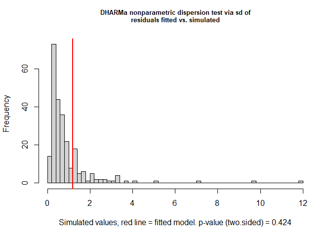
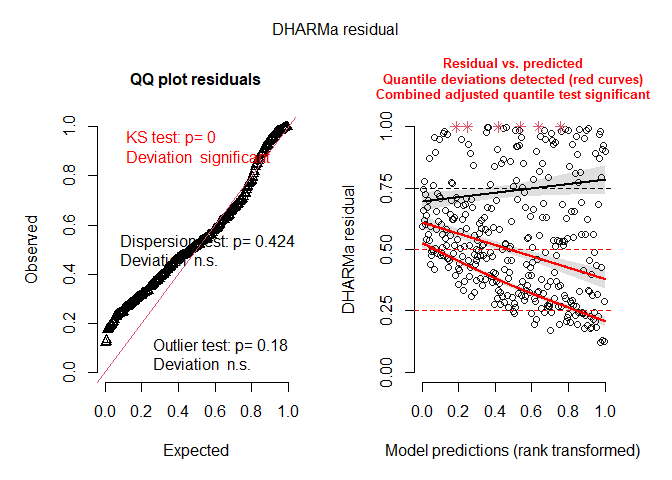

Generalized mutualism promotes range expansion in both ant and plant
partners
================
Pooja Nathan and Megan Frederickson
2023-07-25

# How does mutualism affect ant and plant range sizes?

This R Markdown document describes the dataset and code for:

Nathan P, Economo EP, Guenard B, Simonsen A, Frederickson ME.
Generalized mutualisms promote range expansion in both plant and ant
partners. In prep.

First, let’s load the packages we’ll use.

``` r
#General
library(tidyverse)
library(knitr)

#Plotting
library(cowplot)
library(png)
#devtools::install_github("katiejolly/nationalparkcolors")
#library(nationalparkcolors)

#Taxonomy
library(taxize)

#Linear models
library(car)
library(lme4)
library(nlme)
library(lmtest)
library(DHARMa)

#Phylogenetic methods
library(ape)
library(geiger)
library(phytools)
library(caper)

#Maps and spatial packages
library(sp)
library(sf)
```

## Legume dataset

We obtained introduced and native range size data for legumes from
Simonsen et al. (2017).

Mutualistic trait data came from Weber et al. (2015) for extrafloral
nectaries (EFNs), Chomicki & Renner (2015) for domatia, Simonsen et
al. (2017) for nodulation, and Soudzilovskaia et al. (2020) for
mycorrhizae.

The next several chunks of code are slow to run, so they are not run
here, but they are included for reproducibility.

``` r
#Not run
#Legume range, study count and nodulation data
range <- read.csv("inv_dat_by_species_simonsen2017.csv") #Read in legume range data
names(range)[names(range) == "Species"] <- "Phy"
range$Phy <- as.character(gsub("_", " ", range$Phy))

#EFN data
EFN <- read.csv("EFNs_Weberatal_analysis_onlypresence.csv") #Read in EFN data
EFN$Phy <- as.character(gsub("_", " ", EFN$Phy))

#Domatia
domatia <- read.csv("domatia_chomickirenner_analysis_onlypresence.csv")  #Read in domatia data
names(domatia)[names(domatia) == 'ï..Phy'] <- 'Phy'
domatia$Phy <- as.character(gsub("_", " ", domatia$Phy))

#Mycorrhizae
mycorrhizae <- read.csv("mycorrhizae_sou.csv") #Read in legume species in Soudzilovskaia et al.'s mycorrhizae dataset
mycorrhizae$Phy <- as.character(gsub("_", " ", mycorrhizae$species))
mycorrhizae$In.range.dataset <- mycorrhizae$Phy %in% range$Phy #Check which taxa are in range dataset
mycorrhizae <- subset(mycorrhizae, In.range.dataset) #Subset to just taxa with mycorrhizal trait data that are also in legume range dataset
```

### Check taxonomy

We resolved misspelled names using the gnr_resolve function and checked
for synonyms using the synonyms function in the taxize package.

First, let’s check the taxonomy of the names of domatia-bearing plants.

Next, let’s check the taxonomy of EFN-bearing plants.

``` r
#Not run
#Do the same as above for the EFN data
EFN_resolve <- as.data.frame(gnr_resolve(EFN[, "Phy"], best_match_only=TRUE))
EFN_resolve$num_words <- str_count(EFN_resolve$matched_name, " ")+1
EFN <- merge(EFN, EFN_resolve, by.y = "user_supplied_name", by.x = "Phy", all.x=TRUE)
EFN$matched_name <- ifelse(EFN$num_words == 1, NA, EFN$matched_name)
EFN$matched_name <- ifelse(!is.na(EFN$matched_name), paste0(word(EFN$matched_name, 1, 1), " ", tolower(word(EFN$matched_name, 2, 2))), EFN$matched_name)
EFN$diff <- EFN$Phy == EFN$matched_name #Check changes between original and matched names

#Find synonyms for resolved names
#I had trouble getting this to work consistently so I retrieved the synonyms in batches
EFN_synonyms_pow1 <- synonyms(EFN[1:100,"matched_name"], db="pow") #Get synonyms
EFN_synonyms_pow2 <- synonyms(EFN[101:200,"matched_name"], db="pow")
EFN_synonyms_pow3 <- synonyms(EFN[201:400,"matched_name"], db="pow")
EFN_synonyms_pow4 <- synonyms(EFN[401:826,"matched_name"], db="pow")
EFN_synonyms_pow <- c(EFN_synonyms_pow1, EFN_synonyms_pow2, EFN_synonyms_pow3, EFN_synonyms_pow4)
EFN_syn <- do.call(rbind, EFN_synonyms_pow)
EFN_syn$matched_name <- gsub('[^-[:^punct:]]', '', (gsub('[[:digit:]]+', '', row.names(EFN_syn))), perl=TRUE)
EFN_syn <- subset(EFN_syn, rank == "SPECIES") #Keep on species (not varieties)
colnames(EFN_syn)[2] <- "synonym" #Fix column name

#Determine if original names and synonyms are in domatia, mycorrhizae, and range datasets
EFN_syn$syndomY <- EFN_syn$synonym %in% domatia$Phy 
EFN_syn$synrangeY <- EFN_syn$synonym %in% range$Phy
EFN_syn$synmycoY <- EFN_syn$synonym %in% mycorrhizae$Phy
write.csv(EFN_syn, "efn_synonyms.csv")
EFN_syn <- subset(EFN_syn, EFN_syn$syndomY | EFN_syn$synrangeY | EFN_syn$synmycoY) #Subset if synonyms match other datasets
EFN_syn$EFN <- 1 #Add trait
EFN_syn <- subset(EFN_syn, !is.na(synonym))
colnames(EFN_syn)[[2]] <- "Phy" #Fix column name

#Add synonyms to EFN dataset
EFN <- rbind(EFN[, c("EFN", "Phy", "matched_name")], EFN_syn[, c("EFN", "Phy","matched_name")]) #Merge
EFN$Phy <- trimws(EFN$Phy) #Trim white space from taxonomic names

#Check if each EFN name is in the EFN, mycorrhizae, and range datasets
EFN$RangeY <- EFN$Phy %in% range$Phy
EFN$domY <- EFN$Phy %in% domatia$Phy
EFN$mycoY <- EFN$Phy %in% mycorrhizae$Phy #No EFN-bearing plants in mycorrhizal dataset

write.csv(EFN, file="efn_resolved.csv", row.names=FALSE)
```

Merge the EFN and domatia datasets.

``` r
#Counts
counts <- read.csv("Study_counts_22Mar.csv")

#Read in taxonomically resolved EFN and domatia datasets
EFN <- read.csv("efn_resolved.csv")
domatia <- read.csv("domatia_resolved.csv")

#Further cleaning of EFN and domatia datasets to 
colnames(EFN)[[3]] <- "matched_name_EFN"
colnames(domatia)[[3]] <- "matched_name_domatia"
domatia$diff <- domatia$Phy == domatia$matched_name_domatia 
EFN$diff <- EFN$Phy == EFN$matched_name_EFN
EFN <- subset(EFN, !is.na(diff))
EFN$matches <- EFN$RangeY+EFN$domY+EFN$mycoY
EFN <- subset(EFN, matches > 0)
EFN <- EFN[!duplicated(EFN), ]
EFN <- EFN[!duplicated(EFN$matched_name_EFN),]

#Merge 
EFN_dom <- merge(EFN[,c("EFN", "Phy", "matched_name_EFN")], domatia[,c("Domatia", "Phy")], by="Phy", all=TRUE)

#Add zeros instead of NAs for traits
EFN_dom$EFN <- ifelse(is.na(EFN_dom$EFN), 0, EFN_dom$EFN)
EFN_dom$Domatia <- ifelse(is.na(EFN_dom$Domatia), 0, EFN_dom$Domatia)
```

Next, we’ll check the taxonomy of the legumes for which we have data on
mycorrhizae.

``` r
#Not run
#Resolve names
mycorrhizae_resolve <- as.data.frame(gnr_resolve(mycorrhizae[, "Phy"], best_match_only=TRUE))
mycorrhizae_resolve$num_words <- str_count(mycorrhizae_resolve$matched_name, " ")+1
mycorrhizae <- merge(mycorrhizae, mycorrhizae_resolve, by.y = "user_supplied_name", by.x = "Phy", all.x=TRUE)
mycorrhizae$matched_name <- ifelse(mycorrhizae$num_words == 1, NA, mycorrhizae$matched_name)
mycorrhizae$matched_name <- ifelse(!is.na(mycorrhizae$matched_name), paste0(word(mycorrhizae$matched_name, 1, 1), " ", tolower(word(mycorrhizae$matched_name, 2, 2))), mycorrhizae$matched_name)

#Find synonyms for resolved names
mycorrhizae_synonyms_pow1 <- synonyms(unique(mycorrhizae$matched_name)[1:200], db="pow")
mycorrhizae_synonyms_pow2 <- synonyms(unique(mycorrhizae$matched_name)[201:400], db="pow")
mycorrhizae_synonyms_pow3 <- synonyms(unique(mycorrhizae$matched_name)[401:600], db="pow")
mycorrhizae_synonyms_pow4 <- synonyms(unique(mycorrhizae$matched_name)[601:800], db="pow")
mycorrhizae_syn <- append(mycorrhizae_synonyms_pow1, mycorrhizae_synonyms_pow2)
mycorrhizae_syn <- append(mycorrhizae_syn, mycorrhizae_synonyms_pow3)
mycorrhizae_syn <- append(mycorrhizae_syn, mycorrhizae_synonyms_pow4)

mycorrhizae_syn <- do.call(rbind, mycorrhizae_syn)
mycorrhizae_syn$matched_name <- gsub('[^-[:^punct:]]', '', (gsub('[[:digit:]]+', '', row.names(mycorrhizae_syn))), perl=TRUE)
mycorrhizae_syn <- subset(mycorrhizae_syn, rank == "SPECIES") #Keep on species (not varieties)
colnames(mycorrhizae_syn)[2] <- "synonym" #Fix column name

#Determine if original names and synonyms are in EFN, domatia, and range datasets
mycorrhizae_syn$syndomY <- mycorrhizae_syn$synonym %in% domatia$Phy 
mycorrhizae_syn$synrangeY <- mycorrhizae_syn$synonym %in% range$Phy
mycorrhizae_syn$synefnY <- mycorrhizae_syn$synonym %in% EFN$Phy
write.csv(mycorrhizae_syn, "mycorrhizae_synonyms.csv")

mycorrhizae_syn <- subset(mycorrhizae_syn, mycorrhizae_syn$syndomY | mycorrhizae_syn$synrangeY | mycorrhizae_syn$synefnY) #Subset if synonyms match other datasets
mycorrhizae_syn <- subset(mycorrhizae_syn, !is.na(synonym))
colnames(mycorrhizae_syn)[[2]] <- "Phy" #Fix column name

#Add synonyms to mycorrhizae dataset
mycorrhizae <- mycorrhizae[ ,-c(73:234)]
mycorrhizae_syn <- merge(mycorrhizae[, c("Phy", "mycorrhiza.type")], mycorrhizae_syn, by.x="Phy", by.y="matched_name", all.x=FALSE, all.y=TRUE)
colnames(mycorrhizae_syn)[[4]] <- "species"
mycorrhizae <- rbind(mycorrhizae[, c("mycorrhiza.type", "Phy", "species")], mycorrhizae_syn[, c("mycorrhiza.type", "Phy","species")]) #Merge
#mycorrhizae$Phy <- trimws(mycorrhizae$Phy) #Trim white space from taxonomic names

#Check if each mycorrhizae name is in the EFN, domatia, and range datasets
mycorrhizae$RangeY <- mycorrhizae$Phy %in% range$Phy
mycorrhizae$domY <- mycorrhizae$Phy %in% domatia$Phy
mycorrhizae$efnY <- mycorrhizae$Phy %in% EFN$Phy 

mycorrhizae$AM <- ifelse(mycorrhizae$mycorrhiza.type == "AM; others not addressed" | mycorrhizae$mycorrhiza.type == "AM; no others" | mycorrhizae$mycorrhiza.type == "EcM,AM", 1, 0)
mycorrhizae$EM <- ifelse(mycorrhizae$mycorrhiza.type == "EcM; others not addressed" | mycorrhizae$mycorrhiza.type == "EcM; no others" | mycorrhizae$mycorrhiza.type == "EcM,AM", 1, 0)

mycorrhizae.sum <- mycorrhizae %>% group_by(Phy, species, RangeY, domY, efnY) %>% dplyr::summarize(n=n(), sum.AM = sum(AM), sum.EM=sum(EM))
mycorrhizae.sum$AM <- ifelse(mycorrhizae.sum$sum.AM > 0, "Y", "N")
mycorrhizae.sum$EM <- ifelse(mycorrhizae.sum$sum.EM > 0, "Y", "N")
mycorrhizae.sum$match <- ifelse(mycorrhizae.sum$Phy == mycorrhizae.sum$species, TRUE, FALSE)

write.csv(mycorrhizae.sum, file="mycorrhizae_resolved.csv", row.names=FALSE)
```

Merge the EFN and domatia dataset with the mycorrhizae dataset.

``` r
#Read in taxonomically resolved mycorrhizal dataset
mycorrhizae <- read.csv("mycorrhizae_resolved.csv")

#A little further cleaning of mycorrhizal dataset, to remove taxa that appear twice
mycorrhizae <- mycorrhizae %>% group_by(Phy, RangeY, domY, efnY) %>% dplyr::summarize(n.records=sum(n), sum.AM = sum(sum.AM), sum.EM=sum(sum.EM))
mycorrhizae$AM <- ifelse(mycorrhizae$sum.AM > 0, "Y", "N")
mycorrhizae$EM <- ifelse(mycorrhizae$sum.EM > 0, "Y", "N")

#Merge 
EFN_dom_myco <- merge(mycorrhizae, EFN_dom, by="Phy", all=TRUE)
```

Finally, we’ll check the taxonomy of the range dataset.

``` r
#Not run
#Resolve names
range_resolve <- as.data.frame(gnr_resolve(range[, "Phy"], best_match_only=TRUE))
range_resolve$num_words <- str_count(range_resolve$matched_name, " ")+1
range <- merge(range, range_resolve, by.y = "user_supplied_name", by.x = "Phy", all.x=TRUE)
range$matched_name <- ifelse(range$num_words == 1, NA, range$matched_name)
range$matched_name <- ifelse(!is.na(range$matched_name), paste0(word(range$matched_name, 1, 1), " ", tolower(word(range$matched_name, 2, 2))), range$matched_name)
range$diff <- range$matched_name == range$Phy #Only one difference and spelling doesn't affect trait data (because taxon is not in EFN/dom/myco dataset)

write.csv(range, file="range_resolved.csv", row.names=FALSE)

#We don't really need to check synonyms, because we've already checked the synonyms of the matching datasets, and our goals with considering synonyms is just to make sure we match trait and range data correctly
```

Merge the mutualistic trait data with the range dataset.

``` r
range <- read.csv("range_resolved.csv")

legume_range_df <- merge(range, EFN_dom_myco, all.x="TRUE", all.y="FALSE", by= "Phy") #Put all the data in one dataframe
legume_range_df$EFN <- ifelse(is.na(legume_range_df$EFN), 0, legume_range_df$EFN) #Add zeros for NAs in EFN trait
legume_range_df$Domatia <- ifelse(is.na(legume_range_df$Domatia), 0, legume_range_df$Domatia) #Add zeros for NAs in domatia traitlegume_range_df <- merge(legume_range_df, counts, by = "Phy")
legume_range_df <- cbind(legume_range_df, counts$Counts)
names(legume_range_df)[names(legume_range_df) == "counts$Counts"] <- "Count"

write.csv(legume_range_df, file="legume_range_traits.csv", row.names = FALSE)
```

### Summarize legume dataset

We are finished cleaning the dataset, and now simply have to summarize,
visualize, and model.

First, let’s summarize how many species we have in each category. How
many legumes with vs. without EFNs do we have range size data for, and
how many introduced ranges have they been introduced to, on average?

``` r
#Make factors factors
legume_range_df$EFN <- as.factor(legume_range_df$EFN)
legume_range_df$Domatia <- as.factor(legume_range_df$Domatia)
legume_range_df$fixer <- as.factor(legume_range_df$fixer)
legume_range_df$AM <- as.factor(legume_range_df$AM)
legume_range_df$EM <- as.factor(legume_range_df$EM)
legume_range_df$annual <- as.numeric(legume_range_df$annual)
legume_range_df$woody <- as.numeric(legume_range_df$woody)

##Collapse all mycorrhizal fungi types into a single yes/no category
legume_range_df$myco <- ifelse(legume_range_df$AM == "Y" | legume_range_df$EM == "Y", 1, ifelse(legume_range_df$AM == "N" & legume_range_df$EM == "N", 0, NA))
legume_range_df$myco <- as.factor(legume_range_df$myco)

#Assign to a shorter dataframe name
df <- legume_range_df

#Summarize the number of legume taxa with and without EFNs
summary.efn <- ungroup(subset(df, !is.na(num_introduced)) %>% group_by(EFN) %>% dplyr::summarize(n=n(), mean_num_introduced = mean(num_introduced, na.rm=TRUE), sd_num_introduced = sd(num_introduced, na.rm=TRUE), se_num_introduced = sd_num_introduced/sqrt(n)))
kable(summary.efn)
```

| EFN |    n | mean_num_introduced | sd_num_introduced | se_num_introduced |
|:----|-----:|--------------------:|------------------:|------------------:|
| 0   | 3697 |            1.365702 |          5.330667 |         0.0876712 |
| 1   |  280 |            5.257143 |         10.864345 |         0.6492688 |

How many legumes with vs. without domatia do we have range size data
for?

``` r
summary.dom <- ungroup(subset(df, !is.na(num_introduced)) %>% group_by(Domatia) %>% dplyr::summarize(n=n(), mean_num_introduced = mean(num_introduced, na.rm=TRUE), sd_num_introduced = sd(num_introduced, na.rm=TRUE), se_num_introduced = sd_num_introduced/sqrt(n)))
kable(summary.dom)
```

| Domatia |    n | mean_num_introduced | sd_num_introduced | se_num_introduced |
|:--------|-----:|--------------------:|------------------:|------------------:|
| 0       | 3953 |           1.6463445 |          5.990833 |         0.0952848 |
| 1       |   24 |           0.5416667 |          1.178767 |         0.2406149 |

How many legumes that do vs. do not form nodules do we have range size
data for?

``` r
summary.fix <- ungroup(subset(df, !is.na(num_introduced)) %>% group_by(fixer) %>% dplyr::summarize(n=n(), mean_num_introduced = mean(num_introduced, na.rm=TRUE), sd_num_introduced = sd(num_introduced, na.rm=TRUE), se_num_introduced = sd_num_introduced/sqrt(n)))
kable(summary.fix)
```

| fixer |    n | mean_num_introduced | sd_num_introduced | se_num_introduced |
|:------|-----:|--------------------:|------------------:|------------------:|
| 0     |  396 |            2.482323 |          6.839364 |         0.3436910 |
| 1     | 3581 |            1.546495 |          5.864139 |         0.0979946 |

How many legumes do vs. do not associate with mycorrhizae do we have
range size data for?

``` r
summary.myco <- ungroup(subset(df, !is.na(num_introduced) & !is.na(myco)) %>% group_by(myco) %>% dplyr::summarize(n=n(), mean_num_introduced = mean(num_introduced, na.rm=TRUE), sd_num_introduced = sd(num_introduced, na.rm=TRUE), se_num_introduced = sd_num_introduced/sqrt(n)))
kable(summary.myco)
```

| myco |   n | mean_num_introduced | sd_num_introduced | se_num_introduced |
|:-----|----:|--------------------:|------------------:|------------------:|
| 0    |  33 |            3.636364 |          7.192957 |         1.2521332 |
| 1    | 690 |            5.998551 |         11.970876 |         0.4557235 |

``` r
summary.myco2 <- ungroup(subset(df, !is.na(num_introduced) & !is.na(myco)) %>% group_by(AM,EM) %>% dplyr::summarize(n=n(), mean_num_introduced = mean(num_introduced, na.rm=TRUE), sd_num_introduced = sd(num_introduced, na.rm=TRUE), se_num_introduced = sd_num_introduced/sqrt(n), mean_area_introduced = mean(total_area_introduced, na.rm=TRUE), sd_area_introduced = sd(total_area_introduced, na.rm=TRUE), se_area_introduced = sd_area_introduced/sqrt(n)))
kable(summary.myco2)
```

| AM  | EM  |   n | mean_num_introduced | sd_num_introduced | se_num_introduced | mean_area_introduced | sd_area_introduced | se_area_introduced |
|:----|:----|----:|--------------------:|------------------:|------------------:|---------------------:|-------------------:|-------------------:|
| N   | N   |  33 |           3.6363636 |          7.192957 |         1.2521332 |         3.194037e+12 |       8.008639e+12 |       1.394125e+12 |
| N   | Y   |  38 |           0.8684211 |          2.988004 |         0.4847182 |         4.655278e+11 |       1.604713e+12 |       2.603188e+11 |
| Y   | N   | 572 |           6.6311189 |         12.567518 |         0.5254743 |         6.482227e+12 |       1.410887e+13 |       5.899216e+11 |
| Y   | Y   |  80 |           3.9125000 |          9.169561 |         1.0251881 |         3.160244e+12 |       8.285881e+12 |       9.263897e+11 |

### Make figures

Let’s make the figures showing how mutualistic trait affect legume
native and introduced range sizes.

``` r
#Set sizes and widths for all figures
pt_size <- 3
y_limits <- c(-0.5, 15)
er_width <- 0.1
y_text <- -0.25
y_inset_limits <- c(0,1)

df$introducedY <- ifelse(df$num_introduced > 0, 1, 0) #Create binary variable for whether or not legume is introduced

#Icons
AM_l <- readPNG("AM.png")
EM_l <- readPNG("EM.png")
EFN_l <- readPNG("EFN.png")
Dom_l <- readPNG("Domatia.png")
Fix_l <- readPNG("Nodules.png")

#EFN figure
summary.efn <- ungroup(subset(df, !is.na(num_introduced) & num_introduced > 0) %>% group_by(EFN) %>% dplyr::summarize(n=n(), mean_num_introduced = mean(num_introduced, na.rm=TRUE), sd_num_introduced = sd(num_introduced, na.rm=TRUE), se_num_introduced = sd_num_introduced/sqrt(n)))
#kable(summary.efn)

p_EFN <- ggplot(data=summary.efn, aes(x=EFN, y=mean_num_introduced))+geom_point(size=pt_size)+geom_errorbar(aes(x=EFN, ymin=mean_num_introduced-se_num_introduced, ymax=mean_num_introduced+se_num_introduced), width=er_width)+ geom_line(aes(group=1),linetype="dashed")+theme_cowplot()+ylab("Introduced ranges (no.)")+xlab("EFNs")+geom_text(aes(x=EFN, y= y_text, label=n))+scale_x_discrete(labels=c("No", "Yes"))+scale_y_continuous(limits=y_limits)+annotate("text", x = 1.5, y = 13, label = "***") 
  
summary.efn2 <- ungroup(df %>% group_by(EFN, introducedY) %>% dplyr::summarize(n=n()))
summary.efn2.wide <- spread(summary.efn2, key = introducedY, value=n)
colnames(summary.efn2.wide) <- c("EFN","Not_introduced",  "Introduced")
summary.efn2.wide$total <- summary.efn2.wide$Not_introduced+summary.efn2.wide$Introduced
summary.efn2.wide$prop.introduced <- summary.efn2.wide$Introduced/(summary.efn2.wide$total)
prop.efn <- paste0(summary.efn2.wide$Introduced, "/", summary.efn2.wide$total)

inset_p_EFN <- ggplot(data=summary.efn2.wide, aes(x=EFN, y=prop.introduced))+geom_bar(stat="identity")+theme_cowplot()+scale_x_discrete(labels=c("No", "Yes"))+ylab("Introduced (prop.)")+xlab("EFNs")+scale_y_continuous(limits=y_inset_limits)+annotate("text", x = 1.5, y = 0.55, label = "***")+geom_text(aes(x=EFN, y=0.05, label=prop.efn), color="white")

EFN_icon <- ggdraw() +
  draw_image(
    EFN_l, scale = .53, x = 0.9, y = 0.65,
    hjust = 1, halign = 1, valign = 0
  )

#Domatia figure
summary.dom <- ungroup(subset(df, !is.na(num_introduced) & num_introduced > 0) %>% group_by(Domatia) %>% dplyr::summarize(n=n(), mean_num_introduced = mean(num_introduced, na.rm=TRUE), sd_num_introduced = sd(num_introduced, na.rm=TRUE), se_num_introduced = sd_num_introduced/sqrt(n)))
#kable(summary.dom)

p_dom <- ggplot(data=summary.dom, aes(x=Domatia, y=mean_num_introduced))+geom_point(size=pt_size)+geom_errorbar(aes(x=Domatia, ymin=mean_num_introduced-se_num_introduced, ymax=mean_num_introduced+se_num_introduced), width=er_width)+geom_line(aes(group=1), linetype="dashed")+theme_cowplot()+ylab("Introduced ranges (no.)")+xlab("Domatia")+geom_text(aes(x=Domatia, y= y_text, label=n))+scale_x_discrete(labels=c("No", "Yes"))+scale_y_continuous(limits=y_limits)+annotate("text", x = 1.5, y = 13, label = "*")  

summary.dom2 <- ungroup(df %>% group_by(Domatia, introducedY) %>% dplyr::summarize(n=n()))
summary.dom2.wide <- spread(summary.dom2, key = introducedY, value=n)
colnames(summary.dom2.wide) <- c("Domatia","Not_introduced",  "Introduced")
summary.dom2.wide$total <- summary.dom2.wide$Not_introduced+summary.dom2.wide$Introduced
summary.dom2.wide$prop.introduced <- summary.dom2.wide$Introduced/summary.dom2.wide$total
prop.dom <- paste0(summary.dom2.wide$Introduced, "/", summary.dom2.wide$total)

inset_p_dom <- ggplot(data=summary.dom2.wide, aes(x=Domatia, y=prop.introduced))+geom_bar(stat="identity")+theme_cowplot()+scale_x_discrete(labels=c("No", "Yes"))+ylab("Introduced (prop.)")+xlab("Domatia")+scale_y_continuous(limits=y_inset_limits)+annotate("text", x = 1.5, y = 0.55, label = "ns")+geom_text(aes(x=Domatia, y=0.05, label=prop.dom), color="white")

dom_icon <- ggdraw() +
  draw_image(
    Dom_l, scale = .4, x = 0.82, y = 0.6,
    hjust = 1, halign = 1, valign = 0
  )

#Nodules figure
summary.fix <- ungroup(subset(df, !is.na(num_introduced) & num_introduced > 0) %>% group_by(fixer) %>% dplyr::summarize(n=n(), mean_num_introduced = mean(num_introduced, na.rm=TRUE), sd_num_introduced = sd(num_introduced, na.rm=TRUE), se_num_introduced = sd_num_introduced/sqrt(n)))
#kable(summary.fix)

p_fix <- ggplot(data=summary.fix, aes(x=fixer, y=mean_num_introduced))+geom_point(size=pt_size)+geom_errorbar(aes(x=fixer, ymin=mean_num_introduced-se_num_introduced, ymax=mean_num_introduced+se_num_introduced), width=er_width)+geom_line(aes(group=1), linetype="dashed")+theme_cowplot()+ylab("Introduced ranges (no.)")+xlab("Nodules")+geom_text(aes(x=fixer, y= y_text, label=n))+scale_x_discrete(labels=c("No", "Yes"))+scale_y_continuous(limits=y_limits)+annotate("text", x = 1.5, y = 13, label = "ns") 

summary.fix2 <- ungroup(df %>% group_by(fixer, introducedY) %>% dplyr::summarize(n=n()))
#kable(summary.fix2)
summary.fix2.wide <- spread(summary.fix2, key = introducedY, value=n)
colnames(summary.fix2.wide) <- c("fixer", "Not_introduced",  "Introduced")
summary.fix2.wide$total <- summary.fix2.wide$Not_introduced+summary.fix2.wide$Introduced
summary.fix2.wide$prop.introduced <- summary.fix2.wide$Introduced/summary.fix2.wide$total
prop.fix <- paste0(summary.fix2.wide$Introduced, "/", summary.fix2.wide$total)

inset_p_fix <- ggplot(data=summary.fix2.wide, aes(x=fixer, y=prop.introduced))+geom_bar(stat="identity")+theme_cowplot()+scale_x_discrete(labels=c("No", "Yes"))+ylab("Introduced (prop.)")+xlab("Nodules")+scale_y_continuous(limits=y_inset_limits)+annotate("text", x = 1.5, y = 0.55, label = "ns")+geom_text(aes(x=fixer, y=0.05, label=prop.fix), color="white")

fix_icon <- ggdraw() +
  draw_image(
    Fix_l, scale = .67, x = 0.95, y = 0.55,
    hjust = 1, halign = 1, valign = 0
  )

#Mycorrhizae figure
summary.AM <- ungroup(subset(df, !is.na(num_introduced) & !is.na(myco) & num_introduced > 0) %>% group_by(AM) %>% dplyr::summarize(n=n(), mean_num_introduced = mean(num_introduced, na.rm=TRUE), sd_num_introduced = sd(num_introduced, na.rm=TRUE), se_num_introduced = sd_num_introduced/sqrt(n)))
#kable(summary.AM)

p_AM <- ggplot(data=summary.AM, aes(x=AM, y=mean_num_introduced))+geom_point(size=pt_size)+geom_errorbar(aes(x=AM, ymin=mean_num_introduced-se_num_introduced, ymax=mean_num_introduced+se_num_introduced), width=er_width)+geom_line(aes(group=1), linetype="dashed")+theme_cowplot()+ylab("Introduced ranges (no.)")+xlab("AM")+geom_text(aes(x=AM, y= y_text, label=n))+scale_y_continuous(limits=y_limits)+scale_x_discrete(labels=c("No", "Yes"))+annotate("text", x = 1.5, y = 13, label = "ns")

summary.EM <- ungroup(subset(df, !is.na(num_introduced) & !is.na(myco) & num_introduced > 0) %>% group_by(EM) %>% dplyr::summarize(n=n(), mean_num_introduced = mean(num_introduced, na.rm=TRUE), sd_num_introduced = sd(num_introduced, na.rm=TRUE), se_num_introduced = sd_num_introduced/sqrt(n)))
kable(summary.EM)
```

| EM  |   n | mean_num_introduced | sd_num_introduced | se_num_introduced |
|:----|----:|--------------------:|------------------:|------------------:|
| N   | 295 |           13.264407 |          14.92901 |         0.8692007 |
| Y   |  35 |            9.885714 |          11.88863 |         2.0095451 |

``` r
p_EM <- ggplot(data=summary.EM, aes(x=EM, y=mean_num_introduced))+geom_point(size=pt_size)+geom_errorbar(aes(x=EM, ymin=mean_num_introduced-se_num_introduced, ymax=mean_num_introduced+se_num_introduced), width=er_width)+geom_line(aes(group=1), linetype="dashed")+theme_cowplot()+ylab("Introduced ranges (no.)")+xlab("EM")+geom_text(aes(x=EM, y= y_text, label=n))+scale_y_continuous(limits=y_limits)+scale_x_discrete(labels=c("No", "Yes"))+annotate("text", x = 1.5, y = 13, label = "ns") 

summary.AM2 <- ungroup(subset(df, !is.na(myco)) %>% group_by(AM, introducedY) %>% dplyr::summarize(n=n()))
summary.AM2.wide <- spread(summary.AM2, key = introducedY, value=n)
colnames(summary.AM2.wide) <- c("AM", "Not_introduced",  "Introduced")
summary.AM2.wide$total <- summary.AM2.wide$Not_introduced+summary.AM2.wide$Introduced
summary.AM2.wide$prop.introduced <- summary.AM2.wide$Introduced/summary.AM2.wide$total
prop.AM <- paste0(summary.AM2.wide$Introduced, "/", summary.AM2.wide$total)

inset_p_AM <- ggplot(data=summary.AM2.wide, aes(x=AM, y=prop.introduced))+geom_bar(stat="identity")+theme_cowplot()+scale_x_discrete(labels=c("No", "Yes"))+ylab("Introduced (prop.)")+xlab("AM")+scale_y_continuous(limits=y_inset_limits)+annotate("text",x = 1.5, y = 0.55,label = "ns")+geom_text(aes(x=AM, y=0.05, label=prop.AM), color="white")

AM_icon <- ggdraw() +
  draw_image(
    AM_l, scale = .5, x = 0.85, y = 0.6,
    hjust = 1, halign = 1, valign = 0
  ) 

summary.EM2 <- ungroup(subset(df, !is.na(myco)) %>% group_by(EM, introducedY) %>% dplyr::summarize(n=n()))
summary.EM2.wide <- spread(summary.EM2, key = introducedY, value=n)
colnames(summary.EM2.wide) <- c("EM", "Not_introduced",  "Introduced")
summary.EM2.wide$total <- summary.EM2.wide$Not_introduced+summary.EM2.wide$Introduced
summary.EM2.wide$prop.introduced <- summary.EM2.wide$Introduced/summary.EM2.wide$total
prop.EM <- paste0(summary.EM2.wide$Introduced, "/", summary.EM2.wide$total)

inset_p_EM <- ggplot(data=summary.EM2.wide, aes(x=EM, y=prop.introduced))+geom_bar(stat="identity")+theme_cowplot()+scale_x_discrete(labels=c("No", "Yes"))+ylab("Introduced (prop.)")+xlab("EM")+scale_y_continuous(limits=y_inset_limits)+annotate("text",x = 1.5, y = 0.55,label = "ns")+geom_text(aes(x=EM, y=0.05, label=prop.EM), color="white")

EM_icon <- ggdraw() + draw_image(
    EM_l, scale = .5, x = 0.88, y = 0.65,
    hjust = 1, halign = 1, valign = 0
  ) 

fig1 <- cowplot::plot_grid(inset_p_EFN, inset_p_dom, inset_p_fix, inset_p_AM, inset_p_EM, p_EFN, p_dom, p_fix, p_AM, p_EM, labels=c("AUTO"), nrow=2, ncol=5,align="hv", axis="tblr")
fig1_full <- ggdraw()+cowplot::draw_plot(cowplot::plot_grid(EFN_icon, dom_icon, fix_icon, AM_icon, EM_icon, nrows=1, ncol=5)) + cowplot::draw_plot(fig1)
fig1_full
```

<!-- -->

``` r
save_plot("Figure1.pdf", fig1_full, base_height=8, base_width=14)
save_plot("Figure1.png", fig1_full, base_height=8, base_width=14)
```

We can also plot the effect of the same mutualistic traits on the native
range size of legumes.

``` r
pt_size <- 3
y_limits <- c(-500000, 13e+12)
er_width <- 0.1
y_text <- 0

#For EFNs
summary.efn.dom.native <- ungroup(df %>% group_by(EFN, Domatia) %>% dplyr::summarize(n=n(), mean_native = mean(total_area_native, na.rm=TRUE), sd_native = sd(total_area_native, na.rm=TRUE), se_native = sd_native/sqrt(n)))

p_EFN_dom_native <- ggplot(data=summary.efn.dom.native, aes(x=EFN, y=mean_native, color=Domatia))+geom_point(size=pt_size)+geom_errorbar(aes(x=EFN, ymin=mean_native-se_native, ymax=mean_native+se_native, color=Domatia), width=er_width)+ geom_line(aes(group=Domatia), linetype="dashed")+theme_cowplot()+ylab("Native range (sq. km)")+xlab("EFNs")+geom_text(aes(x=c(0.8,1.2,1.8,2.2), y= y_text, label=n))+scale_x_discrete(labels=c("No", "Yes"))+scale_y_continuous(limits=y_limits)+scale_color_grey(labels=c("No", "Yes"))+theme(legend.position = c(0.1, 0.8))+annotate("text", x = 1.5, y = 7.1e+12, label = "ns")+annotate("text", x = 1.5, y = 3.9e+12, label = "**")

#For domatia
summary.dom.native <- ungroup(df %>% group_by(Domatia) %>% dplyr::summarize(n=n(), mean_native = mean(total_area_native, na.rm=TRUE), sd_native = sd(total_area_native, na.rm=TRUE), se_native = sd_native/sqrt(n)))

p_dom_native <- ggplot(data=summary.dom.native, aes(x=Domatia, y=mean_native))+geom_point(size=pt_size)+geom_errorbar(aes(x=Domatia, ymin=mean_native-se_native, ymax=mean_native+se_native), width=er_width)+ geom_line(aes(group=1),linetype="dashed")+theme_cowplot()+ylab("Native range (sq. km)")+xlab("Domatia")+geom_text(aes(x=Domatia, y= y_text, label=n))+scale_x_discrete(labels=c("No", "Yes"))+scale_y_continuous(limits=y_limits)+annotate("text", x = 1.5, y = 7.1e+12, label = "ns")

#For nodules
summary.fix.native <- ungroup(df %>% group_by(fixer) %>% dplyr::summarize(n=n(), mean_native = mean(total_area_native, na.rm=TRUE), sd_native = sd(total_area_native, na.rm=TRUE), se_native = sd_native/sqrt(n)))

p_fix_native <- ggplot(data=summary.fix.native, aes(x=fixer, y=mean_native))+geom_point(size=pt_size)+geom_errorbar(aes(x=fixer, ymin=mean_native-se_native, ymax=mean_native+se_native), width=er_width)+ geom_line(aes(group=1),linetype="dashed")+theme_cowplot()+ylab("Native range (sq. km)")+xlab("Nodules")+geom_text(aes(x=fixer, y= y_text, label=n))+scale_x_discrete(labels=c("No", "Yes"))+scale_y_continuous(limits=y_limits)+annotate("text", x = 1.5, y = 7.1e+12, label = "ns")

#For EM fungi
summary.AM.native <- ungroup(df %>% group_by(AM) %>% dplyr::summarize(n=n(), mean_native = mean(total_area_native, na.rm=TRUE), sd_native = sd(total_area_native, na.rm=TRUE), se_native = sd_native/sqrt(n)))
kable(summary.AM.native)
```

| AM  |    n |  mean_native |    sd_native |    se_native |
|:----|-----:|-------------:|-------------:|-------------:|
| N   |   71 | 6.641775e+12 | 7.620421e+12 | 904377608987 |
| Y   |  652 | 9.645563e+12 | 1.042585e+13 | 408307721818 |
| NA  | 3254 | 4.185009e+12 | 4.948411e+12 |  86747509406 |

``` r
p_AM_native <- ggplot(data=subset(summary.AM.native, !is.na(AM)), aes(x=AM, y=mean_native))+geom_point(size=pt_size)+geom_errorbar(aes(x=AM, ymin=mean_native-se_native, ymax=mean_native+se_native), width=er_width)+ geom_line(aes(group=1),linetype="dashed")+theme_cowplot()+ylab("Native range (sq. km)")+xlab("AM")+geom_text(aes(x=AM, y= y_text, label=n))+scale_x_discrete(labels=c("No", "Yes"))+scale_y_continuous(limits=y_limits)+annotate("text", x = 1.5, y = 7.1e+12, label = "ns")

#For EM fungi
summary.EM.native <- ungroup(df %>% group_by(EM) %>% dplyr::summarize(n=n(), mean_native = mean(total_area_native, na.rm=TRUE), sd_native = sd(total_area_native, na.rm=TRUE), se_native = sd_native/sqrt(n)))
kable(summary.EM.native)
```

| EM  |    n |  mean_native |    sd_native |    se_native |
|:----|-----:|-------------:|-------------:|-------------:|
| N   |  605 | 1.022114e+13 | 1.082192e+13 | 439973745086 |
| Y   |  118 | 4.887136e+12 | 3.986129e+12 | 366952887362 |
| NA  | 3254 | 4.185009e+12 | 4.948411e+12 |  86747509406 |

``` r
p_EM_native <- ggplot(data=subset(summary.EM.native, !is.na(EM)), aes(x=EM, y=mean_native))+geom_point(size=pt_size)+geom_errorbar(aes(x=EM, ymin=mean_native-se_native, ymax=mean_native+se_native), width=er_width)+ geom_line(aes(group=1),linetype="dashed")+theme_cowplot()+ylab("Native range (sq. km)")+xlab("EM")+geom_text(aes(x=EM, y= y_text, label=n))+scale_x_discrete(labels=c("No", "Yes"))+scale_y_continuous(limits=y_limits)+annotate("text", x = 1.5, y = 7.1e+12, label = "ns")

fig2 <- plot_grid(p_EFN_dom_native, p_fix_native, p_AM_native, p_EM_native, nrow=2, labels="AUTO", rel_widths = c(1, 1, 1, 1))
fig2
```

<!-- -->

``` r
save_plot("Figure2.pdf", fig2, base_height = 8, base_width = 8)
```

### Statistical models

#### Mixed models

One approach is to use mixed models with legume tribe as a random effect
to account for the non-independence of species in a tribe. The response
variable (number of introduced ranges) is very non-normal so we fit two
models: a binomial GLMM modelling whether or not a legume species is
introduced, and linear mixed models of the number of introduced ranges
for introduced species only.

``` r
#Fit binomial model for whether or not a legume species has been introduced
binomial1 <- glmer(introducedY~EFN+Domatia+fixer+uses_num_uses + +scale(total_area_native)+woody+annual+scale(abs_lat_native)+scale(Count)+(1|tribe_ncbi), data=df, family="binomial",glmerControl(optimizer = "bobyqa", optCtrl=list(maxfun=100000)))
summary(binomial1) 
```

    ## Generalized linear mixed model fit by maximum likelihood (Laplace
    ##   Approximation) [glmerMod]
    ##  Family: binomial  ( logit )
    ## Formula: 
    ## introducedY ~ EFN + Domatia + fixer + uses_num_uses + +scale(total_area_native) +  
    ##     woody + annual + scale(abs_lat_native) + scale(Count) + (1 |  
    ##     tribe_ncbi)
    ##    Data: df
    ## Control: glmerControl(optimizer = "bobyqa", optCtrl = list(maxfun = 1e+05))
    ## 
    ##      AIC      BIC   logLik deviance df.resid 
    ##   2548.9   2616.8  -1263.5   2526.9     3523 
    ## 
    ## Scaled residuals: 
    ##      Min       1Q   Median       3Q      Max 
    ## -12.7735  -0.3785  -0.2676  -0.1491   6.0398 
    ## 
    ## Random effects:
    ##  Groups     Name        Variance Std.Dev.
    ##  tribe_ncbi (Intercept) 0.5112   0.715   
    ## Number of obs: 3534, groups:  tribe_ncbi, 51
    ## 
    ## Fixed effects:
    ##                          Estimate Std. Error z value Pr(>|z|)    
    ## (Intercept)              -3.54448    0.29557 -11.992  < 2e-16 ***
    ## EFN1                      1.25393    0.19520   6.424 1.33e-10 ***
    ## Domatia1                  0.43104    0.64236   0.671 0.502208    
    ## fixer1                    0.39940    0.23784   1.679 0.093103 .  
    ## uses_num_uses             1.00233    0.04935  20.312  < 2e-16 ***
    ## scale(total_area_native)  0.18642    0.05717   3.261 0.001110 ** 
    ## woody                     0.78359    0.16162   4.848 1.25e-06 ***
    ## annual                    0.67045    0.18640   3.597 0.000322 ***
    ## scale(abs_lat_native)     0.09121    0.06949   1.313 0.189337    
    ## scale(Count)              0.06440    0.04773   1.349 0.177257    
    ## ---
    ## Signif. codes:  0 '***' 0.001 '**' 0.01 '*' 0.05 '.' 0.1 ' ' 1
    ## 
    ## Correlation of Fixed Effects:
    ##             (Intr) EFN1   Domat1 fixer1 uss_n_ scl(t__) woody  annual scl(b__)
    ## EFN1        -0.068                                                            
    ## Domatia1     0.040 -0.013                                                     
    ## fixer1      -0.721  0.053 -0.089                                              
    ## uses_num_ss -0.241  0.027  0.036  0.092                                       
    ## scl(ttl_r_)  0.000 -0.031  0.003 -0.031 -0.330                                
    ## woody       -0.495 -0.035 -0.001  0.072 -0.003  0.143                         
    ## annual      -0.229 -0.019  0.020 -0.031  0.087  0.085    0.418                
    ## scl(bs_lt_)  0.027  0.028  0.094 -0.129 -0.016  0.128    0.150  0.132         
    ## scale(Cont) -0.005 -0.028  0.011  0.004 -0.004 -0.008    0.017  0.015 -0.021

``` r
Anova(binomial1, type=3)
```

    ## Analysis of Deviance Table (Type III Wald chisquare tests)
    ## 
    ## Response: introducedY
    ##                             Chisq Df Pr(>Chisq)    
    ## (Intercept)              143.8059  1  < 2.2e-16 ***
    ## EFN                       41.2654  1  1.329e-10 ***
    ## Domatia                    0.4503  1  0.5022076    
    ## fixer                      2.8199  1  0.0931025 .  
    ## uses_num_uses            412.5742  1  < 2.2e-16 ***
    ## scale(total_area_native)  10.6338  1  0.0011104 ** 
    ## woody                     23.5053  1  1.246e-06 ***
    ## annual                    12.9376  1  0.0003221 ***
    ## scale(abs_lat_native)      1.7228  1  0.1893374    
    ## scale(Count)               1.8205  1  0.1772573    
    ## ---
    ## Signif. codes:  0 '***' 0.001 '**' 0.01 '*' 0.05 '.' 0.1 ' ' 1

``` r
#plot(binomial1)

#Fit binomial model without random effect
binomial2 <- glm(introducedY~EFN+Domatia+fixer+uses_num_uses + +scale(total_area_native)+woody+annual+scale(abs_lat_native), data=df, family="binomial")
summary(binomial2) 
```

    ## 
    ## Call:
    ## glm(formula = introducedY ~ EFN + Domatia + fixer + uses_num_uses + 
    ##     +scale(total_area_native) + woody + annual + scale(abs_lat_native), 
    ##     family = "binomial", data = df)
    ## 
    ## Deviance Residuals: 
    ##     Min       1Q   Median       3Q      Max  
    ## -3.2228  -0.5086  -0.4211  -0.3255   2.5215  
    ## 
    ## Coefficients:
    ##                          Estimate Std. Error z value Pr(>|z|)    
    ## (Intercept)              -2.92981    0.22214 -13.189  < 2e-16 ***
    ## EFN1                      1.29612    0.17120   7.571 3.71e-14 ***
    ## Domatia1                  0.57800    0.64606   0.895 0.370979    
    ## fixer1                    0.17028    0.18442   0.923 0.355841    
    ## uses_num_uses             0.98857    0.04685  21.101  < 2e-16 ***
    ## scale(total_area_native)  0.21954    0.05411   4.057 4.97e-05 ***
    ## woody                     0.52052    0.14220   3.660 0.000252 ***
    ## annual                    0.96310    0.16558   5.816 6.01e-09 ***
    ## scale(abs_lat_native)     0.13854    0.05291   2.619 0.008827 ** 
    ## ---
    ## Signif. codes:  0 '***' 0.001 '**' 0.01 '*' 0.05 '.' 0.1 ' ' 1
    ## 
    ## (Dispersion parameter for binomial family taken to be 1)
    ## 
    ##     Null deviance: 3814.5  on 3533  degrees of freedom
    ## Residual deviance: 2643.8  on 3525  degrees of freedom
    ##   (443 observations deleted due to missingness)
    ## AIC: 2661.8
    ## 
    ## Number of Fisher Scoring iterations: 5

``` r
Anova(binomial2, type=3)
```

    ## Analysis of Deviance Table (Type III tests)
    ## 
    ## Response: introducedY
    ##                          LR Chisq Df Pr(>Chisq)    
    ## EFN                         54.45  1  1.595e-13 ***
    ## Domatia                      0.73  1  0.3938985    
    ## fixer                        0.87  1  0.3519939    
    ## uses_num_uses              703.67  1  < 2.2e-16 ***
    ## scale(total_area_native)    16.70  1  4.377e-05 ***
    ## woody                       13.92  1  0.0001909 ***
    ## annual                      33.67  1  6.532e-09 ***
    ## scale(abs_lat_native)        6.90  1  0.0086259 ** 
    ## ---
    ## Signif. codes:  0 '***' 0.001 '**' 0.01 '*' 0.05 '.' 0.1 ' ' 1

``` r
#plot(binomial2)

#Compare models
anova(binomial1, binomial2) #Random effect improves model fit to data
```

    ## Data: df
    ## Models:
    ## binomial2: introducedY ~ EFN + Domatia + fixer + uses_num_uses + +scale(total_area_native) + woody + annual + scale(abs_lat_native)
    ## binomial1: introducedY ~ EFN + Domatia + fixer + uses_num_uses + +scale(total_area_native) + woody + annual + scale(abs_lat_native) + scale(Count) + (1 | tribe_ncbi)
    ##           npar    AIC    BIC  logLik deviance  Chisq Df Pr(>Chisq)    
    ## binomial2    9 2661.8 2717.3 -1321.9   2643.8                         
    ## binomial1   11 2548.9 2616.8 -1263.5   2526.9 116.83  2  < 2.2e-16 ***
    ## ---
    ## Signif. codes:  0 '***' 0.001 '**' 0.01 '*' 0.05 '.' 0.1 ' ' 1

``` r
#Fit a linear mixed model for how many new ranges an introduced legume has established in, and how much total area they cover
legume_range_df_introducedY <- subset(df, num_introduced >0) #Filter to species with 1+ introduced ranges

#Number of introduced ranges
lmer1 <- lmer(log(num_introduced)~EFN+Domatia+fixer+scale(abs_lat_native)+scale(total_area_native)+annual+woody+uses_num_uses+(1|tribe_ncbi)+scale(Count), data=legume_range_df_introducedY)
summary(lmer1)
```

    ## Linear mixed model fit by REML ['lmerMod']
    ## Formula: log(num_introduced) ~ EFN + Domatia + fixer + scale(abs_lat_native) +  
    ##     scale(total_area_native) + annual + woody + uses_num_uses +  
    ##     (1 | tribe_ncbi) + scale(Count)
    ##    Data: legume_range_df_introducedY
    ## 
    ## REML criterion at convergence: 2212.9
    ## 
    ## Scaled residuals: 
    ##      Min       1Q   Median       3Q      Max 
    ## -3.08730 -0.76156 -0.02128  0.68264  2.70379 
    ## 
    ## Random effects:
    ##  Groups     Name        Variance Std.Dev.
    ##  tribe_ncbi (Intercept) 0.04038  0.2009  
    ##  Residual               0.83804  0.9154  
    ## Number of obs: 814, groups:  tribe_ncbi, 39
    ## 
    ## Fixed effects:
    ##                          Estimate Std. Error t value
    ## (Intercept)               0.85043    0.16256   5.231
    ## EFN1                      0.34166    0.09861   3.465
    ## Domatia1                 -0.98619    0.38385  -2.569
    ## fixer1                   -0.20849    0.13600  -1.533
    ## scale(abs_lat_native)    -0.06417    0.04209  -1.525
    ## scale(total_area_native) -0.05076    0.03707  -1.370
    ## annual                    0.01048    0.11971   0.088
    ## woody                    -0.21813    0.09987  -2.184
    ## uses_num_uses             0.32048    0.01649  19.438
    ## scale(Count)              0.02212    0.03224   0.686
    ## 
    ## Correlation of Fixed Effects:
    ##             (Intr) EFN1   Domat1 fixer1 scl(b__) scl(t__) annual woody  uss_n_
    ## EFN1        -0.049                                                            
    ## Domatia1     0.025 -0.014                                                     
    ## fixer1      -0.780  0.031 -0.040                                              
    ## scl(bs_lt_)  0.022  0.062  0.064 -0.131                                       
    ## scl(ttl_r_)  0.077 -0.029 -0.004 -0.109  0.061                                
    ## annual      -0.257  0.012 -0.002 -0.028 -0.008    0.187                       
    ## woody       -0.543 -0.087 -0.012  0.120  0.135    0.170    0.420              
    ## uses_num_ss -0.282 -0.042 -0.019  0.085  0.036   -0.377    0.010 -0.059       
    ## scale(Cont) -0.026 -0.023  0.001  0.019 -0.008    0.023    0.036  0.090 -0.070

``` r
Anova(lmer1, type=3)
```

    ## Analysis of Deviance Table (Type III Wald chisquare tests)
    ## 
    ## Response: log(num_introduced)
    ##                             Chisq Df Pr(>Chisq)    
    ## (Intercept)               27.3682  1  1.682e-07 ***
    ## EFN                       12.0040  1  0.0005309 ***
    ## Domatia                    6.6009  1  0.0101926 *  
    ## fixer                      2.3502  1  0.1252684    
    ## scale(abs_lat_native)      2.3247  1  0.1273376    
    ## scale(total_area_native)   1.8756  1  0.1708315    
    ## annual                     0.0077  1  0.9302640    
    ## woody                      4.7710  1  0.0289430 *  
    ## uses_num_uses            377.8456  1  < 2.2e-16 ***
    ## scale(Count)               0.4708  1  0.4926187    
    ## ---
    ## Signif. codes:  0 '***' 0.001 '**' 0.01 '*' 0.05 '.' 0.1 ' ' 1

``` r
plot(lmer1)
```

<!-- -->

``` r
#Use DHARMa package to examine model fit
testDispersion(lmer1)
```

<!-- -->

    ## 
    ##  DHARMa nonparametric dispersion test via sd of residuals fitted vs.
    ##  simulated
    ## 
    ## data:  simulationOutput
    ## dispersion = 0.97839, p-value = 0.704
    ## alternative hypothesis: two.sided

``` r
simulationOutput_lmer1 <- simulateResiduals(fittedModel = lmer1, plot=T)
```

<!-- -->

``` r
#Negative binomial model for count data
nb1 <- glmer.nb(num_introduced~EFN+Domatia+fixer+scale(abs_lat_native)+scale(total_area_native)+annual+woody+uses_num_uses+(1|tribe_ncbi)+scale(Count), data=legume_range_df_introducedY)
summary(nb1)
```

    ## Generalized linear mixed model fit by maximum likelihood (Laplace
    ##   Approximation) [glmerMod]
    ##  Family: Negative Binomial(1.6867)  ( log )
    ## Formula: num_introduced ~ EFN + Domatia + fixer + scale(abs_lat_native) +  
    ##     scale(total_area_native) + annual + woody + uses_num_uses +  
    ##     (1 | tribe_ncbi) + scale(Count)
    ##    Data: legume_range_df_introducedY
    ## 
    ##      AIC      BIC   logLik deviance df.resid 
    ##   4606.1   4662.5  -2291.1   4582.1      802 
    ## 
    ## Scaled residuals: 
    ##     Min      1Q  Median      3Q     Max 
    ## -1.2128 -0.7143 -0.3735  0.3386  6.7816 
    ## 
    ## Random effects:
    ##  Groups     Name        Variance Std.Dev.
    ##  tribe_ncbi (Intercept) 0.03206  0.1791  
    ## Number of obs: 814, groups:  tribe_ncbi, 39
    ## 
    ## Fixed effects:
    ##                          Estimate Std. Error z value Pr(>|z|)    
    ## (Intercept)               1.22085    0.16817   7.260 3.88e-13 ***
    ## EFN1                      0.42144    0.09366   4.499 6.81e-06 ***
    ## Domatia1                 -1.05986    0.46980  -2.256  0.02407 *  
    ## fixer1                   -0.15412    0.13140  -1.173  0.24085    
    ## scale(abs_lat_native)    -0.06798    0.04110  -1.654  0.09815 .  
    ## scale(total_area_native) -0.06561    0.03465  -1.894  0.05825 .  
    ## annual                    0.01937    0.11482   0.169  0.86605    
    ## woody                    -0.29862    0.10231  -2.919  0.00351 ** 
    ## uses_num_uses             0.33331    0.01618  20.594  < 2e-16 ***
    ## scale(Count)              0.02941    0.03427   0.858  0.39088    
    ## ---
    ## Signif. codes:  0 '***' 0.001 '**' 0.01 '*' 0.05 '.' 0.1 ' ' 1
    ## 
    ## Correlation of Fixed Effects:
    ##             (Intr) EFN1   Domat1 fixer1 scl(b__) scl(t__) annual woody  uss_n_
    ## EFN1        -0.029                                                            
    ## Domatia1    -0.005 -0.011                                                     
    ## fixer1      -0.771  0.023 -0.019                                              
    ## scl(bs_lt_)  0.043  0.044  0.037 -0.128                                       
    ## scl(ttl_r_)  0.074  0.007 -0.011 -0.085  0.022                                
    ## annual      -0.179 -0.008 -0.008 -0.053  0.025    0.236                       
    ## woody       -0.609 -0.110  0.004  0.180  0.083    0.109    0.346              
    ## uses_num_ss -0.271 -0.038  0.006  0.044  0.103   -0.321    0.013 -0.026       
    ## scale(Cont) -0.026 -0.042  0.000  0.017  0.014    0.015    0.015  0.107 -0.098

``` r
plot(nb1)
```

<!-- -->

``` r
#Use DHARMa package to examine model fit
testDispersion(nb1)
```

<!-- -->

    ## 
    ##  DHARMa nonparametric dispersion test via sd of residuals fitted vs.
    ##  simulated
    ## 
    ## data:  simulationOutput
    ## dispersion = 0.79552, p-value = 0.384
    ## alternative hypothesis: two.sided

``` r
simulationOutput_nb1 <- simulateResiduals(fittedModel = nb1, plot=T)
```

<!-- -->

``` r
#Model with log-transformed data and gaussian errors fits better than negative binomial GLMM

#Removed the interaction when nonsig 

#Number of introduced ranges without random effect of tribe
lm2 <- lm(log(num_introduced)~EFN+Domatia+fixer+scale(abs_lat_native)+scale(total_area_native)+annual+woody+uses_num_uses, data=legume_range_df_introducedY)
summary(lm2)
```

    ## 
    ## Call:
    ## lm(formula = log(num_introduced) ~ EFN + Domatia + fixer + scale(abs_lat_native) + 
    ##     scale(total_area_native) + annual + woody + uses_num_uses, 
    ##     data = legume_range_df_introducedY)
    ## 
    ## Residuals:
    ##     Min      1Q  Median      3Q     Max 
    ## -3.0074 -0.7321 -0.0230  0.6482  2.5258 
    ## 
    ## Coefficients:
    ##                          Estimate Std. Error t value Pr(>|t|)    
    ## (Intercept)               0.96476    0.13783   7.000 5.41e-12 ***
    ## EFN1                      0.36826    0.09165   4.018 6.42e-05 ***
    ## Domatia1                 -1.03072    0.38320  -2.690  0.00730 ** 
    ## fixer1                   -0.27019    0.10700  -2.525  0.01176 *  
    ## scale(abs_lat_native)    -0.04390    0.03554  -1.235  0.21702    
    ## scale(total_area_native) -0.04904    0.03648  -1.344  0.17921    
    ## annual                    0.07310    0.11491   0.636  0.52487    
    ## woody                    -0.28276    0.09328  -3.031  0.00251 ** 
    ## uses_num_uses             0.32206    0.01644  19.587  < 2e-16 ***
    ## ---
    ## Signif. codes:  0 '***' 0.001 '**' 0.01 '*' 0.05 '.' 0.1 ' ' 1
    ## 
    ## Residual standard error: 0.9297 on 805 degrees of freedom
    ##   (37 observations deleted due to missingness)
    ## Multiple R-squared:  0.3763, Adjusted R-squared:  0.3701 
    ## F-statistic: 60.71 on 8 and 805 DF,  p-value: < 2.2e-16

``` r
Anova(lm2, type=3)
```

    ## Anova Table (Type III tests)
    ## 
    ## Response: log(num_introduced)
    ##                          Sum Sq  Df  F value    Pr(>F)    
    ## (Intercept)               42.35   1  48.9949  5.41e-12 ***
    ## EFN                       13.95   1  16.1441  6.42e-05 ***
    ## Domatia                    6.25   1   7.2349  0.007298 ** 
    ## fixer                      5.51   1   6.3757  0.011760 *  
    ## scale(abs_lat_native)      1.32   1   1.5264  0.217019    
    ## scale(total_area_native)   1.56   1   1.8073  0.179214    
    ## annual                     0.35   1   0.4047  0.524868    
    ## woody                      7.94   1   9.1885  0.002513 ** 
    ## uses_num_uses            331.62   1 383.6613 < 2.2e-16 ***
    ## Residuals                695.81 805                       
    ## ---
    ## Signif. codes:  0 '***' 0.001 '**' 0.01 '*' 0.05 '.' 0.1 ' ' 1

``` r
#plot(lm2)

#Compare models
anova(lmer1, lm2) #Random effect improves model fit to data 
```

    ## Data: legume_range_df_introducedY
    ## Models:
    ## lm2: log(num_introduced) ~ EFN + Domatia + fixer + scale(abs_lat_native) + scale(total_area_native) + annual + woody + uses_num_uses
    ## lmer1: log(num_introduced) ~ EFN + Domatia + fixer + scale(abs_lat_native) + scale(total_area_native) + annual + woody + uses_num_uses + (1 | tribe_ncbi) + scale(Count)
    ##       npar    AIC    BIC  logLik deviance  Chisq Df Pr(>Chisq)  
    ## lm2     10 2202.3 2249.3 -1091.2   2182.3                       
    ## lmer1   12 2201.3 2257.7 -1088.7   2177.3 5.0176  2    0.08136 .
    ## ---
    ## Signif. codes:  0 '***' 0.001 '**' 0.01 '*' 0.05 '.' 0.1 ' ' 1

``` r
#Native range size
lmer3 <- lmer(log(total_area_native/1e+6)~EFN*Domatia+fixer+scale(abs_lat_native)+annual+woody+uses_num_uses+(1|tribe_ncbi) + scale(Count), data=df)
summary(lmer3)
```

    ## Linear mixed model fit by REML ['lmerMod']
    ## Formula: 
    ## log(total_area_native/1e+06) ~ EFN * Domatia + fixer + scale(abs_lat_native) +  
    ##     annual + woody + uses_num_uses + (1 | tribe_ncbi) + scale(Count)
    ##    Data: df
    ## 
    ## REML criterion at convergence: 11432.2
    ## 
    ## Scaled residuals: 
    ##     Min      1Q  Median      3Q     Max 
    ## -9.9426 -0.3566  0.1021  0.6126  2.6940 
    ## 
    ## Random effects:
    ##  Groups     Name        Variance Std.Dev.
    ##  tribe_ncbi (Intercept) 0.1135   0.3369  
    ##  Residual               1.4497   1.2040  
    ## Number of obs: 3534, groups:  tribe_ncbi, 51
    ## 
    ## Fixed effects:
    ##                        Estimate Std. Error t value
    ## (Intercept)           14.909198   0.113430 131.439
    ## EFN1                   0.001639   0.089576   0.018
    ## Domatia1               0.544276   0.300569   1.811
    ## fixer1                -0.092870   0.097131  -0.956
    ## scale(abs_lat_native) -0.181314   0.028227  -6.424
    ## annual                -0.078823   0.073882  -1.067
    ## woody                 -0.329212   0.059109  -5.570
    ## uses_num_uses          0.281745   0.014165  19.890
    ## scale(Count)           0.006944   0.020180   0.344
    ## EFN1:Domatia1         -2.219945   0.678145  -3.274
    ## 
    ## Correlation of Fixed Effects:
    ##             (Intr) EFN1   Domat1 fixer1 sc(__) annual woody  uss_n_ scl(C)
    ## EFN1        -0.026                                                        
    ## Domatia1     0.026  0.036                                                 
    ## fixer1      -0.729  0.021 -0.055                                          
    ## scl(bs_lt_)  0.030  0.037  0.079 -0.110                                   
    ## annual      -0.200 -0.016  0.012 -0.026  0.127                            
    ## woody       -0.436 -0.025 -0.009  0.068  0.119  0.392                     
    ## uses_num_ss -0.110 -0.139  0.026  0.046  0.021  0.034 -0.075              
    ## scale(Cont)  0.002 -0.021  0.007  0.008 -0.017  0.003  0.025 -0.067       
    ## EFN1:Domat1  0.017 -0.112 -0.436 -0.016 -0.008  0.000  0.009 -0.040  0.002

``` r
Anova(lmer3, type=3)
```

    ## Analysis of Deviance Table (Type III Wald chisquare tests)
    ## 
    ## Response: log(total_area_native/1e+06)
    ##                            Chisq Df Pr(>Chisq)    
    ## (Intercept)           17276.3130  1  < 2.2e-16 ***
    ## EFN                       0.0003  1   0.985406    
    ## Domatia                   3.2791  1   0.070169 .  
    ## fixer                     0.9142  1   0.339004    
    ## scale(abs_lat_native)    41.2617  1  1.332e-10 ***
    ## annual                    1.1382  1   0.286029    
    ## woody                    31.0197  1  2.554e-08 ***
    ## uses_num_uses           395.6068  1  < 2.2e-16 ***
    ## scale(Count)              0.1184  1   0.730776    
    ## EFN:Domatia              10.7162  1   0.001062 ** 
    ## ---
    ## Signif. codes:  0 '***' 0.001 '**' 0.01 '*' 0.05 '.' 0.1 ' ' 1

``` r
#plot(lmer3)

#Mycorrhizae
#Successful introduction?
binomial3 <- glmer(introducedY~AM+EM+scale(total_area_native)+annual+woody+scale(abs_lat_native)+uses_num_uses+(1|tribe_ncbi) + scale(Count), data=subset(df, !is.na(myco)), family="binomial", glmerControl(optimizer = "bobyqa", optCtrl=list(maxfun=100000)))
summary(binomial3) 
```

    ## Generalized linear mixed model fit by maximum likelihood (Laplace
    ##   Approximation) [glmerMod]
    ##  Family: binomial  ( logit )
    ## Formula: introducedY ~ AM + EM + scale(total_area_native) + annual + woody +  
    ##     scale(abs_lat_native) + uses_num_uses + (1 | tribe_ncbi) +  
    ##     scale(Count)
    ##    Data: subset(df, !is.na(myco))
    ## Control: glmerControl(optimizer = "bobyqa", optCtrl = list(maxfun = 1e+05))
    ## 
    ##      AIC      BIC   logLik deviance df.resid 
    ##    602.8    648.0   -291.4    582.8      671 
    ## 
    ## Scaled residuals: 
    ##     Min      1Q  Median      3Q     Max 
    ## -3.9072 -0.4639 -0.1961  0.4055  4.4454 
    ## 
    ## Random effects:
    ##  Groups     Name        Variance Std.Dev.
    ##  tribe_ncbi (Intercept) 0.7794   0.8829  
    ## Number of obs: 681, groups:  tribe_ncbi, 42
    ## 
    ## Fixed effects:
    ##                          Estimate Std. Error z value Pr(>|z|)    
    ## (Intercept)               -2.4652     0.5353  -4.606 4.11e-06 ***
    ## AMY                       -0.1645     0.3906  -0.421   0.6736    
    ## EMY                       -0.2257     0.3773  -0.598   0.5497    
    ## scale(total_area_native)   0.2402     0.1452   1.654   0.0981 .  
    ## annual                     0.6992     0.5121   1.365   0.1721    
    ## woody                      0.9111     0.3599   2.532   0.0114 *  
    ## scale(abs_lat_native)      0.2008     0.1507   1.333   0.1826    
    ## uses_num_uses              0.9509     0.0871  10.918  < 2e-16 ***
    ## scale(Count)               0.1968     0.1302   1.512   0.1305    
    ## ---
    ## Signif. codes:  0 '***' 0.001 '**' 0.01 '*' 0.05 '.' 0.1 ' ' 1
    ## 
    ## Correlation of Fixed Effects:
    ##             (Intr) AMY    EMY    scl(t__) annual woody  scl(b__) uss_n_
    ## AMY         -0.691                                                     
    ## EMY         -0.198  0.196                                              
    ## scl(ttl_r_) -0.046  0.000  0.043                                       
    ## annual      -0.292  0.087  0.022  0.162                                
    ## woody       -0.562  0.037 -0.081  0.207    0.345                       
    ## scl(bs_lt_) -0.242  0.063 -0.007  0.049    0.121  0.290                
    ## uses_num_ss -0.326 -0.009  0.022 -0.233    0.038  0.129  0.152         
    ## scale(Cont) -0.038 -0.023  0.019  0.055    0.090  0.111  0.051    0.036

``` r
Anova(binomial3, type=3)
```

    ## Analysis of Deviance Table (Type III Wald chisquare tests)
    ## 
    ## Response: introducedY
    ##                             Chisq Df Pr(>Chisq)    
    ## (Intercept)               21.2114  1  4.113e-06 ***
    ## AM                         0.1774  1    0.67364    
    ## EM                         0.3578  1    0.54974    
    ## scale(total_area_native)   2.7368  1    0.09806 .  
    ## annual                     1.8642  1    0.17214    
    ## woody                      6.4095  1    0.01135 *  
    ## scale(abs_lat_native)      1.7760  1    0.18265    
    ## uses_num_uses            119.1930  1  < 2.2e-16 ***
    ## scale(Count)               2.2862  1    0.13053    
    ## ---
    ## Signif. codes:  0 '***' 0.001 '**' 0.01 '*' 0.05 '.' 0.1 ' ' 1

``` r
#plot(binomial3)

#Number of introduced ranges
lmer4 <- lmer(log(num_introduced)~EM+AM+scale(total_area_native)+annual+woody+scale(abs_lat_native)+uses_num_uses+(1|tribe_ncbi) + scale(Count), data=subset(legume_range_df_introducedY, !is.na(myco)))
summary(lmer4)
```

    ## Linear mixed model fit by REML ['lmerMod']
    ## Formula: log(num_introduced) ~ EM + AM + scale(total_area_native) + annual +  
    ##     woody + scale(abs_lat_native) + uses_num_uses + (1 | tribe_ncbi) +  
    ##     scale(Count)
    ##    Data: subset(legume_range_df_introducedY, !is.na(myco))
    ## 
    ## REML criterion at convergence: 927.8
    ## 
    ## Scaled residuals: 
    ##      Min       1Q   Median       3Q      Max 
    ## -2.90822 -0.73129  0.06945  0.70006  2.19485 
    ## 
    ## Random effects:
    ##  Groups     Name        Variance Std.Dev.
    ##  tribe_ncbi (Intercept) 0.0957   0.3094  
    ##  Residual               0.9525   0.9759  
    ## Number of obs: 320, groups:  tribe_ncbi, 34
    ## 
    ## Fixed effects:
    ##                          Estimate Std. Error t value
    ## (Intercept)               0.81601    0.26595   3.068
    ## EMY                       0.02271    0.21828   0.104
    ## AMY                       0.22687    0.22360   1.015
    ## scale(total_area_native) -0.17808    0.06355  -2.802
    ## annual                    0.19322    0.23529   0.821
    ## woody                    -0.36651    0.16547  -2.215
    ## scale(abs_lat_native)    -0.11607    0.07024  -1.653
    ## uses_num_uses             0.31463    0.02532  12.427
    ## scale(Count)             -0.02952    0.05536  -0.533
    ## 
    ## Correlation of Fixed Effects:
    ##             (Intr) EMY    AMY    scl(t__) annual woody  scl(b__) uss_n_
    ## EMY         -0.106                                                     
    ## AMY         -0.756  0.114                                              
    ## scl(ttl_r_) -0.035  0.058  0.022                                       
    ## annual      -0.261  0.010  0.074  0.239                                
    ## woody       -0.451 -0.141  0.006  0.182    0.360                       
    ## scl(bs_lt_) -0.116 -0.170 -0.005  0.022    0.078  0.212                
    ## uses_num_ss -0.214  0.014 -0.124 -0.246   -0.059 -0.060  0.074         
    ## scale(Cont) -0.024 -0.021 -0.022  0.049   -0.004  0.134  0.030   -0.028

``` r
Anova(lmer4, type=3)
```

    ## Analysis of Deviance Table (Type III Wald chisquare tests)
    ## 
    ## Response: log(num_introduced)
    ##                             Chisq Df Pr(>Chisq)    
    ## (Intercept)                9.4146  1   0.002153 ** 
    ## EM                         0.0108  1   0.917138    
    ## AM                         1.0295  1   0.310276    
    ## scale(total_area_native)   7.8508  1   0.005080 ** 
    ## annual                     0.6743  1   0.411546    
    ## woody                      4.9062  1   0.026760 *  
    ## scale(abs_lat_native)      2.7308  1   0.098427 .  
    ## uses_num_uses            154.4285  1  < 2.2e-16 ***
    ## scale(Count)               0.2843  1   0.593872    
    ## ---
    ## Signif. codes:  0 '***' 0.001 '**' 0.01 '*' 0.05 '.' 0.1 ' ' 1

``` r
#plot(lmer4)

#Use DHARMa package to examine model fit
testDispersion(lmer4)
```

<!-- -->

    ## 
    ##  DHARMa nonparametric dispersion test via sd of residuals fitted vs.
    ##  simulated
    ## 
    ## data:  simulationOutput
    ## dispersion = 0.96091, p-value = 0.656
    ## alternative hypothesis: two.sided

``` r
simulationOutput_lmer4 <- simulateResiduals(fittedModel = lmer4, plot=T)
```

<!-- -->

``` r
#Negative binomial model for count data
nb2 <- glmer.nb(num_introduced~EM+AM+scale(total_area_native)+annual+woody+scale(abs_lat_native)+uses_num_uses+(1|tribe_ncbi) + scale(Count), data=subset(legume_range_df_introducedY, !is.na(myco)))
summary(nb2)
```

    ## Generalized linear mixed model fit by maximum likelihood (Laplace
    ##   Approximation) [glmerMod]
    ##  Family: Negative Binomial(1.6634)  ( log )
    ## Formula: num_introduced ~ EM + AM + scale(total_area_native) + annual +  
    ##     woody + scale(abs_lat_native) + uses_num_uses + (1 | tribe_ncbi) +  
    ##     scale(Count)
    ##    Data: subset(legume_range_df_introducedY, !is.na(myco))
    ## 
    ##      AIC      BIC   logLik deviance df.resid 
    ##   2173.1   2214.6  -1075.6   2151.1      309 
    ## 
    ## Scaled residuals: 
    ##     Min      1Q  Median      3Q     Max 
    ## -1.2042 -0.7671 -0.2766  0.4305  3.9738 
    ## 
    ## Random effects:
    ##  Groups     Name        Variance Std.Dev.
    ##  tribe_ncbi (Intercept) 0.0827   0.2876  
    ## Number of obs: 320, groups:  tribe_ncbi, 34
    ## 
    ## Fixed effects:
    ##                          Estimate Std. Error z value Pr(>|z|)    
    ## (Intercept)               1.29800    0.25184   5.154 2.55e-07 ***
    ## EMY                      -0.02120    0.20504  -0.103  0.91767    
    ## AMY                       0.20744    0.20489   1.012  0.31132    
    ## scale(total_area_native) -0.16689    0.05656  -2.951  0.00317 ** 
    ## annual                    0.22306    0.19834   1.125  0.26076    
    ## woody                    -0.33803    0.15203  -2.223  0.02619 *  
    ## scale(abs_lat_native)    -0.10667    0.06387  -1.670  0.09491 .  
    ## uses_num_uses             0.28737    0.02330  12.334  < 2e-16 ***
    ## scale(Count)             -0.02923    0.05377  -0.544  0.58673    
    ## ---
    ## Signif. codes:  0 '***' 0.001 '**' 0.01 '*' 0.05 '.' 0.1 ' ' 1
    ## 
    ## Correlation of Fixed Effects:
    ##             (Intr) EMY    AMY    scl(t__) annual woody  scl(b__) uss_n_
    ## EMY         -0.098                                                     
    ## AMY         -0.732  0.123                                              
    ## scl(ttl_r_)  0.016  0.059  0.009                                       
    ## annual      -0.225  0.014  0.085  0.247                                
    ## woody       -0.484 -0.114  0.016  0.102    0.311                       
    ## scl(bs_lt_) -0.071 -0.183  0.001 -0.017    0.071  0.134                
    ## uses_num_ss -0.209 -0.063 -0.134 -0.217   -0.063 -0.057  0.107         
    ## scale(Cont)  0.024 -0.054 -0.027  0.024   -0.064  0.113  0.038   -0.076

``` r
plot(nb2)
```

<!-- -->

``` r
#Use DHARMa package to examine model fit
testDispersion(nb2)
```

<!-- -->

    ## 
    ##  DHARMa nonparametric dispersion test via sd of residuals fitted vs.
    ##  simulated
    ## 
    ## data:  simulationOutput
    ## dispersion = 0.64415, p-value = 0.232
    ## alternative hypothesis: two.sided

``` r
simulationOutput_nb2 <- simulateResiduals(fittedModel = nb2, plot=T)
```

<!-- -->

``` r
#Native range size
lmer5 <- lmer(log(total_area_native/1e+6)~AM+EM+annual+woody+scale(abs_lat_native)+uses_num_uses+(1|tribe_ncbi) + scale(Count), data=subset(df, !is.na(myco)))
summary(lmer5)
```

    ## Linear mixed model fit by REML ['lmerMod']
    ## Formula: 
    ## log(total_area_native/1e+06) ~ AM + EM + annual + woody + scale(abs_lat_native) +  
    ##     uses_num_uses + (1 | tribe_ncbi) + scale(Count)
    ##    Data: subset(df, !is.na(myco))
    ## 
    ## REML criterion at convergence: 2051.4
    ## 
    ## Scaled residuals: 
    ##     Min      1Q  Median      3Q     Max 
    ## -4.8810 -0.4298  0.1188  0.6295  2.1270 
    ## 
    ## Random effects:
    ##  Groups     Name        Variance Std.Dev.
    ##  tribe_ncbi (Intercept) 0.09387  0.3064  
    ##  Residual               1.11028  1.0537  
    ## Number of obs: 681, groups:  tribe_ncbi, 42
    ## 
    ## Fixed effects:
    ##                       Estimate Std. Error t value
    ## (Intercept)           15.59874    0.19028  81.977
    ## AMY                    0.06503    0.15034   0.433
    ## EMY                    0.14959    0.14131   1.059
    ## annual                -0.68109    0.18492  -3.683
    ## woody                 -0.61655    0.13131  -4.695
    ## scale(abs_lat_native) -0.02940    0.05502  -0.534
    ## uses_num_uses          0.16605    0.01911   8.688
    ## scale(Count)          -0.01536    0.04069  -0.377
    ## 
    ## Correlation of Fixed Effects:
    ##             (Intr) AMY    EMY    annual woody  sc(__) uss_n_
    ## AMY         -0.727                                          
    ## EMY         -0.219  0.234                                   
    ## annual      -0.270  0.037  0.012                            
    ## woody       -0.518  0.001 -0.122  0.344                     
    ## scl(bs_lt_) -0.168  0.009 -0.038  0.097  0.263              
    ## uses_num_ss -0.165 -0.072  0.038  0.020  0.001  0.095       
    ## scale(Cont) -0.025 -0.030 -0.003  0.021  0.124  0.040 -0.037

``` r
Anova(lmer5, type=3)
```

    ## Analysis of Deviance Table (Type III Wald chisquare tests)
    ## 
    ## Response: log(total_area_native/1e+06)
    ##                           Chisq Df Pr(>Chisq)    
    ## (Intercept)           6720.2064  1  < 2.2e-16 ***
    ## AM                       0.1871  1  0.6653707    
    ## EM                       1.1206  1  0.2897828    
    ## annual                  13.5659  1  0.0002303 ***
    ## woody                   22.0447  1  2.664e-06 ***
    ## scale(abs_lat_native)    0.2856  1  0.5930248    
    ## uses_num_uses           75.4782  1  < 2.2e-16 ***
    ## scale(Count)             0.1425  1  0.7058450    
    ## ---
    ## Signif. codes:  0 '***' 0.001 '**' 0.01 '*' 0.05 '.' 0.1 ' ' 1

``` r
#plot(lmer5)
```

#### Preparing dataset for pgls analysis

``` r
#Creating a column with genus and species name in the appropriate format
df$Phy2 <- paste0(as.character(word(legume_range_df$Phy, 1, 1)), "_", as.character(word(legume_range_df$Phy, 2, 2))) #sfsg

zanne <- read.tree("Vascular_Plants_rooted.dated.tre") #reading in Zanne et al. 2014 plant phylogeny
phyint <- intersect(zanne$tip.label, df$Phy2)  
phydiff <- setdiff(zanne$tip.label, df$Phy2)
pruned.tree.pgls <- drop.tip(zanne, phydiff) #dropping tips not in the dataset

range_pgls <- df[df$Phy2 %in% phyint, ]
#colnames(range_pgls)
#which(colSums(is.na(range_pgls))>0) #Check which columns have NAs
range_pgls <-range_pgls[,-c(23:30, 32, 35)] #Remove some unneeded columns
range_pgls <- range_pgls[complete.cases(range_pgls), ] #removing NA elements
```

#### PGLS models for EFN, domatia, and rhizobia

We ran PGLS models for legumes to account for phylogenetic relationships
when measuring the effects of mutualisms on introduction success and
introduced range size. The problem with PGLS models is that we lose a
lot of trait data for species not in the phylogeny. We either need a
better phylogeny or a non-phylogenetic model.

``` r
#PGLS of number of introduced ranges as response variable with EFNs, domatia, and nodules, 
#interaction and other covariates
#Interactions that were not significant were removed

pgls1 <- gls(log(num_introduced + 1) ~ EFN+fixer+Domatia+scale(total_area_native)+scale(abs_lat_native)+woody+uses_num_uses+annual+scale(Count), correlation = corPagel(1, phy = pruned.tree.pgls, form = ~ Phy2), method="ML", data = range_pgls) 
summary(pgls1)
```

    ## Generalized least squares fit by maximum likelihood
    ##   Model: log(num_introduced + 1) ~ EFN + fixer + Domatia + scale(total_area_native) +      scale(abs_lat_native) + woody + uses_num_uses + annual +      scale(Count) 
    ##   Data: range_pgls 
    ##        AIC      BIC    logLik
    ##   2680.913 2742.192 -1328.456
    ## 
    ## Correlation Structure: corPagel
    ##  Formula: ~Phy2 
    ##  Parameter estimate(s):
    ##    lambda 
    ## 0.2952797 
    ## 
    ## Coefficients:
    ##                               Value  Std.Error  t-value p-value
    ## (Intercept)               0.0480762 0.19149901  0.25105  0.8018
    ## EFN1                      0.4652866 0.07393141  6.29349  0.0000
    ## fixer1                    0.1066891 0.11469722  0.93018  0.3525
    ## Domatia1                 -0.2726713 0.31051926 -0.87811  0.3801
    ## scale(total_area_native) -0.0425652 0.02423988 -1.75600  0.0793
    ## scale(abs_lat_native)    -0.0347854 0.02940601 -1.18294  0.2371
    ## woody                     0.0924127 0.06936067  1.33235  0.1830
    ## uses_num_uses             0.4161274 0.01249980 33.29071  0.0000
    ## annual                    0.0923180 0.07232202  1.27648  0.2020
    ## scale(Count)              0.0113848 0.02083093  0.54653  0.5848
    ## 
    ##  Correlation: 
    ##                          (Intr) EFN1   fixer1 Domat1 scl(t__) scl(b__) woody 
    ## EFN1                      0.011                                              
    ## fixer1                   -0.259 -0.069                                       
    ## Domatia1                  0.017 -0.001 -0.097                                
    ## scale(total_area_native)  0.033 -0.022 -0.038 -0.006                         
    ## scale(abs_lat_native)     0.030  0.024 -0.055  0.053  0.090                  
    ## woody                    -0.316 -0.005  0.020 -0.004  0.109    0.115         
    ## uses_num_uses            -0.092 -0.117  0.068  0.020 -0.428    0.019   -0.098
    ## annual                   -0.125 -0.009 -0.015  0.006  0.113    0.126    0.382
    ## scale(Count)              0.010 -0.016 -0.009  0.009  0.009    0.008    0.048
    ##                          uss_n_ annual
    ## EFN1                                  
    ## fixer1                                
    ## Domatia1                              
    ## scale(total_area_native)              
    ## scale(abs_lat_native)                 
    ## woody                                 
    ## uses_num_uses                         
    ## annual                    0.005       
    ## scale(Count)             -0.056  0.044
    ## 
    ## Standardized residuals:
    ##        Min         Q1        Med         Q3        Max 
    ## -3.5162935 -0.3782091 -0.2789533  0.3589824  3.2388625 
    ## 
    ## Residual standard error: 0.8129636 
    ## Degrees of freedom: 1220 total; 1210 residual

``` r
#Repeating for native area
#PGLS with both EFN and domatia presence and fixer, interaction and covariates
pgls2 <- gls(((total_area_native/1e12)^1/2) ~ EFN + Domatia + fixer+ scale(abs_lat_native) + annual + woody + uses_num_uses + scale(Count), correlation = corPagel(1, phy = pruned.tree.pgls, form = ~ Phy2), method = "ML", data = range_pgls)
summary(pgls2)
```

    ## Generalized least squares fit by maximum likelihood
    ##   Model: ((total_area_native/1e+12)^1/2) ~ EFN + Domatia + fixer + scale(abs_lat_native) +      annual + woody + uses_num_uses + scale(Count) 
    ##   Data: range_pgls 
    ##        AIC      BIC    logLik
    ##   6684.549 6740.721 -3331.274
    ## 
    ## Correlation Structure: corPagel
    ##  Formula: ~Phy2 
    ##  Parameter estimate(s):
    ##    lambda 
    ## 0.3512323 
    ## 
    ## Coefficients:
    ##                            Value Std.Error   t-value p-value
    ## (Intercept)            2.5779733 1.0755005  2.396999  0.0167
    ## EFN1                   0.2615212 0.3803432  0.687593  0.4918
    ## Domatia1               0.3582372 1.6115965  0.222287  0.8241
    ## fixer1                 0.7772763 0.6089351  1.276452  0.2020
    ## scale(abs_lat_native) -0.4640533 0.1529519 -3.033982  0.0025
    ## annual                -1.4805305 0.3708713 -3.992033  0.0001
    ## woody                 -1.3189147 0.3596960 -3.666748  0.0003
    ## uses_num_uses          0.9606374 0.0583125 16.473953  0.0000
    ## scale(Count)          -0.0323245 0.1073258 -0.301182  0.7633
    ## 
    ##  Correlation: 
    ##                       (Intr) EFN1   Domat1 fixer1 sc(__) annual woody  uss_n_
    ## EFN1                   0.011                                                 
    ## Domatia1               0.016 -0.002                                          
    ## fixer1                -0.234 -0.069 -0.095                                   
    ## scale(abs_lat_native)  0.026  0.025  0.050 -0.047                            
    ## annual                -0.118 -0.006  0.007 -0.010  0.116                     
    ## woody                 -0.300 -0.004 -0.003  0.022  0.102  0.368              
    ## uses_num_uses         -0.078 -0.140  0.018  0.054  0.064  0.060 -0.059       
    ## scale(Count)           0.009 -0.014  0.009 -0.008  0.008  0.044  0.046 -0.059
    ## 
    ## Standardized residuals:
    ##        Min         Q1        Med         Q3        Max 
    ## -2.3149588 -0.4414504 -0.1602569  0.3570567  5.2080539 
    ## 
    ## Residual standard error: 4.332565 
    ## Degrees of freedom: 1220 total; 1211 residual

#### PGLS models for mycorrhizae

``` r
range_myco <- subset(df, !is.na(myco))
range_myco$Phy2 <- as.character(range_myco$Phy2)
phyint1 <- intersect(zanne$tip.label, range_myco$Phy2)  
phydiff1 <- setdiff(zanne$tip.label, range_myco$Phy2)
pruned.myco.pgls <- drop.tip(zanne, phydiff1) #dropping tips not in the dataset

range_myco_pgls <- range_myco[range_myco$Phy2 %in% phyint1, ]
#which(colSums(is.na(range_myco_pgls))>0) #Check which columns have NAs
range_myco_pgls <-range_myco_pgls[,-c(32)] #Remove some unneeded columns
range_myco_pgls <- range_myco_pgls[complete.cases(range_myco_pgls), ] #removing NA elements

#PGLS of number of introduced ranges as response variable mycorrhizae and covariates as predictors
pgls3 <- gls(log(num_introduced + 1) ~ AM+EM + scale(total_area_native) + scale(abs_lat_native) + annual + uses_num_uses +woody + scale(Count), correlation = corPagel(1, phy = pruned.myco.pgls, form = ~ Phy2), method = "ML", data = range_myco_pgls) 
summary(pgls3)
```

    ## Generalized least squares fit by maximum likelihood
    ##   Model: log(num_introduced + 1) ~ AM + EM + scale(total_area_native) +      scale(abs_lat_native) + annual + uses_num_uses + woody +      scale(Count) 
    ##   Data: range_myco_pgls 
    ##        AIC      BIC    logLik
    ##   1023.267 1066.724 -500.6335
    ## 
    ## Correlation Structure: corPagel
    ##  Formula: ~Phy2 
    ##  Parameter estimate(s):
    ##    lambda 
    ## 0.3552413 
    ## 
    ## Coefficients:
    ##                               Value Std.Error   t-value p-value
    ## (Intercept)               0.3329773 0.3266018  1.019521  0.3086
    ## AMY                       0.0268071 0.1734166  0.154582  0.8772
    ## EMY                       0.1331354 0.1522386  0.874518  0.3824
    ## scale(total_area_native) -0.1394513 0.0533285 -2.614948  0.0093
    ## scale(abs_lat_native)    -0.1543440 0.0668792 -2.307802  0.0216
    ## annual                    0.2416905 0.1879969  1.285609  0.1994
    ## uses_num_uses             0.4228166 0.0209675 20.165365  0.0000
    ## woody                    -0.1317626 0.1575765 -0.836181  0.4036
    ## scale(Count)             -0.0208148 0.0450807 -0.461722  0.6445
    ## 
    ##  Correlation: 
    ##                          (Intr) AMY    EMY    scl(t__) scl(b__) annual uss_n_
    ## AMY                      -0.454                                              
    ## EMY                      -0.132  0.214                                       
    ## scale(total_area_native)  0.001  0.001  0.046                                
    ## scale(abs_lat_native)    -0.034  0.028 -0.148  0.023                         
    ## annual                   -0.132  0.034 -0.011  0.231    0.160                
    ## uses_num_uses            -0.046 -0.104  0.003 -0.306    0.128   -0.077       
    ## woody                    -0.412  0.007 -0.097  0.146    0.160    0.305 -0.105
    ## scale(Count)             -0.021 -0.022  0.000  0.067    0.041    0.045 -0.033
    ##                          woody 
    ## AMY                            
    ## EMY                            
    ## scale(total_area_native)       
    ## scale(abs_lat_native)          
    ## annual                         
    ## uses_num_uses                  
    ## woody                          
    ## scale(Count)              0.141
    ## 
    ## Standardized residuals:
    ##         Min          Q1         Med          Q3         Max 
    ## -2.71696212 -0.48590725 -0.09219757  0.63388523  2.70771245 
    ## 
    ## Residual standard error: 1.014244 
    ## Degrees of freedom: 384 total; 375 residual

``` r
#Repeating for native area
pgls4 <- gls((total_area_native/1e12)^(1/2) ~ AM+EM+ scale(abs_lat_native) + annual + woody + uses_num_uses + scale(Count), correlation = corPagel(1, phy = pruned.myco.pgls, form = ~ Phy2), method = "ML", data = range_myco_pgls)
summary(pgls4)
```

    ## Generalized least squares fit by maximum likelihood
    ##   Model: (total_area_native/1e+12)^(1/2) ~ AM + EM + scale(abs_lat_native) +      annual + woody + uses_num_uses + scale(Count) 
    ##   Data: range_myco_pgls 
    ##        AIC      BIC    logLik
    ##   1366.272 1405.779 -673.1361
    ## 
    ## Correlation Structure: corPagel
    ##  Formula: ~Phy2 
    ##  Parameter estimate(s):
    ##    lambda 
    ## 0.1840098 
    ## 
    ## Coefficients:
    ##                            Value Std.Error   t-value p-value
    ## (Intercept)            3.0381425 0.4294622  7.074296  0.0000
    ## AMY                    0.1001855 0.2732864  0.366595  0.7141
    ## EMY                   -0.1349912 0.2372438 -0.568998  0.5697
    ## scale(abs_lat_native) -0.0084941 0.0993021 -0.085538  0.9319
    ## annual                -1.2354237 0.2899970 -4.260126  0.0000
    ## woody                 -0.8355773 0.2350183 -3.555372  0.0004
    ## uses_num_uses          0.2034222 0.0313636  6.485923  0.0000
    ## scale(Count)          -0.0598064 0.0720993 -0.829500  0.4073
    ## 
    ##  Correlation: 
    ##                       (Intr) AMY    EMY    sc(__) annual woody  uss_n_
    ## AMY                   -0.553                                          
    ## EMY                   -0.168  0.244                                   
    ## scale(abs_lat_native) -0.064  0.030 -0.142                            
    ## annual                -0.174  0.036 -0.017  0.143                     
    ## woody                 -0.460  0.004 -0.133  0.193  0.306              
    ## uses_num_uses         -0.072 -0.112  0.033  0.145 -0.008 -0.045       
    ## scale(Count)          -0.025 -0.028 -0.008  0.049  0.028  0.145 -0.013
    ## 
    ## Standardized residuals:
    ##         Min          Q1         Med          Q3         Max 
    ## -2.66369252 -0.70964541 -0.09558166  0.69441726  2.84850657 
    ## 
    ## Residual standard error: 1.472877 
    ## Degrees of freedom: 384 total; 376 residual

#### Multiple mutualisms

We can also look at the effects of multiple mutualisms on introduction
success and no. of introduced ranges in legumes.

``` r
#Creating a numeric vector for AM and EM states
df$AM.num <- ifelse(df$AM == "Y", 1, ifelse(df$AM == "N", 0, NA))
df$EM.num <- ifelse(df$EM == "Y", 1, ifelse(df$EM == "N", 0, NA))

#Creating a column containing the total number of mutualisms that each species participates in
df$num_mutualisms <- as.numeric(as.character(df$fixer))+as.numeric(as.character(df$EFN))+as.numeric(as.character(df$AM.num))+as.numeric(as.character(df$Domatia))+as.numeric(as.character(df$EM.num))

#Making figures for proportion of species introduced
summary.mnum2 <- ungroup(subset(df, !is.na(num_mutualisms)) %>% group_by(num_mutualisms, introducedY) %>% dplyr::summarize(n=n()))
summary.mnum2.wide <- spread(summary.mnum2, key = introducedY, value=n)
colnames(summary.mnum2.wide) <- c("num_mutualisms","Not_introduced",  "Introduced")
summary.mnum2.wide$total <- summary.mnum2.wide$Not_introduced+summary.mnum2.wide$Introduced
summary.mnum2.wide$prop.introduced <- summary.mnum2.wide$Introduced/(summary.mnum2.wide$total)
prop.mnum <- paste0(summary.mnum2.wide$Introduced, "/", summary.mnum2.wide$total)

inset_p_mnum <- ggplot(data=subset(summary.mnum2.wide, !is.na(num_mutualisms)), aes(x=num_mutualisms, y=prop.introduced))+geom_bar(stat="identity")+theme_cowplot()+xlab("Mutualistic traits (no.)")+ylab("Introduced (prop.)")+scale_y_continuous(limits=y_inset_limits)+annotate("text", x = 2, y = 0.55, label = "*")+geom_text(aes(x=num_mutualisms, y=0.05, label=prop.mnum), color="white")

#Making figures for number of introduced ranges
summary.mnum <- subset(df, !is.na(num_mutualisms) & introducedY == 1) %>% group_by(num_mutualisms) %>% dplyr::summarize(n=n(), mean_num_introduced = mean(num_introduced, na.rm=TRUE), sd_num_introduced = sd(num_introduced, na.rm=TRUE), se_num_introduced = sd_num_introduced/sqrt(n))
summary.mnum$num_mutualisms <- as.factor(summary.mnum$num_mutualisms)

p_num_mutualisms <- ggplot(data=summary.mnum, aes(x=num_mutualisms, y=mean_num_introduced))+geom_point(size=pt_size)+geom_errorbar(aes(x=num_mutualisms, ymin=mean_num_introduced-se_num_introduced, ymax=mean_num_introduced+se_num_introduced), width=er_width)+theme_cowplot()+ylab("Introduced ranges (no.)")+geom_line(aes(group=1),linetype="dashed")+xlab("Mutualistic traits (no.)")+geom_text(aes(x=num_mutualisms, y= 3, label=n))+annotate("text", x=3, y=15.5, label="p = 0.07")
p_num_mutualisms
```

<!-- -->

``` r
#Linear models to see if the proportion introduced and the number of introduced ranges vary with number of mutualisms
lmer6 <-  lmer(log(num_introduced)~num_mutualisms+annual+scale(abs_lat_native)+woody+uses_num_uses+scale(total_area_native)+(1|tribe_ncbi)+scale(Count), data=subset(df, !is.na(num_mutualisms) & introducedY == 1))
summary(lmer6)
```

    ## Linear mixed model fit by REML ['lmerMod']
    ## Formula: 
    ## log(num_introduced) ~ num_mutualisms + annual + scale(abs_lat_native) +  
    ##     woody + uses_num_uses + scale(total_area_native) + (1 | tribe_ncbi) +  
    ##     scale(Count)
    ##    Data: subset(df, !is.na(num_mutualisms) & introducedY == 1)
    ## 
    ## REML criterion at convergence: 926
    ## 
    ## Scaled residuals: 
    ##      Min       1Q   Median       3Q      Max 
    ## -2.71728 -0.69147  0.06723  0.70480  2.21572 
    ## 
    ## Random effects:
    ##  Groups     Name        Variance Std.Dev.
    ##  tribe_ncbi (Intercept) 0.1142   0.3379  
    ##  Residual               0.9356   0.9672  
    ## Number of obs: 320, groups:  tribe_ncbi, 34
    ## 
    ## Fixed effects:
    ##                          Estimate Std. Error t value
    ## (Intercept)               0.66715    0.25836   2.582
    ## num_mutualisms            0.18198    0.09997   1.820
    ## annual                    0.17408    0.23322   0.746
    ## scale(abs_lat_native)    -0.13474    0.07011  -1.922
    ## woody                    -0.38406    0.16452  -2.334
    ## uses_num_uses             0.31581    0.02497  12.650
    ## scale(total_area_native) -0.18635    0.06331  -2.944
    ## scale(Count)             -0.03194    0.05493  -0.581
    ## 
    ## Correlation of Fixed Effects:
    ##             (Intr) nm_mtl annual scl(b__) woody  uss_n_ scl(t__)
    ## num_mutlsms -0.732                                              
    ## annual      -0.215  0.011                                       
    ## scl(bs_lt_) -0.042 -0.109  0.084                                
    ## woody       -0.412 -0.077  0.353  0.185                         
    ## uses_num_ss -0.290 -0.039 -0.052  0.082   -0.052                
    ## scl(ttl_r_)  0.026 -0.052  0.241  0.039    0.184 -0.244         
    ## scale(Cont) -0.022 -0.028 -0.002  0.029    0.134 -0.029  0.051

``` r
Anova(lmer6, type=3)
```

    ## Analysis of Deviance Table (Type III Wald chisquare tests)
    ## 
    ## Response: log(num_introduced)
    ##                             Chisq Df Pr(>Chisq)    
    ## (Intercept)                6.6682  1   0.009815 ** 
    ## num_mutualisms             3.3134  1   0.068717 .  
    ## annual                     0.5572  1   0.455406    
    ## scale(abs_lat_native)      3.6940  1   0.054608 .  
    ## woody                      5.4493  1   0.019576 *  
    ## uses_num_uses            160.0218  1  < 2.2e-16 ***
    ## scale(total_area_native)   8.6643  1   0.003245 ** 
    ## scale(Count)               0.3380  1   0.560994    
    ## ---
    ## Signif. codes:  0 '***' 0.001 '**' 0.01 '*' 0.05 '.' 0.1 ' ' 1

``` r
#Use DHARMa package to examine model fit
testDispersion(lmer6)
```

<!-- -->

    ## 
    ##  DHARMa nonparametric dispersion test via sd of residuals fitted vs.
    ##  simulated
    ## 
    ## data:  simulationOutput
    ## dispersion = 0.96444, p-value = 0.728
    ## alternative hypothesis: two.sided

``` r
simulationOutput_lmer6 <- simulateResiduals(fittedModel = lmer6, plot=T)
```

<!-- -->

``` r
#Negative binomial GLMM for count data
nb3 <- glmer.nb(num_introduced~num_mutualisms+annual+scale(abs_lat_native)+woody+uses_num_uses+scale(total_area_native)+(1|tribe_ncbi)+scale(Count), data=subset(df, !is.na(num_mutualisms) & introducedY == 1))
summary(nb3)
```

    ## Generalized linear mixed model fit by maximum likelihood (Laplace
    ##   Approximation) [glmerMod]
    ##  Family: Negative Binomial(1.6977)  ( log )
    ## Formula: num_introduced ~ num_mutualisms + annual + scale(abs_lat_native) +  
    ##     woody + uses_num_uses + scale(total_area_native) + (1 | tribe_ncbi) +  
    ##     scale(Count)
    ##    Data: subset(df, !is.na(num_mutualisms) & introducedY == 1)
    ## 
    ##      AIC      BIC   logLik deviance df.resid 
    ##   2168.2   2205.9  -1074.1   2148.2      310 
    ## 
    ## Scaled residuals: 
    ##     Min      1Q  Median      3Q     Max 
    ## -1.1956 -0.7480 -0.2831  0.4488  3.8561 
    ## 
    ## Random effects:
    ##  Groups     Name        Variance Std.Dev.
    ##  tribe_ncbi (Intercept) 0.1039   0.3224  
    ## Number of obs: 320, groups:  tribe_ncbi, 34
    ## 
    ## Fixed effects:
    ##                          Estimate Std. Error z value Pr(>|z|)    
    ## (Intercept)               1.13024    0.25010   4.519 6.21e-06 ***
    ## num_mutualisms            0.17805    0.09131   1.950  0.05118 .  
    ## annual                    0.19820    0.19670   1.008  0.31363    
    ## scale(abs_lat_native)    -0.12841    0.06456  -1.989  0.04671 *  
    ## woody                    -0.35420    0.15064  -2.351  0.01871 *  
    ## uses_num_uses             0.28706    0.02296  12.504  < 2e-16 ***
    ## scale(total_area_native) -0.16894    0.05669  -2.980  0.00288 ** 
    ## scale(Count)             -0.03224    0.05214  -0.618  0.53634    
    ## ---
    ## Signif. codes:  0 '***' 0.001 '**' 0.01 '*' 0.05 '.' 0.1 ' ' 1
    ## 
    ## Correlation of Fixed Effects:
    ##             (Intr) nm_mtl annual scl(b__) woody  uss_n_ scl(t__)
    ## num_mutlsms -0.735                                              
    ## annual      -0.142 -0.025                                       
    ## scl(bs_lt_)  0.049 -0.165  0.082                                
    ## woody       -0.450 -0.021  0.307  0.106                         
    ## uses_num_ss -0.265 -0.062 -0.052  0.110   -0.061                
    ## scl(ttl_r_)  0.054 -0.028  0.250  0.011    0.092 -0.216         
    ## scale(Cont)  0.020 -0.036 -0.072  0.025    0.118 -0.082  0.023

``` r
#Use DHARMa package to examine model fit
testDispersion(nb3)
```

<!-- -->

    ## 
    ##  DHARMa nonparametric dispersion test via sd of residuals fitted vs.
    ##  simulated
    ## 
    ## data:  simulationOutput
    ## dispersion = 0.5709, p-value = 0.144
    ## alternative hypothesis: two.sided

``` r
simulationOutput_nb3 <- simulateResiduals(fittedModel = nb3, plot=T)
```

<!-- -->

``` r
binomial4 <-  glmer(introducedY~num_mutualisms+annual+woody+scale(abs_lat_native)+uses_num_uses+scale(total_area_native)+(1|tribe_ncbi)+scale(Count), data=subset(df, !is.na(num_mutualisms)), family="binomial")
summary(binomial4)
```

    ## Generalized linear mixed model fit by maximum likelihood (Laplace
    ##   Approximation) [glmerMod]
    ##  Family: binomial  ( logit )
    ## Formula: 
    ## introducedY ~ num_mutualisms + annual + woody + scale(abs_lat_native) +  
    ##     uses_num_uses + scale(total_area_native) + (1 | tribe_ncbi) +  
    ##     scale(Count)
    ##    Data: subset(df, !is.na(num_mutualisms))
    ## 
    ##      AIC      BIC   logLik deviance df.resid 
    ##    595.5    636.2   -288.7    577.5      672 
    ## 
    ## Scaled residuals: 
    ##     Min      1Q  Median      3Q     Max 
    ## -3.5777 -0.4741 -0.1736  0.4032  4.9645 
    ## 
    ## Random effects:
    ##  Groups     Name        Variance Std.Dev.
    ##  tribe_ncbi (Intercept) 0.8015   0.8953  
    ## Number of obs: 681, groups:  tribe_ncbi, 42
    ## 
    ## Fixed effects:
    ##                          Estimate Std. Error z value Pr(>|z|)    
    ## (Intercept)              -3.58324    0.56439  -6.349 2.17e-10 ***
    ## num_mutualisms            0.49394    0.20692   2.387   0.0170 *  
    ## annual                    0.72727    0.51502   1.412   0.1579    
    ## woody                     0.86236    0.35944   2.399   0.0164 *  
    ## scale(abs_lat_native)     0.18783    0.15120   1.242   0.2141    
    ## uses_num_uses             0.95591    0.08824  10.834  < 2e-16 ***
    ## scale(total_area_native)  0.22266    0.14634   1.522   0.1281    
    ## scale(Count)              0.18028    0.12872   1.401   0.1613    
    ## ---
    ## Signif. codes:  0 '***' 0.001 '**' 0.01 '*' 0.05 '.' 0.1 ' ' 1
    ## 
    ## Correlation of Fixed Effects:
    ##             (Intr) nm_mtl annual woody  scl(b__) uss_n_ scl(t__)
    ## num_mutlsms -0.727                                              
    ## annual      -0.227  0.007                                       
    ## woody       -0.496 -0.031  0.342                                
    ## scl(bs_lt_) -0.167 -0.033  0.111  0.284                         
    ## uses_num_ss -0.372  0.076  0.050  0.131  0.156                  
    ## scl(ttl_r_)  0.007 -0.057  0.150  0.204  0.047   -0.241         
    ## scale(Cont) -0.014 -0.052  0.095  0.114  0.052    0.034  0.057

``` r
Anova(binomial4, type=3)
```

    ## Analysis of Deviance Table (Type III Wald chisquare tests)
    ## 
    ## Response: introducedY
    ##                             Chisq Df Pr(>Chisq)    
    ## (Intercept)               40.3087  1  2.168e-10 ***
    ## num_mutualisms             5.6984  1    0.01698 *  
    ## annual                     1.9941  1    0.15791    
    ## woody                      5.7561  1    0.01643 *  
    ## scale(abs_lat_native)      1.5432  1    0.21415    
    ## uses_num_uses            117.3669  1  < 2.2e-16 ***
    ## scale(total_area_native)   2.3151  1    0.12812    
    ## scale(Count)               1.9616  1    0.16135    
    ## ---
    ## Signif. codes:  0 '***' 0.001 '**' 0.01 '*' 0.05 '.' 0.1 ' ' 1

``` r
#plot(binomial4)

fig3 <- plot_grid(inset_p_mnum, p_num_mutualisms, ncol=1, labels="AUTO")
fig3
```

<!-- -->

``` r
save_plot("Figure3.pdf", fig3, base_height = 8, base_width=5)

sum.nmum <- subset(df, !is.na(num_mutualisms)) %>% group_by(AM, EM, Domatia, EFN, fixer, num_mutualisms) %>% dplyr::summarize(n=n())
kable(sum.nmum)
```

| AM  | EM  | Domatia | EFN | fixer | num_mutualisms |   n |
|:----|:----|:--------|:----|:------|---------------:|----:|
| N   | N   | 0       | 0   | 0     |              0 |   4 |
| N   | N   | 0       | 0   | 1     |              1 |  28 |
| N   | N   | 0       | 1   | 0     |              1 |   1 |
| N   | Y   | 0       | 0   | 0     |              1 |  19 |
| N   | Y   | 0       | 0   | 1     |              2 |  16 |
| N   | Y   | 0       | 1   | 1     |              3 |   3 |
| Y   | N   | 0       | 0   | 0     |              1 |  63 |
| Y   | N   | 0       | 0   | 1     |              2 | 430 |
| Y   | N   | 0       | 1   | 0     |              2 |  13 |
| Y   | N   | 0       | 1   | 1     |              3 |  63 |
| Y   | N   | 1       | 0   | 0     |              2 |   1 |
| Y   | N   | 1       | 0   | 1     |              3 |   2 |
| Y   | Y   | 0       | 0   | 0     |              2 |  13 |
| Y   | Y   | 0       | 0   | 1     |              3 |  52 |
| Y   | Y   | 0       | 1   | 1     |              4 |  14 |
| Y   | Y   | 1       | 0   | 0     |              3 |   1 |

## Ant dataset

We obtained introduced and native range size data for ants from Benoit
Guenard and Evan Economo, and trait data on which ant species visit
EFNs, disperse seeds, and nest in domatia from Kaur et al. (2019).

``` r
###Native range size
antarea <- read.csv("Ant_species_native range.csv") #native area for ants
invarea <- read.csv("invaded_area_ant_species.csv") #invaded area for ants - all types of introduction and all available data
ncontig <- read.csv("Ant_noncontig.csv") #number of non-contiguous introduced ranges for INTRODUCED ants only
abslat <- read.csv("absolute_native_lat_ants7Feb.csv") #Absolute midpoint latitude of native range

#merging invaded and native area datasets
nat_inv_area <- merge(invarea, antarea, by='Phy', all.y=TRUE) 
nat_inv_area <- merge(nat_inv_area, ncontig, by='Phy', all.x=TRUE)
nat_inv_area$total.area.introduced <- ifelse(is.na(nat_inv_area$total.area.introduced), 0, nat_inv_area$total.area.introduced) #Make NAs zeros 
nat_inv_area_lat <- merge(abslat[, c("Phy", "abs_lat_native")], nat_inv_area, by = 'Phy') #Add midpoint native latitude

#Trait data from Kaur et al. (2019)
antefn <- read.csv("Species_EFN_Data.csv")
antdom <- read.csv("Species_Domatia_Data.csv")
antseed <- read.csv("Species_Seed_Dispersal_Data.csv")

#Creating merged datasets for area
efn_area <- merge(nat_inv_area_lat, antefn, by.y = "Phy", all = TRUE)
efn_dom_area <- merge(efn_area, antdom, by.y = "Phy", all = TRUE)
area <- merge(efn_dom_area, antseed, by.y = "Phy", all = TRUE)

#Make sure factors are factors
area$EFN <- as.factor(area$EFN)
area$Seed_Dispersal <- as.factor(area$Seed_Dispersal)
area$Domatia <- as.factor(area$Domatia)

#Exotic, intercepted, or indoor introduced
exotic <- read.csv("alien_exotic.csv") 
indoor <- read.csv("alien_indoor.csv")
intercepted <- read.csv("alien_intercepted.csv")

#Add exotic, intercepted, or indoor introduced
area <- merge(area, exotic[, c("Phy", "Exotic_status")], by="Phy", all=TRUE)
colnames(area)[[15]] <- "ExoticY"
area <- merge(area, indoor[, c("Phy", "Exotic_status")], by="Phy", all=TRUE)
colnames(area)[[16]] <- "IndoorY"
area <- merge(area, intercepted[, c("Phy", "Exotic_status")], by="Phy", all=TRUE)
colnames(area)[[17]] <- "InterceptedY"

#Introduced? 
area$introducedY <- ifelse(area$total.area.introduced > 0, 1, 0)
area$IndoorY <- ifelse(!is.na(area$IndoorY) & area$IndoorY == "Indoor Introduced" & area$introducedY == 1, 1, ifelse(is.na(area$IndoorY) & area$introducedY == 1, 0, NA))
area$ExoticY <- ifelse(!is.na(area$ExoticY) & area$ExoticY == "Exotic" & area$introducedY == 1, 1, ifelse(is.na(area$ExoticY) & area$introducedY == 1, 0, NA))
area$InterceptedY <- ifelse(!is.na(area$InterceptedY) & area$InterceptedY == "Intercepted" & area$introducedY == 1, 1, ifelse(is.na(area$InterceptedY) & area$introducedY == 1, 0, NA))
```

We will use the ant tribe as a random effect in models, and so need to
download it for each ant genus in the dataset.

``` r
#Not run
#Code included for reproducibility
ant <- data.frame(genus = unique(word(area$Phy, 1, 1, sep="_"))) #creating the vector of unique genera
ant$tribe <- NA #create an empty vector ant tribe 
#Loop through all ant genera
for (i in 1:length(ant$genus)){
  ant[i, "tribe"] <- tax_name(sci= ant$genus[i], get = 'tribe', db = 'itis')$tribe
}
write.csv(ant, "ant_tribe.csv") 
#some tribes added manually from AntWiki because data was not available

ant <- read.csv("ant_tribe.csv")
#Merge ant tribe with ant range dataset
area$genus <- word(area$Phy, 1, 1, sep="_")
area <- merge(area, ant, by="genus", all.x=TRUE)
write.csv(area, "ant_areas.csv")
```

### Summarize ant dataset

``` r
area <- read.csv("ant_areas.csv")
area$tribe <- as.factor(area$tribe)

sum(complete.cases(subset(area, !is.na(introducedY))[, c("EFN", "Domatia", "Seed_Dispersal")])) #Total taxa with at least some trait data 
```

    ## [1] 3023

``` r
kable(subset(area, !is.na(introducedY)) %>% group_by(EFN) %>% dplyr::summarize(n=n()))
```

| EFN |     n |
|----:|------:|
|   0 |  2910 |
|   1 |   115 |
|  NA | 12271 |

``` r
kable(subset(area, !is.na(introducedY)) %>% group_by(Domatia) %>% dplyr::summarize(n=n()))
```

| Domatia |     n |
|--------:|------:|
|       0 |  2967 |
|       1 |    58 |
|      NA | 12271 |

``` r
kable(subset(area, !is.na(introducedY)) %>% group_by(Seed_Dispersal) %>% dplyr::summarize(n=n()))
```

| Seed_Dispersal |     n |
|---------------:|------:|
|              0 |  2758 |
|              1 |   297 |
|             NA | 12241 |

### Make figures

Let’s make the figures showing how mutualistic trait affect ant native
and introduced range sizes.

``` r
pt_size <- 3
y_limits <- c(3, 36)
er_width <- 0.1
y_text <- 4

EFN_a <- readPNG("EFN_ant.png")
Dom_a <- readPNG("Domatia_ant.png")
Disp_a <- readPNG("SD.png")

#For EFN visitation

summary.ant.efn <- subset(area, introducedY == 1 & !is.na(EFN)) %>%group_by(EFN) %>% dplyr::summarize(n=n(), mean_introduced = mean(n_introduced_ranges, na.rm=TRUE), sd_introduced = sd(n_introduced_ranges, na.rm=TRUE), se_introduced = sd_introduced/sqrt(n))
summary.ant.efn <- summary.ant.efn %>% mutate(EFN = factor(EFN, levels = c(0, 1), labels = c("No", "Yes")))

# For the plot 'inset_p_antEFN'
p_antEFN <- ggplot(data=summary.ant.efn, aes(x=EFN, y=mean_introduced))+geom_point(size=pt_size)+geom_errorbar(aes(x=EFN, ymin=mean_introduced-se_introduced, ymax=mean_introduced+se_introduced), width=er_width)+ geom_line(aes(group=1),linetype="dashed")+theme_cowplot()+ylab("Introduced ranges (no.)")+xlab("Visits EFNs")+geom_text(aes(x=EFN, y= y_text, label=n))+scale_y_continuous(limits=y_limits)+annotate("text", x = 1.5, y = 20, label = "**") 
#Adjust labels
summary.ant.efn$EFN <- factor(summary.ant.efn$EFN, levels = c(0, 1), labels = c("No", "Yes"))

summary.ant.efn2 <- ungroup(subset(area, !is.na(EFN)) %>% group_by(EFN, introducedY) %>% dplyr::summarize(n=n()))
summary.ant.efn2.wide <- spread(summary.ant.efn2, key = introducedY, value=n)
colnames(summary.ant.efn2.wide) <- c("EFN","Not_introduced",  "Introduced")
summary.ant.efn2.wide$total <- summary.ant.efn2.wide$Not_introduced+summary.ant.efn2.wide$Introduced
summary.ant.efn2.wide$prop.introduced <- summary.ant.efn2.wide$Introduced/(summary.ant.efn2.wide$total)
prop.ant.efn <- paste0(summary.ant.efn2.wide$Introduced, "/", summary.ant.efn2.wide$total)
summary.ant.efn2.wide$EFN <- factor(summary.ant.efn2.wide$EFN, levels = c(0, 1), labels = c("No", "Yes"))

inset_p_antEFN <- ggplot(data=summary.ant.efn2.wide, aes(x=EFN, y=prop.introduced))+geom_bar(stat="identity")+theme_cowplot()+ylab("Introduced (prop.)")+xlab("Visits EFNs")+scale_x_discrete(labels=c("No", "Yes"))+
scale_y_continuous(limits=y_inset_limits)+annotate("text", x = 1.4, y = 0.55, label = "***")+geom_text(aes(x=EFN, y=0.05, label=prop.ant.efn), color="white")

antefn_pic <- ggdraw() +
  draw_image(
    EFN_a, scale = .44, x = 0.75, y = 0.62,
    hjust = 1, halign = 1, valign = 0
  ) 

#For residing in domatia
summary.ant.dom <- subset(area, introducedY == 1 & !is.na(Domatia)) %>% group_by(Domatia) %>% dplyr::summarize(n=n(), mean_introduced = mean(n_introduced_ranges, na.rm=TRUE), sd_introduced = sd(n_introduced_ranges, na.rm=TRUE), se_introduced = sd_introduced/sqrt(n))
summary.ant.dom$Domatia <- factor(summary.ant.dom$Domatia, levels = c(0, 1), labels = c("No", "Yes"))

p_antdom <- ggplot(data=summary.ant.dom, aes(x=Domatia, y=mean_introduced))+geom_point(size=pt_size)+geom_errorbar(aes(x=Domatia, ymin=mean_introduced-se_introduced, ymax=mean_introduced+se_introduced), width=er_width)+ geom_line(aes(group=1),linetype="dashed")+theme_cowplot()+ylab("Introduced ranges (no.)")+xlab("Nests in domatia")+geom_text(aes(x=Domatia, y= y_text, label=n))+scale_y_continuous(limits=y_limits)+scale_x_discrete(labels=c("No", "Yes"))+annotate("text", x = 1.5, y = 20, label = "ns")

summary.ant.dom2 <- ungroup(subset(area, !is.na(Domatia)) %>% group_by(Domatia, introducedY) %>% dplyr::summarize(n=n()))
summary.ant.dom2.wide <- spread(summary.ant.dom2, key = introducedY, value=n)
colnames(summary.ant.dom2.wide) <- c("Domatia","Not_introduced",  "Introduced")
summary.ant.dom2.wide$total <- summary.ant.dom2.wide$Not_introduced+summary.ant.dom2.wide$Introduced
summary.ant.dom2.wide$prop.introduced <- summary.ant.dom2.wide$Introduced/(summary.ant.dom2.wide$total)
prop.ant.dom <- paste0(summary.ant.dom2.wide$Introduced, "/", summary.ant.dom2.wide$total)
summary.ant.dom2.wide$Domatia <- factor(summary.ant.dom2.wide$Domatia, levels = c(0, 1), labels = c("No", "Yes"))

inset_p_antdom <- ggplot(data=summary.ant.dom2.wide, aes(x=Domatia, y=prop.introduced))+geom_bar(stat="identity")+theme_cowplot()+scale_x_discrete(labels=c("No", "Yes"))+ylab("Introduced (prop.)")+xlab("Nests in domatia")+scale_y_continuous(limits=y_inset_limits)+annotate("text", x = 1.5, y = 0.55, label = "ns")+geom_text(aes(x=Domatia, y=0.05, label=prop.ant.dom), color="white")

antdom_pic <- ggdraw() +
  draw_image(
    Dom_a, scale = .55, x = 0.85, y = 0.7,
    hjust = 1, halign = 1, valign = 0
  ) 

#For myrmecochory (seed dispersal by ants)
summary.ant.elaiosome <- subset(area, introducedY == 1 & !is.na(Seed_Dispersal)) %>% group_by(Seed_Dispersal) %>% dplyr::summarize(n=n(), mean_introduced = mean(n_introduced_ranges, na.rm=TRUE), sd_introduced = sd(n_introduced_ranges, na.rm=TRUE), se_introduced = sd_introduced/sqrt(n))
summary.ant.elaiosome$Seed_Dispersal <- factor(summary.ant.elaiosome$Seed_Dispersal, levels = c(0, 1), labels = c("No", "Yes"))

p_elaiosome <- ggplot(data=summary.ant.elaiosome, aes(x=Seed_Dispersal, y=mean_introduced))+geom_point(size=pt_size)+geom_errorbar(aes(x=Seed_Dispersal, ymin=mean_introduced-se_introduced, ymax=mean_introduced+se_introduced), width=er_width)+ geom_line(aes(group=1),linetype="dashed")+theme_cowplot()+ylab("Introduced ranges (no.)")+xlab("Disperses seeds")+geom_text(aes(x=Seed_Dispersal, y= y_text, label=n))+scale_y_continuous(limits=y_limits)+scale_x_discrete(labels=c("No", "Yes"))+annotate("text", x = 1.5, y = 20, label = "ns")

summary.ant.seed2 <- ungroup(subset(area, !is.na(Seed_Dispersal)) %>% group_by(Seed_Dispersal, introducedY) %>% dplyr::summarize(n=n()))
summary.ant.seed2.wide <- spread(summary.ant.seed2, key = introducedY, value=n)
colnames(summary.ant.seed2.wide) <- c("Seed_Dispersal","Not_introduced",  "Introduced")
summary.ant.seed2.wide$total <- summary.ant.seed2.wide$Not_introduced+summary.ant.seed2.wide$Introduced
summary.ant.seed2.wide$prop.introduced <- summary.ant.seed2.wide$Introduced/(summary.ant.seed2.wide$total)
prop.ant.seed <- paste0(summary.ant.seed2.wide$Introduced, "/", summary.ant.seed2.wide$total)
summary.ant.seed2.wide$Seed_Dispersal <- factor(summary.ant.seed2.wide$Seed_Dispersal, levels = c(0, 1), labels = c("No", "Yes"))

inset_p_antseed <- ggplot(data=summary.ant.seed2.wide, aes(x=Seed_Dispersal, y=prop.introduced))+geom_bar(stat="identity")+theme_cowplot()+ylab("Introduced (prop.)")+xlab("Disperses seeds")+scale_x_discrete(labels=c("No", "Yes"))+scale_y_continuous(limits=y_inset_limits)+annotate("text", x = 1.5, y = 0.55, label = "***")+geom_text(aes(x=Seed_Dispersal, y=0.05, label=prop.ant.seed), color="white")

antseed_pic <- ggdraw() +
  draw_image(
    Disp_a, scale = .35, x = 0.7, y = 0.55,
    hjust = 1, halign = 1, valign = 0
  ) 

fig4 <- plot_grid(inset_p_antEFN, inset_p_antseed, inset_p_antdom, p_antEFN, p_elaiosome, p_antdom, nrow=2, labels="AUTO", align="v", axis="bt")
fig4_full <- ggdraw()+cowplot::draw_plot(cowplot::plot_grid(antefn_pic, antseed_pic, antdom_pic, nrows=1, ncol=3)) + cowplot::draw_plot(fig4)
fig4_full
```

<!-- -->

``` r
save_plot("Figure4.pdf", fig4_full, base_width=14, base_height =8)
save_plot("Figure4.png", fig4_full, base_width=14, base_height =8)
```

#### Native range size

Making figures to show the relationship between native range and
mutualistic interactions in ants.

``` r
y_limits = c(3200000, 1.25e+07)
y_text = 3300000

#For visiting EFNs
summary.ant.efn.native <- subset(area, !is.na(EFN) & !is.na(total.area.native)) %>% group_by(EFN) %>% dplyr::summarize(n=n(), mean_native = mean(total.area.native, na.rm=TRUE), sd_native = sd(total.area.native, na.rm=TRUE), se_native = sd_native/sqrt(n))
summary.ant.efn.native$EFN <-factor(summary.ant.efn.native$EFN, levels = c(0, 1), labels = c("No", "Yes"))

p_antEFN_native <- ggplot(data=summary.ant.efn.native, aes(x=EFN, y=mean_native))+geom_point(size=pt_size)+geom_errorbar(aes(x=EFN, ymin=mean_native-se_native, ymax=mean_native+se_native), width=er_width)+ geom_line(aes(group=1),linetype="dashed")+theme_cowplot()+ylab("Native range (sq. km)")+xlab("Visits EFNs")+geom_text(aes(x=EFN, y= y_text, label=n))+scale_x_discrete(labels=c("No", "Yes"))+scale_y_continuous(limits=y_limits)+annotate("text", x = 1.5, y = 8100000, label = "***")

#For resifding in domatia
summary.ant.dom.native <- subset(area, !is.na(Domatia)& !is.na(total.area.native)) %>% group_by(Domatia) %>% dplyr::summarize(n=n(), mean_native = mean(total.area.native, na.rm=TRUE), sd_native = sd(total.area.native, na.rm=TRUE), se_native = sd_native/sqrt(n))
summary.ant.dom.native$Domatia <-factor(summary.ant.dom.native$Domatia, levels = c(0, 1), labels = c("No", "Yes"))

p_antdom_native <- ggplot(data=summary.ant.dom.native, aes(x=Domatia, y=mean_native))+geom_point(size=pt_size)+geom_errorbar(aes(x=Domatia, ymin=mean_native-se_native, ymax=mean_native+se_native), width=er_width)+ geom_line(aes(group=1),linetype="dashed")+theme_cowplot()+ylab("Native range (sq. km)")+xlab("Nests in domatia")+geom_text(aes(x=Domatia, y= y_text, label=n))+scale_x_discrete(labels=c("No", "Yes"))+scale_y_continuous(limits=y_limits)+annotate("text", x = 1.5, y = 8100000, label = "ns")

#For seed dispersal
summary.ant.seed.native <- subset(area, !is.na(Seed_Dispersal)& !is.na(total.area.native)) %>% group_by(Seed_Dispersal) %>% dplyr::summarize(n=n(), mean_native = mean(total.area.native, na.rm=TRUE), sd_native = sd(total.area.native, na.rm=TRUE), se_native = sd_native/sqrt(n))
summary.ant.seed.native$Seed_Dispersal <-factor(summary.ant.seed.native$Seed_Dispersal, levels = c(0, 1), labels = c("No", "Yes"))

p_antseed_native <- ggplot(data=summary.ant.seed.native, aes(x=Seed_Dispersal, y=mean_native))+geom_point(size=pt_size)+geom_errorbar(aes(x=Seed_Dispersal, ymin=mean_native-se_native, ymax=mean_native+se_native), width=er_width)+ geom_line(aes(group=1),linetype="dashed")+theme_cowplot()+ylab("Native range (sq. km)")+xlab("Disperses seeds")+geom_text(aes(x=Seed_Dispersal, y= y_text, label=n))+scale_x_discrete(labels=c("No", "Yes"))+scale_y_continuous(limits=y_limits)+annotate("text", x = 1.5, y = 8100000, label = "***")

fig5 <- plot_grid(p_antEFN_native, p_antseed_native, p_antdom_native, nrow=1, labels="AUTO")
fig5
```

<!-- -->

``` r
save_plot("Figure5.pdf", fig5, base_height = 4, base_width = 12)
save_plot("Figure5.png", fig5, base_height = 4, base_width = 12)
```

### Mixed models

We used the same approach for analyzing the ant dataset as we did for
the legumes. The response variable (number of introduced ranges) is very
non-normal so we fit two models: a binomial GLMM modelling whether or
not a legume species is introduced, and linear mixed models of the
number of introduced ranges for introduced species only. We also used
Tribe as a random effect.

``` r
#Checking the dependence of the proportion of species introduced and the number of non-contiguous ranges on mutualism

#Introduction success
binomial5 <- lme4::glmer(introducedY~EFN+Domatia+Seed_Dispersal+scale(abs_lat_native)+scale(total.area.native)+(1|tribe), data=area, family="binomial")
summary(binomial5)
```

    ## Generalized linear mixed model fit by maximum likelihood (Laplace
    ##   Approximation) [glmerMod]
    ##  Family: binomial  ( logit )
    ## Formula: 
    ## introducedY ~ EFN + Domatia + Seed_Dispersal + scale(abs_lat_native) +  
    ##     scale(total.area.native) + (1 | tribe)
    ##    Data: area
    ## 
    ##      AIC      BIC   logLik deviance df.resid 
    ##   1732.0   1773.7   -859.0   1718.0     2848 
    ## 
    ## Scaled residuals: 
    ##     Min      1Q  Median      3Q     Max 
    ## -4.3335 -0.3330 -0.2540 -0.1751 12.9607 
    ## 
    ## Random effects:
    ##  Groups Name        Variance Std.Dev.
    ##  tribe  (Intercept) 0.6756   0.8219  
    ## Number of obs: 2855, groups:  tribe, 56
    ## 
    ## Fixed effects:
    ##                          Estimate Std. Error z value Pr(>|z|)    
    ## (Intercept)              -2.95802    0.18691 -15.826  < 2e-16 ***
    ## EFN                       0.91117    0.26030   3.500 0.000464 ***
    ## Domatia                  -0.48525    0.52538  -0.924 0.355683    
    ## Seed_Dispersal            1.29395    0.18836   6.869 6.44e-12 ***
    ## scale(abs_lat_native)    -0.26221    0.06337  -4.138 3.50e-05 ***
    ## scale(total.area.native)  0.40149    0.03720  10.793  < 2e-16 ***
    ## ---
    ## Signif. codes:  0 '***' 0.001 '**' 0.01 '*' 0.05 '.' 0.1 ' ' 1
    ## 
    ## Correlation of Fixed Effects:
    ##             (Intr) EFN    Domati Sd_Dsp sc(__)
    ## EFN         -0.069                            
    ## Domatia     -0.034 -0.122                     
    ## Seed_Dsprsl -0.106 -0.124 -0.003              
    ## scl(bs_lt_)  0.016  0.072  0.108 -0.140       
    ## scl(ttl.r.) -0.256 -0.100 -0.030 -0.201 -0.145

``` r
car::Anova(binomial5, type=3)
```

    ## Analysis of Deviance Table (Type III Wald chisquare tests)
    ## 
    ## Response: introducedY
    ##                             Chisq Df Pr(>Chisq)    
    ## (Intercept)              250.4699  1  < 2.2e-16 ***
    ## EFN                       12.2534  1  0.0004644 ***
    ## Domatia                    0.8531  1  0.3556829    
    ## Seed_Dispersal            47.1894  1  6.445e-12 ***
    ## scale(abs_lat_native)     17.1233  1  3.503e-05 ***
    ## scale(total.area.native) 116.4874  1  < 2.2e-16 ***
    ## ---
    ## Signif. codes:  0 '***' 0.001 '**' 0.01 '*' 0.05 '.' 0.1 ' ' 1

``` r
#plot(binomial5)

#Total non-contiguous ranges
lmer7 <- lmer(log(n_introduced_ranges)~EFN+Domatia+Seed_Dispersal+scale(abs_lat_native)+scale(total.area.native)+(1|tribe), data=subset(area, introducedY == 1))
summary(lmer7)
```

    ## Linear mixed model fit by REML ['lmerMod']
    ## Formula: 
    ## log(n_introduced_ranges) ~ EFN + Domatia + Seed_Dispersal + scale(abs_lat_native) +  
    ##     scale(total.area.native) + (1 | tribe)
    ##    Data: subset(area, introducedY == 1)
    ## 
    ## REML criterion at convergence: 1049.8
    ## 
    ## Scaled residuals: 
    ##     Min      1Q  Median      3Q     Max 
    ## -2.0770 -0.7085 -0.1717  0.5527  2.8600 
    ## 
    ## Random effects:
    ##  Groups   Name        Variance Std.Dev.
    ##  tribe    (Intercept) 0.4145   0.6438  
    ##  Residual             1.1868   1.0894  
    ## Number of obs: 334, groups:  tribe, 32
    ## 
    ## Fixed effects:
    ##                          Estimate Std. Error t value
    ## (Intercept)               0.82748    0.15428   5.363
    ## EFN                       0.55713    0.19734   2.823
    ## Domatia                   0.35416    0.47835   0.740
    ## Seed_Dispersal            0.10403    0.16155   0.644
    ## scale(abs_lat_native)    -0.37503    0.06522  -5.750
    ## scale(total.area.native)  0.08114    0.06214   1.306
    ## 
    ## Correlation of Fixed Effects:
    ##             (Intr) EFN    Domati Sd_Dsp sc(__)
    ## EFN         -0.117                            
    ## Domatia     -0.031 -0.186                     
    ## Seed_Dsprsl -0.251 -0.201  0.016              
    ## scl(bs_lt_)  0.019  0.099  0.123 -0.191       
    ## scl(ttl.r.)  0.059 -0.142 -0.025 -0.307 -0.066

``` r
Anova(lmer7, type=3)
```

    ## Analysis of Deviance Table (Type III Wald chisquare tests)
    ## 
    ## Response: log(n_introduced_ranges)
    ##                            Chisq Df Pr(>Chisq)    
    ## (Intercept)              28.7663  1  8.166e-08 ***
    ## EFN                       7.9703  1   0.004755 ** 
    ## Domatia                   0.5481  1   0.459079    
    ## Seed_Dispersal            0.4147  1   0.519601    
    ## scale(abs_lat_native)    33.0599  1  8.936e-09 ***
    ## scale(total.area.native)  1.7053  1   0.191601    
    ## ---
    ## Signif. codes:  0 '***' 0.001 '**' 0.01 '*' 0.05 '.' 0.1 ' ' 1

``` r
#plot(lmer7)

#Use DHARMa package to examine model fit
testDispersion(lmer7)
```

<!-- -->

    ## 
    ##  DHARMa nonparametric dispersion test via sd of residuals fitted vs.
    ##  simulated
    ## 
    ## data:  simulationOutput
    ## dispersion = 0.95114, p-value = 0.704
    ## alternative hypothesis: two.sided

``` r
simulationOutput_lmer7 <- simulateResiduals(fittedModel = lmer7, plot=T)
```

<!-- -->

``` r
#Negative binomial model for count data
nb4 <- glmer.nb(n_introduced_ranges~EFN+Domatia+Seed_Dispersal+scale(abs_lat_native)+scale(total.area.native)+(1|tribe), data=subset(area, introducedY == 1))
summary(nb4)
```

    ## Generalized linear mixed model fit by maximum likelihood (Laplace
    ##   Approximation) [glmerMod]
    ##  Family: Negative Binomial(0.9808)  ( log )
    ## Formula: 
    ## n_introduced_ranges ~ EFN + Domatia + Seed_Dispersal + scale(abs_lat_native) +  
    ##     scale(total.area.native) + (1 | tribe)
    ##    Data: subset(area, introducedY == 1)
    ## 
    ##      AIC      BIC   logLik deviance df.resid 
    ##   1925.4   1955.9   -954.7   1909.4      326 
    ## 
    ## Scaled residuals: 
    ##     Min      1Q  Median      3Q     Max 
    ## -0.9477 -0.6742 -0.3723  0.1741  7.1244 
    ## 
    ## Random effects:
    ##  Groups Name        Variance Std.Dev.
    ##  tribe  (Intercept) 0.7775   0.8818  
    ## Number of obs: 334, groups:  tribe, 32
    ## 
    ## Fixed effects:
    ##                          Estimate Std. Error z value Pr(>|z|)    
    ## (Intercept)               1.15733    0.21342   5.423 5.86e-08 ***
    ## EFN                       0.88398    0.20136   4.390 1.13e-05 ***
    ## Domatia                   0.45488    0.46904   0.970    0.332    
    ## Seed_Dispersal            0.13079    0.17285   0.757    0.449    
    ## scale(abs_lat_native)    -0.50808    0.07384  -6.880 5.97e-12 ***
    ## scale(total.area.native)  0.05737    0.07384   0.777    0.437    
    ## ---
    ## Signif. codes:  0 '***' 0.001 '**' 0.01 '*' 0.05 '.' 0.1 ' ' 1
    ## 
    ## Correlation of Fixed Effects:
    ##             (Intr) EFN    Domati Sd_Dsp sc(__)
    ## EFN         -0.095                            
    ## Domatia      0.009 -0.254                     
    ## Seed_Dsprsl -0.208 -0.211 -0.021              
    ## scl(bs_lt_)  0.005  0.104  0.130 -0.099       
    ## scl(ttl.r.)  0.046 -0.115 -0.052 -0.323 -0.037

``` r
#Use DHARMa package to examine model fit
testDispersion(nb4)
```

<!-- -->

    ## 
    ##  DHARMa nonparametric dispersion test via sd of residuals fitted vs.
    ##  simulated
    ## 
    ## data:  simulationOutput
    ## dispersion = 1.3609, p-value = 0.384
    ## alternative hypothesis: two.sided

``` r
simulationOutput_nb4 <- simulateResiduals(fittedModel = nb4, plot=T)
```

<!-- -->

``` r
#Native range area
lmer10 <- lmer(log(total.area.native)~EFN+Domatia+Seed_Dispersal+scale(abs_lat_native)+(1|tribe), data=area)
summary(lmer10)
```

    ## Linear mixed model fit by REML ['lmerMod']
    ## Formula: 
    ## log(total.area.native) ~ EFN + Domatia + Seed_Dispersal + scale(abs_lat_native) +  
    ##     (1 | tribe)
    ##    Data: area
    ## 
    ## REML criterion at convergence: 11015.1
    ## 
    ## Scaled residuals: 
    ##     Min      1Q  Median      3Q     Max 
    ## -6.6897 -0.4729  0.1669  0.6714  2.3913 
    ## 
    ## Random effects:
    ##  Groups   Name        Variance Std.Dev.
    ##  tribe    (Intercept) 0.4646   0.6816  
    ##  Residual             2.6809   1.6373  
    ## Number of obs: 2855, groups:  tribe, 56
    ## 
    ## Fixed effects:
    ##                       Estimate Std. Error t value
    ## (Intercept)           14.13199    0.11194 126.246
    ## EFN                    0.63997    0.16916   3.783
    ## Domatia                0.43758    0.26400   1.658
    ## Seed_Dispersal         1.29720    0.11281  11.499
    ## scale(abs_lat_native)  0.10296    0.03149   3.269
    ## 
    ## Correlation of Fixed Effects:
    ##             (Intr) EFN    Domati Sd_Dsp
    ## EFN         -0.056                     
    ## Domatia     -0.049 -0.106              
    ## Seed_Dsprsl -0.046 -0.202  0.004       
    ## scl(bs_lt_) -0.031  0.049  0.101 -0.099

``` r
Anova(lmer10, type=3)
```

    ## Analysis of Deviance Table (Type III Wald chisquare tests)
    ## 
    ## Response: log(total.area.native)
    ##                            Chisq Df Pr(>Chisq)    
    ## (Intercept)           15938.0992  1  < 2.2e-16 ***
    ## EFN                      14.3134  1  0.0001548 ***
    ## Domatia                   2.7473  1  0.0974177 .  
    ## Seed_Dispersal          132.2183  1  < 2.2e-16 ***
    ## scale(abs_lat_native)    10.6874  1  0.0010787 ** 
    ## ---
    ## Signif. codes:  0 '***' 0.001 '**' 0.01 '*' 0.05 '.' 0.1 ' ' 1

``` r
#plot(lmer10)
```

### Multiple mutualisms

We can also look at the effects of multiple mutualisms on introduction
success and no. of introduced ranges in ants.

``` r
#Calculating the number of mutualisms that each ant species participates in
area$num.mm <- as.numeric(as.character(area$Seed_Dispersal))+as.numeric(as.character(area$Domatia))+as.numeric(as.character(area$EFN))

#Model to understand if introduction success varies with number of mutualisms
binomial10 <- glmer(introducedY ~ num.mm + scale(abs_lat_native)+scale(total.area.native)+(1|tribe), data=area, family ="binomial")
summary(binomial10)
```

    ## Generalized linear mixed model fit by maximum likelihood (Laplace
    ##   Approximation) [glmerMod]
    ##  Family: binomial  ( logit )
    ## Formula: 
    ## introducedY ~ num.mm + scale(abs_lat_native) + scale(total.area.native) +  
    ##     (1 | tribe)
    ##    Data: area
    ## 
    ##      AIC      BIC   logLik deviance df.resid 
    ##   1740.7   1770.5   -865.3   1730.7     2850 
    ## 
    ## Scaled residuals: 
    ##     Min      1Q  Median      3Q     Max 
    ## -4.6846 -0.3393 -0.2586 -0.1762 12.4396 
    ## 
    ## Random effects:
    ##  Groups Name        Variance Std.Dev.
    ##  tribe  (Intercept) 0.6592   0.8119  
    ## Number of obs: 2855, groups:  tribe, 56
    ## 
    ## Fixed effects:
    ##                          Estimate Std. Error z value Pr(>|z|)    
    ## (Intercept)              -2.97021    0.18636 -15.938  < 2e-16 ***
    ## num.mm                    0.97258    0.13262   7.333 2.24e-13 ***
    ## scale(abs_lat_native)    -0.22163    0.06176  -3.588 0.000333 ***
    ## scale(total.area.native)  0.41172    0.03690  11.157  < 2e-16 ***
    ## ---
    ## Signif. codes:  0 '***' 0.001 '**' 0.01 '*' 0.05 '.' 0.1 ' ' 1
    ## 
    ## Correlation of Fixed Effects:
    ##             (Intr) num.mm sc(__)
    ## num.mm      -0.149              
    ## scl(bs_lt_)  0.005  0.006       
    ## scl(ttl.r.) -0.260 -0.233 -0.161

``` r
Anova(binomial10, type=3)
```

    ## Analysis of Deviance Table (Type III Wald chisquare tests)
    ## 
    ## Response: introducedY
    ##                            Chisq Df Pr(>Chisq)    
    ## (Intercept)              254.021  1  < 2.2e-16 ***
    ## num.mm                    53.779  1  2.244e-13 ***
    ## scale(abs_lat_native)     12.877  1  0.0003327 ***
    ## scale(total.area.native) 124.486  1  < 2.2e-16 ***
    ## ---
    ## Signif. codes:  0 '***' 0.001 '**' 0.01 '*' 0.05 '.' 0.1 ' ' 1

``` r
#plot(binomial10)

#Model to understand if the number of introduced ranges vary with number of mutualisms
lmer11 <- lmer(log(n_introduced_ranges)~num.mm + scale(abs_lat_native)+scale(total.area.native)+(1|tribe), data=subset(area, introducedY == 1))
summary(lmer11)
```

    ## Linear mixed model fit by REML ['lmerMod']
    ## Formula: 
    ## log(n_introduced_ranges) ~ num.mm + scale(abs_lat_native) + scale(total.area.native) +  
    ##     (1 | tribe)
    ##    Data: subset(area, introducedY == 1)
    ## 
    ## REML criterion at convergence: 1052.3
    ## 
    ## Scaled residuals: 
    ##     Min      1Q  Median      3Q     Max 
    ## -2.0750 -0.7315 -0.1656  0.5339  2.8723 
    ## 
    ## Random effects:
    ##  Groups   Name        Variance Std.Dev.
    ##  tribe    (Intercept) 0.4309   0.6565  
    ##  Residual             1.1869   1.0894  
    ## Number of obs: 334, groups:  tribe, 32
    ## 
    ## Fixed effects:
    ##                          Estimate Std. Error t value
    ## (Intercept)               0.80614    0.15580   5.174
    ## num.mm                    0.30735    0.10527   2.920
    ## scale(abs_lat_native)    -0.39786    0.06333  -6.282
    ## scale(total.area.native)  0.07170    0.06184   1.159
    ## 
    ## Correlation of Fixed Effects:
    ##             (Intr) num.mm sc(__)
    ## num.mm      -0.298              
    ## scl(bs_lt_)  0.001 -0.035       
    ## scl(ttl.r.)  0.052 -0.363 -0.093

``` r
Anova(lmer11, type=3)
```

    ## Analysis of Deviance Table (Type III Wald chisquare tests)
    ## 
    ## Response: log(n_introduced_ranges)
    ##                            Chisq Df Pr(>Chisq)    
    ## (Intercept)              26.7736  1  2.287e-07 ***
    ## num.mm                    8.5241  1   0.003505 ** 
    ## scale(abs_lat_native)    39.4617  1  3.346e-10 ***
    ## scale(total.area.native)  1.3444  1   0.246256    
    ## ---
    ## Signif. codes:  0 '***' 0.001 '**' 0.01 '*' 0.05 '.' 0.1 ' ' 1

``` r
#Use DHARMa package to examine model fit
testDispersion(lmer11)
```

<!-- -->

    ## 
    ##  DHARMa nonparametric dispersion test via sd of residuals fitted vs.
    ##  simulated
    ## 
    ## data:  simulationOutput
    ## dispersion = 0.94951, p-value = 0.688
    ## alternative hypothesis: two.sided

``` r
simulationOutput_lmer11 <- simulateResiduals(fittedModel = lmer11, plot=T)
```

<!-- -->

``` r
#Negative binomial GLMM
nb5 <- glmer.nb(n_introduced_ranges~num.mm + scale(abs_lat_native)+scale(total.area.native)+(1|tribe), data=subset(area, introducedY == 1))
summary(nb5)
```

    ## Generalized linear mixed model fit by maximum likelihood (Laplace
    ##   Approximation) [glmerMod]
    ##  Family: Negative Binomial(0.965)  ( log )
    ## Formula: 
    ## n_introduced_ranges ~ num.mm + scale(abs_lat_native) + scale(total.area.native) +  
    ##     (1 | tribe)
    ##    Data: subset(area, introducedY == 1)
    ## 
    ##      AIC      BIC   logLik deviance df.resid 
    ##   1928.2   1951.1   -958.1   1916.2      328 
    ## 
    ## Scaled residuals: 
    ##     Min      1Q  Median      3Q     Max 
    ## -0.9260 -0.6606 -0.3718  0.1528  7.7232 
    ## 
    ## Random effects:
    ##  Groups Name        Variance Std.Dev.
    ##  tribe  (Intercept) 0.8243   0.9079  
    ## Number of obs: 334, groups:  tribe, 32
    ## 
    ## Fixed effects:
    ##                          Estimate Std. Error z value Pr(>|z|)    
    ## (Intercept)               1.12143    0.21680   5.173 2.31e-07 ***
    ## num.mm                    0.48976    0.10353   4.731 2.24e-06 ***
    ## scale(abs_lat_native)    -0.53703    0.07323  -7.334 2.24e-13 ***
    ## scale(total.area.native)  0.03322    0.07326   0.453     0.65    
    ## ---
    ## Signif. codes:  0 '***' 0.001 '**' 0.01 '*' 0.05 '.' 0.1 ' ' 1
    ## 
    ## Correlation of Fixed Effects:
    ##             (Intr) num.mm sc(__)
    ## num.mm      -0.234              
    ## scl(bs_lt_) -0.015  0.073       
    ## scl(ttl.r.)  0.034 -0.371 -0.059

``` r
#Use DHARMa package to examine model fit
testDispersion(nb5)
```

<!-- -->

    ## 
    ##  DHARMa nonparametric dispersion test via sd of residuals fitted vs.
    ##  simulated
    ## 
    ## data:  simulationOutput
    ## dispersion = 1.3057, p-value = 0.424
    ## alternative hypothesis: two.sided

``` r
simulationOutput_nb5 <- simulateResiduals(fittedModel = nb5, plot=T)
```

<!-- -->

``` r
#Making figures to understand the effects of the number of mutualisms on introduction success
#and number of introiduced ranges

#Introduction success
summary.ant.mm <- ungroup(subset(area, !is.na(introducedY)) %>% group_by(num.mm, introducedY) %>% dplyr::summarize(n=n()))
```

    ## `summarise()` has grouped output by 'num.mm'. You can override using the
    ## `.groups` argument.

``` r
summary.ant.mm.wide <- spread(summary.ant.mm, key=introducedY, value=n)
colnames(summary.ant.mm.wide) <- c("Num_mutualisms","Not_introduced",  "Introduced")
summary.ant.mm.wide$total <- summary.ant.mm.wide$Not_introduced+summary.ant.mm.wide$Introduced
summary.ant.mm.wide$prop.introduced <- summary.ant.mm.wide$Introduced/(summary.ant.mm.wide$total)
prop.ant.mm <- paste0(summary.ant.mm.wide$Introduced, "/", summary.ant.mm.wide$total)
prop.ant.mm <- prop.ant.mm[1:4]

inset_p_antmm <- ggplot(data=subset(summary.ant.mm.wide, !is.na(Num_mutualisms)),aes(x=Num_mutualisms, y=prop.introduced))+geom_bar(stat="identity")+theme_cowplot()+ylab("Introduced (prop.)")+xlab("Mutualistic traits (no.)")+scale_y_continuous(limits=y_inset_limits)+annotate("text", x = 1.5, y = 0.55, label = "***")+geom_text(aes(x=Num_mutualisms, y=0.05, label=prop.ant.mm), color="white")

#Number of introduced ranges
summary.ant.mnum1 <- subset(area, !is.na(num.mm) & introducedY == 1) %>% group_by(num.mm) %>% dplyr::summarize(n=n(), mean_area_introduced = mean(n_introduced_ranges, na.rm=TRUE), sd_area_introduced = sd(n_introduced_ranges, na.rm=TRUE), se_area_introduced = sd_area_introduced/sqrt(n))
summary.ant.mnum1$num.mm <- as.factor(summary.ant.mnum1$num.mm)

p_num_mm <- ggplot(data=summary.ant.mnum1, aes(x=num.mm, y=mean_area_introduced))+geom_point(size=pt_size)+geom_errorbar(aes(x=num.mm, ymin=mean_area_introduced-se_area_introduced, ymax=mean_area_introduced+se_area_introduced), width=er_width)+theme_cowplot()+ylab("Introduced range (sq. km)")+geom_line(aes(group=1),linetype="dashed")+xlab("Mutualistic traits (no.)")+geom_text(aes(x=num.mm, y= -1, label=n))+annotate("text", x=2.5, y=25, label="**")

fig6 <- plot_grid(inset_p_antmm, p_num_mm, ncol=1, labels="AUTO", align='v', axis='lr')
fig6
```

<!-- -->

``` r
save_plot("Figure6.pdf", fig6, base_height = 8, base_width=5)
```

### By introduction mode

We also have data on the introduction mode of ants: in their new ranges,
ant species may have been naturalized (exotic), introduced indoors, or
intercepted by customs. In this analysis, we trid to understand how
participation in mutualisms affected the mode of introduction.

``` r
#Making figures 

# Exotic
area$ExoticY <- as.factor(area$ExoticY)
exotic.efn <- ungroup(subset(area, introducedY ==1 & !is.na(EFN)) %>% group_by(EFN, ExoticY) %>% dplyr::summarize(n=n()))
```

    ## `summarise()` has grouped output by 'EFN'. You can override using the `.groups`
    ## argument.

``` r
exotic.efn.wide <- spread(exotic.efn, key = ExoticY, value=n)
colnames(exotic.efn.wide) <- c("EFN","Not_exotic",  "Exotic")
exotic.efn.wide$EFN <- c("No", "Yes")
exotic.efn.wide$total <- exotic.efn.wide$Not_exotic + exotic.efn.wide$Exotic
exotic.efn.wide$prop.exotic <- exotic.efn.wide$Exotic/exotic.efn.wide$total
prop.exotic.efn <- paste0(exotic.efn.wide$Exotic, "/", exotic.efn.wide$total)

p_exoticefn <- ggplot(data=exotic.efn.wide, aes(x=EFN, y=prop.exotic))+geom_bar(stat="identity")+theme_cowplot()+ylab("Naturalized (prop.)")+xlab("Visits EFNs")+scale_y_continuous(limits=y_inset_limits)+annotate("text", x = 1.5, y = 0.85, label = "ns")+geom_text(aes(x=EFN, y=0.05, label=prop.exotic.efn), color="white")

exotic.dom <- ungroup(subset(area, introducedY ==1 & !is.na(Domatia)) %>% group_by(Domatia, ExoticY) %>% dplyr::summarize(n=n()))
```

    ## `summarise()` has grouped output by 'Domatia'. You can override using the
    ## `.groups` argument.

``` r
exotic.dom.wide <- spread(exotic.dom, key = ExoticY, value=n)
colnames(exotic.dom.wide) <- c("Domatia","Not_exotic",  "Exotic")
exotic.dom.wide$Domatia <- c("No", "Yes")
exotic.dom.wide$total <- exotic.dom.wide$Not_exotic + exotic.dom.wide$Exotic
exotic.dom.wide$prop.exotic <- exotic.dom.wide$Exotic/exotic.dom.wide$total
prop.exotic.dom <- paste0(exotic.dom.wide$Exotic, "/", exotic.dom.wide$total)

p_exoticdom <- ggplot(data=exotic.dom.wide, aes(x=Domatia, y=prop.exotic))+geom_bar(stat="identity")+theme_cowplot()+ylab("Naturalized (prop.)")+xlab("Nests in domatia")+scale_y_continuous(limits=y_inset_limits)+annotate("text", x = 1.5, y = 0.85, label = "ns")+geom_text(aes(x=Domatia, y=0.05, label=prop.exotic.dom), color="white")

exotic.seed <- ungroup(subset(area, introducedY ==1 & !is.na(Seed_Dispersal)) %>% group_by(Seed_Dispersal, ExoticY) %>% dplyr::summarize(n=n()))
```

    ## `summarise()` has grouped output by 'Seed_Dispersal'. You can override using
    ## the `.groups` argument.

``` r
exotic.seed.wide <- spread(exotic.seed, key = ExoticY, value=n)
colnames(exotic.seed.wide) <- c("Seed_Dispersal","Not_exotic",  "Exotic")
exotic.seed.wide$Seed_Dispersal <- c("No", "Yes")
exotic.seed.wide$total <- exotic.seed.wide$Not_exotic + exotic.seed.wide$Exotic
exotic.seed.wide$prop.exotic <- exotic.seed.wide$Exotic/exotic.seed.wide$total
prop.exotic.seed <- paste0(exotic.seed.wide$Exotic, "/", exotic.seed.wide$total)

p_exoticseed <- ggplot(data=exotic.seed.wide, aes(x=Seed_Dispersal, y=prop.exotic))+geom_bar(stat="identity")+theme_cowplot()+ylab("Naturalized (prop.)")+xlab("Disperses seeds")+scale_y_continuous(limits=y_inset_limits)+annotate("text", x = 1.5, y = 0.85, label = "ns")+geom_text(aes(x=Seed_Dispersal, y=0.05, label=prop.exotic.seed), color="white")

p_exotic <- plot_grid(p_exoticefn, p_exoticdom, p_exoticseed, nrow=1, labels=c("G", "H", "I"))

#Binomial model to understand how the introduction success of naturalized species depends of mutualism participation
binomial7 <- glmer(ExoticY~EFN+Domatia+Seed_Dispersal+scale(abs_lat_native)+scale(total.area.native)+(1|tribe), data=subset(area, introducedY == 1), family="binomial")
summary(binomial7)
```

    ## Generalized linear mixed model fit by maximum likelihood (Laplace
    ##   Approximation) [glmerMod]
    ##  Family: binomial  ( logit )
    ## Formula: ExoticY ~ EFN + Domatia + Seed_Dispersal + scale(abs_lat_native) +  
    ##     scale(total.area.native) + (1 | tribe)
    ##    Data: subset(area, introducedY == 1)
    ## 
    ##      AIC      BIC   logLik deviance df.resid 
    ##    426.1    452.7   -206.0    412.1      327 
    ## 
    ## Scaled residuals: 
    ##     Min      1Q  Median      3Q     Max 
    ## -2.6606 -0.9173  0.4931  0.6794  1.5753 
    ## 
    ## Random effects:
    ##  Groups Name        Variance Std.Dev.
    ##  tribe  (Intercept) 0.8078   0.8988  
    ## Number of obs: 334, groups:  tribe, 32
    ## 
    ## Fixed effects:
    ##                          Estimate Std. Error z value Pr(>|z|)  
    ## (Intercept)               0.54840    0.25394   2.160   0.0308 *
    ## EFN                       0.60800    0.41171   1.477   0.1397  
    ## Domatia                  -0.50122    0.93748  -0.535   0.5929  
    ## Seed_Dispersal           -0.13784    0.32300  -0.427   0.6696  
    ## scale(abs_lat_native)    -0.27733    0.13260  -2.092   0.0365 *
    ## scale(total.area.native) -0.01822    0.12382  -0.147   0.8830  
    ## ---
    ## Signif. codes:  0 '***' 0.001 '**' 0.01 '*' 0.05 '.' 0.1 ' ' 1
    ## 
    ## Correlation of Fixed Effects:
    ##             (Intr) EFN    Domati Sd_Dsp sc(__)
    ## EFN         -0.131                            
    ## Domatia     -0.042 -0.185                     
    ## Seed_Dsprsl -0.306 -0.181  0.008              
    ## scl(bs_lt_) -0.004  0.076  0.130 -0.194       
    ## scl(ttl.r.)  0.069 -0.149 -0.025 -0.309 -0.091

``` r
Anova(binomial7, type=3)
```

    ## Analysis of Deviance Table (Type III Wald chisquare tests)
    ## 
    ## Response: ExoticY
    ##                           Chisq Df Pr(>Chisq)  
    ## (Intercept)              4.6637  1    0.03081 *
    ## EFN                      2.1808  1    0.13974  
    ## Domatia                  0.2858  1    0.59290  
    ## Seed_Dispersal           0.1821  1    0.66957  
    ## scale(abs_lat_native)    4.3746  1    0.03648 *
    ## scale(total.area.native) 0.0217  1    0.88299  
    ## ---
    ## Signif. codes:  0 '***' 0.001 '**' 0.01 '*' 0.05 '.' 0.1 ' ' 1

``` r
#plot(binomial7)

#Indoors?
area$IndoorY <- as.factor(area$IndoorY)

indoor.efn <- ungroup(subset(area, introducedY ==1 & !is.na(EFN)) %>% group_by(EFN, IndoorY) %>% dplyr::summarize(n=n()))
```

    ## `summarise()` has grouped output by 'EFN'. You can override using the `.groups`
    ## argument.

``` r
indoor.efn.wide <- spread(indoor.efn, key = IndoorY, value=n)
colnames(indoor.efn.wide) <- c("EFN","Not_indoor",  "indoor")
indoor.efn.wide$EFN <- c("No", "Yes")
indoor.efn.wide$total <- indoor.efn.wide$Not_indoor + indoor.efn.wide$indoor
indoor.efn.wide$prop.indoor <- indoor.efn.wide$indoor/indoor.efn.wide$total
prop.indoor.efn <- paste0(indoor.efn.wide$indoor, "/", indoor.efn.wide$total)

p_indoorefn <- ggplot(data=indoor.efn.wide, aes(x=EFN, y=prop.indoor))+geom_bar(stat="identity")+theme_cowplot()+ylab("Indoors (prop.)")+xlab("Visits EFNs")+scale_y_continuous(limits=y_inset_limits)+annotate("text", x = 1.5, y = 0.85, label = "**")+geom_text(aes(x=EFN, y=0.05, label=prop.indoor.efn), color="white")

indoor.dom <- ungroup(subset(area, introducedY ==1 & !is.na(Domatia)) %>% group_by(Domatia, IndoorY) %>% dplyr::summarize(n=n()))
```

    ## `summarise()` has grouped output by 'Domatia'. You can override using the
    ## `.groups` argument.

``` r
indoor.dom.wide <- spread(indoor.dom, key = IndoorY, value=n)
colnames(indoor.dom.wide) <- c("Domatia","Not_indoor",  "indoor")
indoor.dom.wide$Domatia <- c("No", "Yes")
indoor.dom.wide$total <- indoor.dom.wide$Not_indoor + indoor.dom.wide$indoor
indoor.dom.wide$prop.indoor <- indoor.dom.wide$indoor/indoor.dom.wide$total
prop.indoor.dom <- paste0(indoor.dom.wide$indoor, "/", indoor.dom.wide$total)

p_indoordom <- ggplot(data=indoor.dom.wide, aes(x=Domatia, y=prop.indoor))+geom_bar(stat="identity")+theme_cowplot()+ylab("Indoors (prop.)")+xlab("Nests in domatia")+scale_y_continuous(limits=y_inset_limits)+annotate("text", x = 1.5, y = 0.85, label = "ns")+geom_text(aes(x=Domatia, y=0.05, label=prop.indoor.dom), color="white")

indoor.seed <- ungroup(subset(area, introducedY ==1 & !is.na(Seed_Dispersal)) %>% group_by(Seed_Dispersal, IndoorY) %>% dplyr::summarize(n=n()))
```

    ## `summarise()` has grouped output by 'Seed_Dispersal'. You can override using
    ## the `.groups` argument.

``` r
indoor.seed.wide <- spread(indoor.seed, key = IndoorY, value=n)
colnames(indoor.seed.wide) <- c("Seed_Dispersal","Not_indoor",  "indoor")
indoor.seed.wide$Seed_Dispersal <- c("No", "Yes")
indoor.seed.wide$total <- indoor.seed.wide$Not_indoor + indoor.seed.wide$indoor
indoor.seed.wide$prop.indoor <- indoor.seed.wide$indoor/indoor.seed.wide$total
prop.indoor.seed <- paste0(indoor.seed.wide$indoor, "/", indoor.seed.wide$total)

p_indoorseed <- ggplot(data=indoor.seed.wide, aes(x=Seed_Dispersal, y=prop.indoor))+geom_bar(stat="identity")+theme_cowplot()+ylab("Indoors (prop.)")+xlab("Disperses seeds")+scale_y_continuous(limits=y_inset_limits)+annotate("text", x = 1.5, y = 0.85, label = "**")+geom_text(aes(x=Seed_Dispersal, y=0.05, label=prop.indoor.seed), color="white")

p_indoor <- plot_grid(p_indoorefn, p_indoordom, p_indoorseed, nrow=1, labels=c("D","E", "F"))

#Binomial model to understand how the introduction success of indoor introduced species depends of mutualism participation

binomial8 <- glmer(IndoorY~EFN+Seed_Dispersal+Domatia+scale(abs_lat_native)+scale(total.area.native)+(1|tribe), data=subset(area, introducedY == 1), family="binomial")
summary(binomial8)
```

    ## Generalized linear mixed model fit by maximum likelihood (Laplace
    ##   Approximation) [glmerMod]
    ##  Family: binomial  ( logit )
    ## Formula: IndoorY ~ EFN + Seed_Dispersal + Domatia + scale(abs_lat_native) +  
    ##     scale(total.area.native) + (1 | tribe)
    ##    Data: subset(area, introducedY == 1)
    ## 
    ##      AIC      BIC   logLik deviance df.resid 
    ##    385.1    411.8   -185.6    371.1      327 
    ## 
    ## Scaled residuals: 
    ##     Min      1Q  Median      3Q     Max 
    ## -1.5777 -0.6134 -0.4522  0.9017  3.1608 
    ## 
    ## Random effects:
    ##  Groups Name        Variance Std.Dev.
    ##  tribe  (Intercept) 0.5026   0.709   
    ## Number of obs: 334, groups:  tribe, 32
    ## 
    ## Fixed effects:
    ##                          Estimate Std. Error z value Pr(>|z|)    
    ## (Intercept)               -1.0757     0.2549  -4.221 2.44e-05 ***
    ## EFN                        1.0372     0.3998   2.595  0.00947 ** 
    ## Seed_Dispersal            -1.0421     0.3807  -2.737  0.00620 ** 
    ## Domatia                   -0.2548     0.9998  -0.255  0.79881    
    ## scale(abs_lat_native)     -0.2239     0.1385  -1.616  0.10601    
    ## scale(total.area.native)   0.2788     0.1290   2.161  0.03071 *  
    ## ---
    ## Signif. codes:  0 '***' 0.001 '**' 0.01 '*' 0.05 '.' 0.1 ' ' 1
    ## 
    ## Correlation of Fixed Effects:
    ##             (Intr) EFN    Sd_Dsp Domati sc(__)
    ## EFN         -0.135                            
    ## Seed_Dsprsl -0.203 -0.289                     
    ## Domatia     -0.062 -0.211 -0.001              
    ## scl(bs_lt_)  0.092  0.076 -0.127  0.101       
    ## scl(ttl.r.)  0.044 -0.089 -0.366 -0.016 -0.119

``` r
Anova(binomial8, type=3)
```

    ## Analysis of Deviance Table (Type III Wald chisquare tests)
    ## 
    ## Response: IndoorY
    ##                            Chisq Df Pr(>Chisq)    
    ## (Intercept)              17.8140  1  2.436e-05 ***
    ## EFN                       6.7315  1   0.009473 ** 
    ## Seed_Dispersal            7.4914  1   0.006199 ** 
    ## Domatia                   0.0650  1   0.798812    
    ## scale(abs_lat_native)     2.6126  1   0.106015    
    ## scale(total.area.native)  4.6690  1   0.030711 *  
    ## ---
    ## Signif. codes:  0 '***' 0.001 '**' 0.01 '*' 0.05 '.' 0.1 ' ' 1

``` r
#plot(binomial8)

#Intercepted
area$InterceptedY <- as.factor(area$InterceptedY)

intercepted.efn <- ungroup(subset(area, introducedY ==1 & !is.na(EFN)) %>% group_by(EFN, InterceptedY) %>% dplyr::summarize(n=n()))
```

    ## `summarise()` has grouped output by 'EFN'. You can override using the `.groups`
    ## argument.

``` r
intercepted.efn.wide <- spread(intercepted.efn, key = InterceptedY, value=n)
colnames(intercepted.efn.wide) <- c("EFN","Not_intercepted",  "intercepted")
intercepted.efn.wide$EFN <- c("No", "Yes")
intercepted.efn.wide$total <- intercepted.efn.wide$Not_intercepted + intercepted.efn.wide$intercepted
intercepted.efn.wide$prop.intercepted <- intercepted.efn.wide$intercepted/intercepted.efn.wide$total
prop.intercepted.efn <- paste0(intercepted.efn.wide$intercepted, "/", intercepted.efn.wide$total)

p_interceptedefn <- ggplot(data=intercepted.efn.wide, aes(x=EFN, y=prop.intercepted))+geom_bar(stat="identity")+theme_cowplot()+ylab("Intercepted (prop.)")+xlab("Visits EFNs")+scale_y_continuous(limits=y_inset_limits)+annotate("text", x = 1.5, y = 0.85, label = "ns")+geom_text(aes(x=EFN, y=0.05, label=prop.intercepted.efn), color="white")

intercepted.dom <- ungroup(subset(area, introducedY ==1 & !is.na(Domatia)) %>% group_by(Domatia, InterceptedY) %>% dplyr::summarize(n=n()))
```

    ## `summarise()` has grouped output by 'Domatia'. You can override using the
    ## `.groups` argument.

``` r
intercepted.dom.wide <- spread(intercepted.dom, key = InterceptedY, value=n)
colnames(intercepted.dom.wide) <- c("Domatia","Not_intercepted",  "intercepted")
intercepted.dom.wide$Not_intercepted <- ifelse(is.na(intercepted.dom.wide$Not_intercepted), 0, intercepted.dom.wide$Not_intercepted)
intercepted.dom.wide$Domatia <- c("No", "Yes")
intercepted.dom.wide$total <- intercepted.dom.wide$Not_intercepted + intercepted.dom.wide$intercepted
intercepted.dom.wide$prop.intercepted <- intercepted.dom.wide$intercepted/intercepted.dom.wide$total
prop.intercepted.dom <- paste0(intercepted.dom.wide$intercepted, "/", intercepted.dom.wide$total)

p_intercepteddom <- ggplot(data=intercepted.dom.wide, aes(x=Domatia, y=prop.intercepted))+geom_bar(stat="identity")+theme_cowplot()+ylab("Intercepted (prop.)")+xlab("Nests in domatia")+scale_y_continuous(limits=y_inset_limits)+annotate("text", x = 1.45, y = 0.85, label = "ns")+geom_text(aes(x=Domatia, y=0.05, label=prop.intercepted.dom), color="white")

intercepted.seed <- ungroup(subset(area, introducedY ==1 & !is.na(Seed_Dispersal)) %>% group_by(Seed_Dispersal, InterceptedY) %>% dplyr::summarize(n=n()))
```

    ## `summarise()` has grouped output by 'Seed_Dispersal'. You can override using
    ## the `.groups` argument.

``` r
intercepted.seed.wide <- spread(intercepted.seed, key = InterceptedY, value=n)
colnames(intercepted.seed.wide) <- c("Seed_Dispersal","Not_intercepted",  "intercepted")
intercepted.seed.wide$Seed_Dispersal <- c("No", "Yes")
intercepted.seed.wide$total <- intercepted.seed.wide$Not_intercepted + intercepted.seed.wide$intercepted
intercepted.seed.wide$prop.intercepted <- intercepted.seed.wide$intercepted/intercepted.seed.wide$total
prop.intercepted.seed <- paste0(intercepted.seed.wide$intercepted, "/", intercepted.seed.wide$total)

p_interceptedseed <- ggplot(data=intercepted.seed.wide, aes(x=Seed_Dispersal, y=prop.intercepted))+geom_bar(stat="identity")+theme_cowplot()+ylab("Intercepted (prop.)")+xlab("Disperses seeds")+scale_y_continuous(limits=y_inset_limits)+annotate("text", x = 1.5, y = 0.85, label = "***")+geom_text(aes(x=Seed_Dispersal, y=0.05, label=prop.intercepted.seed), color="white")

p_intercepted <- plot_grid(p_interceptedefn, p_intercepteddom, p_interceptedseed, nrow=1, labels="AUTO")

#Binomial model to understand how the introduction success of species intercepted by customs depends of mutualism participation

binomial9 <- glmer(InterceptedY~EFN+Seed_Dispersal+Domatia+scale(abs_lat_native)+scale(total.area.native)+(1|tribe), data=subset(area, introducedY == 1), family="binomial")
```

    ## Warning in checkConv(attr(opt, "derivs"), opt$par, ctrl = control$checkConv, : Model is nearly unidentifiable: large eigenvalue ratio
    ##  - Rescale variables?

``` r
summary(binomial9)
```

    ## Generalized linear mixed model fit by maximum likelihood (Laplace
    ##   Approximation) [glmerMod]
    ##  Family: binomial  ( logit )
    ## Formula: 
    ## InterceptedY ~ EFN + Seed_Dispersal + Domatia + scale(abs_lat_native) +  
    ##     scale(total.area.native) + (1 | tribe)
    ##    Data: subset(area, introducedY == 1)
    ## 
    ##      AIC      BIC   logLik deviance df.resid 
    ##    424.7    451.3   -205.3    410.7      327 
    ## 
    ## Scaled residuals: 
    ##     Min      1Q  Median      3Q     Max 
    ## -3.2516 -0.8596  0.4450  0.8019  2.0101 
    ## 
    ## Random effects:
    ##  Groups Name        Variance Std.Dev.
    ##  tribe  (Intercept) 0.3336   0.5776  
    ## Number of obs: 334, groups:  tribe, 32
    ## 
    ## Fixed effects:
    ##                           Estimate Std. Error z value Pr(>|z|)    
    ## (Intercept)               -0.07638    0.19909  -0.384 0.701241    
    ## EFN                        0.47319    0.43762   1.081 0.279577    
    ## Seed_Dispersal             1.15363    0.33621   3.431 0.000601 ***
    ## Domatia                   15.83409  295.60337   0.054 0.957281    
    ## scale(abs_lat_native)     -0.40726    0.13154  -3.096 0.001960 ** 
    ## scale(total.area.native)   0.15409    0.13326   1.156 0.247553    
    ## ---
    ## Signif. codes:  0 '***' 0.001 '**' 0.01 '*' 0.05 '.' 0.1 ' ' 1
    ## 
    ## Correlation of Fixed Effects:
    ##             (Intr) EFN    Sd_Dsp Domati sc(__)
    ## EFN         -0.152                            
    ## Seed_Dsprsl -0.332 -0.173                     
    ## Domatia      0.000  0.000  0.000              
    ## scl(bs_lt_)  0.019  0.109 -0.281  0.000       
    ## scl(ttl.r.)  0.076 -0.123 -0.266  0.000 -0.097
    ## optimizer (Nelder_Mead) convergence code: 0 (OK)
    ## Model is nearly unidentifiable: large eigenvalue ratio
    ##  - Rescale variables?

``` r
Anova(binomial9, type=3)
```

    ## Analysis of Deviance Table (Type III Wald chisquare tests)
    ## 
    ## Response: InterceptedY
    ##                            Chisq Df Pr(>Chisq)    
    ## (Intercept)               0.1472  1  0.7012411    
    ## EFN                       1.1691  1  0.2795767    
    ## Seed_Dispersal           11.7736  1  0.0006008 ***
    ## Domatia                   0.0029  1  0.9572815    
    ## scale(abs_lat_native)     9.5864  1  0.0019603 ** 
    ## scale(total.area.native)  1.3371  1  0.2475533    
    ## ---
    ## Signif. codes:  0 '***' 0.001 '**' 0.01 '*' 0.05 '.' 0.1 ' ' 1

``` r
#plot(binomial9)

fig7 <- plot_grid(p_intercepted, p_indoor, p_exotic, nrow=3)
fig7
```

<!-- -->

``` r
save_plot("Figure7.pdf", fig7, base_height=8, base_width=8)
save_plot("Figure7.png", fig7, base_height=8, base_width=8)
```

### PGLS Models

As we did for the legumes, we ran PGLS models to account for
phylogenetic relationships between ant species when measuring the
effects of mutualisms on introduction success and introduced range size.
The problem with PGLS models is that we lose a lot of trait data for
species not in the phylogeny. We either need a better phylogeny or a
non-phylogenetic model.

``` r
#all ant mutualisms
#Native range size
ant_tree <- read.tree("Ant_tree.tre") #Reading in ant phylogeny
phy_int <- intersect(ant_tree$tip.label, area$Phy)
phy_diff <- setdiff(ant_tree$tip.label, area$Phy)
pruned_ant_tree <- drop.tip(ant_tree, as.character(phy_diff)) #pruning tree to contain only tips in the dataset

area$n_introduced_ranges <- ifelse(area$total.area.introduced == 0, 0, area$n_introduced_ranges)

area_phy <- area[area$Phy %in% phy_int, c("Phy", "abs_lat_native", "total.area.introduced", "total.area.native", "n_introduced_ranges", "EFN", "Domatia", "Seed_Dispersal")] #dataset for pgls
area_phy <- area_phy[complete.cases(area_phy), ]

#All mutualistic interactions
a11 <- gls(((total.area.native/1e6)^(1/2)) ~ EFN + Domatia + Seed_Dispersal + abs_lat_native, 
                correlation = corPagel(1, phy = pruned_ant_tree, form = ~ Phy), 
                method = "ML", data = area_phy) 
summary(a11)
```

    ## Generalized least squares fit by maximum likelihood
    ##   Model: ((total.area.native/1e+06)^(1/2)) ~ EFN + Domatia + Seed_Dispersal +      abs_lat_native 
    ##   Data: area_phy 
    ##        AIC      BIC    logLik
    ##   2391.669 2424.184 -1188.834
    ## 
    ## Correlation Structure: corPagel
    ##  Formula: ~Phy 
    ##  Parameter estimate(s):
    ##    lambda 
    ## 0.3282585 
    ## 
    ## Coefficients:
    ##                     Value  Std.Error   t-value p-value
    ## (Intercept)     1.8294245 0.27146773  6.739013  0.0000
    ## EFN             0.7529855 0.15415007  4.884756  0.0000
    ## Domatia        -0.1514539 0.22540203 -0.671928  0.5018
    ## Seed_Dispersal  1.0075736 0.11575502  8.704362  0.0000
    ## abs_lat_native  0.0047118 0.00361609  1.303020  0.1930
    ## 
    ##  Correlation: 
    ##                (Intr) EFN    Domati Sd_Dsp
    ## EFN            -0.035                     
    ## Domatia        -0.044 -0.146              
    ## Seed_Dispersal -0.022 -0.198  0.036       
    ## abs_lat_native -0.218  0.035  0.086 -0.046
    ## 
    ## Standardized residuals:
    ##         Min          Q1         Med          Q3         Max 
    ## -1.75305993 -0.60172646  0.06223429  0.76653475  3.76821401 
    ## 
    ## Residual standard error: 1.249996 
    ## Degrees of freedom: 769 total; 764 residual

``` r
#Numberof non-contiguous ranges
a3 <- gls(log(n_introduced_ranges+1) ~  EFN + Domatia + Seed_Dispersal +  total.area.native + abs_lat_native,  correlation = corPagel(1, phy = pruned_ant_tree, form = ~Phy), method = "ML", data = area_phy)  
summary(a3)
```

    ## Generalized least squares fit by maximum likelihood
    ##   Model: log(n_introduced_ranges + 1) ~ EFN + Domatia + Seed_Dispersal +      total.area.native + abs_lat_native 
    ##   Data: area_phy 
    ##        AIC      BIC    logLik
    ##   1806.334 1843.494 -895.1668
    ## 
    ## Correlation Structure: corPagel
    ##  Formula: ~Phy 
    ##  Parameter estimate(s):
    ##    lambda 
    ## 0.6655688 
    ## 
    ## Coefficients:
    ##                        Value  Std.Error   t-value p-value
    ## (Intercept)        0.2747425 0.29251762  0.939234  0.3479
    ## EFN                0.4743513 0.10338539  4.588186  0.0000
    ## Domatia            0.0217347 0.15247202  0.142549  0.8867
    ## Seed_Dispersal     0.2950486 0.07949651  3.711467  0.0002
    ## total.area.native  0.0000000 0.00000000  5.044367  0.0000
    ## abs_lat_native    -0.0141765 0.00259749 -5.457770  0.0000
    ## 
    ##  Correlation: 
    ##                   (Intr) EFN    Domati Sd_Dsp ttl.r.
    ## EFN               -0.011                            
    ## Domatia           -0.024 -0.138                     
    ## Seed_Dispersal     0.004 -0.112  0.022              
    ## total.area.native -0.053 -0.193  0.021 -0.286       
    ## abs_lat_native    -0.135  0.031  0.055 -0.005 -0.037
    ## 
    ## Standardized residuals:
    ##         Min          Q1         Med          Q3         Max 
    ## -1.28889508 -0.24969506 -0.03911948  0.20280009  4.05796633 
    ## 
    ## Residual standard error: 1.026786 
    ## Degrees of freedom: 769 total; 763 residual

### Latitudinal distribution

We visualized the latitudinal distribution of each mutualism to
understand how different mutualisms are distributed globally. For traits
where we have data for both legumes and ant (e.g. the EFN-ant
interaction), we plotted the distribution of both ants and legumes
together.

``` r
pal="Saguaro"
color_EFN = park_palette(pal)[1]
color_dom = park_palette(pal)[2]
color_seed = park_palette(pal)[3]
color_fixer = park_palette(pal)[4]
color_AM = park_palette(pal)[5]
color_EM = park_palette(pal)[6]
x_limit = c(0, 90)
y_limit = c(-0.1, 0.1)
a = 0.5
x_label = 0.05
y_label = 75

#Models
lmer_lat_ant <- lmer(abs_lat_native~EFN+Domatia+Seed_Dispersal+introducedY+(1|tribe), data=area)
summary(lmer_lat_ant)
Anova(lmer_lat_ant, type=3)

lmer_lat_plant <- lmer(abs_lat_native~EFN+Domatia+fixer+introducedY+(1|tribe), data=df)
summary(lmer_lat_plant)
Anova(lmer_lat_plant, type=3)

#Figures
  
#EFN
p_lat_EFN <- ggplot()+
  geom_density(data=subset(area, introducedY == 1 & EFN == 1), aes(y=abs_lat_native,x=after_stat(density)), fill=color_EFN, color=color_EFN, alpha=a)+
  geom_density(data=subset(df, introducedY == 1 & EFN == 1), aes(y=abs_lat_native, x=-after_stat(density)), fill=color_EFN, color=color_EFN, alpha=a)+
  geom_segment(data=subset(area, introducedY == 1 & EFN == 1), aes(y=median(abs_lat_native, na.rm=TRUE), yend=median(abs_lat_native, na.rm=TRUE), x=0, xend=Inf), color=color_EFN, linetype="dashed")+
  geom_segment(data=subset(df, introducedY == 1 & EFN == 1), aes(y=median(abs_lat_native, na.rm=TRUE), yend=median(abs_lat_native, na.rm=TRUE), x=0, xend=-Inf), color=color_EFN, linetype="dashed")+
  annotate("text", x=x_label, y=y_label, label="EFN-visiting ants")+
  annotate("text",x=-x_label, y=y_label, label="EFN-bearing legumes")+
  geom_vline(aes(xintercept=0))+
  scale_x_continuous(limits=y_limit)+
  scale_y_continuous(limits=x_limit)+
ylab(expression(paste("Latitude ", "|", "\u00B0", "|")))+
  xlab("Density")+
  theme_cowplot()
p_lat_EFN

#Domatia
p_lat_dom <- ggplot()+
  geom_density(data=subset(area, introducedY == 1 & Domatia == 1), aes(y=abs_lat_native,x=after_stat(density)), fill=color_dom, color=color_dom, alpha=a)+
  geom_density(data=subset(df, introducedY == 1 & Domatia == 1), aes(y=abs_lat_native, x=-after_stat(density)), fill=color_dom, color=color_dom, alpha=a)+
  geom_segment(data=subset(area, introducedY == 1 & Domatia == 1), aes(y=mean(abs_lat_native, na.rm=TRUE), yend=mean(abs_lat_native, na.rm=TRUE), x=0, xend=Inf), color=color_dom, linetype="dashed")+
  geom_segment(data=subset(df, introducedY == 1 & Domatia == 1), aes(y=mean(abs_lat_native, na.rm=TRUE), yend=mean(abs_lat_native, na.rm=TRUE), x=0, xend=-Inf), color=color_dom, linetype="dashed")+
  annotate("text", y=y_label, x=x_label, label="Domatia-nesting ants")+
  annotate("text", y=y_label, x=-x_label, label="Domatia-bearing legumes")+
  geom_vline(aes(xintercept=0))+
  scale_x_continuous(limits=y_limit)+
  scale_y_continuous(limits=x_limit)+
ylab(expression(paste("Latitude ", "|", "\u00B0", "|")))+
  xlab("Density")+
  theme_cowplot()
p_lat_dom

#Myrmecochory
p_lat_seed <- ggplot()+
  geom_density(data=subset(area, introducedY == 1 & Seed_Dispersal == 1), aes(y=abs_lat_native,x=after_stat(density)), fill=color_seed, color=color_seed, alpha=a)+
  geom_segment(data=subset(area, introducedY == 1 & Seed_Dispersal == 1), aes(y=mean(abs_lat_native, na.rm=TRUE), yend=mean(abs_lat_native, na.rm=TRUE), x=0, xend=Inf), color=color_seed, linetype="dashed")+
  annotate("text", y=y_label, x=x_label, label="Seed-dispersing ants")+
  geom_vline(aes(xintercept=0))+
  scale_x_continuous(limits=y_limit)+
  scale_y_continuous(limits=x_limit)+
ylab(expression(paste("Latitude ", "|", "\u00B0", "|")))+
  xlab("Density")+
  theme_cowplot()
p_lat_seed

#Nodules
p_lat_fixer <- ggplot()+
  geom_density(data=subset(df, introducedY == 1 & fixer == 1), aes(y=abs_lat_native, x=-after_stat(density)), fill=color_fixer, color=color_fixer, alpha=a)+
  geom_segment(data=subset(df, introducedY == 1 & fixer == 1), aes(y=mean(abs_lat_native, na.rm=TRUE), yend=mean(abs_lat_native, na.rm=TRUE), x=0, xend=-Inf), color=color_fixer, linetype="dashed")+
  annotate("text", y=y_label, x=-x_label, label="Nodulating legumes")+
  geom_vline(aes(xintercept=0))+
  scale_x_continuous(limits=y_limit)+
  scale_y_continuous(limits=x_limit)+
ylab(expression(paste("Latitude ", "|", "\u00B0", "|")))+
  xlab("Density")+
  theme_cowplot()
p_lat_fixer

#AM fungi
p_lat_AM <- ggplot()+
  geom_density(data=subset(df, introducedY == 1 & AM == "Y"), aes(y=abs_lat_native, x=-after_stat(density)), fill=color_AM, color=color_AM, alpha=a)+
  geom_segment(data=subset(df, introducedY == 1 & AM == "Y"), aes(y=mean(abs_lat_native, na.rm=TRUE), yend=mean(abs_lat_native, na.rm=TRUE), x=0, xend=-Inf), color=color_AM, linetype="dashed")+
  annotate("text", y=y_label, x=-x_label, label="AM legumes")+
  geom_vline(aes(xintercept=0))+
  scale_x_continuous(limits=y_limit)+
  scale_y_continuous(limits=x_limit)+
ylab(expression(paste("Latitude ", "|", "\u00B0", "|")))+
  xlab("Density")+
  theme_cowplot()
p_lat_AM

#EM fungi
p_lat_EM <- ggplot()+
  geom_density(data=subset(df, introducedY == 1 & EM == "Y"), aes(y=abs_lat_native, x=-after_stat(density)), fill=color_EM, color=color_EM, alpha=a)+
  geom_segment(data=subset(df, introducedY == 1 & EM == "Y"), aes(y=mean(abs_lat_native, na.rm=TRUE), yend=mean(abs_lat_native, na.rm=TRUE), x=0, xend=-Inf), color=color_EM, linetype="dashed")+
  annotate("text", y=y_label, x=-x_label, label="EM legumes")+
  geom_vline(aes(xintercept=0))+
  scale_x_continuous(limits=y_limit)+
  scale_y_continuous(limits=x_limit)+
ylab(expression(paste("Latitude ", "|", "\u00B0", "|")))+
  xlab("Density")+
  theme_cowplot()
p_lat_EM

p_lat <- plot_grid(p_lat_EFN, p_lat_dom, p_lat_seed, p_lat_fixer, p_lat_AM, p_lat_EM, nrow=6, labels="AUTO")
p_lat
save_plot("Latitude Figure.pdf", p_lat, base_height = 12, base_width=6)
```

### Map of legumes and ants in polygons

We visualized the latitudinal distribution of each taxon (legumes and
ants) to understand how these are distributed globally. This is to
address a reviewer comment about whether our dataset is indeed “global.”

First, ant maps.

``` r
antmaps_native_df <- read_csv("GABI_Data_Release1.0_18012020.csv")
antmaps_df <- antmaps_native_df[, c("valid_species_name", "bentity2_name")]

#Merge with trait data
antmaps_df$match_name <- gsub("\\.", "_", antmaps_df$valid_species_name)
antmaps_df <- merge(antmaps_df, area, by.x="match_name", by.y="Phy")

# Read the spatial polygons using sf
ant_polygons <- st_read(dsn = 'Bentity2_shapefile_fullres/', layer = 'Bentity2_shapefile_fullres')

# Rename the column in the spatial polygons dataset to match the merge column name
colnames(ant_polygons)[colnames(ant_polygons) == 'BENTITY2_N'] <- 'bentity2_name'

#EFNs
species_counts <- antmaps_df %>%
  group_by(bentity2_name, EFN) %>%
  summarise(num_species = n_distinct(valid_species_name.x))

# Merge the data with spatial polygons
merged_data <- merge(ant_polygons, species_counts, by = 'bentity2_name', all.x = TRUE)

# Plotting the variable on a world map
#Ants that visit EFNs
antmap1 <- ggplot() +
  geom_sf(data = ant_polygons, fill="black")+
  geom_sf(data = subset(merged_data, EFN == 1), aes(fill = num_species)) +
  scale_fill_gradient(low = 'white', high = 'blue') +
  labs(fill = "Ant species that\nvisit EFNs (no.)")+theme_cowplot()
#save_plot("map1.png", antmap1, base_width=8)

#Ants that do not visit EFNs
antmap2 <- ggplot() +
    geom_sf(data = ant_polygons, fill="black")+
  geom_sf(data = subset(merged_data, EFN == 0), aes(fill = num_species)) +
  scale_fill_gradient(low = 'white', high = 'blue') +
  labs(fill = "Ant species that\ndo not visit EFNs (no.)")+theme_cowplot()
#save_plot("map2.png", antmap2, base_width=8)

efn_map <- plot_grid(antmap1, antmap2, labels="AUTO", align = 'v', axis='lr', ncol = 1, nrow = 2)
save_plot("EFN_map.pdf", efn_map, base_width=8, base_height = 8)

#Seed dispersal
species_counts <- antmaps_df %>%
  group_by(bentity2_name, Seed_Dispersal) %>%
  summarise(num_species = n_distinct(valid_species_name.x))

#Merge the data with spatial polygons
merged_data <- merge(ant_polygons, species_counts, by = 'bentity2_name', all.x = TRUE)

# Plotting the variable on a world map

#Ants that disperse seeds
antmap3 <- ggplot() +
    geom_sf(data = ant_polygons, fill="black")+
  geom_sf(data = subset(merged_data, Seed_Dispersal == 1), aes(fill = num_species)) +
  scale_fill_gradient(low = 'white', high = 'blue') +
  labs(fill = "Ant species that\ndisperse seeds (no.)")+theme_cowplot()
#save_plot("map3.png", antmap3, base_width=8)

#Ants that do not disperse seeds
antmap4 <- ggplot() +
    geom_sf(data = ant_polygons, fill="black")+
  geom_sf(data = subset(merged_data, Seed_Dispersal == 0), aes(fill = num_species)) +
  scale_fill_gradient(low = 'white', high = 'blue') +
  labs(fill = "Ant species that\ndo not disperse seeds (no.)")+theme_cowplot()
#save_plot("map4.png", antmap4, base_width=8)

seed_map <- plot_grid(antmap3, antmap4, labels=c("C", "D"), align = 'v', axis='lr', ncol = 1, nrow = 2)
save_plot("seed_map.pdf", seed_map, base_width=8, base_height = 8)

#Domatia
species_counts <- antmaps_df %>%
  group_by(bentity2_name, Domatia) %>%
  summarise(num_species = n_distinct(valid_species_name.x))

#Merge the data with spatial polygons
merged_data <- merge(ant_polygons, species_counts, by = 'bentity2_name', all.x = TRUE)

# Plotting the variable on a world map

#Ants that nest in domatia
antmap5 <- ggplot() +
    geom_sf(data = ant_polygons, fill="black")+
  geom_sf(data = subset(merged_data, Domatia == 1), aes(fill = num_species)) +
  scale_fill_gradient(low = 'white', high = 'blue') +
  labs(fill = "Ant species that\nnest in domatia (no.)")+theme_cowplot()
#save_plot("map5.png", antmap5, base_width=8)

#Ants that do not nest in domatia
antmap6 <- ggplot() +
    geom_sf(data = ant_polygons, fill="black")+
  geom_sf(data = subset(merged_data, Domatia == 0), aes(fill = num_species)) +
  scale_fill_gradient(low = 'white', high = 'blue') +
  labs(fill = "Ant species that\ndo not nest in domatia (no.)")+theme_cowplot()
#save_plot("map6.png", antmap6, base_width=8)

antdom_map <- plot_grid(antmap5, antmap6, labels=c("E", "F"), align = 'v', axis='lr', ncol = 1, nrow = 2)
save_plot("dom_map.pdf", antdom_map, base_width=8, base_height = 8)
```

Next up, legumes.

``` r
## Making a similar map for legumes

# Read the .rds file
legume_pol <- readRDS("legume_range_polygons_data.rds")
#legume_range_df <- read.csv("legume_range_traits.csv")

#Extract unique polygons
#There is probably a better way to do this, but this works
tmp <- data.frame(code = NULL, index = NULL)
for (x in 1:length(legume_pol$polygon)) {
  if(legume_pol$polygon[[x]]@data$Code %in% tmp$code) next()
  tmp <- rbind((data.frame(code = legume_pol$polygon[[x]]@data$Code, index = x)), tmp)
}
unique_pols <- legume_pol[tmp$index, ]
unique_pols <- cbind(unique_pols, tmp)

#This is the base map
ant_polygons <- st_read(dsn = 'Bentity2_shapefile_fullres/', layer = 'Bentity2_shapefile_fullres')
```

    ## Reading layer `Bentity2_shapefile_fullres' from data source 
    ##   `D:\PoojaCN\University of Toronto\Academics\Chapter 1 - Multiple mutualisms and diversification\ant-legume-range\Bentity2_shapefile_fullres' 
    ##   using driver `ESRI Shapefile'
    ## Simple feature collection with 546 features and 2 fields
    ## Geometry type: MULTIPOLYGON
    ## Dimension:     XY
    ## Bounding box:  xmin: -180 ymin: -59.4759 xmax: 180 ymax: 83.6236
    ## Geodetic CRS:  WGS 84

``` r
base_legume_map <- ggplot()+geom_sf(data = ant_polygons, fill="black")+theme_cowplot()
#+geom_sf(data=sf::st_as_sf(do.call(rbind, unique_pols$`polygon`)), fill="blue")

# Extract codes for each legume species
legume_pol$code<-NA
for (x in 1:length(legume_pol$polygon)) {
  legume_pol[x, "code"] <- legume_pol$polygon[[x]]@data$Code 
}

#Merge with trait data
merged_legume <- sp::merge(legume_pol, legume_range_df, by.x="species", by.y="Phy", all.x=TRUE, all.y=TRUE,duplicateGeoms = TRUE)
merged_legume <- as.data.frame(merged_legume)

#EFNs
# Calculate the number of unique species in each polygon
lspecies_counts <- subset(merged_legume, introduced_status == "N") %>%
  group_by(code, EFN) %>%
    summarise(num_species = n_distinct(species))

# Merge with unique polygons
merge_EFN <- sp::merge(unique_pols, lspecies_counts, by.x="code", by.y="code")

spatial_polygons <- do.call(rbind, merge_EFN$`polygon`)
attribute_data <- merge_EFN[c("EFN", "num_species")]
spatial_polygons_df <- SpatialPolygonsDataFrame(spatial_polygons, data = attribute_data, match.ID = F)
spatial_polygons_sf <- sf::st_as_sf(spatial_polygons_df)

EFN_N <- base_legume_map + geom_sf(data=subset(spatial_polygons_sf, EFN == 0), aes(fill = num_species))+
  scale_fill_gradient(low = 'white', high = 'blue') +
  labs(fill = "Legume species\nwithout EFNs (no.)")

#save_plot("legumemap1.png", EFN_N, base_width=8)

EFN_Y <- base_legume_map + geom_sf(data=subset(spatial_polygons_sf, EFN == 1), aes(fill = num_species))+
  scale_fill_gradient(low = 'white', high = 'blue') +
  labs(fill = "Legume species\nwith EFNs (no.)")

#save_plot("legumemap2.png", EFN_Y, base_width=8)

legumeefn_map <- plot_grid(EFN_Y, EFN_N, labels=c("A", "B"), align = 'v', axis='lr', ncol = 1, nrow = 2)
save_plot("legume_efn_map.pdf",legumeefn_map, base_width=8, base_height = 8)

#Domatia
# Calculate the number of unique species in each polygon
lspecies_counts <- subset(merged_legume, introduced_status == "N") %>%
  group_by(code, Domatia) %>%
    summarise(num_species = n_distinct(species))

# Merge with unique polygons
merge_dom <- sp::merge(unique_pols, lspecies_counts, by.x="code", by.y="code")

spatial_polygons <- do.call(rbind, merge_dom$`polygon`)
attribute_data <- merge_dom[c("Domatia", "num_species")]
spatial_polygons_df <- SpatialPolygonsDataFrame(spatial_polygons, data = attribute_data, match.ID = F)
spatial_polygons_sf <- sf::st_as_sf(spatial_polygons_df)

Domatia_N <- base_legume_map + geom_sf(data=subset(spatial_polygons_sf, Domatia == 0), aes(fill = num_species))+
  scale_fill_gradient(low = 'white', high = 'blue') +
  labs(fill = "Legume species\nwithout domatia (no.)")

#save_plot("legumemap3.png", Domatia_N, base_width=8)

Domatia_Y <- base_legume_map + geom_sf(data=subset(spatial_polygons_sf, Domatia == 1), aes(fill = num_species))+
  scale_fill_gradient(low = 'white', high = 'blue') +
  labs(fill = "Legume species\nwith domatia (no.)")

#save_plot("legumemap4.png", Domatia_Y, base_width=8)

legumedom_map <- plot_grid(Domatia_Y, Domatia_N, labels=c("C", "D"), align = 'v', axis='lr', ncol = 1, nrow = 2)
save_plot("legume_dom_map.pdf",legumedom_map , base_width=8, base_height = 8)

#Nodules
# Calculate the number of unique species in each polygon
lspecies_counts <- subset(merged_legume, introduced_status == "N") %>%
  group_by(code, fixer) %>%
    summarise(num_species = n_distinct(species))

# Merge with unique polygons
merge_fix <- sp::merge(unique_pols, lspecies_counts, by.x="code", by.y="code")

spatial_polygons <- do.call(rbind, merge_fix$`polygon`)
attribute_data <- merge_fix[c("fixer", "num_species")]
spatial_polygons_df <- SpatialPolygonsDataFrame(spatial_polygons, data = attribute_data, match.ID = F)
spatial_polygons_sf <- sf::st_as_sf(spatial_polygons_df)

fixer_N <- base_legume_map + geom_sf(data=subset(spatial_polygons_sf, fixer == 0), aes(fill = num_species))+
  scale_fill_gradient(low = 'white', high = 'blue') +
  labs(fill = "Nodulating\nlegume species (no.)")
#save_plot("legumemap5.png", fixer_N, base_width=8)

fixer_Y <- base_legume_map + geom_sf(data=subset(spatial_polygons_sf, fixer == 1), aes(fill = num_species))+
  scale_fill_gradient(low = 'white', high = 'blue') +
  labs(fill = "Non-nodulating\nlegume species (no.)")
#save_plot("legumemap6.png", fixer_Y, base_width=8)

legumefix_map <- plot_grid(fixer_Y, fixer_N, labels=c("E", "F"), align = 'v', axis='lr', ncol = 1, nrow = 2)
save_plot("legume_fix_map.pdf",legumefix_map , base_width=8, base_height = 8)

#AM fungi
# Calculate the number of unique species in each polygon
lspecies_counts <- subset(merged_legume, introduced_status == "N") %>%
  group_by(code, AM) %>%
    summarise(num_species = n_distinct(species))

# Merge with unique polygons
merge_AM <- sp::merge(unique_pols, lspecies_counts, by.x="code", by.y="code")

spatial_polygons <- do.call(rbind, merge_AM$`polygon`)
attribute_data <- merge_AM[c("AM", "num_species")]
spatial_polygons_df <- SpatialPolygonsDataFrame(spatial_polygons, data = attribute_data, match.ID = F)
spatial_polygons_sf <- sf::st_as_sf(spatial_polygons_df)

AM_N <- base_legume_map + geom_sf(data=subset(spatial_polygons_sf, AM == "N"), aes(fill = num_species))+
  scale_fill_gradient(low = 'white', high = 'blue') +
  labs(fill = "Legume species that do\nnot associate with AM fungi (no.)")
#save_plot("legumemap7.png", AM_N, base_width=8)

AM_Y <- base_legume_map + geom_sf(data=subset(spatial_polygons_sf, AM == "Y"), aes(fill = num_species))+
  scale_fill_gradient(low = 'white', high = 'blue') +
  labs(fill = "Legume species that\n associate with AM fungi (no.)")
#save_plot("legumemap8.png", AM_Y, base_width=8)

legumeAM_map <- plot_grid(AM_Y, AM_N, labels=c("G", "H"), align = 'v', axis='lr', ncol = 1, nrow = 2)
save_plot("legume_AM_map.pdf",legumeAM_map , base_width=8, base_height = 8)

#EM fungi
# Calculate the number of unique species in each polygon
lspecies_counts <- subset(merged_legume, introduced_status == "N") %>%
  group_by(code, EM) %>%
    summarise(num_species = n_distinct(species))

# Merge with unique polygons
merge_EM <- sp::merge(unique_pols, lspecies_counts, by.x="code", by.y="code")

spatial_polygons <- do.call(rbind, merge_EM$`polygon`)
attribute_data <- merge_EM[c("EM", "num_species")]
spatial_polygons_df <- SpatialPolygonsDataFrame(spatial_polygons, data = attribute_data, match.ID = F)
spatial_polygons_sf <- sf::st_as_sf(spatial_polygons_df)

EM_N <- base_legume_map + geom_sf(data=subset(spatial_polygons_sf, EM == "N"), aes(fill = num_species))+
  scale_fill_gradient(low = 'white', high = 'blue') +
  labs(fill = "Legume species that do\nnot associate with EM fungi (no.)")
#save_plot("legumemap9.png", EM_N, base_width=8)

EM_Y <- base_legume_map + geom_sf(data=subset(spatial_polygons_sf, EM == "Y"), aes(fill = num_species))+
  scale_fill_gradient(low = 'white', high = 'blue') +
  labs(fill = "Legume species that\nassociate with EM fungi (no.)")
#save_plot("legumemap10.png", EM_Y, base_width=8)

legumeEM_map <- plot_grid(EM_Y, EM_N, labels=c("I", "J"), align = 'v', axis='lr', ncol = 1, nrow = 2)
save_plot("legume_EM_map.pdf",legumeEM_map , base_width=8, base_height = 8)
```
